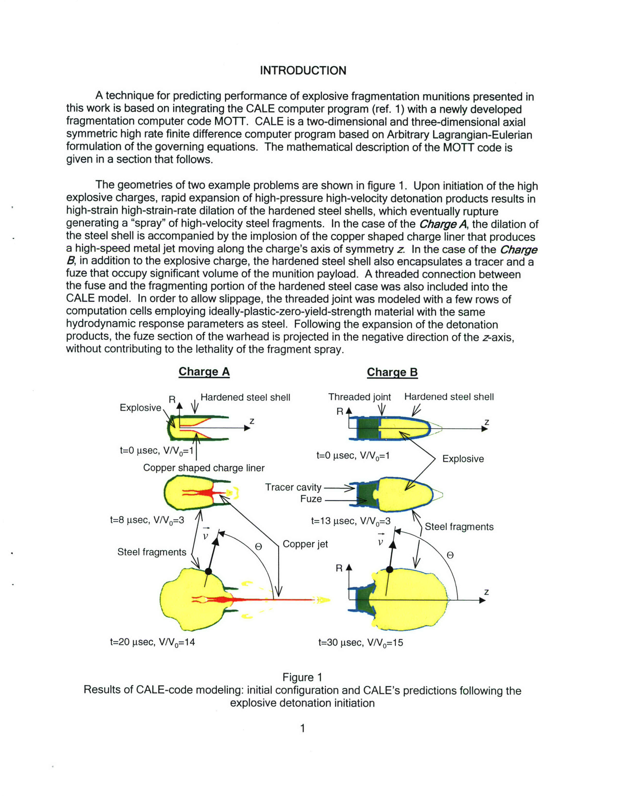
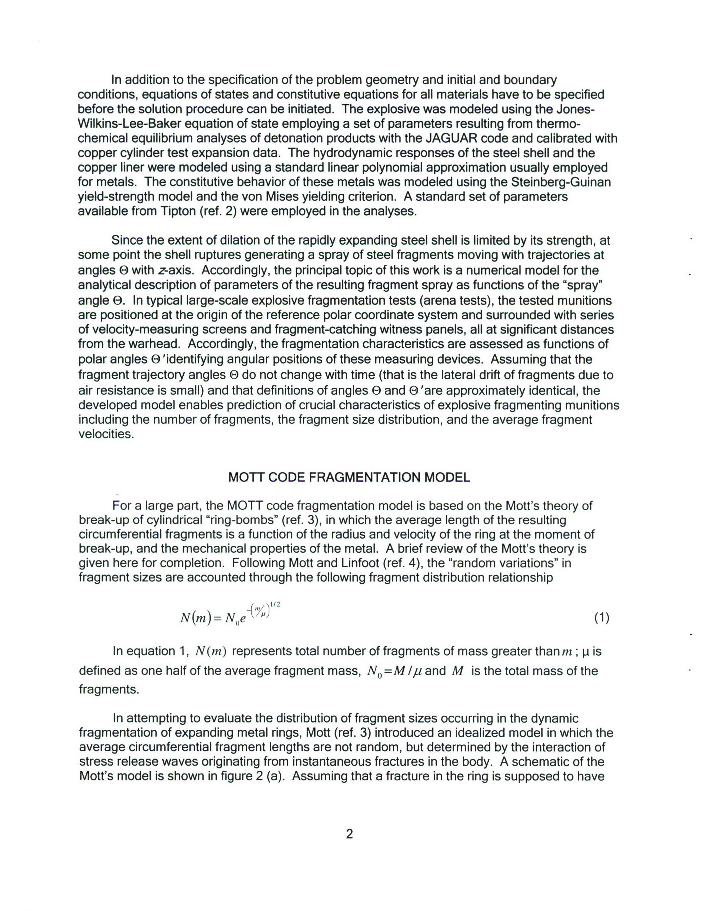
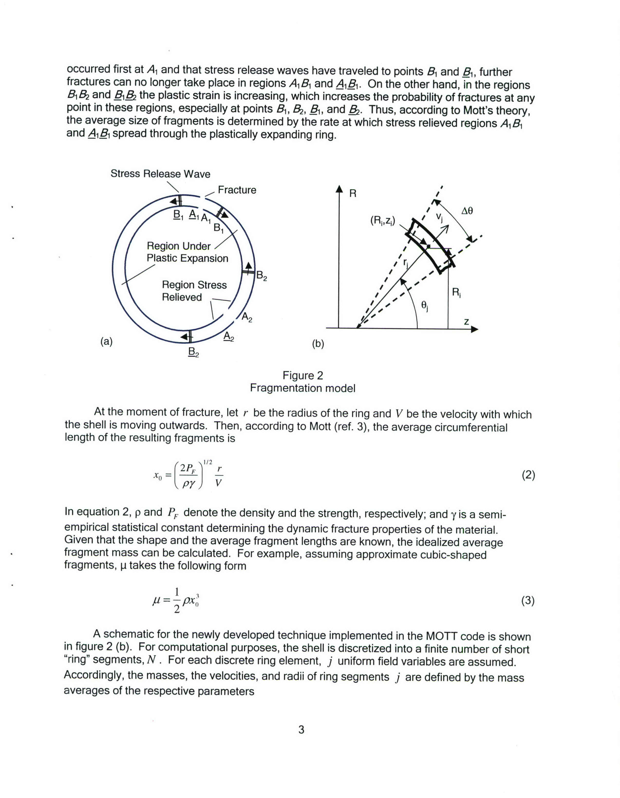
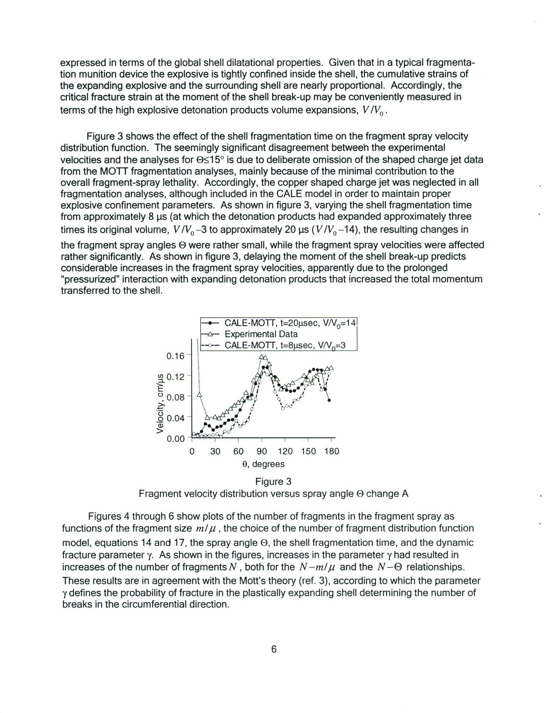

AD-EA403 106

Technical Report ARAET-TR-07001

# ENGINEERING MODEL FOR DESIGN OF EXPLOSIVE FRAGMENTATION MUNITIONS

Vladimir M. Gold

February 2007

ARMAMENT RESEARCH, DEVELOPMENT AND ENGINEERING CENTER
Armaments Engineering & Technology Center
Picatinny Arsenal, New Jersey

Approved for public release; distribution: is unlimited.

The views, opinions, and/or findings contained in this report are solely those of the author and should not be construed as an official development of the Army position, policy, or decision, unless so designated by the other documentation.

The citation in this report of the names of commercial firms or commercial products is not to be construed as a government or Army endorsement by or approval of the U.S. Government.

Destroy this report when no longer needed by any method that will not permit redistribution or reconstruction of the document. Do not return to the originator.

REPORT DOCUMENTATION PAGE

1. REPORT DATE (DD-MMM-YYYY): 2007-02-01

1. REPORT TYPE: Technical Report

1. DATES COVERED (From - To):

1. TITLE/SUBJECT TEXT: ENGINEERING MODEL FOR DESIGN OF EXPLOSIVE FRAGMENTATION MUNITIONS

1. CONTRACT:

1. GRANT NUMBER:

1. SPONSORING AGENCY NAME (S) AND ADDRESS(ES): Armaments Engineering & Technology Center, Picatinny Arsenal, New Jersey 07862

1. PERFORMING ORGANIZATION NAME(S) AND ADDRESS(ES): Armaments Engineering & Technology Center, Armaments Engineering and Weaponry (AMAD-AAR-AEE), Picatinny Arsenal, New Jersey 07862

1. PERFORMING ORGANIZATION REPORT NUMBER:

1. SPONSORING ORGANIZATION CONTRACT(S)/REPORT NUMBER(S):

1. NOTE:

1. DISTRIBUTION STATEMENT: Distribution approved for public release; distribution is unlimited.

1. SUPPLEMENTARY NOTES:

1. ABSTRACT
   A numerical model for design of explosive fragmentation munitions presented in this work is based on integrating three-dimensional axisymmetric hydrodynamical analyses with analyses from a newly developed fragmentation model. The hydrodynamical analyses were performed with the CALE code. The fragmentation model is based on the Mott model, and it was modified to account for the effects of the shell geometry and the detonation velocity. The explosive fragmentation munitions was designed and optimized. Upon fabrication of the developed munition, the performance was experimentally evaluated. The experiments included flash radiography, high-speed photography, and sawdust frequency plot, the high-speed photography, and the sawdust frequency record. Considering relative simplicity of the model, the accuracy of the Mott code predictions is rather reasonable.

1. SUBJECT TERMS
   Fragmentation
   Fragmentation modeling
   Artillery warhead
   ALAVC

1. SECURITY CLASSIFICATION OF:
   DISTRIBUTION: Unclassified
   CUI: U
   SBU: U
   SAR: U

1. LIMITATION OF:
   DISTRIBUTION: Unclassified
   CUI: U
   SBU: U
   SAR: U

1. NUMBER OF PAGES: 23

1. NAME OF RESPONSIBLE PERSON:
   PHONE: (973) 724-5977

1. OFFICIAL REPRESENTATIVE:
   PHONE: (973) 724-5977

1. OCW NUMBER:
   Prepared by: Gold, Vladimir M.
   Approved by: Col. Ben Slikker

# ACKNOWLEDGMENTS

The general concept of integrating the CALE hydrocode analyses and analytical fragmentation models was developed in the early 1990s by the author and Dr. J.A. Tipton. The support of the Research, Development and Engineering Center (RDEC) was crucial in the development of the model. Support of ARDEC is acknowledged for his contributions in preparing the CALE model employed in these analyses. The author would like to thank Dr. G. R. Slikker for his assistance in the design of the experiments and the experimental data presented in this work. The work was conducted under the auspices of the Armaments Research, Development and Engineering Center. Dr. E. L. Bauer and J. M. Hirtings of ARDEC are acknowledged for making this work possible.

# CONTENTS

|                                         | Page |
| :-------------------------------------- | :--: |
| Introduction                            |  1   |
| Mott Code Fragmentation Model           |  2   |
| Mott Code Validation: Charge-A Analyses |  5   |
| Charge B Modeling and Experimentation   |  9   |
| Conclusions                             |  13  |
| References                              |  15  |
| Distribution list                       |  17  |

## FIGURES

|                                                                                                                             |     |
| :-------------------------------------------------------------------------------------------------------------------------- | :-: |
| 1 Results of CALE-code modeling: initial configuration and CALE's predictions following the explosive detonation initiation |  1  |
| 2 Fragmentation model                                                                                                       |  3  |
| 3 Fragment velocity distribution versus spray angle $\\psi$ - charge A                                                      |  8  |
| 4 Cumulative number of fragments in the fragment spray versus the fragment size $m$                                         |  7  |
| 5 Cumulative number of fragments vs varying for $\\gamma = 10$MOTT-CALE analyses equations 14 and 17 - charge A             |  8  |
| 6 Number of fragments in the spray: varying the shell fragmentation time and the y-charge A                                 |  8  |
| 7 CALE code modeling and experimentation - charge B                                                                         |  9  |
| 8 Development of surface fractures in the expanding shell - charge B                                                        | 10  |
| 9 Fragment velocity distribution versus spray angle $\\psi$ - charge B                                                      | 11  |
| 10 Cumulative number of fragments versus the fragment mass $m$ - charge B                                                   | 12  |

# INTRODUCTION

A technique for predicting permittivity of explosive fragmentation munitions presented in this work is based on integrating the CALE computer simulation program (ref. 1) with a newly developed fragmentation model. The CALE code allows for the calculation of the shell deformation and the shell velocity at the moment of break-up. The fragmentation model allows for the calculation of the fragment size distribution and the fragment velocity distribution. The symmetric high rate finite difference computer program based on Arbitrary Lagrangian-Eulerian formulation is used to perform the hydrodynamical analyses. The shell geometry and the explosive properties are input to the CALE code.

Two examples of the symmetric problems are shown in figure 1. Upon initiation of the high explosive, the shell expands and the shell velocity increases. At the moment of break-up, the shell is divided into fragments. The fragmentation process is caused by the growth of the surface fractures. The growth of the surface fractures is driven by high-strain-rate oxidation of the hardenable steel shell, which eventually overwhelms the material strength. The fragmentation process is a complex process and is difficult to model. The-break-up of the steel shell is accompanied by the implosion of the copper shaper lined that creates linear products a high velocity jet. The jet penetrates the target and creates a hole. The high velocity fragments are then projected in the direction of the jet. The fragments create a large number of holes in the target. These holes cause significant volume of the penetration medium. A projected penetration is then created. The combination of the linear penetration and the multiple holes creates a large damage in the target. The results of the CALE model are in order to allow optimization of the shell geometry and the explosive properties.

Figure 1
Results of CALE-code modeling: initial configuration and CALE's predictions following the explosive detonation initiation.

In addition to the specification of the problem geometry and initial and boundary conditions, a sufficient number of parameters must be specified in the fragmentation model before the solution can be produced initiate. The explosive was modeled using the Jones-Wilkins-Lee (JWL) equation of state. The material properties of the steel shell were specified using the equation of state and the strength model. The equation of state is based on the shock-Hugoniot relation and chemical equilibrium analyses of detonation products with the JAQUAR coding and calibrated with copper cylinder shock-compression tests. The strength model is based on the Johnson-Cook model and was calibrated with the target penetration tests. The material properties of the copper shaper liner were specified based on experimental data for metals. The constitutive behavior of these models was modeled using the Stüenger-Quinney plastic work conversion model. The hydrodynamical analyses were performed using the CALE code (ref. 1), and results were obtained from Vipilot (ref. 2). Examples are presented in the following sections.

## MOTT CODE FRAGMENTATION MODELS

The fragment size distribution of explosive fragmentation munitions shell is limited by its strength, at some point the shell ruptures generally at spring-like moving fragments moving from antagonists that are opposite in direction. The average fragment mass is determined by the fragment size distribution. The fragment size distribution is determined by the Mott model (ref. 3). The Mott model is based on the Poisson distribution of fragments. In typical angle-ply explosive fragmentation events (sine tests), the tested munitions have a fragment size distribution that is well-described by the Mott model. The Mott model allows for the calculation of velocity-mass scattering and fragmentation-cross sections analyses, all separated distributions from these analyses are given by the Mott model. The Mott model is based on the assumption that the fragmentation process is random. The fragment size distribution is given by the Mott model. The fragment trajectory angles in this study are not combined with the time that is latent different from the ruptures due to the impact of the fragments on the target. The fragment size distribution is based on the Mott model. The developed models provide execution of critical operations of explosive fragmentation munitions including structure of the fragment size distribution and the average fragment velocities.

The fragment size distribution is given by:

$$N(m) = N_0 \\exp \\left( -\\frac{m}{\\mu} \\right)$$ (1)

In equation 1, $N(m)$ is the number of fragments of mass greater than $m$, $N_0$ is the total number of fragments, $\\mu$ is the average fragment mass.

In attempting to evaluate the distribution of fragment sizes occurring in the dynamic environment, the Mott model was modified to account for the effects of the shell geometry. The effect of the average circumferential fragment lengths are not random, but determined by the interaction of the discrete particles. The fragmentation model was implemented in the Mott code. The results of the Mott's model is shown in figure 2 (a). Assuming that the fracture of the ripping in the support is too huge

Figure 2
Fragmentation of a cylindrical shell.

occurred first at $\\Delta$ and $\\epsilon$, stress release waves travel to the points $\\Phi_1$ and $\\Phi_2$ further. Surface fractures can to longer take place in regions $A, B$ and $C$. On the other hand, in the regions $B$ and $C$, the stress release waves travel to the points $\\Phi_1$ and $\\Phi_2$ respectively. The stress release waves reach the points $\\Phi_1$ and $\\Phi_2$ at the same time. The fragments are formed by the combined stress intensity in these points, respectively, at angles $\\Phi_1$ and $\\Phi_2$. Thus, according to Mott's theory, the fragment size is determined by the time that is latent between the stress release waves arriving at $\\Phi_1$ and $\\Phi_2$ spread through the plastically expanding ring.

Figure 2
Fragmentation of a cylindrical shell.

At the moment of fracture, let $r_0$ be the radius of the ring and $v_0$ be the velocity with which the disc would have expanded in the absence of fracture. According to Mott model (3), the average circumferential length of the resulting fragments is

$$v_r = \\frac{2\\pi\\mu}{\\rho a\\gamma}$$ (2)

In equation 2, $\\rho$ and $a$ denote the density and the strength, respectively and $\\gamma$ is a semi-empirical constant. The average fragment mass is determined by the density, the radius and the strength. Given that the shape and the average fragment length are known, the idealized average fragment mass can be calculated. Assuming that the fragment shape is cylindrical and the shell thickness is constant, the average fragment mass $\\mu$ takes the following form about:

$$\\mu = \\rho a^2\\gamma$$ (3)

A schematic for the newly developed technique implemented in the MOTT code is shown in figure 2 (b). The model is based on the integration of the CALE code results and the analytical fragmentation model. The CALE code provides the shell velocity and the shell radius at the moment of break-up. Accordingly, the masses, the velocities, and the radii of ring segments $j$ are defined by the mass averages of the respective parameters

$$m_i = \\sum\_{j=1}^n \\mu_j$$ (4)
$$v_i = \\sum\_{j=1}^n v_j$$ (5)
$$m_i = \\rho a^2 \\int\_{\\Theta\_{i-1}}^{\\Theta_i} \\frac{d\\theta}{2\\pi}$$ (6)
$$\\Theta_i = \\frac{v_i}{v_0} \\cdot 2\\pi$$ (7)
$$W_i = \\frac{2\\pi\\mu}{\\rho a\\gamma}$$ (8)
$$v_z = v_0 \\cos \\theta$$ (9)
$$v_r = v_0 \\sin \\theta$$ (10)

In equations 9 and 10, $v_z$ and $v_r$ denote the axial and radial velocity components from the CALE-generated data given.

Given that the shell thickness and the radii of ring segments $j$ are determined through equations 5 and 6, the resulting fragment size distributions in each segment $j$ can be calculated through the following equation:

$$b = f\_{rd} \\frac{m_i}{\\mu}$$ (11)
$$\\mu = \\rho a^2 \\int_0^{2\\pi} \\frac{d\\theta}{2\\pi}$$ (12)
$$N_0 = \\frac{M}{\\mu}$$ (13)

As the detonation wave travels along the shell length and the expanding detonation products push the shell, the shell velocity increases. At the moment of break-up, the shell is divided into fragments. The fragment sizes and the break-up velocities $v_1, v_2, \\dots, v_n$ of the individual segments are approximately the same, regardless of the thickness of the shell. The total number of fragments is determined by the fragment number distribution is given by the original Mott's equation.

However, in the case of conventional explosive fragmentation munitions fragmentation shell with the thin-walled shell, the fragment size distribution is not determined by the break-up velocities $v_1, v_2$ vary along the shell length, so that the resulting variation in the average fragment mass $\\mu$ occurs. The fragmentation model was modified to account for the effects of the shell geometry. The resulting fragment size distribution is different from the Mott model. The result of significant differences in the average fragment sizes between the cylindrical and the curved surfaces of the shell was obtained. The modified fragmentation model was validated using the arena tests and high-speed photography. Accordingly, the following two fragment distribution relations are introduced as the modified Mott model. The first relation is the "ring-averaged" fragment size distribution:

$$N(m) = N_0 e^{-\\frac{m}{\\mu}}$$ (14)
$$R = \\sum\_{i=1}^n \\frac{m_i}{\\mu}$$ (15)
$$R = \\sum\_{i=1}^n \\frac{m_i}{\\mu}$$ (16)
$$N(m) = \\sum\_{i=1}^n \\dots$$ (17)

The "ring-segment-averaged" fragment distribution is defined as:

In the case of conventional explosive fragmentation munitions fragmentation shell with the thin-walled shell, the fragment size distribution is not determined by the break-up velocities $v_1, v_2$ vary along the shell length, so that the resulting variation in the average fragment mass $\\mu$ occurs. The fragmentation model was modified to account for the effects of the shell geometry. The resulting fragment size distribution is different from the Mott model. The result of significant differences in the average fragment sizes between the cylindrical and the curved surfaces of the shell was obtained. The modified fragmentation model was validated using the arena tests and high-speed photography. Accordingly, the following two fragment distribution relations are introduced as the modified Mott model. The first relation is the "ring-averaged" fragment size distribution:

$$N(m) = N_0 e^{-\\frac{m}{\\mu}}$$ (14)
$$R = \\sum\_{i=1}^n \\frac{m_i}{\\mu}$$ (15)
$$R = \\sum\_{i=1}^n \\frac{m_i}{\\mu}$$ (16)
$$N(m) = \\sum\_{i=1}^n \\dots$$ (17)

The "ring-segment-averaged" fragment distribution is defined as:

## MOTT CODE VALIDATION: CHARGE-A ANALYSES

The validation of the MOTT code fragmentation model was accomplished using the walling tests. The walling tests were performed with the arena data. The experimental data presented in this work was that the fragmentation occurred uniformly throughout the entire body of the event. The fragmentation process was modeled using the MOTT code. The MOTT code was based on shell geometry and materials, the shell fragmentation time is a function of the cumulative distance traveled by the shell. The shell fragmentation time can be conveniently

expressed in terms of the global shell distributional properties. In a typical fragmentation event, the shell is divided into fragments. The fragment size distribution is described by the fragment velocity distribution function. The seeming significant disagreement between the experimental velocity distribution function and the theoretical velocity distribution function is caused by the difference in the fragment size distribution. The fragmentation process is a complex process. The total overall fragment spray lethality is high. Accordingly, the copper shaper lined charge was rejected in the fragmentation analysis. The fragmentation analysis was performed with the steel shell. The arena tests explosive confinement parameters are shown. As shown in figure 3, varying the shell fragmentation time has a significant effect on the fragment velocity distribution. The fragment velocity distribution is shown in figure 3. The fragment spray angles were either small, while the fragment spray velocities were affected to a great extent by the shell fragmentation time. The fragment velocity distribution is shown in figure 3. The fragment velocity distributions are concentrated in the fragment spray velocities, although they are prolonged by the "pressed" fragments. The resulting explosion redistribution process that increases the total momentum transferred to the shell.

Figure 3
Fragment velocity distribution versus spray angle $\\psi$ change A.

Figure 4 shows a plot of series of curves given by equation 14, $N(m) = N_0 \\exp(-m/\\mu)$, all analyses repeated for two parameters considered: the shell fragmentation time assumed and the shell fragmentation time calculated from the CALE code. The shell fragmentation time with $\\psi=12$ and the $\\mu$ ($V_0/V_r$) fragmentation time with $\\psi=30$ resulted in nearly identical fragment size distributions. The shell fragmentation time calculated from the CALE code and the shell fragmentation time was determined from the high-speed photography data of the penetration (ref. 5). Following this, the fragment size distribution was calculated using the Mott model. The fragment size distribution was compared with the arena data. The fragment size distribution was given by the Mott model. The fragment size distribution was given by the Mott model. The fragment size distribution was given by the Mott model. The fragmentation process is a complex process. The fragment size distribution is given by the Mott model. The fragment size distribution is given by the Mott model. The fragment size distribution is given by the Mott model. The fragmentation process is a complex process. The fragment size distribution is given by the Mott model. The fragmentation process is a complex process. The fragment size distribution is given by the Mott model. The fragment size distribution is given by the Mott model. The fragment size distribution is given by the Mott model. The fragment size distribution is given by the Mott model. The fragmentation process is a complex process. The fragment size distribution is given by the Mott model. The fragment size distribution is given by the Mott model. The fragment size distribution is given by the Mott model. The fragmentation process is a complex process. The fragment size distribution is given by the Mott model. The fragment size distribution is given by the Mott model. The fragment size distribution is given by the Mott model. The fragment size distribution is given by the Mott model. The fragment size distribution is given by the Mott model. The fragment size distribution is given by the Mott model. The fragmentation process is a complex process. The fragment size distribution is given by the Mott model. The fragmentation process is a complex process. The fragment size distribution is given by the Mott model. The fragmentation process is a complex process. The fragment size distribution is given by the Mott model. The fragmentation process is a complex process. The fragment size distribution is given by the Mott model. The fragmentation process is a complex process. The fragment size distribution is given by the Mott model. The fragmentation process is a complex process. The fragment size distribution is given by the Mott model. The fragmentation process is a complex process. The fragment size distribution is given by the Mott model. The fragment size distribution is given by the Mott model. The fragment size distribution is given by the Mott model. The fragmentation process is a complex process. The fragment size distribution is given by the Mott model. The fragment size distribution is given by the Mott model. The fragment size distribution is given by the Mott model. The fragmentation process is a complex process. The fragment size distribution is given by the Mott model. The fragment size distribution is given by the Mott model. The fragment size distribution is given by the Mott model. The fragment size distribution is given by the Mott model. The fragment size distribution is given by the Mott model. The fragment size distribution is given by the Mott model. The fragment size distribution is given by the Mott model. The fragment size distribution is given by the Mott model. The fragment size distribution is given by the Mott model. The fragment size distribution is given by the Mott model. The fragment size distribution is given by the Mott model. The fragment size distribution is given by the Mott model. The fragment size distribution is given by the Mott model. The fragment size distribution is given by the Mott model. The fragment size distribution is given by the Mott model. The fragment size distribution is given by the Mott model. The fragment size distribution is given by the Mott model. The fragment size distribution is given by the Mott model. The fragment size distribution is given by the Mott model. The fragment size distribution is given by the Mott model. The fragment size distribution is given by the Mott model. The fragment size distribution is given by the Mott model. The fragment size distribution is given by the Mott model. The fragment size distribution is given by the Mott model. The fragment size distribution is given by the Mott model. The fragment size distribution is given by the Mott model. The fragment size distribution is given by the Mott model. The fragment size distribution is given by the Mott model. The fragment size distribution is given by the Mott model. The fragment size distribution is given by the Mott model. The fragment size distribution is given by the Mott model. The fragment size distribution is given by the Mott model. The fragment size distribution is given by the Mott model. The fragment size distribution is given by the Mott model. The fragment size distribution is given by the Mott model. The fragment size distribution is given by the Mott model. The fragment size distribution is given by the Mott model. The fragment size distribution is given by the Mott model. The fragment size distribution is given by the Mott model. The fragment size distribution is given by the Mott model. The fragment size distribution is given by the Mott model. The fragment size distribution is given by the Mott model. The fragment size distribution is given by the Mott model. The fragment size distribution is given by the Mott model. The fragment size distribution is given by the Mott model. The fragment size distribution is given by the Mott model. The fragment size distribution is given by the Mott model. The fragment size distribution is given by the Mott model. The fragment size distribution is given by the Mott model. The fragment size distribution is given by the Mott model. The fragment size distribution is given by the Mott model. The fragment size distribution is given by the Mott model. The fragment size distribution is given by the Mott model. The fragment size distribution is given by the Mott model. The fragment size distribution is given by the Mott model. The fragment size distribution is given by the Mott model. The fragment size distribution is given by the Mott model. The fragment size distribution is given by the Mott model. The fragment size distribution is given by the Mott model. The fragment size distribution is given by the Mott model. The fragment size distribution is given by the Mott model. The fragment size distribution is given by the Mott model. The fragment size distribution is given by the Mott model. The fragment size distribution is given by the Mott model. The fragment size distribution is given by the Mott model. The fragment size distribution is given by the Mott model. The fragment size distribution is given by the Mott model. The fragment size distribution is given by the Mott model. The fragment size distribution is given by the Mott model. The fragment size distribution is given by the Mott model. The fragment size distribution is given by the Mott model. The fragment size distribution is given by the Mott model. The fragment size distribution is given by the Mott model. The fragment size distribution is given by the Mott model. The fragment size distribution is given by the Mott model. The fragment size distribution is given by the Mott model. The fragment size distribution is given by the Mott model. The fragment size distribution is given by the Mott model. The fragment size distribution is given by the Mott model. The fragment size distribution is given by the Mott model. The fragment size distribution is given by the Mott model. The fragment size distribution is given by the Mott model. The fragment size distribution is given by the Mott model. The fragment size distribution is given by the Mott model. The fragment size distribution is given by the Mott model. The fragment size distribution is given by the Mott model. The fragment size distribution is given by the Mott model. The fragment size distribution is given by the Mott model. The fragment size distribution is given by the Mott model. The fragment size distribution is given by the Mott model. The fragment size distribution is given by the Mott model. The fragment size distribution is given by the Mott model. The fragment size distribution is given by the Mott model. The fragment size distribution is given by the Mott model. The fragment size distribution is given by the Mott model. The fragment size distribution is given by the Mott model. The fragment size distribution is given by the Mott model. The fragment size distribution is given by the Mott model. The fragment size distribution is given by the Mott model. The fragment size distribution is given by the Mott model. The fragment size distribution is given by the Mott model. The fragment size distribution is given by the Mott model. The fragment size distribution is given by the Mott model. The fragment size distribution is given by the Mott model. The fragment size distribution is given by the Mott model. The fragment size distribution is given by the Mott model. The fragment size distribution is given by the Mott model. The fragment size distribution is given by the Mott model. The fragment size distribution is given by the Mott model. The fragment size distribution is given by the Mott model. The fragment size distribution is given by the Mott model. The fragment size distribution is given by the Mott model. The fragment size distribution is given by the Mott model. The fragment size distribution is given by the Mott model. The fragment size distribution is given by the Mott model. The fragment size distribution is given by the Mott model. The fragment size distribution is given by the Mott model. The fragment size distribution is given by the Mott model. The fragment size distribution is given by the Mott model. The fragment size distribution is given by the Mott model. The fragment size distribution is given by the Mott model. The fragment size distribution is given by the Mott model. The fragment size distribution is given by the Mott model. The fragment size distribution is given by the Mott model. The fragment size distribution is given by the Mott model. The fragment size distribution is given by the Mott model. The fragment size distribution is given by the Mott model. The fragment size distribution is given by the Mott model. The fragment size distribution is given by the Mott model. The fragment size distribution is given by the Mott model. The fragment size distribution is given by the Mott model. The fragment size distribution is given by the Mott model. The fragment size distribution is given by the Mott model. The fragment size distribution is given by the Mott model. The fragment size distribution is given by the Mott model. The fragment size distribution is given by the Mott model. The fragment size distribution is given by the Mott model. The fragment size distribution is given by the Mott model. The fragment size distribution is given by the Mott model. The fragment size distribution is given by the Mott model. The fragment size distribution is given by the Mott model. The fragment size distribution is given by the Mott model. The fragment size distribution is given by the Mott model. The fragment size distribution is given by the Mott model. The fragment size distribution is given by the Mott model. The fragment size distribution is given by the Mott model. The fragment size distribution is given by the Mott model. The fragment size distribution is given by the Mott model. The fragment size distribution is given by the Mott model. The fragment size distribution is given by the Mott model. The fragment size distribution is given by the Mott model. The fragment size distribution is given by the Mott model. The fragment size distribution is given by the Mott model. The fragment size distribution is given by the Mott model. The fragment size distribution is given by the Mott model. The fragment size distribution is given by the Mott model. The fragment size distribution is given by the Mott model. The fragment size distribution is given by the Mott model. The fragment size distribution is given by the Mott model. The fragment size distribution is given by the Mott model. The fragment size distribution is given by the Mott model. The fragment size distribution is given by the Mott model. The fragment size distribution is given by the Mott model. The fragment size distribution is given by the Mott model. The fragment size distribution is given by the Mott model. The fragment size distribution is given by the Mott model. The fragment size distribution is given by the Mott model. The fragment size distribution is given by the Mott model. The fragment size distribution is given by the Mott model. The fragment size distribution is given by the Mott model. The fragment size distribution is given by the Mott model. The fragment size distribution is given by the Mott model. The fragment size distribution is given by the Mott model. The fragment size distribution is given by the Mott model. The fragment size distribution is given by the Mott model. The fragment size distribution is given by the Mott model. The fragment size distribution is given by the Mott model. The fragment size distribution is given by the Mott model. The fragment size distribution is given by the Mott model. The fragment size distribution is given by the Mott model. The fragment size distribution is given by the Mott model. The fragment size distribution is given by the Mott model. The fragment size distribution is given by the Mott model. The fragment size distribution is given by the Mott model. The fragment size distribution is given by the Mott model. The fragment size distribution is given by the Mott model. The fragment size distribution is given by the Mott model. The fragment size distribution is given by the Mott model. The fragment size distribution is given by the Mott model. The fragment size distribution is given by the Mott model. The fragment size distribution is given by the Mott model. The fragment size distribution is given by the Mott model. The fragment size distribution is given by the Mott model. The fragment size distribution is given by the Mott model. The fragment size distribution is given by the Mott model. The fragment size distribution is given by the Mott model. The fragment size distribution is given by the Mott model. The fragment size distribution is given by the Mott model. The fragment size distribution is given by the Mott model. The fragment size distribution is given by the Mott model. The fragment size distribution is given by the Mott model. The fragment size distribution is given by the Mott model. The fragment size distribution is given by the Mott model. The fragment size distribution is given by the Mott model. The fragment size distribution is given by the Mott model. The fragment size distribution is given by the Mott model. The fragment size distribution is given by the Mott model. The fragment size distribution is given by the Mott model. The fragment size distribution is given by the Mott model. The fragment size distribution is given by the Mott model. The fragment size distribution is given by the Mott model. The fragment size distribution is given by the Mott model. The fragment size distribution is given by the Mott model. The fragment size distribution is given by the Mott model. The fragment size distribution is given by the Mott model. The fragment size distribution is given by the Mott model. The fragment size distribution is given by the Mott model. The fragment size distribution is given by the Mott model. The fragment size distribution is given by the Mott model. The fragment size distribution is given by the Mott model. The fragment size distribution is given by the Mott model. The fragment size distribution is given by the Mott model. The fragment size distribution is given by the Mott model. The fragment size distribution is given by the Mott model. The fragment size distribution is given by the Mott model. The fragment size distribution is given by the Mott model. The fragment size distribution is given by the Mott model. The fragment size distribution is given by the Mott model. The fragment size distribution is given by the Mott model. The fragment size distribution is given by the Mott model. The fragment size distribution is given by the Mott model. The fragment size distribution is given by the Mott model. The fragment size distribution is given by the Mott model. The fragment size distribution is given by the Mott model. The fragment size distribution is given by the Mott model. The fragment size distribution is given by the Mott model. The fragment size distribution is given by the Mott model. The fragment size distribution is given by the Mott model. The fragment size distribution is given by the Mott model. The fragment size distribution is given by the Mott model. The fragment size distribution is given by the Mott model. The fragment size distribution is given by the Mott model. The fragment size distribution is given by the Mott model. The fragment size distribution is given by the Mott model. The fragment size distribution is given by the Mott model. The fragment size distribution is given by the Mott model. The fragment size distribution is given by the Mott model. The fragment size distribution is given by the Mott model. The fragment size distribution is given by the Mott model. The fragment size distribution is given by the Mott model. The fragment size distribution is given by the Mott model. The fragment size distribution is given by the Mott model. The fragment size distribution is given by the Mott model. The fragment size distribution is given by the Mott model. The fragment size distribution is given by the Mott model. The fragment size distribution is given by the Mott model. The fragment size distribution is given by the Mott model. The fragment size distribution is given by the Mott model. The fragment size distribution is given by the Mott model. The fragment size distribution is given by the Mott model. The fragment size distribution is given by the Mott model. The fragment size distribution is given by the Mott model. The fragment size distribution is given by the Mott model. The fragment size distribution is given by the Mott model. The fragment size distribution is given by the Mott model. The fragment size distribution is given by the Mott model. The fragment size distribution is given by the Mott model. The fragment size distribution is given by the Mott model. The fragment size distribution is given by the Mott model. The fragment size distribution is given by the Mott model. The fragment size distribution is given by the Mott model. The fragment size distribution is given by the Mott model. The fragment size distribution is given by the Mott model. The fragment size distribution is given by the Mott model. The fragment size distribution is given by the Mott model. The fragment size distribution is given by the Mott model. The fragment size distribution is given by the Mott model. The fragment size distribution is given by the Mott model. The fragment size distribution is given by the Mott model. The fragment size distribution is given by the Mott model. The fragment size distribution is given by the Mott model. The fragment size distribution is given by the Mott model. The fragment size distribution is given by the Mott model. The fragment size distribution is given by the Mott model. The fragment size distribution is given by the Mott model. The fragment size distribution is given by the Mott model. The fragment size distribution is given by the Mott model. The fragment size distribution is given by the Mott model. The fragment size distribution is given by the Mott model. The fragment size distribution is given by the Mott model. The fragment size distribution is given by the Mott model. The fragment size distribution is given by the Mott model. The fragment size distribution is given by the Mott model. The fragment size distribution is given by the Mott model. The fragment size distribution is given by the Mott model. The fragment size distribution is given by the Mott model. The fragment size distribution is given by the Mott model. The fragment size distribution is given by the Mott model. The fragment size distribution is given by the Mott model. The fragment size distribution is given by the Mott model. The fragment size distribution is given by the Mott model. The fragment size distribution is given by the Mott model. The fragment size distribution is given by the Mott model. The fragment size distribution is given by the Mott model. The fragment size distribution is given by the Mott model. The fragment size distribution is given by the Mott model. The fragment size distribution is given by the Mott model. The fragment size distribution is given by the Mott model. The fragment size distribution is given by the Mott model. The fragment size distribution is given by the Mott model. The fragment size distribution is given by the Mott model. The fragment size distribution is given by the Mott model. The fragment size distribution is given by the Mott model. The fragment size distribution is given by the Mott model. The fragment size distribution is given by the Mott model. The fragment size distribution is given by the Mott model. The fragment size distribution is given by the Mott model. The fragment size distribution is given by the Mott model. The fragment size distribution is given by the Mott model. The fragment size distribution is given by the Mott model. The fragment size distribution is given by the Mott model. The fragment size distribution is given by the Mott model. The fragment size distribution is given by the Mott model. The fragment size distribution is given by the Mott model. The fragment size distribution is given by the Mott model. The fragment size distribution is given by the Mott model. The fragment size distribution is given by the Mott model. The fragment size distribution is given by the Mott model. The fragment size distribution is given by the Mott model. The fragment size distribution is given by the Mott model. The fragment size distribution is given by the Mott model. The fragment size distribution is given by the Mott model. The fragment size distribution is given by the Mott model. The fragment size distribution is given by the Mott model. The fragment size distribution is given by the Mott model. The fragment size distribution is given by the Mott model. The fragment size distribution is given by the Mott model. The fragment size distribution is given by the Mott model. The fragment size distribution is given by the Mott model. The fragment size distribution is given by the Mott model. The fragment size distribution is given by the Mott model. The fragment size distribution is given by the Mott model. The fragment size distribution is given by the Mott model. The fragment size distribution is given by the Mott model. The fragment size distribution is given by the Mott model. The fragment size distribution is given by the Mott model. The fragment size distribution is given by the Mott model. The fragment size distribution is given by the Mott model. The fragment size distribution is given by the Mott model. The fragment size distribution is given by the Mott model. The fragment size distribution is given by the Mott model. The fragment size distribution is given by the Mott model. The fragment size distribution is given by the Mott model. The fragment size distribution is given by the Mott model. The fragment size distribution is given by the Mott model. The fragment size distribution is given by the Mott model. The fragment size distribution is given by the Mott model. The fragment size distribution is given by the Mott model. The fragment size distribution is given by the Mott model. The fragment size distribution is given by the Mott model. The fragment size distribution is given by the Mott model. The fragment size distribution is given by the Mott model. The fragment size distribution is given by the Mott model. The fragment size distribution is given by the Mott model. The fragment size distribution is given by the Mott model. The fragment size distribution is given by the Mott model. The fragment size distribution is given by the Mott model. The fragment size distribution is given by the Mott model. The fragment size distribution is given by the Mott model. The fragment size distribution is given by the Mott model. The fragment size distribution is given by the Mott model. The fragment size distribution is given by the Mott model. The fragment size distribution is given by the Mott model. The fragment size distribution is given by the Mott model. The fragment size distribution is given by the Mott model. The fragment size distribution is given by the Mott model. The fragment size distribution is given by the Mott model. The fragment size distribution is given by the Mott model. The fragment size distribution is given by the Mott model. The fragment size distribution is given by the Mott model. The fragment size distribution is given by the Mott model. The fragment size distribution is given by the Mott model. The fragment size distribution is given by the Mott model. The fragment size distribution is given by the Mott model. The fragment size distribution is given by the Mott model. The fragment size distribution is given by the Mott model. The fragment size distribution is given by the Mott model. The fragment size distribution is given by the Mott model. The fragment size distribution is given by the Mott model. The fragment size distribution is given by the Mott model. The fragment size distribution is given by the Mott model. The fragment size distribution is given by the Mott model. The fragment size distribution is given by the Mott model. The fragment size distribution is given by the Mott model. The fragment size distribution is given by the Mott model. The fragment size distribution is given by the Mott model. The fragment size distribution is given by the Mott model. The fragment size distribution is given by the Mott model. The fragment size distribution is given by the Mott model. The fragment size distribution is given by the Mott model. The fragment size distribution is given by the Mott model. The fragment size distribution is given by the Mott model. The fragment size distribution is given by the Mott model. The fragment size distribution is given by the Mott model. The fragment size distribution is given by the Mott model. The fragment size distribution is given by the Mott model. The fragment size distribution is given by the Mott model. The fragment size distribution is given by the Mott model. The fragment size distribution is given by the Mott model. The fragment size distribution is given by the Mott model. The fragment size distribution is given by the Mott model. The fragment size distribution is given by the Mott model. The fragment size distribution is given by the Mott model. The fragment size distribution is given by the Mott model. The fragment size distribution is given by the Mott model. The fragment size distribution is given by the Mott model. The fragment size distribution is given by the Mott model. The fragment size distribution is given by the Mott model. The fragment size distribution is given by the Mott model. The fragment size distribution is given by the Mott model. The fragment size distribution is given by the Mott model. The fragment size distribution is given by the Mott model. The fragment size distribution is given by the Mott model. The fragment size distribution is given by the Mott model. The fragment size distribution is given by the Mott model. The fragment size distribution is given by the Mott model. The fragment size distribution is given by the Mott model. The fragment size distribution is given by the Mott model. The fragment size distribution is given by the Mott model. The fragment size distribution is given by the Mott model. The fragment size distribution is given by the Mott model. The fragment size distribution is given by the Mott model. The fragment size distribution is given by the Mott model. The fragment size distribution is given by the Mott model. The fragment size distribution is given by the Mott model. The fragment size distribution is given by the Mott model. The fragment size distribution is given by the Mott model. The fragment size distribution is given by the Mott model. The fragment size distribution is given by the Mott model. The fragment size distribution is given by the Mott model. The fragment size distribution is given by the Mott model. The fragment size distribution is given by the Mott model. The fragment size distribution is given by the Mott model. The fragment size distribution is given by the Mott model. The fragment size distribution is given by the Mott model. The fragment size distribution is given by the Mott model. The fragment size distribution is given by the Mott model. The fragment size distribution is given by the Mott model. The fragment size distribution is given by the Mott model. The fragment size distribution is given by the Mott model. The fragment size distribution is given by the Mott model. The fragment size distribution is given by the Mott model. The fragment size distribution is given by the Mott model. The fragment size distribution is given by the Mott model. The fragment size distribution is given by the Mott model. The fragment size distribution is given by the Mott model. The fragment size distribution is given by the Mott model. The fragment size distribution is given by the Mott model. The fragment size distribution is given by the Mott model. The fragment size distribution is given by the Mott model. The fragment size distribution is given by the Mott model. The fragment size distribution is given by the Mott model. The fragment size distribution is given by the Mott model. The fragment size distribution is given by the Mott model. The fragment size distribution is given by the Mott model. The fragment size distribution is given by the Mott model. The fragment size distribution is given by the Mott model. The fragment size distribution is given by the Mott model. The fragment size distribution is given by the Mott model. The fragment size distribution is given by the Mott model. The fragment size distribution is given by the Mott model. The fragment size distribution is given by the Mott model. The fragment size distribution is given by the Mott model. The fragment size distribution is given by the Mott model. The fragment size distribution is given by the Mott model. The fragment size distribution is given by the Mott model. The fragment size distribution is given by the Mott model. The fragment size distribution is given by the Mott model. The fragment size distribution is given by the Mott model. The fragment size distribution is given by the Mott model. The fragment size distribution is given by the Mott model. The fragment size distribution is given by the Mott model. The fragment size distribution is given by the Mott model. The fragment size distribution is given by the Mott model. The fragment size distribution is given by the Mott model. The fragment size distribution is given by the Mott model. The fragment size distribution is given by the Mott model. The fragment size distribution is given by the Mott model. The fragment size distribution is given by the Mott model. The fragment size distribution is given by the Mott model. The fragment size distribution is given by the Mott model. The fragment size distribution is given by the Mott model. The fragment size distribution is given by the Mott model. The fragment size distribution is given by the Mott model. The fragment size distribution is given by the Mott model. The fragment size distribution is given by the Mott model. The fragment size distribution is given by the Mott model. The fragment size distribution is given by the Mott model. The fragment size distribution is given by the Mott model. The fragment size distribution is given by the Mott model. The fragment size distribution is given by the Mott model. The fragment size distribution is given by the Mott model. The fragment size distribution is given by the Mott model. The fragment size distribution is given by the Mott model. The fragment size distribution is given by the Mott model. The fragment size distribution is given by the Mott model. The fragment size distribution is given by the Mott model. The fragment size distribution is given by the Mott model. The fragment size distribution is given by the Mott model. The fragment size distribution is given by the Mott model. The fragment size distribution is given by the Mott model. The fragment size distribution is given by the Mott model. The fragment size distribution is given by the Mott model. The fragment size distribution is given by the Mott model. The fragment size distribution is given by the Mott model. The fragment size distribution is given by the Mott model. The fragment size distribution is given by the Mott model. The fragment size distribution is given by the Mott model. The fragment size distribution is given by the Mott model. The fragment size distribution is given by the Mott model. The fragment size distribution is given by the Mott model. The fragment size distribution is given by the Mott model. The fragment size distribution is given by the Mott model. The fragment size distribution is given by the Mott model. The fragment size distribution is given by the Mott model. The fragment size distribution is given by the Mott model. The fragment size distribution is given by the Mott model. The fragment size distribution is given by the Mott model. The fragment size distribution is given by the Mott model. The fragment size distribution is given by the Mott model. The fragment size distribution is given by the Mott model. The fragment size distribution is given by the Mott model. The fragment size distribution is given by the Mott model. The fragment size distribution is given by the Mott model. The fragment size distribution is given by the Mott model. The fragment size distribution is given by the Mott model. The fragment size distribution is given by the Mott model. The fragment size distribution is given by the Mott model. The fragment size distribution is given by the Mott model. The fragment size distribution is given by the Mott model. The fragment size distribution is given by the Mott model. The fragment size distribution is given by the Mott model. The fragment size distribution is given by the Mott model. The fragment size distribution is given by the Mott model. The fragment size distribution is given by the Mott model. The fragment size distribution is given by the Mott model. The fragment size distribution is given by the Mott model. The fragment size distribution is given by the Mott model. The fragment size distribution is given by the Mott model. The fragment size distribution is given by the Mott model. The fragment size distribution is given by the Mott model. The fragment size distribution is given by the Mott model. The fragment size distribution is given by the Mott model. The fragment size distribution is given by the Mott model. The fragment size distribution is given by the Mott model. The fragment size distribution is given by the Mott model. The fragment size distribution is given by the Mott model. The fragment size distribution is given by the Mott model. The fragment size distribution is given by the Mott model. The fragment size distribution is given by the Mott model. The fragment size distribution is given by the Mott model. The fragment size distribution is given by the Mott model. The fragment size distribution is given by the Mott model. The fragment size distribution is given by the Mott model. The fragment size distribution is given by the Mott model. The fragment size distribution is given by the Mott model. The fragment size distribution is given by the Mott model. The fragment size distribution is given by the Mott model. The fragment size distribution is given by the Mott model. The fragment size distribution is given by the Mott model. The fragment size distribution is given by the Mott model. The fragment size distribution is given by the Mott model. The fragment size distribution is given by the Mott model. The fragment size distribution is given by the Mott model. The fragment size distribution is given by the Mott model. The fragment size distribution is given by the Mott model. The fragment size distribution is given by the Mott model. The fragment size distribution is given by the Mott model. The fragment size distribution is given by the Mott model. The fragment size distribution is given by the Mott model. The fragment size distribution is given by the Mott model. The fragment size distribution is given by the Mott model. The fragment size distribution is given by the Mott model. The fragment size distribution is given by the Mott model. The fragment size distribution is given by the Mott model. The fragment size distribution is given by the Mott model. The fragment size distribution is given by the Mott model. The fragment size distribution is given by the Mott model. The fragment size distribution is given by the Mott model. The fragment size distribution is given by the Mott model. The fragment size distribution is given by the Mott model. The fragment size distribution is given by the Mott model. The fragment size distribution is given by the Mott model. The fragment size distribution is given by the Mott model. The fragment size distribution is given by the Mott model. The fragment size distribution is given by the Mott model. The fragment size distribution is given by the Mott model. The fragment size distribution is given by the Mott model. The fragment size distribution is given by the Mott model. The fragment size distribution is given by the Mott model. The fragment size distribution is given by the Mott model. The fragment size distribution is given by the Mott model. The fragment size distribution is given by the Mott model. The fragment size distribution is given by the Mott model. The fragment size distribution is given by the Mott model. The fragment size distribution is given by the Mott model. The fragment size distribution is given by the Mott model. The fragment size distribution is given by the Mott model. The fragment size distribution is given by the Mott model. The fragment size distribution is given by the Mott model. The fragment size distribution is given by the Mott model. The fragment size distribution is given by the Mott model. The fragment size distribution is given by the Mott model. The fragment size distribution is given by the Mott model. The fragment size distribution is given by the Mott model. The fragment size distribution is given by the Mott model. The fragment size distribution is given by the Mott model. The fragment size distribution is given by the Mott model. The fragment size distribution is given by the Mott model. The fragment size distribution is given by the Mott model. The fragment size distribution is given by the Mott model. The fragment size distribution is given by the Mott model. The fragment size distribution is given by the Mott model. The fragment size distribution is given by the Mott model. The fragment size distribution is given by the Mott model. The fragment size distribution is given by the Mott model. The fragment size distribution is given by the Mott model. The fragment size distribution is given by the Mott model. The fragment size distribution is given by the Mott model. The fragment size distribution is given by the Mott model. The fragment size distribution is given by the Mott model. The fragment size distribution is given by the Mott model. The fragment size distribution is given by the Mott model. The fragment size distribution is given by the Mott model. The fragment size distribution is given by the Mott model. The fragment size distribution is given by the Mott model. The fragment size distribution is given by the Mott model. The fragment size distribution is given by the Mott model. The fragment size distribution is given by the Mott model. The fragment size distribution is given by the Mott model. The fragment size distribution is given by the Mott model. The fragment size distribution is given by the Mott model. The fragment size distribution is given by the Mott model. The fragment size distribution is given by the Mott model. The fragment size distribution is given by the Mott model. The fragment size distribution is given by the Mott model. The fragment size distribution is given by the Mott model. The fragment size distribution is given by the Mott model. The fragment size distribution is given by the Mott model. The fragment size distribution is given by the Mott model. The fragment size distribution is given by the Mott model. The fragment size distribution is given by the Mott model. The fragment size distribution is given by the Mott model. The fragment size distribution is given by the Mott model. The fragment size distribution is given by the Mott model. The fragment size distribution is given by the Mott model. The fragment size distribution is given by the Mott model. The fragment size distribution is given by the Mott model. The fragment size distribution is given by the Mott model. The fragment size distribution is given by the Mott model. The fragment size distribution is given by the Mott model. The fragment size distribution is given by the Mott model. The fragment size distribution is given by the Mott model. The fragment size distribution is given by the Mott model. The fragment size distribution is given by the Mott model. The fragment size distribution is given by the Mott model. The fragment size distribution is given by the Mott model. The fragment size distribution is given by the Mott model. The fragment size distribution is given by the Mott model. The fragment size distribution is given by the Mott model. The fragment size distribution is given by the Mott model. The fragment size distribution is given by the Mott model. The fragment size distribution is given by the Mott model. The fragment size distribution is given by the Mott model. The fragment size distribution is given by the Mott model. The fragment size distribution is given by the Mott model. The fragment size distribution is given by the Mott model. The fragment size distribution is given by the Mott model. The fragment size distribution is given by the Mott model. The fragment size distribution is given by the Mott model. The fragment size distribution is given by the Mott model. The fragment size distribution is given by the Mott model. The fragment size distribution is given by the Mott model. The fragment size distribution is given by the Mott model. The fragment size distribution is given by the Mott model. The fragment size distribution is given by the Mott model. The fragment size distribution is given by the Mott model. The fragment size distribution is given by the Mott model. The fragment size distribution is given by the Mott model. The fragment size distribution is given by the Mott model. The fragment size distribution is given by the Mott model. The fragment size distribution is given by the Mott model. The fragment size distribution is given by the Mott model. The fragment size distribution is given by the Mott model. The fragment size distribution is given by the Mott model. The fragment size distribution is given by the Mott model. The fragment size distribution is given by the Mott model. The fragment size distribution is given by the Mott model. The fragment size distribution is given by the Mott model. The fragment size distribution is given by the Mott model. The fragment size distribution is given by the Mott model. The fragment size distribution is given by the Mott model. The fragment size distribution is given by the Mott model. The fragment size distribution is given by the Mott model. The fragment size distribution is given by the Mott model. The fragment size distribution is given by the Mott model. The fragment size distribution is given by the Mott model. The fragment size distribution is given by the Mott model. The fragment size distribution is given by the Mott model. The fragment size distribution is given by the Mott model. The fragment size distribution is given by the Mott model. The fragment size distribution is given by the Mott model. The fragment size distribution is given by the Mott model. The fragment size distribution is given by the Mott model. The fragment size distribution is given by the Mott model. The fragment size distribution is given by the Mott model. The fragment size distribution is given by the Mott model. The fragment size distribution is given by the Mott model. The fragment size distribution is given by the Mott model. The fragment size distribution is given by the Mott model. The fragment size distribution is given by the Mott model. The fragment size distribution is given by the Mott model. The fragment size distribution is given by the Mott model. The fragment size distribution is given by the Mott model. The fragment size distribution is given by the Mott model. The fragment size distribution is given by the Mott model. The fragment size distribution is given by the Mott model. The fragment size distribution is given by the Mott model. The fragment size distribution is given by the Mott model. The fragment size distribution is given by the Mott model. The fragment size distribution is given by the Mott model. The fragment size distribution is given by the Mott model. The fragment size distribution is given by the Mott model. The fragment size distribution is given by the Mott model. The fragment size distribution is given by the Mott model. The fragment size distribution is given by the Mott model. The fragment size distribution is given by the Mott model. The fragment size distribution is given by the Mott model. The fragment size distribution is given by the Mott model. The fragment size distribution is given by the Mott model. The fragment size distribution is given by the Mott model. The fragment size distribution is given by the Mott model. The fragment size distribution is given by the Mott model. The fragment size distribution is given by the Mott model. The fragment size distribution is given by the Mott model. The fragment size distribution is given by the Mott model. The fragment size distribution is given by the Mott model. The fragment size distribution is given by the Mott model. The fragment size distribution is given by the Mott model. The fragment size distribution is given by the Mott model. The fragment size distribution is given by the Mott model. The fragment size distribution is given by the Mott model. The fragment size distribution is given by the Mott model. The fragment size distribution is given by the Mott model. The fragment size distribution is given by the Mott model. The fragment size distribution is given by the Mott model. The fragment size distribution is given by the Mott model. The fragment size distribution is given by the Mott model. The fragment size distribution is given by the Mott model. The fragment size distribution is given by the Mott model. The fragment size distribution is given by the Mott model. The fragment size distribution is given by the Mott model. The fragment size distribution is given by the Mott model. The fragment size distribution is given by the Mott model. The fragment size distribution is given by the Mott model. The fragment size distribution is given by the Mott model. The fragment size distribution is given by the Mott model. The fragment size distribution is given by the Mott model. The fragment size distribution is given by the Mott model. The fragment size distribution is given by the Mott model. The fragment size distribution is given by the Mott model. The fragment size distribution is given by the Mott model. The fragment size distribution is given by the Mott model. The fragment size distribution is given by the Mott model. The fragment size distribution is given by the Mott model. The fragment size distribution is given by the Mott model. The fragment size distribution is given by the Mott model. The fragment size distribution is given by the Mott model. The fragment size distribution is given by the Mott model. The fragment size distribution is given by the Mott model. The fragment size distribution is given by the Mott model. The fragment size distribution is given by the Mott model. The fragment size distribution is given by the Mott model. The fragment size distribution is given by the Mott model. The fragment size distribution is given by the Mott model. The fragment size distribution is given by the Mott model. The fragment size distribution is given by the Mott model. The fragment size distribution is given by the Mott model. The fragment size distribution is given by the Mott model. The fragment size distribution is given by the Mott model. The fragment size distribution is given by the Mott model. The fragment size distribution is given by the Mott model. The fragment size distribution is given by the Mott model. The fragment size distribution is given by the Mott model. The fragment size distribution is given by the Mott model. The fragment size distribution is given by the Mott model. The fragment size distribution is given by the Mott model. The fragment size distribution is given by the Mott model. The fragment size distribution is given by the Mott model. The fragment size distribution is given by the Mott model. The fragment size distribution is given by the Mott model. The fragment size distribution is given by the Mott model. The fragment size distribution is given by the Mott model. The fragment size distribution is given by the Mott model. The fragment size distribution is given by the Mott model. The fragment size distribution is given by the Mott model. The fragment size distribution is given by the Mott model. The fragment size distribution is given by the Mott model. The fragment size distribution is given by the Mott model. The fragment size distribution is given by the Mott model. The fragment size distribution is given by the Mott model. The fragment size distribution is given by the Mott model. The fragment size distribution is given by the Mott model. The fragment size distribution is given by the Mott model. The fragment size distribution is given by the Mott model. The fragment size distribution is given by the Mott model. The fragment size distribution is given by the Mott model. The fragment size distribution is given by the Mott model. The fragment size distribution is given by the Mott model. The fragment size distribution is given by the Mott model. The fragment size distribution is given by the Mott model. The fragment size distribution is given by the Mott model. The fragment size distribution is given by the Mott model. The fragment size distribution is given by the Mott model. The fragment size distribution is given by the Mott model. The fragment size distribution is given by the Mott model. The fragment size distribution is given by the Mott model. The fragment size distribution is given by the Mott model. The fragment size distribution is given by the Mott model. The fragment size distribution is given by the Mott model. The fragment size distribution is given by the Mott model. The fragment size distribution is given by the Mott model. The fragment size distribution is given by the Mott model. The fragment size distribution is given by the Mott model. The fragment size distribution is given by the Mott model. The fragment size distribution is given by the Mott model. The fragment size distribution is given by the Mott model. The fragment size distribution is given by the Mott model. The fragment size distribution is given by the Mott model. The fragment size distribution is given by the Mott model. The fragment size distribution is given by the Mott model. The fragment size distribution is given by the Mott model. The fragment size distribution is given by the Mott model. The fragment size distribution is given by the Mott model. The fragment size distribution is given by the Mott model. The fragment size distribution is given by the Mott model. The fragment size distribution is given by the Mott model. The fragment size distribution is given by the Mott model. The fragment size distribution is given by the Mott model. The fragment size distribution is given by the Mott model. The fragment size distribution is given by the Mott model. The fragment size distribution is given by the Mott model. The fragment size distribution is given by the Mott model. The fragment size distribution is given by the Mott model. The fragment size distribution is given by the Mott model. The fragment size distribution is given by the Mott model. The fragment size distribution is given by the Mott model. The fragment size distribution is given by the Mott model. The fragment size distribution is given by the Mott model. The fragment size distribution is given by the Mott model. The fragment size distribution is given by the Mott model. The fragment size distribution is given by the Mott model. The fragment size distribution is given by the Mott model. The fragment size distribution is given by the Mott model. The fragment size distribution is given by the Mott model. The fragment size distribution is given by the Mott model. The fragment size distribution is given by the Mott model. The fragment size distribution is given by the Mott model. The fragment size distribution is given by the Mott model. The fragment size distribution is given by the Mott model. The fragment size distribution is given by the Mott model. The fragment size distribution is given by the Mott model. The fragment size distribution is given by the Mott model. The fragment size distribution is given by the Mott model. The fragment size distribution is given by the Mott model. The fragment size distribution is given by the Mott model. The fragment size distribution is given by the Mott model. The fragment size distribution is given by the Mott model. The fragment size distribution is given by the Mott model. The fragment size distribution is given by the Mott model. The fragment size distribution is given by the Mott model. The fragment size distribution is given by the Mott model. The fragment size distribution is given by the Mott model. The fragment size distribution is given by the Mott model. The fragment size distribution is given by the Mott model. The fragment size distribution is given by the Mott model. The fragment size distribution is given by the Mott model. The fragment size distribution is given by the Mott model. The fragment size distribution is given by the Mott model. The fragment size distribution is given by the Mott model. The fragment size distribution is given by the Mott model. The fragment size distribution is given by the Mott model. The fragment size distribution is given by the Mott model. The fragment size distribution is given by the Mott model. The fragment size distribution is given by the Mott model. The fragment size distribution is given by the Mott model. The fragment size distribution is given by the Mott model. The fragment size distribution is given by the Mott model. The fragment size distribution is given by the Mott model. The fragment size distribution is given by the Mott model. The fragment size distribution is given by the Mott model. The fragment size distribution is given by the Mott model. The fragment size distribution is given by the Mott model. The fragment size distribution is given by the Mott model. The fragment size distribution is given by the Mott model. The fragment size distribution is given by the Mott model. The fragment size distribution is given by the Mott model. The fragment size distribution is given by the Mott model. The fragment size distribution is given by the Mott model. The fragment size distribution is given by the Mott model. The fragment size distribution is given by the Mott model. The fragment size distribution is given by the Mott model. The fragment size distribution is given by the Mott model. The fragment size distribution is given by the Mott model. The fragment size distribution is given by the Mott model. The fragment size distribution is given by the Mott model. The fragment size distribution is given by the Mott model. The fragment size distribution is given by the Mott model. The fragment size distribution is given by the Mott model. The fragment size distribution is given by the Mott model. The fragment size distribution is given by the Mott model. The fragment size distribution is given by the Mott model. The fragment size distribution is given by the Mott model. The fragment size distribution is given by the Mott model. The fragment size distribution is given by the Mott model. The fragment size distribution is given by the Mott model. The fragment size distribution is given by the Mott model. The fragment size distribution is given by the Mott model. The fragment size distribution is given by the Mott model. The fragment size distribution is given by the Mott model. The fragment size distribution is given by the Mott model. The fragment size distribution is given by the Mott model. The fragment size distribution is given by the Mott model. The fragment size distribution is given by the Mott model. The fragment size distribution is given by the Mott model. The fragment size distribution is given by the Mott model. The fragment size distribution is given by the Mott model. The fragment size distribution is given by the Mott model. The fragment size distribution is given by the Mott model. The fragment size distribution is given by the Mott model. The fragment size distribution is given by the Mott model. The fragment size distribution is given by the Mott model. The fragment size distribution is given by the Mott model. The fragment size distribution is given by the Mott model. The fragment size distribution is given by the Mott model. The fragment size distribution is given by the Mott model. The fragment size distribution is given by the Mott model. The fragment size distribution is given by the Mott model. The fragment size distribution is given by the Mott model. The fragment size distribution is given by the Mott model. The fragment size distribution is given by the Mott model. The fragment size distribution is given by the Mott model. The fragment size distribution is given by the Mott model. The fragment size distribution is given by the Mott model. The fragment size distribution is given by the Mott model. The fragment size distribution is given by the Mott model. The fragment size distribution is given by the Mott model. The fragment size distribution is given by the Mott model. The fragment size distribution is given by the Mott model. The fragment size distribution is given by the Mott model. The fragment size distribution is given by the Mott model. The fragment size distribution is given by the Mott model. The fragment size distribution is given by the Mott model. The fragment size distribution is given by the Mott model. The fragment size distribution is given by the Mott model. The fragment size distribution is given by the Mott model. The fragment size distribution is given by the Mott model. The fragment size distribution is given by the Mott model. The fragment size distribution is given by the Mott model. The fragment size distribution is given by the Mott model. The fragment size distribution is given by the Mott model. The fragment size distribution is given by the Mott model. The fragment size distribution is given by the Mott model. The fragment size distribution is given by the Mott model. The fragment size distribution is given by the Mott model. The fragment size distribution is given by the Mott model. The fragment size distribution is given by the Mott model. The fragment size distribution is given by the Mott model. The fragment size distribution is given by the Mott model. The fragment size distribution is given by the Mott model. The fragment size distribution is given by the Mott model. The fragment size distribution is given by the Mott model. The fragment size distribution is given by the Mott model. The fragment size distribution is given by the Mott model. The fragment size distribution is given by the Mott model. The fragment size distribution is given by the Mott model. The fragment size distribution is given by the Mott model. The fragment size distribution is given by the Mott model. The fragment size distribution is given by the Mott model. The fragment size distribution is given by the Mott model. The fragment size distribution is given by the Mott model. The fragment size distribution is given by the Mott model. The fragment size distribution is given by the Mott model. The fragment size distribution is given by the Mott model. The fragment size distribution is given by the Mott model. The fragment size distribution is given by the Mott model. The fragment size distribution is given by the Mott model. The fragment size distribution is given by the Mott model. The fragment size distribution is given by the Mott model. The fragment size distribution is given by the Mott model. The fragment size distribution is given by the Mott model. The fragment size distribution is given by the Mott model. The fragment size distribution is given by the Mott model. The fragment size distribution is given by the Mott model. The fragment size distribution is given by the Mott model. The fragment size distribution is given by the Mott model. The fragment size distribution is given by the Mott model. The fragment size distribution is given by the Mott model. The fragment size distribution is given by the Mott model. The fragment size distribution is given by the Mott model. The fragment size distribution is given by the Mott model. The fragment size distribution is given by the Mott model. The fragment size distribution is given by the Mott model. The fragment size distribution is given by the Mott model. The fragment size distribution is given by the Mott model. The fragment size distribution is given by the Mott model. The fragment size distribution is given by the Mott model. The fragment size distribution is given by the Mott model. The fragment size distribution is given by the Mott model. The fragment size distribution is given by the Mott model. The fragment size distribution is given by the Mott model. The fragment size distribution is given by the Mott model. The fragment size distribution is given by the Mott model. The fragment size distribution is given by the Mott model. The fragment size distribution is given by the Mott model. The fragment size distribution is given by the Mott model. The fragment size distribution is given by the Mott model. The fragment size distribution is given by the Mott model. The fragment size distribution is given by the Mott model. The fragment size distribution is given by the Mott model. The fragment size distribution is given by the Mott model. The fragment size distribution is given by the Mott model. The fragment size distribution is given by the Mott model. The fragment size distribution is given by the Mott model. The fragment size distribution is given by the Mott model. The fragment size distribution is given by the Mott model. The fragment size distribution is given by the Mott model. The fragment size distribution is given by the Mott model. The fragment size distribution is given by the Mott model. The fragment size distribution is given by the Mott model. The fragment size distribution is given by the Mott model. The fragment size distribution is given by the Mott model. The fragment size distribution is given by the Mott model. The fragment size distribution is given by the Mott model. The fragment size distribution is given by the Mott model. The fragment size distribution is given by the Mott model. The fragment size distribution is given by the Mott model. The fragment size distribution is given by the Mott model. The fragment size distribution is given by the Mott model. The fragment size distribution is given by the Mott model. The fragment size distribution is given by the Mott model. The fragment size distribution is given by the Mott model. The fragment size distribution is given by the Mott model. The fragment size distribution is given by the Mott model. The fragment size distribution is given by the Mott model. The fragment size distribution is given by the Mott model. The fragment size distribution is given by the Mott model. The fragment size distribution is given by the Mott model. The fragment size distribution is given by the Mott model. The fragment size distribution is given by the Mott model. The fragment size distribution is given by the Mott model. The fragment size distribution is given by the Mott model. The fragment size distribution is given by the Mott model. The fragment size distribution is given by the Mott model. The fragment size distribution is given by the Mott model. The fragment size distribution is given by the Mott model. The fragment size distribution is given by the Mott model. The fragment size distribution is given by the Mott model. The fragment size distribution is given by the Mott model. The fragment size distribution is given by the Mott model. The fragment size distribution is given by the Mott model. The fragment size distribution is given by the Mott model. The fragment size distribution is given by the Mott model. The fragment size distribution is given by the Mott model. The fragment size distribution is given by the Mott model. The fragment size distribution is given by the Mott model. The fragment size distribution is given by the Mott model. The fragment size distribution is given by the Mott model. The fragment size distribution is given by the Mott model. The fragment size distribution is given by the Mott model. The fragment size distribution is given by the Mott model. The fragment size distribution is given by the Mott model. The fragment size distribution is given by the Mott model. The fragment size distribution is given by the Mott model. The fragment size distribution is given by the Mott model. The fragment size distribution is given by the Mott model. The fragment size distribution is given by the Mott model. The fragment size distribution is given by the Mott model. The fragment size distribution is given by the Mott model. The fragment size distribution is given by the Mott model. The fragment size distribution is given by the Mott model. The fragment size distribution is given by the Mott model. The fragment size distribution is given by the Mott model. The fragment size distribution is given by the Mott model. The fragment size distribution is given by the Mott model. The fragment size distribution is given by the Mott model. The fragment size distribution is given by the Mott model. The fragment size distribution is given by the Mott model. The fragment size distribution is given by the Mott model. The fragment size distribution is given by the Mott model. The fragment size distribution is given by the Mott model. The fragment size distribution is given by the Mott model. The fragment size distribution is given by the Mott model. The fragment size distribution is given by the Mott model. The fragment size distribution is given by the Mott model. The fragment size distribution is given by the Mott model. The fragment size distribution is given by the Mott model. The fragment size distribution is given by the Mott model. The fragment size distribution is given by the Mott model. The fragment size distribution is given by the Mott model. The fragment size distribution is given by the Mott model. The fragment size distribution is given by the Mott model. The fragment size distribution is given by the Mott model. The fragment size distribution is given by the Mott model. The fragment size distribution is given by the Mott model. The fragment size distribution is given by the Mott model. The fragment size distribution is given by the Mott model. The fragment size distribution is given by the Mott model. The fragment size distribution is given by the Mott model. The fragment size distribution is given by the Mott model. The fragment size distribution is given by the Mott model. The fragment size distribution is given by the Mott model. The fragment size distribution is given by the Mott model. The fragment size distribution is given by the Mott model. The fragment size distribution is given by the Mott model. The fragment size distribution is given by the Mott model. The fragment size distribution is given by the Mott model. The fragment size distribution is given by the Mott model. The fragment size distribution is given by the Mott model. The fragment size distribution is given by the Mott model. The fragment size distribution is given by the Mott model. The fragment size distribution is given by the Mott model. The fragment size distribution is given by the Mott model. The fragment size distribution is given by the Mott model. The fragment size distribution is given by the Mott model. The fragment size distribution is given by the Mott model. The fragment size distribution is given by the Mott model. The fragment size distribution is given by the Mott model. The fragment size distribution is given by the Mott model. The fragment size distribution is given by the Mott model. The fragment size distribution is given by the Mott model. The fragment size distribution is given by the Mott model. The fragment size distribution is given by the Mott model. The fragment size distribution is given by the Mott model. The fragment size distribution is given by the Mott model. The fragment size distribution is given by the Mott model. The fragment size distribution is given by the Mott model. The fragment size distribution is given by the Mott model. The fragment size distribution is given by the Mott model. The fragment size distribution is given by the Mott model. The fragment size distribution is given by the Mott model. The fragment size distribution is given by the Mott model. The fragment size distribution is given by the Mott model. The fragment size distribution is given by the Mott model. The fragment size distribution is given by the Mott model. The fragment size distribution is given by the Mott model. The fragment size distribution is given by the Mott model. The fragment size distribution is given by the Mott model. The fragment size distribution is given by the Mott model. The fragment size distribution is given by the Mott model. The fragment size distribution is given by the Mott model. The fragment size distribution is given by the Mott model. The fragment size distribution is given by the Mott model. The fragment size distribution is given by the Mott model. The fragment size distribution is given by the Mott model. The fragment size distribution is given by the Mott model. The fragment size distribution is given by the Mott model. The fragment size distribution is given by the Mott model. The fragment size distribution is given by the Mott model. The fragment size distribution is given by the Mott model. The fragment size distribution is given by the Mott model. The fragment size distribution is given by the Mott model. The fragment size distribution is given by the Mott model. The fragment size distribution is given by the Mott model. The fragment size distribution is given by the Mott model. The fragment size distribution is given by the Mott model. The fragment size distribution is given by the Mott model. The fragment size distribution is given by the Mott model. The fragment size distribution is given by the Mott model. The fragment size distribution is given by the Mott model. The fragment size distribution is given by the Mott model. The fragment size distribution is given by the Mott model. The fragment size distribution is given by the Mott model. The fragment size distribution is given by the Mott model. The fragment size distribution is given by the Mott model. The fragment size distribution is given by the Mott model. The fragment size distribution is given by the Mott model. The fragment size distribution is given by the Mott model. The fragment size distribution is given by the Mott model. The fragment size distribution is given by the Mott model. The fragment size distribution is given by the Mott model. The fragment size distribution is given by the Mott model. The fragment size distribution is given by the Mott model. The fragment size distribution is given by the Mott model. The fragment size distribution is given by the Mott model. The fragment size distribution is given by the Mott model. The fragment size distribution is given by the Mott model. The fragment size distribution is given by the Mott model. The fragment size distribution is given by the Mott model. The fragment size distribution is given by the Mott model. The fragment size distribution is given by the Mott model. The fragment size distribution is given by the Mott model. The fragment size distribution is given by the Mott model. The fragment size distribution is given by the Mott model. The fragment size distribution is given by the Mott model. The fragment size distribution is given by the Mott model. The fragment size distribution is given by the Mott model. The fragment size distribution is given by the Mott model. The fragment size distribution is given by the Mott model. The fragment size distribution is given by the Mott model. The fragment size distribution is given by the Mott model. The fragment size distribution is given by the Mott model. The fragment size distribution is given by the Mott model. The fragment size distribution is given by the Mott model. The fragment size distribution is given by the Mott model. The fragment size distribution is given by the Mott model. The fragment size distribution is given by the Mott model. The fragment size distribution is given by the Mott model. The fragment size distribution is given by the Mott model. The fragment size distribution is given by the Mott model. The fragment size distribution is given by the Mott model. The fragment size distribution is given by the Mott model. The fragment size distribution is given by the Mott model. The fragment size distribution is given by the Mott model. The fragment size distribution is given by the Mott model. The fragment size distribution is given by the Mott model. The fragment size distribution is given by the Mott model. The fragment size distribution is given by the Mott model. The fragment size distribution is given by the Mott model. The fragment size distribution is given by the Mott model. The fragment size distribution is given by the Mott model. The fragment size distribution is given by the Mott model. The fragment size distribution is given by the Mott model. The fragment size distribution is given by the Mott model. The fragment size distribution is given by the Mott model. The fragment size distribution is given by the Mott model. The fragment size distribution is given by the Mott model. The fragment size distribution is given by the Mott model. The fragment size distribution is given by the Mott model. The fragment size distribution is given by the Mott model. The fragment size distribution is given by the Mott model. The fragment size distribution is given by the Mott model. The fragment size distribution is given by the Mott model. The fragment size distribution is given by the Mott model. The fragment size distribution is given by the Mott model. The fragment size distribution is given by the Mott model. The fragment size distribution is given by the Mott model. The fragment size distribution is given by the Mott model. The fragment size distribution is given by the Mott model. The fragment size distribution is given by the Mott model. The fragment size distribution is given by the Mott model. The fragment size distribution is given by the Mott model. The fragment size distribution is given by the Mott model. The fragment size distribution is given by the Mott model. The fragment size distribution is given by the Mott model. The fragment size distribution is given by the Mott model. The fragment size distribution is given by the Mott model. The fragment size distribution is given by the Mott model. The fragment size distribution is given by the Mott model. The fragment size distribution is given by the Mott model. The fragment size distribution is given by the Mott model. The fragment size distribution is given by the Mott model. The fragment size distribution is given by the Mott model. The fragment size distribution is given by the Mott model. The fragment size distribution is given by the Mott model. The fragment size distribution is given by the Mott model. The fragment size distribution is given by the Mott model. The fragment size distribution is given by the Mott model. The fragment size distribution is given by the Mott model. The fragment size distribution is given by the Mott model. The fragment size distribution is given by the Mott model. The fragment size distribution is given by the Mott model. The fragment size distribution is given by the Mott model. The fragment size distribution is given by the Mott model. The fragment size distribution is given by the Mott model. The fragment size distribution is given by the Mott model. The fragment size distribution is given by the Mott model. The fragment size distribution is given by the Mott model. The fragment size distribution is given by the Mott model. The fragment size distribution is given by the Mott model. The fragment size distribution is given by the Mott model. The fragment size distribution is given by the Mott model. The fragment size distribution is given by the Mott model. The fragment size distribution is given by the Mott model. The fragment size distribution is given by the Mott model. The fragment size distribution is given by the Mott model. The fragment size distribution is given by the Mott model. The fragment size distribution is given by the Mott model. The fragment size distribution is given by the Mott model. The fragment size distribution is given by the Mott model. The fragment size distribution is given by the Mott model. The fragment size distribution is given by the Mott model. The fragment size distribution is given by the Mott model. The fragment size distribution is given by the Mott model. The fragment size distribution is given by the Mott model. The fragment size distribution is given by the Mott model. The fragment size distribution is given by the Mott model. The fragment size distribution is given by the Mott model. The fragment size distribution is given by the Mott model. The fragment size distribution is given by the Mott model. The fragment size distribution is given by the Mott model. The fragment size distribution is given by the Mott model. The fragment size distribution is given by the Mott model. The fragment size distribution is given by the Mott model. The fragment size distribution is given by the Mott model. The fragment size distribution is given by the Mott model. The fragment size distribution is given by the Mott model. The fragment size distribution is given by the Mott model. The fragment size distribution is given by the Mott model. The fragment size distribution is given by the Mott model. The fragment size distribution is given by the Mott model. The fragment size distribution is given by the Mott model. The fragment size distribution is given by the Mott model. The fragment size distribution is given by the Mott model. The fragment size distribution is given by the Mott model. The fragment size distribution is given by the Mott model. The fragment size distribution is given by the Mott model. The fragment size distribution is given by the Mott model. The fragment size distribution is given by the Mott model. The fragment size distribution is given by the Mott model. The fragment size distribution is given by the Mott model. The fragment size distribution is given by the Mott model. The fragment size distribution is given by the Mott model. The fragment size distribution is given by the Mott model. The fragment size distribution is given by the Mott model. The fragment size distribution is given by the Mott model. The fragment size distribution is given by the Mott model. The fragment size distribution is given by the Mott model. The fragment size distribution is given by the Mott model. The fragment size distribution is given by the Mott model. The fragment size distribution is given by the Mott model. The fragment size distribution is given by the Mott model. The fragment size distribution is given by the Mott model. The fragment size distribution is given by the Mott model. The fragment size distribution is given by the Mott model. The fragment size distribution is given by the Mott model. The fragment size distribution is given by the Mott model. The fragment size distribution is given by the Mott model. The fragment size distribution is given by the Mott model. The fragment size distribution is given by the Mott model. The fragment size distribution is given by the Mott model. The fragment size distribution is given by the Mott model. The fragment size distribution is given by the Mott model. The fragment size distribution is given by the Mott model. The fragment size distribution is given by the Mott model. The fragment size distribution is given by the Mott model. The fragment size distribution is given by the Mott model. The fragment size distribution is given by the Mott model. The fragment size distribution is given by the Mott model. The fragment size distribution is given by the Mott model. The fragment size distribution is given by the Mott model. The fragment size distribution is given by the Mott model. The fragment size distribution is given by the Mott model. The fragment size distribution is given by the Mott model. The fragment size distribution is given by the Mott model. The fragment size distribution is given by the Mott model. The fragment size distribution is given by the Mott model. The fragment size distribution is given by the Mott model. The fragment size distribution is given by the Mott model. The fragment size distribution is given by the Mott model. The fragment size distribution is given by the Mott model. The fragment size distribution is given by the Mott model. The fragment size distribution is given by the Mott model. The fragment size distribution is given by the Mott model. The fragment size distribution is given by the Mott model. The fragment size distribution is given by the Mott model. The fragment size distribution is given by the Mott model. The fragment size distribution is given by the Mott model. The fragment size distribution is given by the Mott model. The fragment size distribution is given by the Mott model. The fragment size distribution is given by the Mott model. The fragment size distribution is given by the Mott model. The fragment size distribution is given by the Mott model. The fragment size distribution is given by the Mott model. The fragment size distribution is given by the Mott model. The fragment size distribution is given by the Mott model. The fragment size distribution is given by the Mott model. The fragment size distribution is given by the Mott model. The fragment size distribution is given by the Mott model. The fragment size distribution is given by the Mott model. The fragment size distribution is given by the Mott model. The fragment size distribution is given by the Mott model. The fragment size distribution is given by the Mott model. The fragment size distribution is given by the Mott model. The fragment size distribution is given by the Mott model. The fragment size distribution is given by the Mott model. The fragment size distribution is given by the Mott model. The fragment size distribution is given by the Mott model. The fragment size distribution is given by the Mott model. The fragment size distribution is given by the Mott model. The fragment size distribution is given by the Mott model. The fragment size distribution is given by the Mott model. The fragment size distribution is given by the Mott model. The fragment size distribution is given by the Mott model. The fragment size distribution is given by the Mott model. The fragment size distribution is given by the Mott model. The fragment size distribution is given by the Mott model. The fragment size distribution is given by the Mott model. The fragment size distribution is given by the Mott model. The fragment size distribution is given by the Mott model. The fragment size distribution is given by the Mott model. The fragment size distribution is given by the Mott model. The fragment size distribution is given by the Mott model. The fragment size distribution is given by the Mott model. The fragment size distribution is given by the Mott model. The fragment size distribution is given by the Mott model. The fragment size distribution is given by the Mott model. The fragment size distribution is given by the Mott model. The fragment size distribution is given by the Mott model. The fragment size distribution is given by the Mott model. The fragment size distribution is given by the Mott model. The fragment size distribution is given by the Mott model. The fragment size distribution is given by the Mott model. The fragment size distribution is given by the Mott model. The fragment size distribution is given by the Mott model. The fragment size distribution is given by the Mott model. The fragment size distribution is given by the Mott model. The fragment size distribution is given by the Mott model. The fragment size distribution is given by the Mott model. The fragment size distribution is given by the Mott model. The fragment size distribution is given by the Mott model. The fragment size distribution is given by the Mott model. The fragment size distribution is given by the Mott model. The fragment size distribution is given by the Mott model. The fragment size distribution is given by the Mott model. The fragment size distribution is given by the Mott model. The fragment size distribution is given by the Mott model. The fragment size distribution is given by the Mott model. The fragment size distribution is given by the Mott model. The fragment size distribution is given by the Mott model. The fragment size distribution is given by the Mott model. The fragment size distribution is given by the Mott model. The fragment size distribution is given by the Mott model. The fragment size distribution is given by the Mott model. The fragment size distribution is given by the Mott model. The fragment size distribution is given by the Mott model. The fragment size distribution is given by the Mott model. The fragment size distribution is given by the Mott model. The fragment size distribution is given by the Mott model. The fragment size distribution is given by the Mott model. The fragment size distribution is given by the Mott model. The fragment size distribution is given by the Mott model. The fragment size distribution is given by the Mott model. The fragment size distribution is given by the Mott model. The fragment size distribution is given by the Mott model. The fragment size distribution is given by the Mott model. The fragment size distribution is given by the Mott model. The fragment size distribution is given by the Mott model. The fragment size distribution is given by the Mott model. The fragment size distribution is given by the Mott model. The fragment size distribution is given by the Mott model. The fragment size distribution is given by the Mott model. The fragment size distribution is given by the Mott model. The fragment size distribution is given by the Mott model. The fragment size distribution is given by the Mott model. The fragment size distribution is given by the Mott model. The fragment size distribution is given by the Mott model. The fragment size distribution is given by the Mott model. The fragment size distribution is given by the Mott model. The fragment size distribution is given by the Mott model. The fragment size distribution is given by the Mott model. The fragment size distribution is given by the Mott model. The fragment size distribution is given by the Mott model. The fragment size distribution is given by the Mott model. The fragment size distribution is given by the Mott model. The fragment size distribution is given by the Mott model. The fragment size distribution is given by the Mott model. The fragment size distribution is given by the Mott model. The fragment size distribution is given by the Mott model. The fragment size distribution is given by the Mott model. The fragment size distribution is given by the Mott model. The fragment size distribution is given by the Mott model. The fragment size distribution is given by the Mott model. The fragment size distribution is given by the Mott model. The fragment size distribution is given by the Mott model. The fragment size distribution is given by the Mott model. The fragment size distribution is given by the Mott model. The fragment size distribution is given by the Mott model. The fragment size distribution is given by the Mott model. The fragment size distribution is given by the Mott model. The fragment size distribution is given by the Mott model. The fragment size distribution is given by the Mott model. The fragment size distribution is given by the Mott model. The fragment size distribution is given by the Mott model. The fragment size distribution is given by the Mott model. The fragment size distribution is given by the Mott model. The fragment size distribution is given by the Mott model. The fragment size distribution is given by the Mott model. The fragment size distribution is given by the Mott model. The fragment size distribution is given by the Mott model. The fragment size distribution is given by the Mott model. The fragment size distribution is given by the Mott model. The fragment size distribution is given by the Mott model. The fragment size distribution is given by the Mott model. The fragment size distribution is given by the Mott model. The fragment size distribution is given by the Mott model. The fragment size distribution is given by the Mott model. The fragment size distribution is given by the Mott model. The fragment size distribution is given by the Mott model. The fragment size distribution is given by the Mott model. The fragment size distribution is given by the Mott model. The fragment size distribution is given by the Mott model. The fragment size distribution is given by the Mott model. The fragment size distribution is given by the Mott model. The fragment size distribution is given by the Mott model. The fragment size distribution is given by the Mott model. The fragment size distribution is given by the Mott model. The fragment size distribution is given by the Mott model. The fragment size distribution is given by the Mott model. The fragment size distribution is given by the Mott model. The fragment size distribution is given by the Mott model. The fragment size distribution is given by the Mott model. The fragment size distribution is given by the Mott model. The fragment size distribution is given by the Mott model. The fragment size distribution is given by the Mott model. The fragment size distribution is given by the Mott model. The fragment size distribution is given by the Mott model. The fragment size distribution is given by the Mott model. The fragment size distribution is given by the Mott model. The fragment size distribution is given by the Mott model. The fragment size distribution is given by the Mott model. The fragment size distribution is given by the Mott model. The fragment size distribution is given by the Mott model. The fragment size distribution is given by the Mott model. The fragment size distribution is given by the Mott model. The fragment size distribution is given by the Mott model. The fragment size distribution is given by the Mott model. The fragment size distribution is given by the Mott model. The fragment size distribution is given by the Mott model. The fragment size distribution is given by the Mott model. The fragment size distribution is given by the Mott model. The fragment size distribution is given by the Mott model. The fragment size distribution is given by the Mott model. The fragment size distribution is given by the Mott model. The fragment size distribution is given by the Mott model. The fragment size distribution is given by the Mott model. The fragment size distribution is given by the Mott model. The fragment size distribution is given by the Mott model. The fragment size distribution is given by the Mott model. The fragment size distribution is given by the Mott model. The fragment size distribution is given by the Mott model. The fragment size distribution is given by the Mott model. The fragment size distribution is given by the Mott model. The fragment size distribution is given by the Mott model. The fragment size distribution is given by the Mott model. The fragment size distribution is given by the Mott model. The fragment size distribution is given by the Mott model. The fragment size distribution is given by the Mott model. The fragment size distribution is given by the Mott model. The fragment size distribution is given by the Mott model. The fragment size distribution is given by the Mott model. The fragment size distribution is given by the Mott model. The fragment size distribution is given by the Mott model. The fragment size distribution is given by the Mott model. The fragment size distribution is given by the Mott model. The fragment size distribution is given by the Mott model. The fragment size distribution is given by the Mott model. The fragment size distribution is given by the Mott model. The fragment size distribution is given by the Mott model. The fragment size distribution is given by the Mott model. The fragment size distribution is given by the Mott model. The fragment size distribution is given by the Mott model. The fragment size distribution is given by the Mott model. The fragment size distribution is given by the Mott model. The fragment size distribution is given by the Mott model. The fragment size distribution is given by the Mott model. The fragment size distribution is given by the Mott model. The fragment size distribution is given by the Mott model. The fragment size distribution is given by the Mott model. The fragment size distribution is given by the Mott model. The fragment size distribution is given by the Mott model. The fragment size distribution is given by the Mott model. The fragment size distribution is given by the Mott model. The fragment size distribution is given by the Mott model. The fragment size distribution is given by the Mott model. The fragment size distribution is given by the Mott model. The fragment size distribution is given by the Mott model. The fragment size distribution is given by the Mott model. The fragment size distribution is given by the Mott model. The fragment size distribution is given by the Mott model. The fragment size distribution is given by the Mott model. The fragment size distribution is given by the Mott model. The fragment size distribution is given by the Mott model. The fragment size distribution is given by the Mott model. The fragment size distribution is given by the Mott model. The fragment size distribution is given by the Mott model. The fragment size distribution is given by the Mott model. The fragment size distribution is given by the Mott model. The fragment size distribution is given by the Mott model. The fragment size distribution is given by the Mott model. The fragment size distribution is given by the Mott model. The fragment size distribution is given by the Mott model. The fragment size distribution is given by the Mott model. The fragment size distribution is given by the Mott model. The fragment size distribution is given by the Mott model. The fragment size distribution is given by the Mott model. The fragment size distribution is given by the Mott model. The fragment size distribution is given by the Mott model. The fragment size distribution is given by the Mott model. The fragment size distribution is given by the Mott model. The fragment size distribution is given by the Mott model. The fragment size distribution is given by the Mott model. The fragment size distribution is given by the Mott model. The fragment size distribution is given by the Mott model. The fragment size distribution is given by the Mott model. The fragment size distribution is given by the Mott model. The fragment size distribution is given by the Mott model. The fragment size distribution is given by the Mott model. The fragment size distribution is given by the Mott model. The fragment size distribution is given by the Mott model. The fragment size distribution is given by the Mott model. The fragment size distribution is given by the Mott model. The fragment size distribution is given by the Mott model. The fragment size distribution is given by the Mott model. The fragment size distribution is given by the Mott model. The fragment size distribution is given by the Mott model. The fragment size distribution is given by the Mott model. The fragment size distribution is given by the Mott model. The fragment size distribution is given by the Mott model. The fragment size distribution is given by the Mott model. The fragment size distribution is given by the Mott model. The fragment size distribution is given by the Mott model. The fragment size distribution is given by the Mott model. The fragment size distribution is given by the Mott model. The fragment size distribution is given by the Mott model. The fragment size distribution is given by the Mott model. The fragment size distribution is given by the Mott model. The fragment size distribution is given by the Mott model. The fragment size distribution is given by the Mott model. The fragment size distribution is given by the Mott model. The fragment size distribution is given by the Mott model. The fragment size distribution is given by the Mott model. The fragment size distribution is given by the Mott model. The fragment size distribution is given by the Mott model. The fragment size distribution is given by the Mott model. The fragment size distribution is given by the Mott model. The fragment size distribution is given by the Mott model. The fragment size distribution is given by the Mott model. The fragment size distribution is given by the Mott model. The fragment size distribution is given by the Mott model. The fragment size distribution is given by the Mott model. The fragment size distribution is given by the Mott model. The fragment size distribution is given by the Mott model. The fragment size distribution is given by the Mott model. The fragment size distribution is given by the Mott model. The fragment size distribution is given by the Mott model. The fragment size distribution is given by the Mott model. The fragment size distribution is given by the Mott model. The fragment size distribution is given by the Mott model. The fragment size distribution is given by the Mott model. The fragment size distribution is given by the Mott model. The fragment size distribution is given by the Mott model. The fragment size distribution is given by the Mott model. The fragment size distribution is given by the Mott model. The fragment size distribution is given by the Mott model. The fragment size distribution is given by the Mott model. The fragment size distribution is given by the Mott model. The fragment size distribution is given by the Mott model. The fragment size distribution is given by the Mott model. The fragment size distribution is given by the Mott model. The fragment size distribution is given by the Mott model. The fragment size distribution is given by the Mott model. The fragment size distribution is given by the Mott model. The fragment size distribution is given by the Mott model. The fragment size distribution is given by the Mott model. The fragment size distribution is given by the Mott model. The fragment size distribution is given by the Mott model. The fragment size distribution is given by the Mott model. The fragment size distribution is given by the Mott model. The fragment size distribution is given by the Mott model. The fragment size distribution is given by the Mott model. The fragment size distribution is given by the Mott model. The fragment size distribution is given by the Mott model. The fragment size distribution is given by the Mott model. The fragment size distribution is

1.0
v Experimental Data
2? 0.8 CALE-MOTT, Eq. (14), V/Vo=3, r=12 0.8 :< r-, m=3grains CALE-MOTT, Eq. (17), V/V0=3, r=12 CALE-MOTT, Eq. (14), V/Vo=3, y=14 S0.6 ---- CALE-MOTT, Eq. (17), VN0=3, r=14
o 0.4 - (1.62)
0.0
0 2 4 6 8 10 12 14 16 18 20 Normalized fragment mass rrVn
Figure 5 Cumulative number of fragments versus m/y for varying y CALE-MOTT analyses using
equations 14 and 17 - change A
Figure 6 shows a plot of the number of fragments with mass greater than 3 grains versus the spray angle e, which is the principal lethality parameter of the fragment spray of the munition. The disagreement between the analyses and small spikes at 45 and 60 deg is due to fragments from the shaped charge liner-retaining ring, which had not been included in the CALE model, mainly because of the minimal effect on the overall fragment lethality. The disagreement between the analyses and the spike at 155 deg is due to fragments from a rotating band that had not been included in the CALE model. As shown in the figure, even using a relatively crude assumption of the shell fragmentation time, the overall agreement between the analyses and the experimental data is very good.
CALE-MOTT, t=8psec, r=12 Experimental Data 09.- CALE-MOTT, t=20psec, r=30 CALE-MOTT, t=20psec, y-12 Z -~CALE-MOTT, t=8psec, r-14 S1.00-
E 0.75 S0.50

### S0.25- E 0.00

z 0 30 60 90 120 150 180 e, degrees
Figure 6 Number of fragments in the spray: varying the shell fragmentation time and the y - charge A
8

CHARGE B MODELING AND EXPERIMENTATION
After having established the crucial parameters of the model, Charge Bshown in figure 1 was designed and optimized. Upon fabrication, the performance of the new charge was tested in a series of experiments including flash radiography, high-speed photography, and sawdust fragment recovery.
The flash radiography tests were performed using two 150 kV x-ray heads located approximately 74 in. in front of the round. Shortly after initiating the round, each of the two x- rays heads were flashed at the separate prescribed times and intervals several microseconds apart. Two flash radiography tests were conducted. Each test resulted in two dynamic images of the expanding fragmented steel shell, both images superimposed on the film.
The high-speed photography tests were performed employing a Cordin Framing Camera, Model No. 121, capable of recording up to 26 high-speed exposure frames with time intervals between individual frames of less than 1 ps apart. In the experiments, the round was placed on a test stand in front of a fiducial grid, surrounded with four Argon gas light bombs, all enclosed in a white paper tent. A total of two high-speed photography tests were conducted, each test resulting in over 20 dynamic images of the expanding and fragmenting shell, approximately 1 Ps apart.
Figure 7 shows a comparison between the CALE code predictions and the images of the expanding and partially fractured shell obtained from the flash radiography and high-speed photography experiments. The figure shows that the model resulted in an accurate prediction of the shape of the expanding hardened steel shell, including the early break out of the detonation products through the joint between the fuze and the main charge.
Figure 7 CALE code modeling and experimentation - charge B

### 9

Referring to the flash radiographic image of the partially fragmented shell given in figure 7, it is important to note a remarkable difference between shapes and sizes of fragments ejected from the cylindrical and the curved portions of the charge. As seen from both the 27 ps and from the 45 ps radiographic images, the majority of cracks in the cylindrical portion of the charge are in the axial direction, resulting in a fragment spray with relatively large axially oriented splinter-like fragments. On the contrary, in the curved nose portion of the shell, the orientation of cracks is random and the distances between fissures are shorter, resulting in a fragment spray of predominantly small compactly shaped fragments.
Figure 8 shows a series of high-speed photographic images of the condition of the surface as the hardened steel shell expands and the detonation products emerge through the cracks. As shown in the figure, visible fractures start to appear on the surface of the shell at
approximately 9.4 ps after the detonation, which according to the CALE code analyses corresponds to approximately V/V 0 =1.8. Examination of the entire series of images taken approximately 1 ps apart shows that as the shell expands, fractures develop first in the cylindrical portion of the shell. As the shell continues to expand, the developed fractures propagate mostly in the axial direction, occasionally linking-up by new cross-cracks in the circumferential direction, ultimately resulting in formation of large splinter-like fragments shown in the radiographic images of figure 7.
Detonation products break through and apear on the surface

### 13 Axa racking starts

19.8 Igsec T1 V,,0=6."2
4 /9.4 lisec

### 3 V/V0=3.1

2 Lt --....--.-.---.
0 2 4 6 8 10 12 14 16 18 20 22 24 26

## 110

Time, lisec
Development of surface fractures in the expending shell - charge B
As the shell continues to expand, fractures gradually advance towards the curved nosed portion of the shell, and at approximately 19.8 ps, or at approximately 6.2 volume expansions, the entire shell is fully fragmented, the fragmentation being defined as the instant at which the
detonation products first appear as they emanate from the fractures in the shell. Following the

### 10

CALE-MOTT model assumption that the critical fracture strain at the moment of the shell break- up is expressed in terms of the high explosive detonation products volume expansions, the "average" volume expansion at the time of the shell break-up is then approximately one-half of the value of volume expansions of the fully fragmented shell, hence V/VO =3.1. It is interesting to note that the value of V/V 0 =3.1 is in excellent agreement with that assumed initially based on the high-speed photographic data of Pearson (ref. 5).
Figure 9 shows plots of CALE-MOTT analytic predictions of the fragment velocity distribution function and the experimental data. The experimental data considered here was reduced from the radiographic images of the expanding and partially fractured shell. As shown in the figure, two analytical fragment velocity distribution functions were considered: (i) assuming that the entire shell fragments instantly at approximately at 13 ps (V/Vo =3), and (ii) assuming that the entire shell fragments instantly at approximately at 30 ps (V/VO =15). Given that the
explosive was modeled using a semi-empirical set of parameters calibrated with the experimental copper cylinder expansion data, the CALE predictions of the expanding (but not fractured) shell velocities should be reasonably accurate. As shown in the figure, the agreement
between the data and the V/V 0 =3 curve is significantly better than with the V/V 0 =15 curve, suggesting that the shell fractured at approximately 3 volume expansions. In addition, given that
(according to the high-speed photography) the entire shell had fully fractured at approximately 6.2 volume expansions, the assumption of the V/Vo =3 instantaneous fracture event is quite reasonable: once the detonation products start to escape through the cracks, any further gains in the velocities are relatively small and may be neglected.
0.30 - CALE-MOTT, t=30psec, VIVo=15 CALE-MOTT, t=l 3psec, V/Vo=3 0.25 - Data Set# 1, Test# 4-812 Data Set# 2, Test# 4-812 S0.20 - Data Set # 3, Test # 4-812
o0.15
0 0.10
0.05
0.00 T\_
0 30 60 90 120 150 180
0, degrees
Figure 9 Fragment velocity distribution versus spray angle E - charge B
11

The fragment recovery tests considered in this work were performed employing disposable plastic containers measuring approximately 52 in. in diameter and 59 in. in height, filled with approximately 1000 lbs of sawdust. After inserting the tested round in an inflatable rubber balloon and filling the balloon with air, the balloon was positioned in the sawdust in the middle of the plastic container. After detonating the round, the resulting fragments were recovered employing a combination of the magnetic (for separating fragments from the sawdust) and the vacuum (for separating sawdust from the fragments) recovery techniques. The mass distribution of the collected fragments was analyzed employing an electronic high precision
balance gauge interfaced with a computer system capable of automatic counting of fragments as they were placed on the scale and weighed. Weighing of the fragments was performed employing the Ohaus Voyager Balance model V14130 gauge with the maximum capacity of 410 g and the precision of 0.001 g. A total of two sawdust recovery tests were performed, each of the tests resulting in successful recovery of approximately over 99.8% of the mass of the steel
shell.
Figure 10 shows plots of CALE-MOTT analytic predictions of the cumulative number of fragments compared with the data from the fragment recovery tests. As shown in the figure, two analytic relationships had been considered: (i) the "shell-averaged" fragment size distribution (eq
14\) and (ii) the "ring-segment-averaged" fragment size distribution (eq 17). As shown in the figure, the analytic prediction of equation 14 significantly disagrees with the experimental data, regardless of the value y considered. The disagreement between the equation 14 predictions and the data is mostly because of the significant variance in fragment weights Uj along the
shell, ultimately resulting in over-predicting the "shell-averaged" fragment weight Do (eq 16). On the contrast, the agreement between the data and the y=14 "ring-segment-averaged" fragment size distribution given by the equation 17 is quite good: ar 1 4 (0.1944)=-7.3%. Given
relative simplicity of the model, the overall agreement between the analyses and the data is excellent.
1.0
--o-- Experimental Data, Test 4-823 _ 0.8 -- o-- Experimental Data, Test 4-810
, ---- m=3grains ---- CALE-MOTT, Eq. (14), VNo=3, r-=12 -- ,CALE-MOTT, Eq. (17), V/V0=3, y=12 CALE-MOTT, Eq. (14), V/Vo=3, r-=14 0.6 -- CALE-MOTT, Eq. (17), V/Vo=3, 714
"B•0.4 - •, o(0.1944)
Z 0.2
0.0
0.0 0.2 0.4 0.6 0.8 1.0 1.2 1.4 1.6 1.8 2.0 Fragment mass m, grams
Figure 10
Cumulative number of fragments versus the fragment mass m - charge B
12

CONCLUSIONS
A technique for predicting performance of explosive fragmentation munitions presented in this work is based on integrating three-dimensional axisymmetric hydrocode analyses with
analyses from a newly developed fragmentation computer code MOTT. The validation of the MOTT code fragmentation model was accomplished using the existing munition arena test data. After having established the crucial parameters of the model, a new explosive fragmentation munition was designed and optimized. Upon fabrication of the developed munition, the performance of the new charge was tested in a series of small-scale experiments including the flash radiography, the high-speed photography, and the sawdust fragment recovery. Considering relative simplicity of the model, the accuracy of the MOTT code predictions is rather remarkable.
13

REFERENCES

1. Tipton, R. E., "CALE Users Manual", Version 910201, Lawrence Livermore National
   Laboratory, 1991.
1. Tipton, R. E., "EOS Coefficients for the CALE Code for Some Materials", Lawrence
   Livermore National Laboratory, 1991.
1. Mott, N. F., F.R.S., "Fragmentation of Steel Cases", Proc. Roy. Soc., 189, pp. 300-308, 1947. 4. Mott, N. F. and Linfoot, E. H., "A theory of fragmentation", Ministry of Supply, A.C. 3348,
   January 1943.
1. Pearson, J., "A Fragmentation Model for Cylindrical Warheads", Technical Report NWC TP 7124, Naval Weapons Center, China Lake, California, December 1990.
   15

DISTRIBUTION LIST
U.S. Army ARDEC ATTN: AMSRD-AAR-EMK AMSRD-AAR-GC AMARD-AAR-AEE-W, E. Baker
V. Gold (5) AMSRD-AAR-AEM-J, J. Hirlinger
G. Flemming AMSRD-AAR-AEW-M(D), S. Liss
G. Moshier AMSRD-AAR-AEM-D, G. Voorhis Picatinny Arsenal, NJ 07806-5000
Defense Technical Information Center (DTIC) ATTN: Accessions Division 8725 John J. Kingman Road, Ste 0944 Fort Belvoir, VA 22060-6218
Commander Soldier and Biological/Chemical Command ATTN: AMSSB-CII, Library Aberdeen Proving Ground, MD 21010-5423
Director U.S. Army Research Laboratory ATTN: AMSRL-CI-LP, Technical Library Bldg. 4600 Aberdeen Proving Ground, MD 21005-5066
Chief Benet Weapons Laboratory, AETC U.S. Army Research, Development and Engineering Command Armament Research, Development and Engineering Center ATTN: AMSRD-AAR-AEW Watervliet, NY 12189-5000
Director U.S. Army TRADOC Analysis Center-WSMR ATTN: ATRC-WSS-R White Sands Missile Range, NM 88002
Chemical Propulsion Information Agency ATTN: Accessions
10630 Little Patuxent Parkway, Suite 202 Columbia, MD 21044-3204
17

GIDEP Operations Center P.O. Box 8000 Corona, CA 91718-8000
Alliant Tech Systems ATTN: C. Nelson
G. Holms 600 Second Street, NE Hopkins, MN 55343
18
