# A fast and accurate model for the creation of explosion fragments with improved fragment shape and dimensions

**Authors:** David Felix; Ian Colwill; Paul Harris
**Journal:** Defence Technology
**Date:** 2022-02-28
**DOI:** [10.1016/j.dt.2020.12.004](https://doi.org/10.1016/j.dt.2020.12.004)

## Abstract

Explosion models based on Finite Element Analysis (FEA) can be used to simulate how a warhead fragments. However their execution times are extensive. Active protection systems need to make very fast predictions, before a fast attacking weapon hits the target. Fast execution times are also needed in real time simulations where the impact of many different computer models is being assessed. Hence, FEA explosion models are not appropriate for these real-time systems. The research presented in this paper delivers a fast simulation model based on Mott’s equation that calculates the number and weight of fragments created by an explosion. In addition, the size and shape of fragments, unavailable in Mott’s equation, are calculated using photographic evidence and a distribution of a fragment’s length to its width. The model also identifies the origin of fragments on the warhead’s casing. The results are verified against experimental data and a fast execution time is achieved using uncomplicated simulation steps. The developed model then can be made available for real-time simulation and fast computation.

**Keywords:** Distribution of fragments, Fragment shape, Real-time simulation, Cylindrical explosion

## 1 Introduction

A modern active protection system such as the Defence Aid System (DAS) relies on a computer system with a quick reaction time. An active protection system identifies a threat and can quickly assemble a response, before the threat strikes; thereby reducing the potential damage. The computer system incorporated into such a scheme must be able to assess multiple simultaneous threats, within fractions of a second.
Fast computer systems are also required to gage the effect of various threats on a vehicle under design, and allow a designer to determine the optimum armour and/or vehicle architecture required to increase a vehicle’s survivability [ 1 ]. Faster models allow more threats to be assessed early in the design cycle which allows designers to consider a larger range of design options [ 2 ].
One of the main threats to a military asset is an explosion, a complex physical event involving many variables. Many of these variables were first successfully analysed during World War II by people such as Gurney [ 3 ], Taylor [ 4 ] and Mott [ 5 ]. Mott’s equation provides an accurate distribution for the number and weight of explosion fragments but excludes information on the fragment’s shape and dimensions.
Since World War II, with the progress of computers, more complicated models have been developed using methods such as FEA and particle hydrodynamics. These methods provide similar accuracy as Mott’s equation with additional features such as the shape and size of fragments, but the methods are computationally intensive and are therefore unsuitable for models that require a fast computer execution time.
As a trade-off between accuracy and execution time, this paper creates a simulation of the fracturing of a warhead’s casing in an explosion, based on Mott’s and Lineau’s original work. It delivers a distribution of the number and weight of fragments and also provides additional information about the fragments’ size, dimensions and their origin on the warhead’s casing.
The accuracy of the new model is validated against experimental data, via Mott’s distribution of the number of explosive fragments and their weight. Additional experimental data is used to validate the shape and dimensions of the model’s fragments. The model’s overall execution speed is compared with the execution speed of FEA models.

## 2 Background and related work

### 2.1 The distribution of bomb fragments, Mott’s equation and FEA

The formation and trajectory of bomb fragments depend on complex physical laws [ 6 ], with many of the fragment’s variables being difficult to measure accurately [ 7–9 ]. Various analytical approaches have been adopted by researchers attempting to estimate these variables and provide the overall fragmentation effect of exploding warheads. Mott provided the initial, most successful equation to estimate the distribution of the number and weight of fragments created by a cylindrical warhead’s explosion [ 5 ].
As computers became more powerful, authors such as Liu [ 10 ] and Ma [ 11 ] enhanced equations by creating more complex physical algorithms using tools such as FEA and particle hydrodynamics. There are now several FEA simulations that create an explosion or part of an explosion. However FEA explosion simulations are unsuitable for real-time calculation [ 12 ]. In a paper by Babu an FEA model is used to simulate the damage created by IEDs on military vehicles [ 13 ]. However, the execution time of the simulation is hundreds of thousands of seconds. The Lawrence Livermore National Laboratory in the United States has also developed FEA explosion models which take many minutes to execute.
This paper delivers an alternative approach to FEA models using probabilistic analysis for the fracturing of a warhead’s casing. This gives a more realistic result than a deterministic and conservative analysis [ 14 ]. The fast simulation realistically replicates how fragments are formed on the warhead’s casing with results that provide an accurate distribution of the number of fragments, their weight, shape and dimensions. The following sections discuss these requirements.

### 2.2 The distribution of explosion fragments

Mott’s equation is based on the work of Lineau [ 15 ] who analysed the fracturing of a one dimensional figure impacted by an external force. Lineau thought fractures occurred randomly and were caused by inherent weaknesses in the figure. Random occurrences of weaknesses were generated using a Poisson or Binomial distribution. Modern researchers have also used the Weibull distribution, but the net effect is only marginally better than using a Poisson distribution, and the Weibull distribution is more complex to use.
In creating his two-dimensional equations Mott used Lineau’s model to formulate the distribution of the number and weight of fragments [ 15 ]. Mott’s equation is shown in Eq. (1) \[ 16 \]: $$ N ( m ) = N\_{0} exp ( - ( m )^{\\frac{1}{2}} / M\_{A} ) $$ where $N ( m )$ is the number of fragments with a mass greater than m , $N\_{0}$ is the total number of fragments created by the warhead and $$ N\_{0} = M / 2 M\_{A}^{2} $$ where $M$ is the mass of the warhead’s casing and M A is the fragment size parameter which depends on the thickness of the casing and the diameter of the warhead. A thin casing is one where the ratio of the explosive charge to the mass of the casing is less than two [ 17 ]. Most warheads have a thin casing and thin warheads can be modelled in two dimensions since most of the fragments have the same thickness as the casing’s thickness [ 18 ]. Mott established the following formula for $M\_{A}$ , for a thin cased warhead: $$ M\_{A} = B\_{m} t^{5 / 6} d^{1 / 3} ( 1 + t / d ) $$ where $B\_{m}$ is a constant that depends on the casing material and the explosive, t is the thickness of the casing and d is the diameter of the cylindrical warhead. Some values of $B\_{m}$ can be found in Needham’s book “Blastwaves” [ 19 ]. Several authors have made changes to the original Mott equation and a good summary of several of these changes can be found in papers from Elek [ 18 , 20 ] and Victor [ 17 ].
Fig. 1 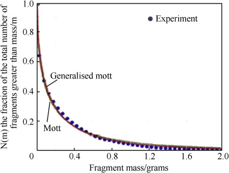 displays the result for the number of fragments measured against the mass of fragments for the Mott distribution, the generalised Mott distribution (which caters for a thick cased explosion) and experimental data. The closeness of the curves and experimental data indicate that the Mott distribution is an accurate approximation for experimental data. Gold’s and Cunniff’s papers also agrees with this conclusion [ 21 , 22 ]. Unfortunately, Mott’s equation does not indicate the length, width and general shape of fragments. Different approaches are required to estimate these dimensions.
The main weakness of Mott’s work on the number of fragments are: 1. There is no information on the shape of fragments. Several researchers assume the fragments created in a warhead are either spherical or cubic. This makes the trajectory and penetration of fragments easier to calculate. 2. There is no information about where on the casing the fragment originates. 3. The number of small fragments is overestimated. This is of minimal interest in this paper because there is evidence from Gardner [ 23 ] that the largest fragments are the most efficient at armour penetration. 4. The number of large fragments is underestimated, and the formula assumes that fragments are randomly distributed throughout the warhead. Experimental results including work from in Kong [ 24 ] and Nyström [ 25 ] indicate that a larger percentage of larger fragments are originated at the opposite end of the cylinder from the detonator [ 26 ].

### 2.3 The shape of fragments

The actual shape of fragments is different from the simulation shape used by several researchers who assume fragments are spherical or cubic shaped.
Fig. 2 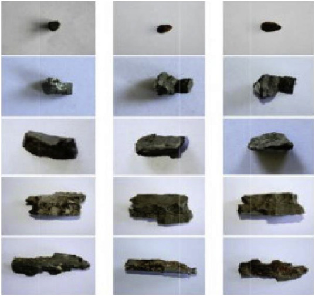 shows the general shape of fragments formed from a cylindrical explosion [ 27 ].
The most detailed available pictures of most, if not all, fragments created by an explosion is provided by Gardner [ 23 ] (see Fig. 10 ). He shows that fragments are mainly irregularly shaped with jagged edges.
Hiroe [ 28 ] also presents similar shaped fragments (see Fig. 11 ). Most of the larger fragments appear to be 2–6 times longer than they are wide.

### 2.4 The average length of axial fragments

There is limited information available on the average length of axial fragments. Using statistical fragmentation theory Mott estimated the average length of a fragment is approximately 1.1 cm [ 29 ]. This is considered to be an accurate estimate of the average length of axial fragments.

### 2.5 The average aspect ratio of fragments

The aspect ratio of a fragment is defined as a fragment’s width divided by its length. Given the aspect ratio of a fragment, if the length of the fragment is known, its width can be calculated. Wilson produced a paper that estimates the average aspect ratio of axial fragments at 1:1.65 for a cylindrical casing made from Tungsten alloy [ 30 ]. Grady referred to work in which the average aspect ratio was estimated at 1: 1.5 for AERMET-100 steel casing [ 29 ].
Mott created a distribution for the aspect ratio of fragments as shown in Fig. 3 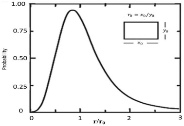 . Unfortunately, the value of $r\_{0}$ (the average value of the aspect ratio) is not provided. This paper aims to provide a value for the average aspect ratio of steel fragments.

### 2.6 How fragments are formed

Research by Mott, Elek and other scientists suggest that as a cylindrical warhead explodes, its casing expands, and circumferential fragments are first formed. This can also be seen in explosion simulations. Although simulations are not an ideal method to determine how explosive cylindrical casings expand, providing the simulations use the laws of physics for the casing and the explosive they can provide a possible indication. Kong’s simulation gives an example of an exploding cylindrical warhead and indicates that long strings are formed just before the casing fractures [ 24 ]. Babu’s recent work on an advanced simulation also shows long strings are first formed in an explosion [ 31 ]. After the warhead’s casing splits into long strings, the strings then split into fragments.
From observations of explosive fragments Mott investigated various two-dimensional randomised approaches that partitioned the casing of the warhead into fragments (see Fig. 4 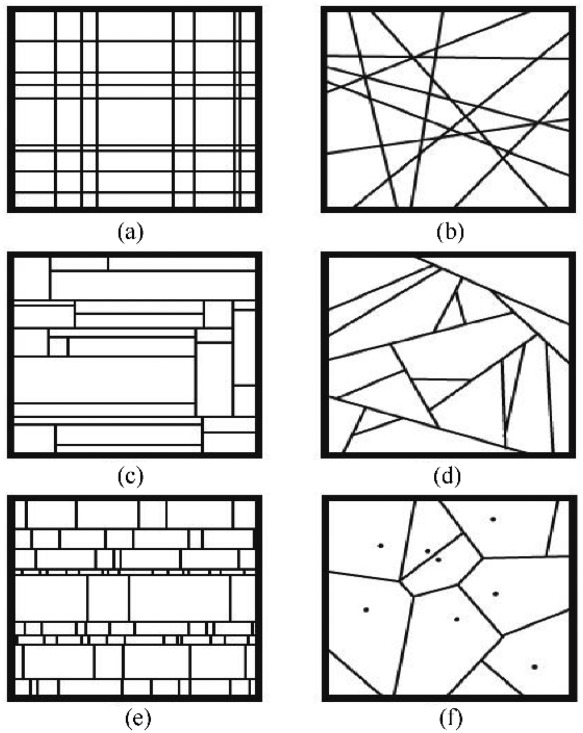 ). The vertical axes represent the unfurled circular part of the warhead and the horizontal axes the length of the warhead. Unfortunately, his investigations of these models did not provide a suitable and converging distribution function.

## 3 Derivation and analysis to improve the fragment characteristics in a cylindrical explosion

This paper offers an alternative approach to FEA using a less complex model adapted from models developed by Mott, to create a fast execution time for simulating fragments. The fragments have a realistic size and shape and the origin of fragments on the warhead’s casing can be determined. This resolves the first two points in the set of weaknesses in Section 2.2 and although the last two points are not addressed the approach can be modified to satisfy these weaknesses.
This model uses the work of several researchers and calculates variables to determine the dimensions of fragments. Using this accumulated data, the final simulation is created using statistical assumptions made by both Lineau and Mott.

### 3.1 Cuboid shaped fragments

Using the information in Section 2.6 , the most accurate diagrams for the creation of fragments in Fig. 4 are options (c) and (e). Option (e) is chosen because it is the closest option to the simulations and papers of Kong [ 24 ], Babu [ 31 ] and Victor [ 17 ] (i.e. as the cylinder expands, circumferential fractures are formed, creating long strings and then the resultant long strings break into fragments). Fig. 5 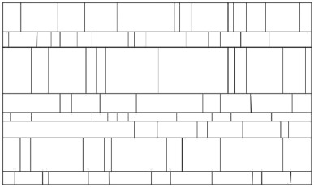 enlarges a copy of image (e) shown in Fig. 4 . These fragments are cuboid shaped.

### 3.2 The effect of the shape of fragments on penetration

There are few published non-FEA fragmentation simulations and the ones that were discovered create cubic or spherical fragments. The shape of a fragment generally has a significant effect on the air resistance restricting the velocity of the fragment, and its penetration into an armour target [ 32 ]. This paper assumes the explosion is close to the target where the effect of air resistance on the flight of fragments is minimal and can be ignored [ 33 ]. The impact area of a fragment on a target substantially affects penetration of the target [ 32 ].
The impact areas for spherical, cubic and cuboid fragments shown in Fig. 6 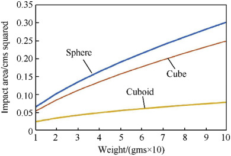 and Fig. 7 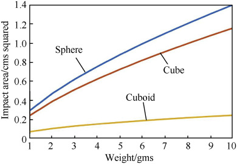 .
Fig. 6 shows the area of impact of fragments against fragment masses between 0.1 g and 1 g and Fig. 7 shows the area of impact of fragments against fragment masses between 1 g and 10 g.
In both of these figures the ratio of the width of the cuboid fragment to its length (the aspect ratio) is assumed to be 1:2. Other aspect ratios for cuboid fragments produce curves similar in shape to the curves in Figs. 6 and 7 (See Fig. 8 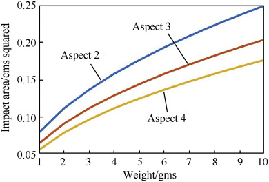 ). The fragments are assumed to have been created from a thin cylindrical warhead, the case for many explosion equations as thin cylindrical warheads are common in warfare.
Although cuboid shaped fragments are not identical to the shape of fragments shown in Gardner’s and Hiroe’s photographs, they have a closer resemblance to the shape of fragments than spheres or cubes. Figs. 6 and 7 show that if a parallelepiped (cuboid) shape is used to represent a fragment rather than a sphere or a cube then the area of impact of the fragment on the target is significantly reduced. This has a substantial effect on the penetration of a fragment on a target [ 32 ].

### 3.3 This paper simulates a cylindrical warhead’s explosion

This paper simulates a cylindrical warhead’s explosion, unfurls its casing to produce a two-dimensional rectangular shape with one side representing the circumferential length of the warhead’s circular end plates and the other side the warhead’s length. The shape of the casing and its fragments is shown in Fig. 5 . The circular part of the casing is split into long sting fragments determined by a Poisson distribution with the size of these fragments’ dependent on the average width of fragments. The average width of fragments is unknown, so is estimated from the average aspect ratio of fragments and the average length of fragments, which is known (see Section 2.4) ). As the average width of fragments is estimated a range of values is considered, to study the sensitivity of the approximated value.
The equation of the Poisson distribution is $$ P k events in an interval = \\lambda^{k} · e^{- \\lambda} / k ! $$
In this simulation λ is the average number of breaks (weaknesses) in the casing for a given length.
Bierlaire [ 34 ] published a simulation to generate random waiting times between two events in a Poisson distribution. He shows the time between random events depends on the distribution $e^{- \\lambda t}$ . His simulation is modified to generate random fragment lengths instead of random waiting times. The following MATLAB code generates circumferential fragments with random widths and lengths equal to the length of the warhead (long string fragments):

1. t = 0;
1. inc = 1;
1. while t -(log (s (inc))/lamda) < Length.
1. x = log (s (inc));
1. x = x /lamda;
1. cyl (inc) = - x ;
1. t = t-x ;
1. inc = inc+1;
1. end.
   % make up the last fragment of the warhead.
1. x = Length1- t ;
1. cyl (inc) = x ;Where the length of circumference is “Length”, the matrix “s (inc)” contains random numbers between (0,1) and “lamda” is the average width.
   The width of fragments are available in the matrix “cyl”, which uses an index “inc”.
   To determine the final cuboid fragments the long string fragments are split, using a Poisson distribution with the length of fragments dependent on the available average length of fragments (1.1 cms).
   The model is identical to the above model with “lamda” set equal to the average length and Length set equal to the length of the warhead.
   In summary the steps taken are: 1. Use the diagram in Fig. 5 to determine the division of the casing into fragments 2. Assume the average length of fragments is 1.1 cms 3. Estimate the average aspect ratio of fragments 4. Using the estimated aspect ratio of fragments to calculate the average width of fragments 5. Create the circumferential fragments using a Poisson distribution with the average width of fragments 6. Create the axial fragments, using the long stings and a Poisson distribution with average length 1.1 cms.

## 4 Results and discussion

### 4.1 The aspect ratio of fragments

In this paper the X axis of a cylindrical warhead is located along the unfurled circumference of the warhead, and represents the width of fragments, and the Y axis is located along the warhead’s axis and represents the length of fragments.
Fig. 3 shows Mott’s distribution of aspect ratios, copied as Fig. 9 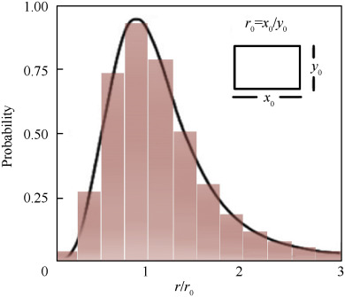 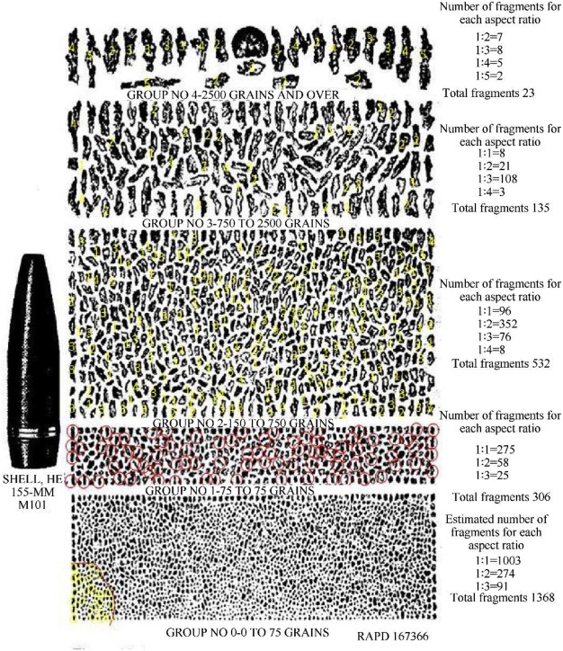 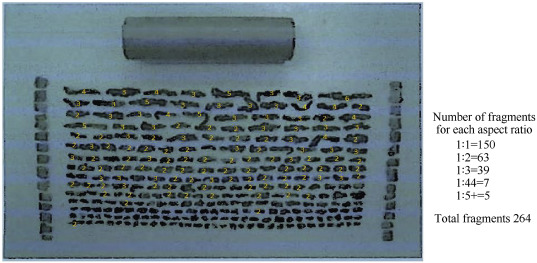 which also includes a histogram with 0.25 interval sizes. The histogram is designed so that the area outside of the curve but included in the histogram, is equal to the area inside the curve and not included in the histogram. The estimated values of the histogram are shown in Table 1 .

#### 4.1.1 Estimate the value of r 0

Mott estimated $r\_{0}$ has a value of $( ε ˙_{x} / ε ˙_{y} )^{- 2 / 3}$ where $ε ˙_{x} and ε ˙_{y}$ are the rate of change of strain with time in the x (width) and y (length) directions [ 29 ]. The values of $ε ˙_{x} and ε ˙_{y}$ are not available in any research papers so the following sections are an attempt to estimate the value of. $r\_{0} .$

##### 4.1.1.1 Using the stress and strain formulae

In Morley’s book “Strength of Materials” in the chapter on thin cylindrical shells having internal pressure he shows the ratio of hoop tension caused by a pressure of P is twice the longitudinal tension [ 35 ]. These formulae lead to the ratio of strain in the longitudinal direction to strain in the radial direction being about 1 : 2. This suggests that the length of fragments will be twice as long as they are wide. Although he does not indicate the formulae is for stress and strain for metals in an elastic state, it is assumed that this is the case. It is unknown if metals subject to plasticisation will have a similar value for the ratio of radial strain to longitudinal strain.

##### 4.1.1.2 Using Kong’s paper to calculate r 0

Mott’s aspect ratio distribution does not depend on the type of warhead; it is for all cylindrical warheads [ 29 ]. He also shows that the value of $ε ˙_{x}$ at the position x is equal to $V_{x} / r\_{x}$ where $V\_{x}$ is the fragmentation velocity at point x and $r\_{x}$ is the radius of the cylinder at point x [ 29 ]. A similar formula is used for the value of. $ε ˙_{y} .$
Few papers provide the velocity of end plate fragments $V_{y} .$ Rottenkolber’s and Hartmann’s papers [ 36 , 37 ] provide an analytical model to calculate fragment velocity, including end plate velocity and Kong’s paper [ 24 ] delivers precise experimental data for a cylindrical warhead’s end plate and axial velocities. It is more accurate and preferable to use experimental data rather than use analytical data, so the Kong paper is selected.
Kong’s paper suggests the detonation end plate has a velocity of about 1300 m/s and the far end plate a velocity of about 1745 m/s. The velocities of the two end plates are not equal so it is proposed to equate the two values of $V\_{y} / r\_{y}$ for the end plates by solving $:$ $$ ( 1745 / l ) = ( 1300 / ( 160 - l ) ) $$ where the length of the warhead in the experiment is 160 and $l$ is the distance from the non-detonation end plate. The solution to Eq. (6) is approximately 92. This gives a value of $ε ˙_{y} = 1745 / 92 and ε ˙_{x} = 1400 / 55$ , where 55 is the radius of the cylinder. So $( ε ˙_{x} / ε ˙_{y} )^{- 2 / 3} ≃ 0.82$ Therefore $r\_{0}$ is approximately 0.82 and $1 / r\_{0}$ $≃$ 1.22. Although this is for Kong’s experimental data there are no more experimental data papers on end plate velocities. It is assumed that the values of $( ε ˙_{x} / ε ˙_{y} )^{- 2 / 3}$ are similar for steel casings so the above Figures in Table 1 need to be adjusted. As the value of $1 / r\_{0}$ $≃$ 1.22 has been estimated the sensitivity of the value is checked by considering a range of values between 1.12 and 1.32 in Table 1 . The updated Table 1 values are rearranged to provide Table 2 .

#### 4.1.2 The aspect ratio of fragments in the Grady paper

The dimensions of the shell in Fig. 10 correspond to the shell’s actual dimensions, so it is assumed the fragments also have correct dimensions. The aspect ratio of fragments is estimated using the following approximations:
In Fig. 10 aspect ratios are rounded. So, the ratio of 1:1 covers the range of 1:0.5 to 1:1.5 and the ratio of 1:2 the range of 1:1.5–1:2.5 and so on.
For Group 0 fragments, the total number of fragments is assessed by estimating the number of rows and columns and multiplying the two values to give an overall number of fragments. An area, designated with the red line, contains a small proportion of fragments that are counted. In this area, fragments with an aspect ratio of 1:2 and 1:3 are highlighted and enumerated and the remaining fragments are counted and considered to have an aspect ratio of 1:1. From the three values (the number of fragments in Group 0, the number of fragments with an aspect ratio of 1:2 and 1:3) the number of fragments with aspect ratios of 1:1, 1:2 and 1:3 in Group 0 can then be identified.
For Group 1 fragments the total number of fragments is estimated and the number of fragments with an aspect ratio of 1:2 highlighted and counted. Fragments with an aspect ratio of 1:1 and 1:3 are then estimated.
For Group 2 fragments the total number of fragments are estimated, and fragments are assumed to have an aspect ratio of 1.2. Fragments with an aspect ratio of 1:1, 1:3 and 1:4 are highlighted and counted.
For Group 3 fragments the total number of fragments are counted, and fragments are assumed to have an aspect ratio of 1:3. Fragments with an aspect ratio of 1:1, 1:2, and 1:4 are highlighted and counted.
The estimated aspect ratios of Group 4 fragments are also counted.
The results for all the Groups are set out in Table 3 .

#### 4.1.3 The aspect ratio of fragments in the Hiroe paper

Fig. 11 aspect ratios uses the same rounding routine described in Grady’s Figure. All fragments with aspect ratio 1:2 to 1:5+ are indicated in the figure. The remaining fragments are assumed to have an aspect ratio of 1:1.
Table 4 includes the figures in Table 3 together with the aspect ratios of fragments with for Hiroe’s explosion. The percentages for Motts distribution include the percentage for aspect ratios less than 1:1 split over aspect ratios 1:2 and 1:3. The percentage of fragments with an aspect ratio of 1:1 is not changed.
This figure shows the percentage of fragments for aspect ratios are similar. Mott’s percentages are slightly higher for aspect ratio 1:1 and the aspect ratio 1:4 is probably inaccurate for each of the figures. Mott’s ratio of 1:3 is also significantly less than the ratios in the two papers. This is probably due to the difficulty in estimating the length of fragments in the two papers and the limited information available to estimate Mott’s average values. However overall the three figures have similar values.
Mott’s distribution and Hiroe’s paper are for cylindrical warheads and Grady’s for an ogive shaped warhead. With the lack of any creditable figures for the average aspect ratio the average of the three results in Tables 4 and 1 :1.6 rounded is taken as the starting point for the average aspect ratio. This figure corresponds reasonably well to the figures provided by Wilson and Grady (Section 2.5 ). However, a range of aspect ratios are also considered to judge the sensitivity of the average aspect ratio.
In Mott’s distribution of aspect ratios the ratios less than 1:1 are not compared with results from Figs. 10 and 11 . In Figs. 10 and 11 it is impossible to differentiate fragments with aspect ratio less than 1:1 from aspect ratios greater than 1:1. I.e. in these figures it is assumed that the long side of a fragment is its length. This may not be the case. More detailed photographs of fragments created by a warhead will produce more accurate results.
The simulation is created for cuboid fragments with a fragment’s length depending on the Poisson distribution with an average length of 1.1 cm and a fragment’s width depending on a Poisson distribution with an average width of 1/1.6.
Fig. 12 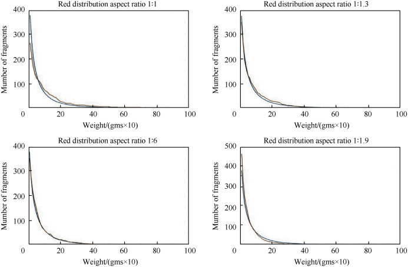 compares the graph of Mott’s distribution with the simulations’ distributions for different aspect ratios. The blue curves represent the Mott distribution and the red curves the simulation distribution. The results indicate that as the average aspect ratio (width to length) increases to 1:1.6 the curves become similar. For aspect ratios less than 1:1.6 there are a larger number of large fragments and fewer small fragment when compared with the Mott distribution. For aspect ratios beyond 1: 1.6 the reverse is true; there are more small fragments and fewer large fragments.
The results shown in Fig. 12 are for a warhead whose width to length is 1: 2 and the warheads length is 10 cm. However, an experiment where the warhead’s length is 20 cm was also performed, providing similar results.
Although the results shown in Fig. 12 are a good representation of different aspect ratio distribution, each distribution contains many random results and it is possible to have some patterns divergent from those shown. Incorporating an additional step in the model to generate three or four executions for a given aspect ratio and selecting the execution with the number of fragments closest to the figure created by the Mott distribution should eliminate most divergent executions. However, the execution time of the simulation could double.
Fig. 12 indicates the best aspect ratio is close to 1:1.6. The 1:1.6 and 1:1.7 aspect ratios provide a correlation coefficient of 0.99 with Mott’s equation. Table 5 gives some values and calculated values for the simulations. The aspect ratios of 1:1.6 and 1:1.7, in Table 5 , have the average number of new model fragments closest to the number of fragments in Mott’s model, as shown in the percentage change. This indicates that the percentage change appears to offer an accurate indicator for the optimum aspect ratio.
Also included in the model were instructions to calculate the aspect ratios of the fragments. Unfortunately, the aspect ratio graphs do not give similar results as the graph in Fig. 3 This could indicate that the graph is inaccurate, or the results are inaccurate or perhaps a little bit of each. A number of small fragments give a high aspect ratio. This is a difficult anomaly to address because of the number of small fragments that give a small length and a high aspect ratio.

### 4.2 Correlation coefficient

The correlation coefficient used to determine the “goodness of fit” between the experimental and calculated number of fragments is Pearson’s coefficient as outlined in Rodger’s paper [ 38 ]. This coefficient has a value between −1 and 1 where the value of 1 indicates an exact positive correlation and −1 indicates an exact negative correlation. The correlation coefficient between Mott’s distribution and the new distribution is almost equal to one (0.99) which means the new distribution is very accurate when compared with experimental data.

### 4.3 Computer execution times

An estimate of the computer execution time required to run the simulation programme is obtained in MATLAB by executing the simulation programme 10,000 times. The average execution time for one cycle is then calculated at about 2.32 × 10 −6 s with the average time taken to simulate the new model 10,000 times being 0.023232 s. The code has been checked and where discovered unused code has been deleted. However, the code has not been optimised for the given results and so it may be possible to reduce the elapsed time further with code optimisation.

## 5 Conclusions

This study presents a fast, two-dimensional explosion simulation to estimate the number, weight, size, shape and position of fragments on the warhead’s casing. The size and shape of fragments is important in non-FEA modelling because several researchers assume cubic or spherical shaped fragments. These shapes give inaccurate results for drag and armour penetration which can lead to false conclusions about the effect of fragments on external targets. The fast execution speed of the simulation will allow this model to be used in real-time computations.
To verify the simulation’s accuracy simulation is compared with Mott’s distribution, which is considered to be accurate when compared with experimental data, other experimental data and calculated data. The calculated correlation coefficient between the two-dimensional simulation and Mott’s distribution is 0.99 which means the method is accurate compared with experimental data.
The execution time of one cycle of the two-dimensional method is fast (0.023 s) and with code optimisation can be made even faster. The simulation is therefore suitable for real-time simulation and fast computation, with additional features when compared to existing approaches.
As well as correlating with Mott’s equation the method provides more accurate average length and width of fragments. The fragments are cuboid shaped with their average length equal to 1.1 cm and their average width between 1/1.6 and 1/1.7. Although a cuboid in not identical to the shape of all fragments it is a better approximation than a sphere or a cube.
Better experimental data on the distribution of large fragments would help to improve the origin of large fragments. More information on the size and probability distribution of end plates fragments is also required. This would enable the simulation to be more comprehensive in terms of all fragments in a cylindrical warhead.

## References

[1]. S. Gabrovsek, I. Colwill, and E. Stipidis, "Agent-based simulation of improvised explosive device fragment damage on individual components," The Journal of Defense Modeling and Simulation: Applications, Methodology, Technology, vol. 13, pp. 399-413, 2016.
[2]. S. Gabrovsek, "Agent-based modelling of fragment damage for platform combat utility prediction ", 2017.
[3]. R. W. Gurney, "The initial velocities of fragments from bombs, shell and grenades," DTIC Document1943.
[4]. G. Taylor, "Analysis of the explosion of a long cylindrical bomb detonated at one end," Mechanics of Fluids, Scientific Papers of GI Taylor, vol. 2, pp. 277-286, 1941.
[5]. Mott, "A theory of the Fragmentation of Shells and Bombs," 1943.
[6]. X. An, P. Ye, J. Liu, C. Tian, S. Feng, and Y. Dong, "Dynamic Fracture and Fragmentation Characteristics of Metal Cylinder and Rings Subjected to Internal Explosive Loading," Materials, vol. 13, p. 778, 2020.
[7]. Y. J. Charron, "Estimation of velocity distribution of fragmenting warheads using a modified gurney method," DTIC Document1979.
[8]. J. Szmelter, N. Davies, and C. K. Lee, "Simulation and measurement of fragment velocity in exploding shells," 2007.
[9]. C. H. Choi, M. Callaghan, P. van der Schaaf, H. Li, and B. Dixon, "Modification of the Gurney Equation for Explosive Bonding by Slanted Elevation Angle," 2014.
[10]. M. Liu, G. Liu, Z. Zong, and K. Lam, "Computer simulation of high explosive explosion using smoothed particle hydrodynamics methodology," Computers & Fluids, vol. 32, pp. 305-322, 2003.
[11]. S. Ma, X. Zhang, Y. Lian, and X. Zhou, "Simulation of high explosive explosion using adaptive material point method," Computer Modeling in Engineering and Sciences (CMES), vol. 39, p. 101, 2009.
[12]. K. Spranghers, I. Vasilakos, D. Lecompte, H. Sol, and J. Vantomme, "Numerical simulation and experimental validation of the dynamic response of aluminum plates under free air explosions," International journal of impact engineering, vol. 54, pp. 83-95, Apr 2013.
[13]. V. Babu, R. Thyagarajan, and J. Ramalingam, "Faster Method of Simulating Military Vehicles Exposed to Fragmenting Underbody IED Threats," SAE Technical Paper 0148-7191, 2017.
[14]. M. M. Van der Voort and D. M. Sharp, "Probabilistic Aspects of the Initiation of Explosives and Ammunition," in 35th International Systems Safety Conference, 2017, pp. 21-25.
[15]. C. Lineau, "Random fracture of a brittle solid," Journal of the Franklin Institute, vol. 221, pp. 673-686, 1936.
[16]. E. Stroemsoee and K. Ingebrigtsen, "A modification of the Mott formula for prediction of the fragment size distribution," Propellants, explosives, pyrotechnics, vol. 12, pp. 175-178, 1987.
[17]. A. C. Victor, "Warhead performance calculations for threat hazard assessment," DTIC Document 1996.
[18]. P. Elek and S. Jaramaz, "Size distribution of fragments generated by detonation of fragmenting warheads," in Proceedings of the 23rd International Symposium on Ballistics, Tarragona, Spain, April, 2007, pp. 16-20.
[19]. Needham, Ed., Blast Waves. Springer International Publishing, 2018, 484 Pages.
[20]. P. Elek and S. Jaramaz, "Fragment mass distribution of naturally fragmenting warheads," FME Transactions, vol. 37, p. 135, 2009.
[21]. V. M. Gold, "Engineering model for design of explosive fragmentation munitions," DTIC Document2007.
[22]. P. M. Cunniff, "A Method to Describe the Statistical Aspects of Armor Penetration, Human Vulnerability and Lethality due to Fragmenting Munitions," presented at the International symposium on ballistics, 2014.
[23]. [23] S. Gardner, "Analysis of fragmentation and resulting shrapnel penetration of naturally fragmenting cylindrical bombs," California: Lawrence Livermore National Laboratory2000.
[24]. X. Kong, W. Wu, J. Li, F. Liu, P. Chen, and Y. Li, "A numerical investigation on explosive fragmentation of metal casing using Smoothed Particle Hydrodynamic method," Materials & Design, vol. 51, pp. 729-741, 2013.
[25]. U. Nystrom and K. Gylltoft, "Numerical studies of the combined effects of blast and fragment loading," International journal of impact engineering, vol. 36, pp. 995-1005, 2009.
[26]. W. Arnold and E. Rottenkolber, "Fragment mass distribution of metal cased explosive charges," International journal of impact engineering, vol. 35, pp. 1393-1398, 2008.
[27]. A. Catovic, B. Zecevic, S. S. Kadic, and J. Terzic, "Numerical simulations for prediction of aerodynamic drag on high velocity fragments from naturally frag-menting high explosive warheads," Dim, vol. 50, p. 100, 2012.
[28]. T. Hiroe, K. Fujiwara, H. Hata, and H. Takahashi, "Deformation and fragmentation behaviour of exploded metal cylinders and the effects of wall materials, configuration, explosive energy and initiated locations," International journal of impact engineering, vol. 35, pp. 1578-1586, 2008.
[29]. D. E. Grady, Ed., Fragmentation of Rings and Shells The legacy of N. F. Mott Springer-Verlag Berlin Heidelberg, 2006, 371 Pages.
[30]. L. Wilson, D. Reedal, M. E. KIPP, R. R. MARTINEZ, and D. Grady, "Comparison of calculated and experimental results of fragmenting cylinder experiments," Sandia National Labs., Albuquerque, NM (US); Sandia National Labs …2000.
[31]. V. Babu, S. Kankanalapalli, and M. Vunnam, "Effect of Fragmenting Buried High Explosive Projectile (152mm HE Frag OF-540) on Military Ground Vehicles," US ARMY CCDC GVSC (FORMERLY TARDEC) WARREN United States2019.
[32]. P. THOR, "The resistance of various metallic materials to preforation by steel fragments; empirical relationships for fragments residual velocity and residual weight," 1961.
[33]. Fitzpatrick, "Projectile motion with air resistance," University of Texas, 2014.
[34]. M. Bierlaire. (2018, Simulating events: the Poisson process. Transports and Mobility Laboratory.
[35]. A. Morley, "Strength of Materials (7th edition)," ed: London, 1930.
[36]. E. Rottenkolber and W. Arnold, "A generalization of the Gurney formalism to three dimensions," in Proceedings of 21st International Symposium on Ballistics, Adelaide, Australia, 2004.
[37]. T. Hartmann, E. Rottenkolber, and A. Boimel, "Engineering Tools for the Analysis of Penetration and Fragmentation," in 30th International Symposium on Shock Waves 2, 2017, pp. 1513-1518.
[38]. J. Lee Rodgers and W. A. Nicewander, "Thirteen ways to look at the correlation coefficient," The American Statistician, vol. 42, pp. 59-66, 1988.
