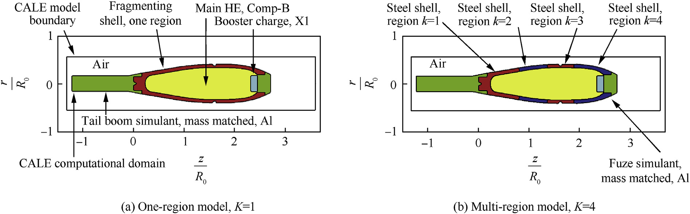
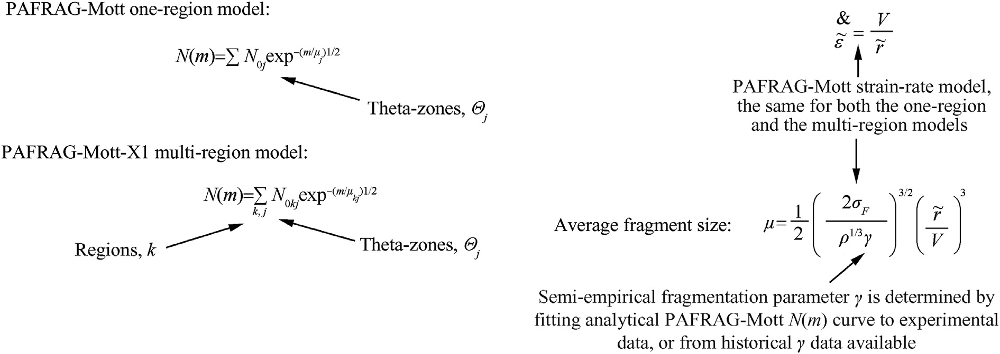
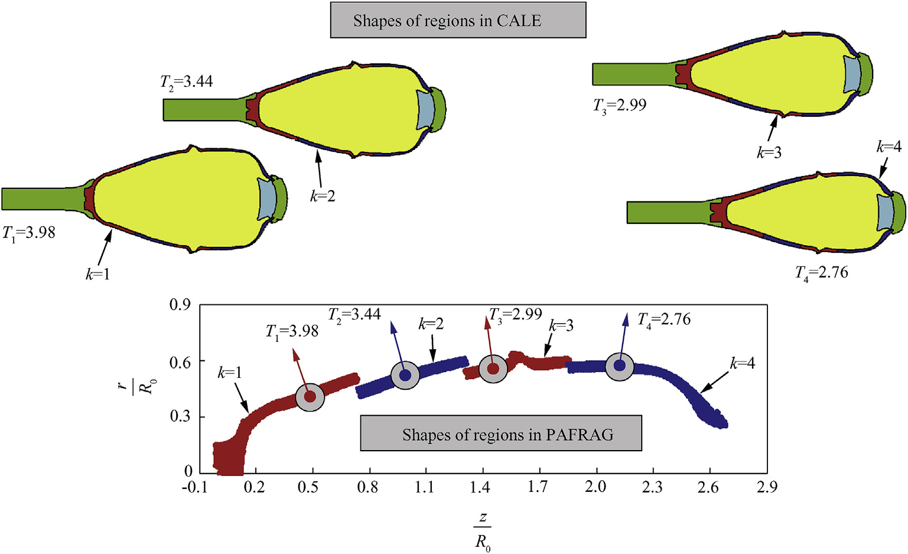
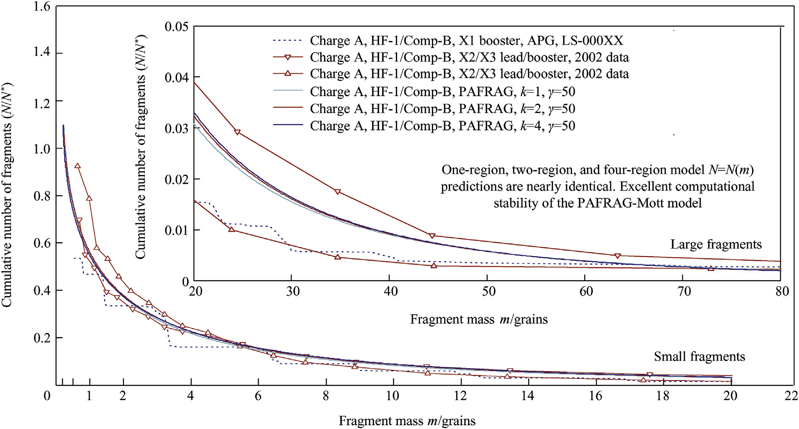
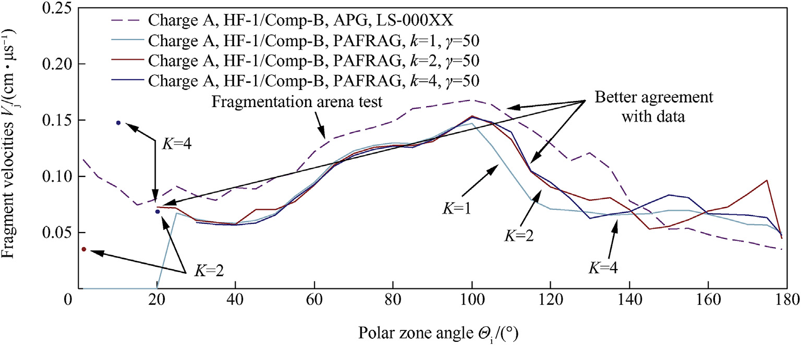

# Fragmentation Model for Large L/D (Length over Diameter) Explosive Fragmentation Warheads

**Authors:** Vladimir M. Gold\
**Affiliation:** US Army RDECOM-ARDEC, Attn: RDAR-MEE-F, Picatinny Arsenal, NJ 07806-5000, USA\
**Journal:** Defence Technology, Vol. 13, No. 4, pp. 300–309, August 2017\
**DOI:** [10.1016/j.dt.2017.05.007](https://doi.org/10.1016/j.dt.2017.05.007)\
**PII:** S2214-9147(17)30079-X\
**Open Access:** CC BY-NC-ND 4.0

______________________________________________________________________

## Abstract

New advanced numerical computer model enabling accurate simulation of fragmentation parameters of large Length over Diameter (L/D) explosively driven metal shells has been developed and validated. The newly developed large L/D multi-region model links three-dimensional axisymmetric high strain high strain-rate hydrocode analyses with the conventional set of Picatinny Arsenal FRAGmentation (PAFRAG) simulation routines. The standard PAFRAG modeling technique is based on the Mott's theory of break-up of idealized cylindrical "ring-bombs", in which the length of the average fragment is a function of the radius and velocity of the shell at the moment of break-up, and the mechanical properties of the metal. In the newly developed multi-region model, each of the shell region, the break-up is assumed to occur instantaneously, whereas the entire shell is modeled to fragment at multiple times, according to the number of the regions considered. According to PAFRAG methodology, the required input for both the natural and the controlled fragmentation models including the geometry and the velocity of the shell at moment of break-up had been provided from the hydrocode analyses and validated with available experimental data. The newly developed large L/D multi-region PAFRAG model has been shown to accurately reproduce available experimental fragmentation data.

**Keywords:** Explosive fragmentation modeling; Natural fragmentation; Mott model; PAFRAG; Fragmentation warhead lethality performance

______________________________________________________________________

## 1. Introduction: PAFRAG Capabilities and Challenges

The subject of fragmentation of explosively driven shells has long been of interest in the military field and has recently commanded attention in a number of other applications including the design of fragment and blast resistant structures and protective facilities. A review of previous work shows that extensive studies on the subject were performed in the early 1940s. Historically, three names of ground-breaking researchers' stand out. Gurney is credited for deriving a form of an empirical expression for prediction of fragment velocities as a function of the mass ratio between the explosive and the metal shell [21], Mott is credited for developing statistical models for predicting average fragment sizes and fragment mass distributions [6], and Taylor is credited for developing models describing expanding shell dynamics and the state of stress at the time of fracture [22]. Most of this work, however, ceased shortly after the World War II and was not resumed until the 1960s.

Before the state-of-the-art high-strain-rate high-strain finite difference computer programs became available to fragmentation munition designers, for nearly six past decades modeling of explosive fragmentation munitions relied for a large degree on analytical methods developed in 1940s, primarily, the fragment velocity predictions based on Gurney [21] approximations with fragment mass distribution statistics based on Mott [6] or Gurney and Sarmousakis [23] fragmentation models. Mott's [6] approach to the dynamics of fracture activation was successfully pursued starting in 1980s by Grady and Kipp resulting in significant advances in a number of dynamic fracture and fragmentation areas [24–27] including the high-velocity impact fragmentation [32,33], shaped charge jet break-up [28], dynamic fragmentation of metal rings [24,25,29], spalling phenomena [30,31], and rock blasting [34]. The extensive influence of Mott's concepts can be found in many other works including that of Hoggatt and Recht [35], Wesenberg and Sagartz [36], and Sweitzer [46,47]. A comprehensive review of Mott's fragmentation concepts is given by Grady [37]. A perturbation stability approach to fragmentation of rapidly expanding metal rings is given by Mercier and Molinari [38]. A compilation of analytical techniques for assessment of effectiveness of fragmentation munitions can be found in Weiss [39] and a brief review of fragmentation models can be found in Grady [40]. Recently, there are a number of reports applying the state-of-the-art continuum hydrocode analyses to the explosive fragmentation problem utilizing Eulerian, Arbitrary-Lagrangian-Eulerian, Lagrangian, Peridynamics, SPH (Smooth Particle Hydrodynamics), and corpuscular model methods [41–45].

Picatinny Arsenal FRAGmentation (PAFRAG) methodology (Ref. [4 and 16]) is the state-of-the-art modeling and simulation technique for assessing lethality and safe separation distances of explosive fragmentation munitions. According to the PAFRAG methodology, the analytical assessment of the warhead fragmentation parameters is performed employing a series of PAFRAG code modules linking three-dimensional axial symmetric high-strain, high-strain-rate continuum hydrocode analyses with a comprehensive suite of phenomenological fragmentation models. The later models include modules for "natural" fragmentation warheads, modules for "controlled" or "preformed" fragmentation warheads, or modules for multi-mode multi-material composite Steel/W-alloy/W-matrix fragmentation shell structures, for example. In addition to cost effectiveness, employing the PAFRAG approach offers a more detailed and accurate warhead performance information at all warhead life cycle development and modification phases. Depending on specific applications, PAFRAG can be used for a ballpark fragmentation performance estimate when there are no experimental data available, or as a powerful warhead design modification and optimization tool when supported and augmented by experimentation. When the precision in predicting fragmentation warhead performance is a requirement, the PAFRAG analyses are validated through a series of experiments including high speed photography, X-ray flash radiography, and sawdust, or water total fragment spray recovery.

The PAFRAG natural fragmentation model module, PAFRAG-Mott, is based on the Mott's theory of break-up of cylindrical "ring-bombs" (refs. [6–8]), in which the length of the average fragment is a function of the radius and the expansion velocity of the shell at the moment of break-up and the mechanical properties of the metal. According to the original one-region PAFRAG implementation, the entire fragmenting shell is modeled as one continuous material region with the same fragmentation properties; the principal assumption of the PAFRAG-Mott model is that the entire shell fragments instantly at some prescribed time at which the "average" shell strain $\\varepsilon$ reaches a predetermined critical fracture value $\\varepsilon_F$, the same value for the entire shell. Accordingly, in the original one-region PAFRAG-Mott model implementation, the averaged shell strain $\\varepsilon$ is measured in terms of a single parameter, $V/V_0$, the high explosive detonation product volume expansions ratio. This single parameter is used for the entire shell.

The relationship between the average strain in the shell $\\varepsilon$ and $V/V_0$ is a complex function of the warhead geometry, the mechanical properties of the fragmenting shell, the thermodynamic properties of the explosive, and the reactive flow parameters of detonation products escaping through fractures or unconstrained boundaries. Following Pearson (ref. [17]), the fragmentation of shells with idealized cylindrical geometries occurs at approximately three volume expansions, whereas the instant of fragmentation is defined as the time at which the detonation products first escape from the fractures in the shell. Accordingly, for example, assuming an ideal case with no detonation product leaks; the ideal plane stress axisymmetric dilation conditions; and that the warhead case breaks-up at approximately three volume expansions, the corresponding value of the shell fracture strain $\\varepsilon_F$ should be approximately 0.73, i.e. $\\varepsilon_F \\approx [(V/V_0)^{1/2} - 1] \\sim 0.73$. The later value of the shell's critical fracture strain is typically in fair agreement with both the high-speed photography and the X-ray flash radiography; accordingly, the $V/V_0 \\sim 3.0$ criterion is accepted as a rule of thumb for routine one-region PAFRAG modeling. For small length to diameter ratio (L/D) warheads (with length over diameter ratios $\\leq$ 2–2.5), employing the three volume expansion warhead case fragmentation rule, $V/V_0 \\sim 3.0$, one-region PAFRAG analyses usually result in good agreement with the available fragment recovery data. Regrettably, when applying one-region PAFRAG modeling to high L/D warheads, the agreement between analyses and the fragmentation experimentation is rather poor (ref. [5]).

For large L/D warheads, as the explosive detonation wave travels along the warhead's length and ignites the main explosive charge, regions of the fragmentation shell nearest to the detonation initiation point are set in motion and fracture first, significantly earlier compared to the sections that are at larger axial distances from the point of charge initiation. In particular, for large L/D warheads, for which the shell region fragmentation time is a strong function of the region axial coordinate, the original one-region model assumption may become unacceptably inaccurate, resulting in significant discrepancies between analytical PAFRAG predictions and the experimental data. Thus, in order to accurately model the fragmentation performance of large L/D warheads, an improved model accounting for the variance in the shell region fragmentation times is required. In the newly developed multi-region model, each of the shell region, the break-up is assumed to occur instantaneously, however, the entire shell is modeled to fragment at multiple times, according to the number of the regions considered.

In the original one-region PAFRAG model, the warhead case fragmentation properties are the same for the entire warhead; in the newly developed multi-region model, the fragmentation properties of the shell are allowed to vary from region to region, a feature useful for modelling large L/D complex explosive cavity curvature warheads. For complex geometry warheads, as the explosive detonation wave sweeps across warhead's length, the angle of the interaction between the explosive detonation wave and the fragmentation shell is continuously changing, which significantly affects the local shell's fragmentation properties, because of the varying magnitude of the shock transmitted to the shell. This later phenomena is a corollary of a well-established correlation between the values of the Mott fragmentation parameters and the explosive Chapmen-Jouget detonation pressures, an effect well studied and documented in the literature, see Ref. [20], for example. Accordingly, for example, if one is interested in an idealized explosively driven fragmentation configuration, large L/D cylinders would represent the most favourable shape for characterizing fragmentation properties of the shell material, since for this ideal geometry the angle of interaction of the detonation wave with shell's surface is approximately constant, so that the local fragmentation properties of the shell are approximately the same.

In this work, to explore the validity of qualitative predictions of the newly developed multi-region fragmentation model, an engineering application example of a multi-booster axial initiation train design concept was considered and studied. The engineering rationale for the multi-booster explosive initiation train approach is that, given that the Mott fragmentation properties of an explosively driven shell is a strong function of the strength of the transmitted shock, the fragmentation performance of the complex curvature warhead can be optimized through maximizing the angle of the interaction between explosive fill and the shell, ideally, as close to approximately 90°, if possible. In the study presented, the multi-region PAFRAG model was developed and validated using an available set of generic Charge A warhead data. In validating the model, a different prototype multi-booster axially initiated explosive Charge B munition was considered, constructed, and tested. A brief mathematical description of the newly developed model, a series of the Charge A fragmentation simulation examples, comparison of the Charge A numerical modelling with the available experimental data, and results of the Charge B axial booster experimentation tests are given in sections that follow.

______________________________________________________________________

## 2. One-Region CALE/PAFRAG Model and Assumptions

Modelling the Charge A warhead using the one-region CALE/PAFRAG technique was the first step in the multi-region, large L/D model development effort. All three-dimensional axisymmetric, high-strain, high-strain-rate, continuum hydrocode analyses (both the one-region and the multi-region modeling) presented in this work were performed using the CALE (ref. [10]) computer program. CALE is plane two-dimensional and axisymmetric hydrodynamics code based on the Arbitrary Lagrangian-Eulerian (ALE) numerical technique. It is capable of modelling multi-material flow and allows for discontinuous velocities at material interfaces.

Fig. 1 (a) above shows a layout of a one-region CALE model for the prototype Charge A warhead. As shown in the figure, the Charge A warhead components that were included in the model are as follows: (1) fragmenting HF-1 steel shell; (2) main high explosive (HE) Comp-B charge; (3) booster charge, X1; (4) tail boom simulant, modelled as aluminium bar of the equivalent mass; and (5) fuze simulant, modelled as aluminium cap of the equivalent mass. A generic set of the equations of state (EOS) and the constitutive model parameters for the fragmenting shell (for the tail boom) and for the fuze simulant commonly used for these materials was adopted from Refs. [11–13]. The Comp-B explosive detonation model parameters were adapted from Ref. [14]. The X1 explosive detonation model parameters were compiled by the author from the JAGUAR-code thermochemical calculations (ref. [15]).

Upon initiation of the HE, the rapid expansion of high-pressure, high-velocity detonation products results in high-strain, high-strain-rate dilation of the fragmentation shell, which eventually ruptures, generating a spray of high-velocity steel fragments. Following the expansion of the detonation products, the tail boom section is projected in the negative z-direction, and fuze is projected in the positive z-direction. The end of the tail boom simulant in contact with the explosive and the fuze simulant undergo significant plastic flow and break up projecting a number of aluminum fragments in both directions but without any significant contribution to the warhead lethality.

In the PAFRAG model, the direction of fragments in the fragment spray is measured in reference to the positive z-axis in terms of the polar angle $\\Theta$. The principal topic of this work is a numerical model for analytical description of parameters of the resulting fragment spray as functions of the spray angle $\\Theta$. In a typical large-scale explosive fragmentation test (commonly called an arena test) the munitions are positioned at the origin of the reference coordinate system and surrounded with a series of velocity-measuring screens and fragment-capturing witness panels. All of the screens and panels are placed at significant distances from the warhead. Accordingly, the fragmentation characteristics are assessed as functions of polar angles $\\Theta'$ identifying angular positions of these measuring devices. Assuming that the fragment trajectory angles $\\Theta$ do not change with time (that is the lateral drift of fragments due to air resistance is small), and that definitions of angles $\\Theta$ and $\\Theta'$ are approximately identical, the model enables the prediction of crucial characteristics of fragmenting munitions including the number of fragments, the fragment size distribution, and the average velocities.

For convenience, let us introduce non-dimensional time parameter $T = \\tau/\\tau_0$, where $\\tau$ is the time in microseconds and $\\tau_0$ is a predefined scale factor, also in microseconds. For the Charge A warhead, using the 3 detonation product volume expansion fracture rule of thumb, the $V/V_0 \\sim 3$ threshold criterion is reached at the non-dimensional time T of approximately 3. Assuming that the entire shell fragments instantly at approximately $T = 3$, the entire CALE-generated flow field is passed to the PAFRAG-Mott model module. A brief review of the original one-region PAFRAG-Mott model is given here for completeness. Following (ref. [8]), the random variations in fragment size is accounted for using the following distribution

$$N(m) = N_0 , e^{-(m/\\mu)^{1/2}} \\tag{1}$$

In equation (1) $N(m)$ represents total number of fragments of mass greater than $m$; $\\mu$ is defined as one half of the average fragment mass; $N_0 = M/2\\mu$ and $M$ is the total mass of the fragments.

At the instant of fracture, let $r$ be the radius of the ring and $V$ be the velocity with which the shell is moving outwards. Then, according to Mott (1947), the average circumferential length of the resulting fragments is

$$x_0 = \\left(\\frac{2\\sigma_F}{\\rho \\gamma'}\\right)^{1/2} \\frac{r}{V} \\tag{2}$$

Here $\\rho$ and $\\sigma_F$ denote the density and the strength respectively; and $\\gamma'$ is a semi-empirical statistical constant determining the dynamic fracture properties of the material.

As the shell expands radially, a series of radial fractures propagate along its length resulting in the formation of relatively long splinter-like fragments that continue to stretch in the axial direction. Since the extent of the plastic deformation is limited by the shell strength, the splinter-liker fragments eventually break-up forming irregularly sized prism-shaped fragments. Formation of these fragments is accomplished through a series of complex three-dimensional processes governed by randomness, instabilities, and more specifically, by the fracture propagation/bifurcation phenomenon. On the micro-scale, fracture propagation is accomplished through a number of microstructural mechanisms including adiabatic shear banding, micro cracking, micro-void nucleation and growth, all determined by intrinsic microstructural features such as inclusions, grain size, texture, and the like. On the macro-scale, these microstructural features translate into the continuum mechanical/physical properties such as flow stress, strength, hardness, strain hardening behavior, the temperature sensitivity of the flow, etc. Accordingly, on the macro-scale, the fragmentation is governed by the material strength and propagation of stress loading and rarefaction/release Mott waves, which is relatively "stable", that is, small perturbations in the material properties produce small variations in the stress wave speeds. Therefore, on the continuum macro-scale, small perturbations in the physical material structures and geometries create small variations in the patterns/regions where the fragmentation is most likely to occur, which defines a fundamental cause for fragmentation randomness. On the micro-scale, however, fragmentation is determined by the material fracture site initiation/crack propagation/branching, which is intrinsically "unstable". Combination of these two stochastic phenomena, on the macro-scale and on the micro-scale, determines the overall dynamic fragmentation randomness.

A series of engineering assumptions that allow essentially one-dimensional Mott wave propagation approach to model complex three-dimensional fragmentation phenomenon are as follows. According to Mott (1943), the ratio of the fragment circumferential breadth to the length is approximately constant and the average cross-sectional area is approximately proportional to

$$\\left(\\frac{r}{V}\\right)^2 \\tag{3}$$

Given that the irregular, ragged-shaped fragments can be idealized with simple geometric shapes like a parallelepiped (Mott, 1943) having a longitudinal length of $l_0$, breadth $x_0$, and a thickness $t_0$, the average fragment mass takes the following form

$$\\mu = \\frac{1}{2} \\alpha \\rho x_0^3 \\tag{4}$$

In the equation (4) $\\alpha = \\dfrac{l_0}{x_0} \\cdot \\dfrac{t_0}{x_0}$. Substituting equation (2) into equation (4) results in

$$\\mu = \\frac{1}{2} \\left(\\frac{2\\sigma_F}{\\rho^{1/3} \\alpha^{-2/3} \\gamma'}\\right)^{3/2} \\left(\\frac{r}{V}\\right)^3 \\tag{5}$$

Since the fragment distribution relationship (see equation (1)) warrants knowledge of the average fragment mass but not the shape, introducing

$$\\gamma = \\alpha^{-2/3} \\gamma' \\tag{6}$$

allows equation (5) to be put in a simpler and more useful form

$$\\mu = \\frac{1}{2} \\left(\\frac{2\\sigma_F}{\\rho^{1/3} \\gamma}\\right)^{3/2} \\left(\\frac{r}{V}\\right)^3 \\tag{7}$$

In the one-region PAFRAG-Mott model, for computational purposes, the shell is discretized into a finite number of short ring segments $N$. For each discrete ring element $j$ uniform field variables are assumed. Accordingly, the masses, the velocities, and the radii of ring segments $j$ are defined by the mass averages of the respective parameters

$$m_j = \\sum\_{L_j} m_i \\tag{8}$$

$$V_j = \\frac{\\displaystyle\\sum\_{L_j} V_i m_i}{m_j} \\tag{9}$$

$$r_j = \\frac{\\displaystyle\\sum\_{L_j} R_i m_i}{m_j} \\cdot \\frac{1}{\\sin \\Theta_j} \\tag{10}$$

$$\\Theta_j - \\frac{\\pi}{2N} \\leq \\Theta_i < \\Theta_j + \\frac{\\pi}{2N} \\tag{11}$$

In equations (8) through (11), $m_i$, $V_i$, and $R_i$ denote the mass, the velocity, and the radial coordinate of the $i$th computational cell from the CALE-generated data. In the one-region PAFRAG-Mott model, the shell is discretized into ring elements $j$ in terms of $\\Theta$-angles, $L_j$ denotes a number of computational cells contained in the $j$th ring segment, and $\\Theta_j$ denotes the $\\Theta$-angle that corresponds to the $j$th ring segment given by

$$\\Theta_j = \\frac{\\pi}{2N} \\cdot \\left(j - \\frac{1}{2}\\right) \\tag{12}$$

For each computational cell $i$, the velocity $V_i$ and the $\\Theta$-angle $\\Theta_i$ are calculated by

$$V_t = \\sqrt{V\_{zi}^2 + V\_{Ri}^2} \\tag{13}$$

and

$$\\Theta_i = \\arctan \\frac{V\_{Ri}}{V\_{zi}} \\tag{14}$$

In equations (13) and (14) $V\_{zi}$, and $V\_{Ri}$ denote the axial and the radial velocity components from the CALE generated data. In the current CALE-PAFRAG implementation, coupling between two computer programs is carried out through a static ASCII format data file exchange, although a number of other, more efficient dynamic data exchange approaches are possible.

Given that the velocities and the radii of ring segments $j$ are determined through equations (9) and (10), the resulting fragment size distributions in each segment $j$ can be calculated using the following equations

$$N_j(m) = N\_{0j} , e^{-(m/\\mu_j)^{1/2}} \\tag{15}$$

$$\\mu_j = \\sqrt{\\frac{2}{\\rho}} \\left(\\frac{\\sigma_F}{\\gamma}\\right)^{3/2} \\left(\\frac{r_j}{V_j}\\right)^3 \\tag{16}$$

$$N\_{0j} = \\frac{m_j}{\\mu_j} \\tag{17}$$

As the detonation wave travels along the length of the shell and the expanding detonation products rupture it (as in the case of the idealized long pipe bombs) the break-up radii $r_j$ and the break-up velocities $V_j$ of the individual segments $j$ are approximately the same, regardless of the axial positions of the segments. Accordingly, taking $\\mu \\approx \\mu_j$, the number of fragment distribution relationship is given by the original Mott equation (1).

In the case of conventional explosive fragmentation munitions with a highly non ideal shell geometry, the break-up radii $r_j$ and the break-up velocities $V_j$ vary along the shell length, so the resulting variance in the average fragment half-weights $\\mu_j$ of the individual segments $j$ may be significant. The existence of significant differences in the average fragment sizes between the cylindrical and the curved portions of the shell was experimentally confirmed through flash radiography and high-speed photography in Ref. [16]. Accordingly, the original one-region model fragment distribution is defined as

$$N(m) = \\sum_j N\_{0j} , e^{-(m/\\mu_j)^{1/2}} \\tag{18}$$

A more detailed description of this model is given in Ref. [4 and 16].

**Fig. 1.** Charge A CALE model layouts.

______________________________________________________________________

## 3. Multi-Region CALE/PAFRAG Model, Assumptions, and Results

### 3.1. Multi-Region PAFRAG-Mott-X1 Model

Fig. 2 below shows a summary of underlying assumptions for both the one-region and the multi-region PAFRAG-Mott model formulations. Similar to the one-region model, this model also assumes that the warhead fragmentation shell can be discretized into a series of adjacent axial regions comprising the entire body.

Each region is discretized into a finite number of short ring segments, $N$. In each region, for each discrete ring element $j$ uniform field variables are assumed. The multi-region PAFRAG-Mott-X1 model introduced here is described by the following equation

$$N(m) = \\sum_k \\sum_j N\_{0kj} , e^{-(m/\\mu\_{kj})^{1/2}} \\tag{19}$$

In equation (19) index $k$ denotes the region number, $k = 1, 2, \\ldots, K-1, K$, $K$ is the total number of regions considered, and index $j$ denotes the ring segment number. Similar to the one-region model, in this new model, in each region $k$, the velocities and the radii of ring segments $j$ are determined through equations (9) and (10), the resulting fragment size distributions for each region $k$ and in each segment $j$ can be calculated through the following relationships

$$N\_{kj}(m) = N\_{0kj} , e^{-(m/\\mu\_{kj})^{1/2}} \\tag{20}$$

$$\\mu\_{kj} = \\sqrt{\\frac{2}{\\rho}} \\left(\\frac{\\sigma\_{Fk}}{\\gamma_k}\\right)^{3/2} \\left(\\frac{r_j}{V_j}\\right)^3 \\tag{21}$$

$$N\_{0kj} = \\frac{m\_{kj}}{\\mu\_{kj}} \\tag{22}$$

In equations (20–22), $\\gamma_k$ and $\\sigma\_{Fk}$ denote parameters $\\gamma$ and $\\sigma_F$ in each region $k$, respectively. Hence, because the region material definitions $k$ are tracked in the Lagrangian frame of reference, the one-region model formulation allows varying values of $\\gamma_k$ and $\\sigma\_{Fk}$ through the fragmenting shell regions considered.

**Fig. 2.** One-region versus multi-region PAFRAG-Mott fragment distribution model.

### 3.2. Region Dilation and Strain Parameters

The multi-region modeling approach offers an opportunity to track the region average flow field parameters in the Lagrangian frame of reference. Introducing a notion of the average radius of the shell region $k$ is useful. Let the mass weighted average radius of the shell region $k$ be defined as

$$R_k = \\frac{\\displaystyle\\sum\_{i}^{L_k} \\hat{r}_i A_i}{\\displaystyle\\sum_{i}^{L_k} A_i} \\tag{23}$$

In equation (23) $\\hat{r}\_i$ and $A_i$ denote the radial coordinate and the area of a computational cell $i$, $i = 1, \\ldots, L_k$, respectively, and $L_k$ is a number of computational cells in region $k$. Alternatively, the average radius of the shell region $k$ can also be defined simply as an arithmetic average of radial coordinates $r_i$ of all computational cells in this region, namely, as

$$R_k = \\frac{\\displaystyle\\sum\_{i}^{L_k} r_i}{L_k} \\tag{24}$$

For this work, equation (24) was used for all multi-region analyses. This was primarily because of programmatic considerations and the time constraints requiring substantial revision in CALE data extraction routines, although equation (23) is expected to be more accurate. Using a notion of the average radius of the shell region, the average strain in the region $k$ can be defined as

$$\\varepsilon_k = \\frac{R_k}{R\_{k0}} - 1 \\tag{25}$$

In equation (25) $R\_{k0}$ is defined as

$$R\_{k0} = \\left.\\frac{\\displaystyle\\sum\_{i}^{L_k} r_i}{L_k}\\right|\_{t=0} \\tag{26}$$

### 3.3. Multi-Region Modeling Results

Figures 3 through 6 show the results of multi-region CALE/PAFRAG analyses for one, two, and four region assumptions ($K = 1$, 2, and 4). All PAFRAG analyses were conducted employing the PAFRAG-Mott-X1 model, equation (19), with $K = 1, 2, 4$. For $K = 1$, the PAFRAG-Mott-X1 model, equation (19), reduces to the one-region model, equation (18). Figs. 4 and 5 show a summary of all $N=N(m)$ and $V = V(\\Theta_i)$ CALE/PAFRAG analyses conducted using the one, two, and four-region models.

An example of the multi-region CALE model layout for four regions ($K = 4$) is given in Fig. 1 (b). As shown in the figure, the entire warhead body was subdivided into four computational domains of approximately equal length; all four regions were modeled with the same EOS and the same constitutive models but the regions were tracked as separate Lagrangian domains; steel shell region 1, steel shell region 2, steel shell region 3, and steel shell region 4, which are color coded red, blue, red, and blue respectively.

Fig. 3 shows a plot of the dilation parameter $R/R_0$ for one-region model ($K = 1$); and four plots of dilation parameters for four-region model ($K = 4$): the $R_1/R\_{10}$, the $R_2/R\_{20}$, the $R_3/R\_{30}$, and the $R_4/R\_{40}$, referring to four regions 1–4, respectively. For the one-region model, the estimate of the non-dimensional fragmentation time is approximately 3.26. For the four-region model ($K = 4$) the estimates of the four region fragmentation times are approximately 3.98, 3.44, 2.99, and 2.76, respectively. These times were obtained using the critical dilation criterion of $R/R_0 \\approx 1.586$ which corresponds to the critical fracture strain assumption of $\\varepsilon_F \\approx 0.586$.

**Fig. 3.** Shell dilation parameter $R/R_0$ versus non-dimensional time $T = \\tau/\\tau_0$ for one-region model, $K = 1$, and for multi-region model, $K = 4$. The value of $R/R_0$ determines region fragmentation time $T_k$ [3].

Fig. 4 shows a series of CALE images at the assumed fragmentation times of $T_1 = 3.98$, $T_2 = 3.44$, $T_3 = 2.99$, and $T_4 = 2.76$, and the corresponding PAFRAG images of each of the shell regions as the respective CALE flow field data was imported into the PAFRAG-Mott-X1 model.

**Fig. 4.** Shapes of shell regions $K = 1, \\ldots, 4$ at assumed non-dimensional fragmentation times $T_K$.

Fig. 5 below shows a series of plots of a cumulative number of fragments versus fragment mass, $N=N(m)$, computed using multi-region PAFRAG-Mott-X1 model, equation (19), for $K = 1$, 2, and 4. All of these models employ the same value for $\\gamma$: $\\gamma = 50$, $\\gamma_1 = \\gamma_2 = 50$, and $\\gamma_1 = \\gamma_2 = \\gamma_3 = \\gamma_4 = 50$ for $K = 1$, 2, and 4, respectively. One-region modelling ($K = 1$) was conducted using the $V/V_0 \\sim 3$ criterion with a shell fragmentation time of 3. The two and four-region models ($K = 2$ and 4 respectively) used the same value for $R/R_0 \\approx 1.586$, with corresponding region fragmentation times shown in the figure. As shown in Fig. 5, all analyses resulted in nearly identical $N=N(m)$ predictions, demonstrating excellent computational stability of the original PAFRAG-Mott fragmentation model for the L/D warhead values as high as 3.3.

Fig. 5 also shows all available data for the Charge A prototype warhead, specifically: (1) one data set from the arena fragmentation test reconstructed from the Z-data file, (ref. [1]); and (2) two 100% fragment recovery tests with two booster configurations (ref. [2]). Referring to the figure, a significant variance in the cumulative number of fragments between all three tests, and in particular, between the two booster tests should be noted. Given that the main explosive is Comp-B, a well-studied and nearly ideal HE composition with a critical diameter of approximately 4.28 mm (ref. [9]), the reason for the fragmentation performance sensitivity to the detonation train initiation configuration is unclear.

**Fig. 5.** Cumulative number of fragments versus fragment mass, Charge A. Data from: fragmentation arena tests, 100% sawdust recovery tests, and CALE/PAFRAG multi-region modelling, $K = 1, 2$, and 4.

Fig. 6 above shows a series of plots of average fragment velocities $V(\\Theta_i)$ computed via each model, all compared with the arena test data from Ref. [1]. As shown in Fig. 6, in the direction of main fragment spray ($80° \\leq \\Theta \\leq 110°$), where the uncertainties of the fragment velocity measurements are the least, the disagreement between the test data and the PAFRAG model predictions is in the order of approximately 10–15%. The discrepancies between the CALE-PAFRAG model predictions and the velocity test data can be usually traced down to inconsistencies between warhead fabrication and inspection specifications, unfortunate deviations in arena testing procedures, and flawed modeling assumptions used in analyses. The most common examples of causes for the fragment velocity discrepancies are the actual loading densities versus that employed in the analyses, normal uncertainties in the fragment velocity assessments, undesirable but often unavoidable test methodology shortcomings, limited number of tests conducted due to financial constraints, and the like. A detailed discussion of this issue is addressed at length in Ref. [19].

As shown in Fig. 6, both the one-region and the multi-region analyses are in good qualitative agreement with arena test data. And yet, as shown in the figure, the $V=V(\\Theta_i)$ plots computed using the one and four-region PAFRAG-Mott-X1 models resulted in markedly better prediction of fragment velocities for $\\Theta \\geq 100°$ and for $0° \\leq \\Theta \\leq 20°$ $\\Theta$-zones. It is particularly interesting that the degree of agreement between the PAFRAG analyses and the arena tests increased with an increasing number of steel shell regions $K$ included in the PAFRAG-Mott-X1 model. In the case of the $0° \\leq \\Theta \\leq 20°$ $\\Theta$-zone (in contrast with the one-region analyses) both of the multi-region analyses showed a number of sporadic steel fragments with varied velocities in the order of approximately 0.04 cm/$\\mu$s at $\\Theta \\approx 1.25°$, 0.15 cm/$\\mu$s at $\\Theta \\approx 10°$, and 0.07 cm/$\\mu$s at $\\Theta \\approx 20°$. This appears to be the result of more refined modeling of the front of the fragmenting shell with increasing number of regions $K$ considered. Similarly, the better prediction of fragment velocities for $\\Theta \\geq 100°$ is also due to finer region resolution at the center and the aft regions of the fragmenting shell with increasing $K$. The better agreement with the experimental data is apparently also due to the multi-region approach that allowed fragments in the rear of the shell to achieve a higher velocity by delaying the fragmentation time from $T = 3.0$ for the one-region model ($K = 1$), to $T_1 = 3.6$ for the two-region model ($K = 2$), and to $T_1 = 3.98$ and $T_2 = 3.44$ for the four-region model ($K = 4$). A more detailed account of this effect is addressed at length in reference ([19]).

**Fig. 6.** Fragment velocity versus polar zone theta-angle distribution. Charge A fragmentation arena test data and CALE/PAFRAG multi-region modeling, $K = 1, 2, 4$.

______________________________________________________________________

## 4. The Axial Booster Initiation Concept: Charge A Variable $\\gamma$ Modeling and Charge B Experimentation Results

The newly developed multi-region modeling approach can be applied to a number of fragmentation warhead design efforts, including large L/D in-service and new munition, explosive detonation initiation modeling & optimization, and fragmentation lethality performance optimization, among others. Figs. 7 and 8 show examples of the application of the newly developed multi-region PAFRAG-Mott-X1 model in support of the YY-mm Charge B axial multi-booster investigation efforts.

According to the axial multiple booster design concept, the main IMX explosive of the Charge B munition is initiated by employing an axillary rod-like axial booster comprised of a stack of X1 explosive pellets having detonation velocity substantially higher than that of the main IMX charge. According to the concept, when this booster is initiated from the fuze, the axial detonation wave propagates through the booster imparting a sweeping oblique shock to the surrounding main IMX. Therefore, given that typical IMX shock-to-detonation transition distances are relatively large, an approximately radially-expanding detonation wave can be expected to occur within the main IMX. Accordingly, given the complex Charge B fragmentation shell geometry, a significant variation in the incident angle $\\alpha$ between the detonation wave direction and the shell surface normal is expected. Thus, because the amplitude of the shock wave transmitted to the shell is a function of the incidence angle between the detonation wave and the shell, a significant variation in the shock amplitude transmitted to the shell is expected. Fig. 7 shows available historical data on the PAFRAG-Mott fragmentation parameter $\\gamma$ as function of ideal explosive detonation Chapman-Jouguet (CJ) pressure, $P\_{CJ}$, (ref. [18]). Subsequently, a substantial variation of $\\gamma$ as function of the axial location $z$ in the fragmenting shell is expected and must be accounted for.

Figs. 7 and 8 show the results of numerical experimentation using the multi-region PAFRAG-Mott-X1 model, equation (19), for arbitrary but potentially realistic values of $\\gamma$. Specifically, Fig. 7 shows an example of varying $\\gamma$ as a function of the detonation wave direction. As shown in the figure, the four-region CALE/PAFRAG model example ($K = 4$) was studied with three sets of arbitrary values of $\\gamma_1$, $\\gamma_2$, $\\gamma_3$, and $\\gamma_4$.

**Fig. 7.** An example: variable $\\gamma$ modelling. (a) Empirical $\\gamma$ versus explosive detonation pressures, $P\_{CJ}$. (b) Parameter $\\gamma$ is a function of the detonation shock wave incidence angle $\\alpha$, and varies along the shell. The steeper angle $\\alpha$ is, the higher parameter $\\gamma$ is.

Fig. 8 shows a series of plots of cumulative number of fragments versus fragment mass, $N=N(m)$, computed for Charge A prototype configuration using the following sets of values for the $\\gamma$: (1) $\\gamma_1 = \\gamma_2 = \\gamma_3 = \\gamma_4 = 50$, (2) $\\gamma_1 = 50$, $\\gamma_2 = 40$, $\\gamma_3 = 30$, $\\gamma_4 = 20$, and (3) $\\gamma_1 = 50$, $\\gamma_2 = 40$, $\\gamma_3 = 30$, $\\gamma_4 = 40$. To minimize any possible artificial fragmentation model dependent numerical discrepancies, the assumed non-dimensional region fragmentation times were kept the same; similar to the analyses in Figs. 3 through 6, the following values were used: $T_1 = 3.98$, $T_2 = 3.44$, $T_3 = 2.99$, and $T_4 = 2.76$. As shown in Fig. 8, the resulting variation in $N=N(m)$ curves is rather significant, both for the small ($\\leq 20$ grains) and the large ($\\geq 20$ grains) fragment ranges.

As shown in Fig. 8, employing somewhat arbitrary, but reasonable sets of values of the $\\gamma$-parameters, the Charge A axial initiation modeling assumptions predicted approximately 67% increase of the total number of fragments with masses of 0.2 grains and higher. To explore the validity of the a priori qualitative predictions of the PAFRAG-Mott-X1 model, Charge B was constructed and tested. Due to a number of programmatic constrains, testing of the Charge B took place approximately one year after the PAFRAG-Mott-X1 numerical predictions for the Charge A prototype configuration had been obtained, documented, and reported. Table 1 shows results of the Charge B 100% fragment recovery experimentation with and without axial booster initiation. The qualitative agreement between the PAFRAG-Mott-X1 model predictions and experimentation is rather remarkable considering relative simplicity of the model given by equation (19).

**Fig. 8.** CALE/PAFRAG predictions of cumulative number of fragments versus fragment mass. Variable $\\gamma$ multi-region modeling, Charge A, HF-1/Comp-B. Charge A empirical data: APG fragmentation arena tests and ARDEC 100% sawdust recovery tests.

**Table 1.** Results of the Charge B 100% fragment recovery experimentation with and without axial booster initiation.

| Body | Explosive | $P\_{CJ}$/GPa | Axial booster | Total number of fragments, $N/N^\*$ |
| ---- | --------- | ------------- | ------------- | ----------------------------------- |
| 1090 | IMX       | 19.0          | No            | 1                                   |
| 1090 | IMX       | 19.0          | Yes           | 1.71                                |

______________________________________________________________________

## 5. Summary

The newly developed multi-region PAFRAG-Mott-X1 model was validated using the available Charge A prototype warhead data. Numerical experimentation with the new model showed excellent computational stability of the original one-region PAFRAG-Mott model for L/D values as high as 3.3. The newly developed model has been shown to accurately reproduce the available experimental fragmentation data and can be applied in support of a number of fragmentation warhead research, design, analysis, and development efforts.

______________________________________________________________________

## Acknowledgement

The author wishes to express his gratitude to the following individuals. To Mr. Jeff Ranu of the US Army Armaments Research Development and Engineering Center, Picatinny Arsenal, New Jersey, for his invaluable help in providing Charge A and Charge B prototype warhead test data. To Mr. Kevin T. Miers of American Systems Corporation, Picatinny Arsenal, New Jersey, for his kind help in transcribing the Charge A prototype warhead drawings into the Creo-2 solid model.

______________________________________________________________________

## References

[1] APG Test Record No. LS-000XX Z-data file of the XX-mm Charge A (HF-1 steel shell, Comp-B explosive fill) projectile arena fragmentation test. Picatinny Arsenal, New Jersey: US Army ARDEC; 13 January 2015.

[2] Abridged 100% fragment recovery data from 2002 XX-mm Charge A explosive booster initiation experimentation study. Picatinny Arsenal, New Jersey: US Army ARDEC; 10 February 2015.

[3] Mock Jr W, Holt WH. Fragmentation behavior of Armco iron and HF-1 steel explosive-filled cylinders. J Appl Phys 1983;54:2344–51.

[4] Gold VM. An engineering model for design of explosive fragmentation munitions (U). Technical Report ARAET-TR-07001, Picatinny Arsenal, New Jersey. February 2007.

[5] Cordes JA, Enea AJ, Recchia S, Gold V, Stunzenas G, Wu I, Baker E, Magrini MA, Gordon DP. Modeling and simulations of hardened installation protection for persistent operations (HIPPO) joint technology demonstration final report (U). Technical Report ARMET-TR-13008, Picatinny Arsenal, New Jersey. February 2013.

[6] Mott NF. A theory of fragmentation of shells and bombs. Ministry of Supply, A C. 4035. May 1943.

[7] Mott NF, F.R.S.. Fragmentation of steel cases. Proc Roy Soc 1947;189:300–8.

[8] Mott NF, Linfoot EH. A theory of fragmentation. Ministry of Supply, A.C 3348. January 1943.

[9] Dobratz BM. LLNL explosive handbook. Properties of chemical explosives and explosive simulants. LLNL Report No. UCRL-52997. Livermore, California: Lawrence Livermore National Laboratory; 16 March 1981.

[10] Tipton RE. CALE user's manual. Version 910201. Lawrence Livermore National Laboratory; 1991.

[11] Tipton RE. EOS coefficients for the CALE code for some materials. Lawrence Livermore National Laboratory; 1991.

[12] Steinberg DJ, Cochran SG, Guinan MW. A constitutive model for metals applicable at high-strain rate. J Appl Phys 1980;51:1498–504.

[13] Steinberg DJ. Equation of state and strength properties of selected materials. Technical Report UCRL-MA-106439. Livermore, California: Lawrence Livermore National Laboratory; 1996.

[14] Hall TN, Holden JR. Navy explosive handbook. Explosion effects and properties — Part III. Properties of explosives and explosive compositions. Technical Report No. NSWC MP 88-116. Dahlgren, Virginia: Naval Surface Warfare Center; October 1980.

[15] Stiel LI. X1 JAGUAR 10.8 EOS calculations, Unpublished Data, per correspondence of 22 January 2015, Brooklyn, New York: New York University Polytechnic School of Engineering, Six MetroTech Center.

[16] Gold VM, Baker EL. A model for fracture of explosively driven metal shells. Eng Fract Mech 2008;75:275–89.

[17] Pearson J. A fragmentation model for cylindrical warheads. Technical Report NWC TP 7124. China Lake, California: Naval Weapons Center; December 1990.

[18] Gold VM. An effect of the explosive detonation pressures on the PAFRAG-Mott fragmentation parameter γ, Unpublished Data; 2009, Picatinny Arsenal, New Jersey: US Army ARDEC.

[19] Gold VM. XX-mm Charge A PAFRAG fragmentation modelling: development of PAFRAG large L/D multi-region fragmentation model in support of YY-mm Charge B multi-booster concept. Memorandum Technical Report. Picatinny Arsenal, New Jersey: US Army ARDEC; 12 June 2015.

[20] A manual for the prediction of blast and fragment loadings on structures. Amarillo, Texas: SWI for US Dept. of Energy/Albuquerque Offices; November 1980. DE82-000536, DOE-TIC-11268.

[21] Gurney RW. The initial velocities of fragments from shells, bombs, and grenades. US Army Ballistic Research Laboratory Report BRL 405. Maryland: Aberdeen Proving Ground; September 1943.

[22] Taylor GI. The fragmentation of tubular bombs, paper written for the advisory council on scientific research and technical development. Ministry of Supply (1944). In: Batchelor GK, editor. The scientific papers of Sir Geoffrey Ingram Taylor, vol. 3. Cambridge: Cambridge University Press; 1963. p. 387–90.

[23] Gurney RW, Sarmousakis JN. The mass distribution of fragments from bombs, shells, and grenades. US Army Ballistic Research Laboratory Report BRL 448. Maryland: Aberdeen Proving Ground; February 1944.

[24] Grady DE. Fragmentation of solids under impulsive stress loading. J Geophys Res 1981;86:1047–54.

[25] Grady DE. Application of survival statistics to the impulsive fragmentation of ductile rings. In: Meyers MA, Murr LE, editors. Shock waves and high-strain-rate phenomena in metals. New York: Plenum Press; 1981. p. 181–92.

[26] Grady DE, Kipp ME. Mechanisms of dynamic fragmentation: factors covering fragment size. Mech Mat 1985;4:311–20.

[27] Grady DE, Kipp ME. Dynamic fracture and fragmentation. In: Asay JA, Shahinpoor M, editors. High-pressure shock compression of solids. New York: Springer-Verlag; 1993. p. 265–322.

[28] Grady DE. Fragmentation of rapidly expanding jets and sheets. Int J Impact Engng 1987;5:285–92.

[29] Grady DE, Benson DA. Fragmentation of metal rings by electromagnetic loading. Exp Mech 1983;4:393–400.

[30] Grady DE. Spall strength of condensed matter. J Mech Phys Solids 1988;36:353–84.

[31] Grady DE, Dunn JE, Wise JL, Passman SL. Analysis of prompt fragmentation Sandia report SAND90-2015. Albuquerque, New Mexico: Sandia National Laboratories; 1990.

[32] Grady DE, Passman SL. Stability and fragmentation of ejecta in hypervelocity impact. Int J Impact Engng 1990;10:197–212.

[33] Kipp ME, Grady DE, Swegle JW. Experimental and numerical studies of high-velocity impact fragmentation. Int J Impact Engng 1993;14:427–38.

[34] Grady DE, Kipp ME. Continuum modeling of explosive fracture in oil shale. Int J Rock Mech Min Sci Geomech Abstr 1980;17:147–57.

[35] Hoggatt CR, Recht RF. Fracture behavior of tubular bombs. J Appl Phys 1968;39:1856–62.

[36] Wesenberg DL, Sagartz MJ. Dynamic fracture of 6061-T6 aluminum cylinders. J Appl Mech 1977;44:643–6.

[37] Grady DE. Fragmentation of rings and shells. The legacy of N. F. Mott. Berlin Heidelberg New York: Springer; 2005.

[38] Mercier S, Molinari A. Analysis of multiple necking in rings under rapid radial expansion. Int J Impact Engng 2004;30:403–19.

[39] Weiss HK. Methods for computing effectiveness fragmentation weapons against targets on the ground. US Army Ballistic Research Laboratory Report BRL 800. Maryland: Aberdeen Proving Ground; January 1952.

[40] Grady DE. Natural fragmentation of conventional warheads. Sandia Report SAND90-0254. Albuquerque, New Mexico: Sandia National Laboratories; May 1990.

[41] Vogler TJ, Thornhill TF, Reinhart WD, Chhabildas LC, Grady DE, Wilson LT, et al. Fragmentation of materials in expanding tube experiments. Int J Impact Eng 2003;29:735–46.

[42] Goto DM, Becker R, Orzechowski TJ, Springer HK, Sunwoo AJ, Syn CK. Investigation of the fracture and fragmentation of explosive driven rings and cylinders. Int J Impact Eng 2008;35:1547–56.

[43] Wang P. Modeling material responses by arbitrary Lagrangian Eulerian formulation and adaptive mesh refinement method. J Comp Phys 2010;229:1573–99.

[44] Moxnes JF, Prytz AK, Froland Ø, Klokkehaug S, Skriudalen S, Friis E, Teland JA, Dorum C, Ødegardstuen G. Experimental and numerical study of the fragmentation of expanding warhead casings by using different numerical codes and solution techniques. Def Technol 2014;10:161–76.

[45] Demmie PN, Preece DS, Silling SA. Warhead fragmentation modeling with Peridynamics. In: Proc. 23rd int. Symposium on ballistics; 16–20 April 2007. p. 95–102. Tarragona, Spain.

[46] Sweitzer JC. Material sections and natural fragmentation size distributions in heterogeneous shells. Ph. D. Dissertation. Huntsville, Alabama: The University of Alabama in Huntsville; 2016.

[47] Sweitzer JC, Hill SD, Banish RM. Energy based distribution for naturally fragmenting warheads. California: Joint Classified Bombs/Warheads & Ballistics Symposium Monterey; August 2016. p. 1–4.
