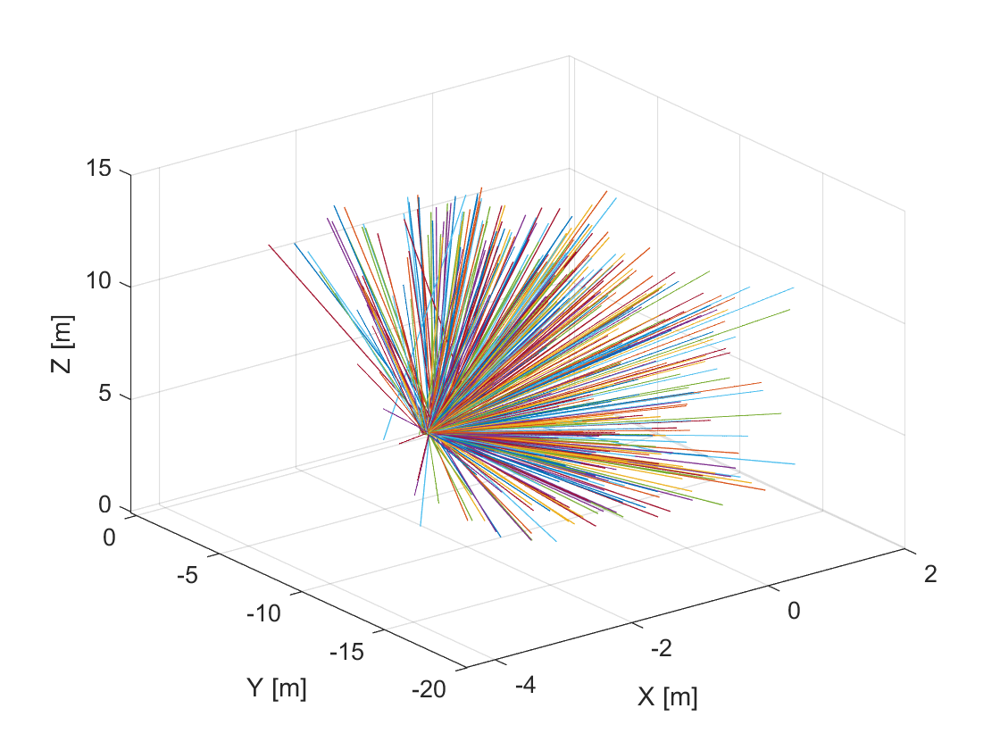
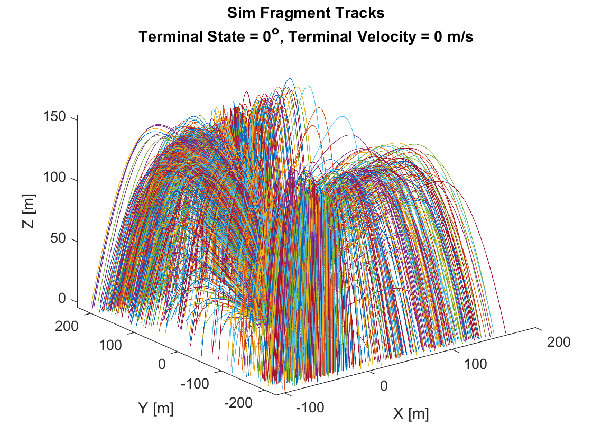
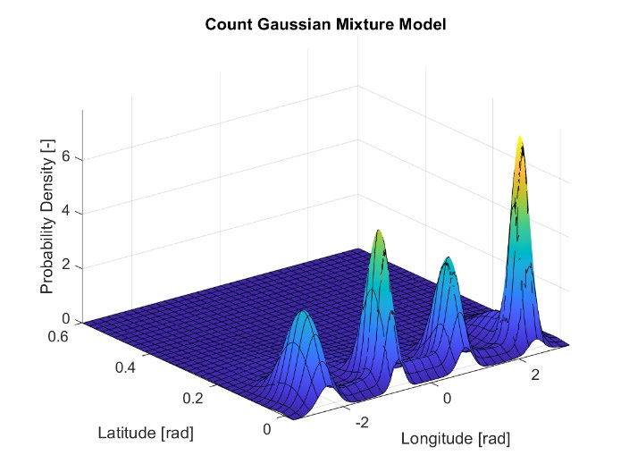
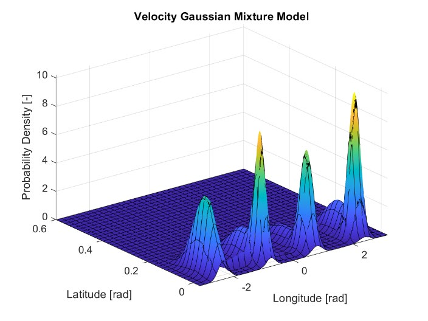
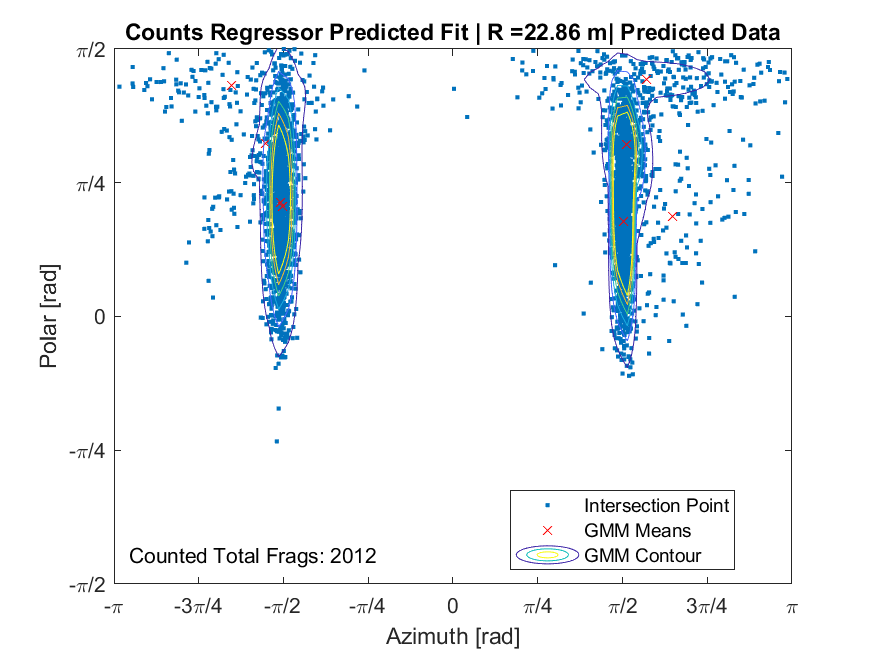
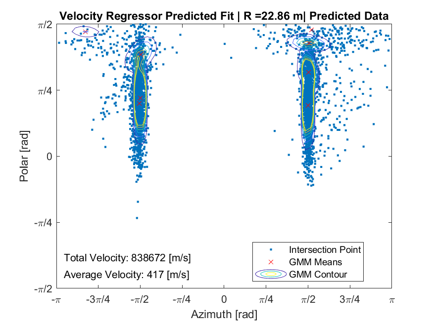
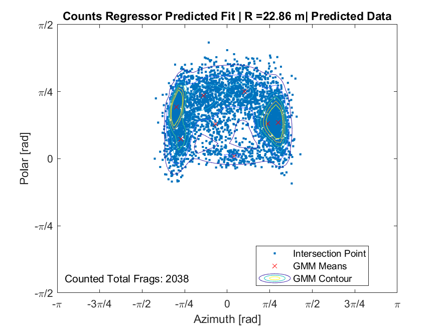

Doctoral Dissertations and Master's Theses
Fall 2022

# Machine Learning to Predict Warhead Fragmentation In-Flight Machine Learning to Predict Warhead Fragmentation In-Flight Behavior from Static Data Behavior from Static Data

Katharine Larsen Embry-Riddle Aeronautical University, larsenk2@my.erau.edu
Follow this and additional works at: https://commons.erau.edu/edt

Part of the Artificial Intelligence and Robotics Commons, Dynamical Systems Commons, Navigation,
Guidance, Control, and Dynamics Commons, Numerical Analysis and Scientific Computing Commons,
Other Aerospace Engineering Commons, and the Probability Commons
Scholarly Commons Citation Scholarly Commons Citation Larsen, Katharine, "Machine Learning to Predict Warhead Fragmentation In-Flight Behavior from Static Data" (2022). Doctoral Dissertations and Master's Theses. 708. https://commons.erau.edu/edt/708
This Thesis - Open Access is brought to you for free and open access by Scholarly Commons. It has been accepted for inclusion in Doctoral Dissertations and Master's Theses by an authorized administrator of Scholarly Commons. For more information, please contact commons@erau.edu.

MACHINE LEARNING TO PREDICT WARHEAD FRAGMENTATION
IN-FLIGHT BEHAVIOR FROM STATIC DATA
By
Katharine Larsen
A Thesis Submitted to the Faculty of Embry-Riddle Aeronautical University
In Partial Fulfillment of the Requirements for the Degree of
Master of Science in Aerospace Engineering
November 2022
Embry-Riddle Aeronautical University
Daytona Beach, Florida

MACHINE LEARNING TO PREDICT WARHEAD FRAGMENTATION
IN-FLIGHT BEHAVIOR FROM STATIC DATA
By
Katharine Larsen
This Thesis was prepared under the direction of the candidate’s Thesis Committee Chair, Dr. Riccardo Bevilacqua, Department of Aerospace Engineering, and has been approved by the members of the Thesis Committee. It was submitted to the Office of the Senior Vice President for Academic Affairs and Provost, and was accepted in the partial fulfillment of the requirements for the Degree of Master of Science in Aerospace Engineering.
THESIS COMMITTEE
SIGN SIGN
Chair, Dr. Riccardo Bevilacqua Member, Dr. Troy Henderson
SIGN SIGN
Member, Dr. Richard Prazenica Member, Dr. Hever Moncayo
SIGN
Date
Graduate Program Coordinator, Dr. Hever Moncayo
SIGN
Date
Dean of the College of Engineering, Dr. James W. Gregory
SIGN
Date
Associate Provost of Academic Support, Dr. Christopher Grant

To my parents – my first teachers.

### ACKNOWLEDGEMENTS

Firstly, I would like to thank my advisor, Dr. Riccardo Bevilacqua. It is because of his
encouragement and motivation that I present this work. Secondly, I would like to thank my
committee members, Dr. Richard Prazenica, Dr. Hever Moncayo, and Dr. Troy Henderson, two of
which I have had the privledge to have taken classes with. Not only do I thank my entire committee
for their assistance throughout the process of this research, but for all their advisement and
instruction in my graduate career.
For their mentorship, guidance, and expertise, I thank Dr. Elisabetta Jerome, Thomas J. Hatch-
Alguilar, and Omkar Mulekar. I must also thank Omkar Mulekar for acting both as a mentor as
well as a peer throughout this process.
Next, I must acknowledge the grant, AFOSR Grant FA9550-20-1-0200, for funding my first
year as a graduate student. For funding the remainder of my graduate educational career, I thank
the Science, Mathematics, and Research for Transformation (SMART) Scholarship Program. It is
through both funding opportunities that I am able to complete this research and continue my
education.
Last but not least, I would like to thank my family for everything. Literally everything. I owe
my love for math to my mother, I owe my passion for science to my father, I owe my competitive
drive to my brother, and to John, I owe my sanity. Thank you.

### 

### 

### 

i

### ABSTRACT

Accurate characterization of fragment fly-out properties from high-speed warhead detonations
is essential for estimation of collateral damage and lethality for a given weapon. Real warhead
dynamic detonation tests are rare, costly, and often unrealizable with current technology, leaving
fragmentation experiments limited to static arena tests and numerical simulations. Stereoscopic
imaging techniques can now provide static arena tests with time-dependent tracks of individual
fragments, each with characteristics such as fragment IDs and their respective position vector.
Simulation methods can account for the dynamic case but can exclude relevant dynamics
experienced in real-life warhead detonations. This research leverages machine learning
methodologies to predict fragmentation characteristics using data from this imaging technique and
simulation data combined. Gaussian mixture models (GMMs), fit via expectation maximization
(EM), are used to model fragment track intersections on a defined surface of intersection. After
modeling the fragment distributions, k-nearest neighbor (K-NN) regressors are used to predict the
desired fragmentation characteristics. Using Monte Carlo simulations, the K-NN regression is
shown to predict the distributions for the total number of fragments intersecting a given surface
and the total fragment velocity and mass associated with that surface. An ability to predict fragment
fly-out characteristics accurately and quickly would provide information which can then be used
to evaluate the collateral damage and lethality of a given weapon.

### 

### 

ii

### TABLE OF CONTENTS

ACKNOWLEDGEMENTS i
ABSTRACT ii
LIST OF FIGURES v
LIST OF TABLES vii
NOMENCLATURE vii

1. Introduction 1
   1.1 Problem Statement 2
   1.2 Research Goals 3
   1.3 Importance of Research 3
1. Preliminaries and Review of Relevant Literature 4
   2.1 Background 4
   2.1.1 Mott’s Formula 4
   2.1.2 Gurney’s Equation 5
   2.1.3 Static Arena Testing 6
   2.2 Stereoscopic Imaging 8
   2.3 Simulation Methods 9
   2.4 Previous Machine Learning Methods 10
   2.5 Overview of Utilized Techniques 10
   2.5.1 Gaussian Mixture Models 11
   2.5.2 Expectation Maximization 13
   2.5.3 Random Forest Regression 14
   2.5.4 K-Nearest Neighbors Regression 15
   2.5.5 Neural Networks 16
   2.5.6 Boundaries of Interest 17
1. Methodology 19
   iii

3.1 Software 19
3.2 Sources of Data 19
3.3 Extracting Data 24
3.4 Generating Training Data 24
3.4.1 Importance of Proper Formatting 26
3.5 Regression Learning 27
3.6 Predicting Within Bounded Regions of Interest 27
3.7 Validation Methods 27
3.8 Energy Distributions 29
3.9 Summary 29
4\. Results and Analysis 32
4.1 Ball Bearing Data 32
4.2 Initial Velocity Comparison 39
4.3 Naturally Fragmenting Article 42
5\. Conclusions and Future Work 47
REFERENCES 50
iv

### LIST OF FIGURES

Figure Page
1.1 The inputs and outputs of the desired learning model 2
2.1 An example of a fragment static arena test set-up 7
2.2 Hypersonic sled testing at Holloman Air Force Base 7
2.3 OWLSS camera field-of-view 8
2.4 OWLSS high-speed camera set-up 9
12
2.5 Converting from cartesian coordinates to a polar-azimuth plane for a simulation with R = 75 m
2.6 K-NN with k = 4 for a binary case 16
2.7 Illustration of a simple neural network 17
18
2.8 An example of a chosen region of interest on an intersection radius scaled to a unit sphere
20
3.1 The experimental static arena test set-up for 5 mm ball bearing detonation (left) and fragment tracks from stereoscopic imaging (right)
3.2 The tracks collected from the 5 mm ball bearing static arena test 20
3.3 Relative orientation of the ball bearing simulation cases 21
3.4 Fragment tracks from one of the NAWCWD ball bearing simulations 22
3.5 Fragment tracks from one of the NAWCWD simulations 23
3.6 Fragment tracks from one of the NAWCWD simulations 25
25
3.7 Fragments intersecting a radius of ~71.65 m on a unit sphere from one of the NAWCWD simulations
26
3.8 Fragments intersecting a radius of ~71.65 m on a mapped onto a polar-azimuth coordinate system
v

27
3.9 Unweighted gaussian mixture model for fragment counts (left) compared to the weighted gaussian mixture model for fragment velocity
3.10 Diagram of the Monte Carlo validation method for count comparison 28
3.11 Diagram of the Monte Carlo validation method for velocity comparison 29
3.12 Diagram of the fragment count predictor 30
3.13 Diagram of the fragment total velocity predictor 31
3.14 Diagram of the average velocity within a given boundary of interest 31
4.1 Monte Carlo simulation results for count differences 34
4.2 Monte Carlo simulation results for velocity differences 35
4.3 Monte Carlo simulation results for velocity differences without EM 37
4.4 Monte Carlo simulation results for velocity differences without EM 38
41
4.5 Predicted distributions at a randomly generated radius of intersection for various denoted initial velocities
4.6 Monte Carlo simulation results for count differences 44
4.7 Monte Carlo simulation results for velocity differences 45
4.8 Monte Carlo simulation results for mass differences 46
vi

### LIST OF TABLES

Table Page
3.1 NAWCWD 5 mm ball bearing simulation cases 21
3.2 Realistic article of interest simulation cases 23
4.1 Mean and standard deviation of fragment count differences 32
4.2 Mean of total and average velocity differences 33
4.3 Comparison of the average initial fragment velocity 39
4.4 Mean of the fragment characteristic differences 42
vii

### NOMENCLATURE

𝑁𝑁 Number of fragments with mass greater than a given mass, m
𝑁𝑁𝑜𝑜 Total number of fragments created by an explosion
𝑀𝑀 Mass of a warhead shell casing
𝑀𝑀𝐴𝐴 Size parameter dependent on explosive casing thickness and diameter
𝐵𝐵𝑚𝑚 Material constant
𝑡𝑡 Casing thickness
𝑑𝑑 Casing diameter
𝑣𝑣𝑜𝑜 Initial fragment velocity
𝐸𝐸 Energy per unit mass
𝐶𝐶 Charge mass
𝜙𝜙 Polar angle
𝜃𝜃 Azimuth angle
𝒩𝒩 Gaussian distribution
Σ Multivariate gaussian distribution symmetric covariance matrix
𝜇𝜇 Mean of a distribution as a vector
𝑑𝑑𝑑𝑑𝑑𝑑 Dimension of a dataset
𝑝𝑝 Probability distribution
𝜋𝜋𝑖𝑖 Mixing coefficient or mixing component weight
𝜂𝜂 Expectation maximization posterior
𝐾𝐾 Number of mixing coefficients
𝑤𝑤 Weight
𝑔𝑔 Random forest regressor
viii

𝑢𝑢 Regressor input vector
𝑓𝑓𝑖𝑖 Individual trees in a random forest regressor
𝑓𝑓𝑘𝑘𝑘𝑘𝑘𝑘 K-nearest neighbors regressor
𝑘𝑘 Number of neighbors in k-nearest neighbors neighborhood
𝐷𝐷൫𝑥𝑥𝑞𝑞, 𝑥𝑥𝑖𝑖൯ Distance between a pair of objects
𝐶𝐶 Sample covariance
𝑁𝑁𝑡𝑡𝑡𝑡𝑡𝑡𝑡𝑡𝑡𝑡 Total number of fragments over an entire sphere of intersection
𝑉𝑉𝑡𝑡𝑡𝑡𝑡𝑡𝑡𝑡𝑡𝑡 Sum of all fragment velocities over an entire sphere of intersection
𝐾𝐾𝐾𝐾 Kinetic energy
ix

### 1. Introduction

Warheads come in large variety, specialized for desired targets and areas of interest. They
generally deliver damage by blast effect or fragment penetration, but come in five different major
types: blast, fragmentation, shaped charge, continuous rod, and special purpose [1,2]. When
evaluating warheads, one must examine lethality estimates, including probability of hit and
probability of kill. While the main function of a warhead is to damage enemy targets, there is also
an interest in testing and evaluation to avoid collateral damage. Warhead characteristics such as
fragment counts, spatial distribution, velocities, and masses, are often used to characterize the
lethality estimates and collateral damage of warheads [3,4]. However, previous methods of
fragmentation experimentation are limited and costly.
Most prediction methods are limited to numerical simulations or static arena tests, where data
are collected under unrealistic conditions that do not capture the full physics of a warhead applied
in a real scenario. Static arena tests exclude the impact velocity of a warhead, while numerical
simulations often exclude realistic dynamic effects experienced by the fragments. Additionally,
simulations, such as hydrodynamic codes, take a long time to run and therefore are not as useful
of a reference when acting quickly in the field. Structural and dynamic equations may provide
useful information as well but are often constrained to assumptions.
Previously, static arena tests have been limited to manual collection techniques. However,
stereoscopic imaging has led to improvements in the quality and quantity of the data collected. In
this thesis, static arena data collected using stereoscopic imaging have been provided by the United
States Naval Air Warfare Center’s Weapon Division (NAWCWD). Data are also provided from a
simulation method developed by NAWCWD. Their software provides data with dynamic terminal
conditions using initial information from the static detonation testing. Combining data produced
using this software with experimental static arena test data from which the simulations are
1

initialized will provide training data with both in-flight characteristics and real-world dynamic
factors, normally excluded by static arena testing.
The remainder of Section I covers the problem statement and the importance of this research.
Section II presents preliminaries and review of relevant literature, including the machine learning
techniques utilized. The methodology is proposed in Section III and the results and analysis are in
Section IV. Finally, Section V consists of conclusions and suggestions for future work.

### 1.1 Problem Statement

Given a terminal state of a warhead, i.e., the attitude of detonation and pre-detonation velocity
(impact or terminal velocity), and a chosen radius of intersection, this research will provide more
accurate fragmentation predictions than previous methods. The overall goal is to create a transfer
function to predict in-flight fragmentation behavior, specifically fragment distribution, velocity,
and fragment mass, over time using machine learning techniques, static arena test data, and
corresponding high-fidelity numerical simulations from NAWCWD. Figure 1.1 displays a
diagram of the inputs and outputs of the proposed machine learning model.
Figure 1.1 The inputs and outputs of the desired learning model.
2

### 1.2 Research Goals

The main goal of this research is to model and predict post-detonation fragmentation
charactersitics for dynamic warheads using static arena test data. Eventually, this can be
generalized to evaluate many different warheads, ultimately discovering trends that may exist
among terminal conditions. This research also aims to provide the United States Air Force with
lethality and collateral damage predictions and static-to-dynamic relationships.

### 1.3 Importance of Research

In terms of knowledge gaps, previous test and evaluation methods have large limitations. Static
arena testing excludes real dynamic detonation information, while real dynamic warhead testing
is limited. This research aims to close the gap between static and dynamic detonation evaluations
by combining experimental static arena data with dynamic simulation data. Additionally,
fragments excluded by one case may be included by the other. This method will also allow much
faster and more computationally efficient predictions, creating a tool that can easily be used for
multiple different weapons, given proficient training data. Evaluating the dynamic weapon trends
produced by this research may also provide new information for current simulations.

### 

### 

3

### 2. Preliminaries and Review of Relevant Literature

This chapter first offers a review of relevant literature and previous work. It also presents the
machine learning techniques utilized in this research.

### 2.1 Background

This subsection provides a brief history of estimation formulas and static arena testing
procedures.

### 2.1.1 Mott’s Formula

With the end of World War II came one of the first and most prominent fragmentation theories
– Mott’s formula. Mott presented a formula designed to predict the distribution of metal shell
casing fragments from an exploding weapon, highly dependent on the structure and material of the
weapon [5]. One version of Mott’s two-dimensional fragmentation distribution law takes the form
𝑁𝑁(𝑚𝑚) = 𝑁𝑁𝑜𝑜exp ൤−(𝑚𝑚)
1 2/𝑀𝑀𝐴𝐴൨ (2.1)
where 𝑁𝑁 is the number of fragments with mass greater than 𝑚𝑚 and 𝑁𝑁𝑜𝑜 is the total number of
fragments created by the warhead defined as
𝑁𝑁𝑜𝑜= 𝑀𝑀
2𝑀𝑀𝐴𝐴 2 (2.2)
where 𝑀𝑀 is the mass of the warhead’s casing and 𝑀𝑀𝐴𝐴 is the size parameter dependent on the casing
thickness and cylindrical warhead diameter. For a thin casing, this size parameter is defined as
5 6𝑑𝑑
1 3 ൬1 + 𝑡𝑡
𝑀𝑀𝐴𝐴= 𝐵𝐵𝑚𝑚𝑡𝑡
𝑑𝑑൰ (2.3)
where 𝐵𝐵𝑚𝑚 is a material constant dependent on the casing and the explosive, 𝑡𝑡 is the thickness of
the casing, and 𝑑𝑑 is the casing diameter [6].
While this formula can represent a large distribution of the casing fragmentation, Mott made
data distribution assumptions, giving it only a generic representation of the center of spatial
4

distribution, where most of the fragments lie, often excluding smaller fragments and those existing
outside the center of the distribution [7]. Additionally, the formula must be adjusted for different
pre-detonation warhead properties, such as material, affecting the accuracy. The machine learning
technique proposed in this thesis aims to remove these distribution assumptions using gaussian
mixture models (GMMs) and create a more generic procedure that can be readily used for various
pre-detonation conditions, including terminal velocity and orientation.
Following Mott’s formula came many other fragmentation methods. One paper, published in
2009, presents a comparison of seven different theoretical mass distribution models: the Mott, the
generalized Mott, the Grady, the generalized Grady, the log-normal, the Weibull, and the Held [8].
Comparing all methods to experimental data sets, the investigators found the generalized Grady
distribution fit best to the experimental cases. These methods, like Mott’s formula, depend on the
weapon scenario and material for accuracy.

### 2.1.2 Gurney’s Equation

Gurney produced a set of equations to predict the initial velocities of the fragments produced
by an explosion depending on the warhead casing shape, around the same time Mott’s equation
was published. Gurney’s equation [9] can be written as follows
𝑣𝑣𝑜𝑜= √2𝐸𝐸𝐸𝐸 (2.4)
where 𝐸𝐸 is the energy per unit mass and 𝑅𝑅 is a function dependent on the shape of the metal casing.
For a cylindrical casing, 𝑅𝑅 is defined as
(2.5)
𝐶𝐶 𝑀𝑀
𝑅𝑅=
1 + 1 2 ∗𝐶𝐶 𝑀𝑀
where 𝐶𝐶/𝑀𝑀 is the charge to shell mass ratio. The initial velocity equation for a cylindrical warhead
can then be written as
5

(2.6)
𝑣𝑣𝑜𝑜= √2𝐸𝐸
ට𝑀𝑀 𝐶𝐶+ 1 2
This equation relies heavily on the casing dimensions and the explosive characteristics, such
as the type and quantity. One major assumption of Gurney’s equation is that the total kinetic energy
per unit mass of explosive is independent of the fragment characteristics such as size [9].
Therefore, each fragment produces the same initial velocity for all fragments.
Additionally, Gurney’s equation is one-dimensional and requires on-axis initiation for
cylindrical warheads. Others, such as those discussed in [10], have proposed modified formulas to
estimate the initial velocity of the fragments when initiated off-axis. In their modified formula, the
velocity is dependent on an azimuth angle. Additionally, [11] extended Gurney’s equation into
another dimension by incorporating the height of a cylindrical casing into the equation.
While these equations are simplistic and useful for providing simulations with velocity
characteristics, they are only valid for the initial velocities of the fragments. They may also serve
as a method of validation.

### 2.1.3 Static Arena Testing

In this thesis, the term static arena testing refers to a warhead placed at the center of a testing
arena surrounded by fragment collection media. When performing static arena tests, the Joint
Munitions Effectiveness Manual (JMEM) is often referred to for the standard testing procedure,
collection of fragmentation characteristics, and weapon requirements. Previously, static arena tests
included witness panels, Celotex bundles, or other fragment collection panels, and might include
measurement equipment such as pressure gauges [12,13]. Then, fragment characteristics such as
shape, size, mass, and location rely on on-the-field manual collection. These methods are high in
labor and financial costs, often exclude dynamic pre-detonation behaviors, and small fragments
6

that may cause damage in a real-life situation are often missed. An example of a static arena test
set-up is shown in Figure 2.1.
Figure 2.1 An example of a fragment static arena test set-up (14).
Static tests exclude the terminal velocity of a weapon before detonation, experienced in a
realistic scenario. Instead, dynamic tests can be performed. Dynamic tests consist of monorail track
testing, as shown in Figure 2.2, and can be used to model the physics of a warhead's behavior
before detonation. However, they are more limited and costly than static arena tests.
Figure 2.2 Hypersonic sled testing at Holloman Air Force Base (15).
7

### 2.2 Stereoscopic Imaging

In recent years, stereoscopic imaging has become an addition to the classic static arena test.
High-speed stereoscopic imaging utilizes still images from multiple different camera angles to
provide two-dimensional images with depth, essentially giving the image three-dimensional
qualities [16]. Eglin Air Force Base, as well as other testing bases, now uses a stereoscopic vision
system developed by Torch Technologies, known as the Optical Warhead Lethality Sensor Suite
(OWLSS). OWLSS tracks the position vectors of individual fragments from which the velocity
vectors can be calculated [17].
OWLSS collects more fragment characteristics and is often cheaper and faster than other static
detonation testing methods, some of which are described in the previous section. Figure 2.3
displays the camera field-of-view alignment of a general OWLSS test. In this scenario, there are
four camera stations, each with two boxes set up with two cameras each, totaling 16 cameras. An
example of this camera station can be referenced in Figure 2.4. The four cameras at these stations
each collect a slightly different angle, providing the user with three-dimensional information.
Figure 2.3 OWLSS camera field-of-view (18).
8

Figure 2.4 OWLSS high-speed camera set-up (18).

### 2.3 Simulation Methods

Using the described distribution theories and finite element analysis (FEA), models and
simulations have since been developed to predict fragment characteristics and decrease the
financial and labor costs of weapon testing. One method uses a high-rate finite difference computer
program, known as CALE, to predict numerical models of fragment spray, including mass and
velocity distributions, of a fragmentation munition [19,20].
Following this work came another fragmentation computer code, known as Picatinny Arsenal
Fragmentation (PAFRAG). This method is primarily based on Mott’s theory, but the choice of
fragmentation theory can be altered [21,22]. Using CALE and PAFRAG, Picatinny Arsenal
integrates analytical and experimental techniques by combining high-strain/high-strain-rate
computer modeling with semi-empirical modeling and experimentation to estimate lethality and a
safe separation distance [23,24].
9

Similar fragmentation work has begun outside of weapons analysis using Artificial Neural
Networks (ANNs) to predict rock wall fragmentation [25]. One study compares rock fragmentation
prediction methods using linear and non-linear regression to ANN, noting that predictions were
more accurate using ANN [26]. This can be attributed to the rigidity of linear and non-linear
regression methods, often eliminating some data with multiple inputs and outputs. For the same
reason, regression methods other than linear and non-linear regression are chosen for the proposed
research presented in this thesis.
The U.S. Naval Air Warfare Center’s Weapons Division (NAWCWD) has also developed a
simulation model. Provided initial characteristics from static arena tests, this novel software can
model the behavior of dynamic scenarios by iteratively solving Langevin’s equations, stochastic
differential equations to describe the Brownian particle motion over time [27,28].

### 2.4 Previous Machine Learning Methods

In 2021, a paper was published proposing multivariate GMMs to develop training data
followed by regression learning, specifically random forest regression, to predict the fragment
count distribution of a warhead detonation [3]. Unlike previous methods, this study assimilated
simulation data and static arena test data to provide the training dataset with realistic dynamic
considerations of high-speed detonations, that simulation data alone would exclude. This thesis
both improves upon the prediction of the number of fragments as well as proposes a methodology
to predict the fragment velocity distributions.

### 2.5 Overview of Utilized Techniques

This subsection outlines the machine learning and other techniques utilized in this research:
gaussian mixture models (GMM), expectation maximization (EM), random forest regression
(RFR), k-nearest neighbors regression (k-NN), neural networks (NN), and boundaries of interest.
10

### 2.5.1 Gaussian Mixture Models

Training datasets can be generated by representing the available data using probability
distributions. In the case of fragmentation, these distributions can be used to describe fragment
track intersections on surfaces. This surface can be created by finding the points of intersection
along a sphere with a chosen radius of intersection and converting from cartesian coordinates to a
polar-azimuth plane. An example of this process is displayed in Figure 2.5 for a simulation with
an intersection radius of 75 m.
To convert the cartesian coordinate system of [𝑥𝑥, 𝑦𝑦, 𝑧𝑧] to polar and azimuth angles, 𝜙𝜙 and 𝜃𝜃
respectively, the following equations are used:
𝜙𝜙= tan−1 ቆ 𝑧𝑧
ඥ𝑥𝑥2 + 𝑦𝑦2ቇ (2.7)
𝑦𝑦
𝜃𝜃= tan−1 ቀ
𝑥𝑥ቁ (2.8)
The multivariate gaussian distribution is defined as
𝒩𝒩(𝑥𝑥⃗|𝜇𝜇⃗, Σ) = 1
exp ቆ−1
2 (𝑥𝑥⃗−𝜇𝜇⃗)𝑇𝑇Σ−1(𝑥𝑥⃗−𝜇𝜇⃗)ቇ (2.9)
ඥ(2𝜋𝜋)𝑑𝑑𝑑𝑑𝑑𝑑|Σ|
where Σ is a symmetric covariance matrix, 𝜇𝜇 is a vector containing the means, and 𝑑𝑑𝑑𝑑𝑑𝑑 is the
dimension of the dataset [29,30]. However, these distributions are unimodal and do not capture
the full shape of the intersection distribution, as they only represent one subpopulation of the data.
Instead, gaussian mixture models (GMMs) are a weighted linear combination of multivariate
gaussian distributions, ultimately combining the subpopulations to represent the entire population.
They have two defining parameters: the mean, 𝜇𝜇, represents the location of each mode of the
distribution, or subpopulation center, and the covariance, Σ, represents the spread of the data
distribution.
11

Figure 2.5 Converting from cartesian coordinates to a polar-azimuth plane for a simulation with R = 75 m.
12

In the multivariate case the GMM is the probability distribution defined as
𝑁𝑁
(2.10)
𝑝𝑝(𝑥𝑥⃗) = ෍𝜋𝜋𝑖𝑖𝒩𝒩(𝑥𝑥⃗|𝜇𝜇⃗𝑖𝑖, Σ𝑖𝑖)
𝑖𝑖=1
where 𝑁𝑁 is the number of components, ∑ 𝜋𝜋𝑖𝑖 𝑁𝑁 𝑖𝑖=1 = 1 where 𝜋𝜋𝑖𝑖 are the mixing coefficients, and
𝒩𝒩(𝑥𝑥⃗|𝜇𝜇⃗𝑖𝑖, Σ𝑖𝑖) is the multivariate distribution described in Eq. 2.9 [29,30].
Using GMM hyperparameters, the model can be tuned further to optimize the fit of the data
and prevent overfitting or underfitting. These hyperparameters include the number of components
and the covariance type, whether it be full, tied, diagonal, spherical, etc. Previously, 4 different
cases were tested: full covariance with 8 components, full covariance with 4 components, diagonal
covariance with 8 components, and diagonal covariance with 4 components [3]. It was concluded
that GMMs with 8 components and a full covariance perform better than the others. Therefore,
this thesis focuses on the full covariance type with 8 components.

### 2.5.2 Expectation Maximization

Expectation maximization (EM) is an iterative method used to calculate the maximum
likelihood estimates (MLE) of GMM parameters, essentially assigning weights, or cluster
numbers, to the points of the dataset. This value can then be used to represent the velocity of each
point. Then, each point can be treated differently than the next and both the position and velocity
can be taken into consideration for the velocity distribution predictions. This method can also be
used to consider the mass of a particle as a cluster number.
EM consists of two main steps: the E-Step and the M-Step. In the E-Step, or expectation step,
the posteriors are calculated as
(2.11)
𝑤𝑤𝛴𝛴ቁ
(𝑟𝑟+1) = 𝜋𝜋𝑘𝑘 (𝑟𝑟)𝒩𝒩ቀ𝑥𝑥; 𝜇𝜇, 1
𝜂𝜂𝑖𝑖𝑖𝑖
∑ 𝜋𝜋𝑘𝑘𝒩𝒩ቀ𝑥𝑥; 𝜇𝜇𝑘𝑘, 1 𝑤𝑤𝛴𝛴𝑘𝑘ቁ 𝐾𝐾 𝑘𝑘=1
13

where 𝐾𝐾 is the number of mixture components and 𝑤𝑤 is the weight defined by
(2.12)
𝑤𝑤𝑖𝑖= ෍exp ቆ−𝑑𝑑2൫𝑥𝑥𝑖𝑖, 𝑥𝑥𝑗𝑗൯
𝜎𝜎 ቇ
𝑗𝑗∈𝑆𝑆𝑖𝑖 𝑞𝑞
where 𝑑𝑑൫𝑥𝑥𝑖𝑖, 𝑥𝑥𝑗𝑗൯ is the Euclidean distance, 𝑆𝑆𝑖𝑖 𝑞𝑞 is the set containing 𝑞𝑞 nearest neighbors of 𝑥𝑥𝑖𝑖, and 𝜎𝜎
is a positive scalar [31].
In the M-Step, or maximization step, the mixing coefficients, means, and covariances are
calculated as
(2.13)
(𝑟𝑟+1) 𝑛𝑛
𝜋𝜋𝑘𝑘 (𝑟𝑟+1) = 1 𝑛𝑛෍𝜂𝜂𝑖𝑖𝑖𝑖
𝑖𝑖=1
(2.14)
𝜇𝜇𝑘𝑘 (𝑟𝑟+1) = ∑ 𝑤𝑤𝑖𝑖𝜂𝜂𝑖𝑖𝑖𝑖
(𝑟𝑟+1)𝑥𝑥𝑖𝑖 𝑛𝑛 𝑖𝑖=1 ∑ 𝑤𝑤𝑖𝑖𝜂𝜂𝑖𝑖𝑖𝑖 (𝑟𝑟+1) 𝑛𝑛 𝑖𝑖=1
$$
⊤
$$
(2.15)
(𝑟𝑟+1)(𝑥𝑥𝑖𝑖−𝜇𝜇𝑘𝑘 (𝑟𝑟+1)) 𝑛𝑛 𝑖𝑖=1 ቀ𝑥𝑥𝑖𝑖−𝜇𝜇𝑘𝑘 (𝑟𝑟+1)ቁ
𝛴𝛴𝑘𝑘 (𝑟𝑟+1) = ∑ 𝑤𝑤𝑖𝑖𝜂𝜂𝑖𝑖𝑖𝑖
(𝑟𝑟+1) 𝑛𝑛 𝑖𝑖=1
∑ 𝜂𝜂𝑖𝑖𝑖𝑖
The E-Step and the M-Step are repeated until convergence of the GMM parameters or when a
or when a maximum number of iterations is reached. Convergence occurs when the difference
between the log likelihood of two consecutive iterations is small [31].

### 2.5.3 Random Forest Regression

Following the development of training data, regression tools can be used to learn a relationship
between input data (independent variables) and output data (dependent variables). In previous
methods, random forest regression (RFR) was a suitable machine learning tool, noting multiple
decision trees as a method to avoid overfitting data [3].
When using multiple trees, RFR can be described as the mean of all the individual trees
14

𝑀𝑀
(2.16)
𝑔𝑔(𝑢𝑢) = 1 𝑀𝑀෍𝑓𝑓𝑖𝑖(𝑢𝑢)
𝑖𝑖=1
where 𝑓𝑓𝑖𝑖 represents each individual tree, 𝑀𝑀 is the number of trees in the random forest, and 𝑢𝑢 is
an input vector [3,32].

### 2.5.4 K-Nearest Neighbors Regression

While RFR was suitable for the fragment count predictions, other regression methods were
also considered. Predictions were improved for both the count predictions and the velocity
predictions when using k-nearest neighbors (k-NN) regression learning. The goal of the K-NN
algorithm, as well as other regression methods, is to create a function to describe an input-output
relationship. K-NN, like RFR, uses an average of observations to produce a model. However,
unlike RFR, K-NN takes an average of the closest points based on a local neighborhood. K-NN
computes the mean as
(2.17)
, 𝐷𝐷൫𝑥𝑥𝑞𝑞, 𝑥𝑥𝑖𝑖൯≠0
𝑓𝑓𝑘𝑘𝑘𝑘𝑘𝑘൫𝑥𝑥𝑞𝑞൯= ൞
∑ 𝑤𝑤𝑖𝑖𝑓𝑓(𝑥𝑥𝑖𝑖)) 𝑘𝑘 𝑖𝑖=1 ∑ 𝑤𝑤𝑖𝑖 𝑘𝑘 𝑖𝑖=1
𝑓𝑓(𝑥𝑥1), 𝐷𝐷൫𝑥𝑥𝑞𝑞, 𝑥𝑥𝑖𝑖൯= 0
where 𝐷𝐷൫𝑥𝑥𝑞𝑞, 𝑥𝑥𝑖𝑖൯ is the distance between 𝑥𝑥𝑞𝑞, the query point, and 𝑥𝑥𝑖𝑖, a close point or a neighbor, 𝑤𝑤
is the weight defined as
𝑤𝑤𝑖𝑖= 1
𝐷𝐷൫𝑥𝑥𝑞𝑞, 𝑥𝑥𝑖𝑖൯ (2.18)
and 𝑘𝑘 is the size of the neighborhood [33,34]. In the case that the minimum distance between the
pair of objects is zero, 𝐷𝐷൫𝑥𝑥𝑞𝑞, 𝑥𝑥𝑖𝑖൯= 0, the weight is undefined. Instead of using the weighted
average, the corresponding output training data of the single closest point is used.
The size of the neighborhood, 𝑘𝑘, is a chosen integer, and must be adjusted to avoid overfitting
and underfitting. For example, if one were to pick 𝑘𝑘= 1, the output would result in the parameters
15

of the most similar point in the training set. In a binary case, for example Figure 2.6, where there
are only two options for the output variable, this would be appropriate. Otherwise, there is a risk
of underpredicting or overpredicting.
Figure 2.6 K-NN with k = 4 for a binary case.
Euclidean distance is a common method for calculating the distance between points in a
dataset. Rather than calculating a physical distance, Mahalanobis distance works well for
correlated multivariate data and solves for the difference between multiple variables or
dimensions. It can be calculated as
(2.19)
𝐷𝐷൫𝑥𝑥𝑞𝑞, 𝑥𝑥𝑖𝑖൯= ට൫𝑥𝑥𝑞𝑞−𝑥𝑥𝑖𝑖൯ 𝑇𝑇𝐶𝐶−1൫𝑥𝑥𝑞𝑞−𝑥𝑥𝑖𝑖൯
where 𝑥𝑥𝑞𝑞 and 𝑥𝑥𝑖𝑖 represent a pair of objects and 𝐶𝐶 is the sample covariance [35,36].

### 2.5.5 Neural Networks

An alternative method to regression learning is the use of regression-based neural networks.
Neural networks, sometimes known as artificial neural networks (ANN), are a type of deep
machine learning modeled after the way the human brain processes information. They are a set of
neurons, or processing units, arranged into a system of layers that can be used to model complex
16

relationships between inputs and outputs [37]. These layers consist of an input layer, hidden
(internal) layers, and an output layer. Most of the processing occurs in the hidden layers of the
network. An example of a simple neural network is displayed in Figure 2.7. If these networks have
at least two hidden layers, they are considered a deep neural network [37].
Figure 2.7 Illustration of a simple neural network (37).
Neural networks normally include forward propagation but may also include backward
propagation. Through forward propagation, information moves from the input layers to the output
layers, where each of the connections between the neurons hold weight and each of the neurons
obey an activation function before passing the information on to the next neuron. Through
backward propagation, information moves from the output layer backwards. This optimizes the
weights to minimize the loss function.

### 2.5.6 Boundaries of Interest

After predicting the total fragment counts, fragment velocities, and their respective
distributions, fragment characteristics within a given boundary of interest can be calculated using
double integrals defined as
17

𝐹𝐹𝐹𝐹𝐹𝐹𝐹𝐹𝐹𝐹𝐹𝐹𝐹𝐹𝐹𝐹 𝐶𝐶𝐶𝐶𝐶𝐶𝐶𝐶𝐶𝐶= 𝑁𝑁𝑡𝑡𝑡𝑡𝑡𝑡𝑡𝑡𝑡𝑡∗∬ 𝑝𝑝𝑁𝑁(𝑥𝑥) 𝑆𝑆 𝑑𝑑𝑑𝑑 (2.20)
𝐹𝐹𝐹𝐹𝐹𝐹𝐹𝐹𝐹𝐹𝐹𝐹𝐹𝐹𝐹𝐹 𝑉𝑉𝑉𝑉𝑉𝑉𝑉𝑉𝑉𝑉𝑉𝑉𝑉𝑉𝑉𝑉= 𝑉𝑉𝑡𝑡𝑡𝑡𝑡𝑡𝑡𝑡𝑡𝑡∗∬ 𝑝𝑝𝑉𝑉(𝑥𝑥) 𝑆𝑆 𝑑𝑑𝑑𝑑 (2.21)
where 𝑁𝑁𝑡𝑡𝑡𝑡𝑡𝑡𝑡𝑡𝑡𝑡 is the predicted total number of fragments passing through the entire sphere of
intersection, 𝑉𝑉𝑡𝑡𝑡𝑡𝑡𝑡𝑡𝑡𝑡𝑡 is the predicted total velocity, or the sum of all fragment velocities intersecting
the entire sphere of intersection at the chosen radius, and 𝑑𝑑𝑑𝑑 is described as
𝑑𝑑𝑑𝑑= 𝑑𝑑𝑑𝑑𝑑𝑑𝑑𝑑 (2.22)
where 𝜙𝜙 is the polar angle and 𝜃𝜃 is the azimuth angle. An example of this boundary can be seen
in Figure 2.8.
Figure 2.8 An example of a chosen region of interest on an intersection radius scaled to a unit sphere.

### 

18

### 3. Methodology

This chapter details software and data used as well as the research approach. The procedure
follows a general machine learning method of data collection, data extraction, training data
compilation, regression learning methods, and validation.

### 3.1 Software

The primary software in this research includes MATLAB and python. The data extraction and
training data preparation are performed in MATLAB and most of the regression learning is
performed in python, where Scikit-Learn and other machine learning libraries can be utilized [39].
In addition to the software, the following data are used for this research.

### 3.2 Sources of Data

Most data available for this research consist of experimental static arena test data and
simulation data developed using experimental data as initial conditions. The experimental data
comes from static pipe bomb detonations performed by the NAWCWD at China Lake. Using
stereoscopic tracking systems, the pipe bomb detonations were performed for 3 different cases: 2
mm, 5 mm, and 7 mm ball bearings. An example of the stereoscopic tracking and the experimental
setup for the 5 mm static detonation is shown in Figure 3.1.
Figure 3.1 also displays the radially symmetric placement of the ball bearings. Therefore, this
research assumes there is a symmetric pair across the y-axis, making a duplicated position at
[𝑥𝑥, −𝑦𝑦, 𝑧𝑧] for every fragment at [𝑥𝑥, 𝑦𝑦, 𝑧𝑧]. The fragment tracks for the 5 mm ball bearing case can
be referenced in Figure 3.2. However, these data can only be collected at small volumes, because
of the restrictions and the financial cost of the static arena tests.
19

Figure 3.1 The experimental static arena test set-up for 5 mm ball bearing detonation (left) and fragment tracks from stereoscopic imaging (right).

Figure 3.2 The tracks collected from the 5 mm ball bearing static arena test.
Using the 5 mm ball bearing static arena test data, NAWCWD provided simulation data by
iteratively solving Langevin’s equations. NAWCWD simulated time history tracks for all 3861
ball bearing fragments for 1100 different cases at various terminal speeds and detonation
20

orientations, displayed in Table 3.1, making up approximately 1.3 TB of data. A diagram of the
relative orientation of the simulated cases can be referenced in Figure 3.3. The fragment tracks for
the simulation case with 0° roll, pitch, and yaw and a terminal velocity of 0 m/s are displayed in
Figure 3.4.
Table 3.1 NAWCWD 5 mm ball bearing simulation cases.

### Variables Range Number of Cases Units

11 m/s

### Terminal Speed Magnitude 0, 152, 305, 457, 610,

762, 914, 1066, 1219,
1371, 1524
Pitch -90, -60, -30, 0 4

### Orientation of

### Weapon at Burst

degrees Yaw -60, -30, 0, 30, 60 5

### Point

Roll 0, 45, 90, 135, 180 5
Figure 3.3 Relative orientation of the ball bearing simulation cases.
21

Figure 3.4 Fragment tracks from one of the NAWCWD ball bearing simulations.
By combining the limited experimental data with the larger set of simulation data, static and
dynamic characteristics can be included in the machine learning model. However, as discussed
previously, there are limitations with current technology. Over time, future data collected under
improved systems will enhance the modeling process, by improving the quality of the data as well
as the amount of data. In addition to the 5 mm ball bearing data, there are now other sets of data
from two different articles of interest that can be utilized to validate and improve work performed
on the ball bearing data.
Under the same process of collection and simulation, greater amounts of data can be augmented
to the current dataset. Since the beginning of this research, new data for various articles of interest
have been collected.
22

A more realistic static arena test was performed. The corresponding simulation data is
displayed in Table 3.2, making up 1000 simulation cases. The fragment tracks for the simulation
case with 0° roll, pitch, and yaw and a terminal velocity of 0 m/s are displayed in Figure 3.5.
Table 3.2 Realistic article of interest simulation cases.

### Variables Range Number of Cases Units

8 m/s

### Terminal Speed Magnitude 0, 152, 305, 457, 610,

914, 1219, 1524
Pitch 0, 22.5, 45, 67.5, 90 5

### Orientation of

### Weapon at Burst

degrees Yaw -45, -22.5, 0, 22.5, 45 5

### Point

Roll 0, 22.5, 45, 67.5, 90 5
Figure 3.5 Fragment tracks from one of the NAWCWD simulations.
For most of this research, the ball bearing data were used. Their equal mass, volume, and shape
allowed for easy data collection and minimal differences when predicting the fragment velocities.
Additionally, the high number of fragments, 3861 ball bearings, gave the training dataset more
23

variety. For the more realistic static arena case and each case of the data displayed in Table 3.2,
information for only 94 fragments was collected. This made the resulting training dataset biased
as only one portion of a chosen radius has intersections.

### 3.3 Extracting Data

Before training the ball bearing data, the experimental and simulation data collected must be
extracted and converted to the described polar-azimuth coordinate system, as mentioned in Section
2.5.1.

### 3.4 Generating Training Data

For a range of intersection radii, in this work 65 radii ranging from 7.62 m to 182.88 m, polar-
azimuth maps are generated. An example of this process is shown in Figures 3.6, 3.7, and 3.8 for
a NAWCWD simulation case with an impact orientation of 135° roll, 60° pitch, and −60° yaw
and an impact velocity of 0 𝑚𝑚/𝑠𝑠. For each map, training data are generated as probability
distributions using gaussian mixture models.
The number of fragments is collected by interpolating the data and counting the number of
intersection coordinates produced. By taking the derivative of these positions, the velocity of each
intersection point is also recorded. When using mass data, the mass of each fragment is included
only if there is an intersection point found along the given radius for that fragment. Training
datasets for fragment counts and fragment velocities are generated for both the experimental static
arena test data and the corresponding 1100 NAWCWD simulations.
As mentioned previously, a paper compared four cases of GMMs finding that GMMs with 8
components and full covariance are best suited for this data [3]. They also note the importance of
including both the experimental static arena test data and the simulation data in the training data.
Although the simulation data makes up a large percentage of the training data population, the
24

experimental data should be included to incorporate realistic fragment dynamics, not experienced
by the simulations. Additionally, by including both cases, some regions excluded by the
experimental case may be included by the simulation cases and vice versa.
Figure 3.6 Fragment tracks from one of the NAWCWD simulations.
Figure 3.7 Fragments intersecting a radius of ~71.65 m on a unit sphere from one of the NAWCWD simulations.
25

Figure 3.8 Fragments intersecting a radius of ~71.65 m mapped onto a polar-azimuth coordinate system.

### 3.4.1 Importance of Proper Formatting

When producing training data for velocity using Expectation Maximization, one should note
the importance of proper data formatting. EM is highly dependent on the initialization point. Using
random initialization, the means, or centroids, of the dataset distributions may not be placed in the
same location every time the same dataset is fit. To preserve the component ordering for similar
distributions, the EM algorithm should be strictly initialized using the GMM without EM. Figure
3.9 displays the slight difference in distribution between GMM parameters without EM, on the
left, and GMM parameters with EM, on the right.
26

Figure 3.9 Unweighted gaussian mixture model for fragment counts (left) compared to the weighted gaussian mixture model for fragment velocity (right).

### 3.5 Regression Learning

Once training data are produced, the model can be trained. Using K-NN regression, with
Mahalanobis distance as the desired metric, fragmentation predictions can be made. The count
predictions are generated using the training data from GMMs without EM and the fragment
velocity predictions are generated using the training data from GMMs with EM.

### 3.6 Predicting Within Bounded Regions of Interest

After predicting the total fragment counts and fragment velocities and their respective
distributions, fragment characteristics within a given boundary of interest can be calculated using
the double integrals described previously, in Eq. 2.20 and Eq. 2.21.

### 3.7 Validation Methods

After training the model, validation methods can be used to verify and improve the process.
This research uses Monte Carlo simulation as the primary validation method. Monte Carlo
simulations artificially model data using random inputs [39]. This random generation enables fast
predictions to evaluate the full model. In this research the randomly generated parameters consist
27

of the simulation number, with an associated terminal attitude and velocity, and radius of
intersection. Using these parameters and a randomly generated polar-azimuth region of interest,
the total fragments within the given boundary from both the direct fragment counts and predicted
fragment counts are found and compared using the method proposed in Figure 3.10. This same
method can be used for the velocity comparison. A diagram of this proposed model is displayed
in Figure 3.11, with the only difference from Figure 3.10 being the addition of the fragment counts
from each case to observe the differences in average velocity as well as the total velocity within
the boundary of interest. These differences are produced for multiple runs at various randomized
conditions to evaluate the model.
Figure 3.10 Diagram of the Monte Carlo validation method for count comparison.
28

Figure 3.11 Diagram of the Monte Carlo validation method for velocity comparison.

### 3.8 Energy Distribution

The mass of the fragments are desirable to both estimate the size of each of the fragments and
to estimate the total kinetic energy of a region of interest. Using the total mass, 𝑚𝑚, and the total
velocity, 𝑣𝑣, of a region of interest, the total kinetic energy can be calculated as
𝐾𝐾𝐾𝐾= 1
2 𝑚𝑚𝑣𝑣2 (3.1)
providing an estimate of the total kinetic energy impacting a given area.

### 3.9 Summary

Using the provided static arena test data and corresponding simulation data, a training pool is
generated as probability distributions for fragment track intersections at various intersection radii
29

mapped on a polar-azimuth plane. K-NN regression uses an average of the nearest neighbors to
predict the GMM parameters of a point of interest. Given an input as a vector, including the
weapon’s terminal state (impact velocity and orientation as roll, pitch, and yaw) and an
intersection radius, the GMM parameters of a probability distribution can be predicted, using two
separate K-NN regressors. One regressor predicts the fragment count distribution shown in
Figure 3.12 and the other predicts the fragment velocity distribution shown in Figure 3.13. In
addition to the GMM parameters, the total number of fragments and the total fragment velocity
are also output for the entire sphere of intersection, which can then be input into double integrals
to find totals within a chosen area of interest. Using these values, the average velocity can be
calculated using the process displayed in Figure 3.14. Following this same method, the mass and
energy distributions can be generated.
Figure 3.12 Diagram of the fragment count predictor.
30

Figure 3.13 Diagram of the fragment total velocity predictor.
Figure 3.14 Diagram of the average velocity within a given boundary of interest.

### 

31

### 4. Results and Analysis

The following results and analysis section is split into three subsections. The first subsection
provides and discusses the fragment count and fragment velocity results from the ball bearing data.
The second subsection compares different methods of initial fragment velocity estimation,
Gurney’s Equation and regression learning, to the average ball bearing initial velocity collected
from the ball bearing static arena test data and simulation data. The final subsection provides and
discusses the fragment count, velocity, and mass results from the naturally fragmenting article of
interest data.

### 4.1 Ball Bearing Data

Previous work suggested RFR as a suitable method to predict the number of fragments but did
not predict the fragment velocities [3]. The research presented here includes random forest
regression as a means of comparison, but considered other regression techniques, finding k-nearest
neighbors regression with 𝑘𝑘= 2 to yield the best results for both the fragment velocity and the
fragment count predictions. Using Monte Carlo simulations as a method of validation, as discussed
in the previous section, both techniques were analyzed over 1000 simulations, each with 20
different randomized polar-azimuth regions, creating 20,000 randomized runs. The mean and
standard deviation of the fragment count differences for both regression methods are provided in
Table 4.1. The mean of the total and average velocity differences for the velocity training data
using the weighted data and using the unweighted training data are provided in Table 4.2.
Table 4.1 Mean and standard deviation of fragment count differences.

### Regression Technique Mean Count Difference, Frags Standard Deviation, Frags

### RFR 2.7 37.5

### K-NN 1.8 28.0

32

Table 4.2 Mean of total and average velocity differences.

### Regression Technique Mean Total V Difference, m/s Mean Avg V Difference, m/s

### RFR 2774.0 -66.7

### RFR with Count Data 3212 -75.5

### K-NN 904.3 31.9

### K-NN with Count Data 2087.6 -4.58

An example of the produced distributions from the Monte Carlo simulations are displayed in
Figure 4.1, fragment count differences, and Figure 4.2, fragment velocity differences using EM
training data. These figures show the GMM distributions directly fit to the data compared to the
predicted GMM distributions produced by the machine learning model. The counted fragments
across the entire surface of intersection for this case is 1,916 fragments and the model predicted a
total of 1,916 fragments, yielding no fragment difference between the direct and predicted fits.
However, the fragments counted within the area of interest, shown by the black rectangular outline,
were not as close, with a direct count of 420 fragments and a predicted count of 277 fragments,
yielding a difference of 143 fragments.
The total velocity of all the intersecting fragments over the entire surface from the direct fit
model is 259,065 m/s and from the predicted model is 259,136 m/s, yielding a difference of 71
m/s. Like the count predictions, the total velocity within the boundary of interest was not as
accurate. However, the average values of 161 m/s and 162 m/s, for the direct fit and predicted
models respectively, within the boundaries of interest, yield a difference of 1 m/s. It should also
be noted that the standard deviations are high for all methods.
33

Figure 4.1 Monte Carlo simulation results for count differences.
34

Figure 4.2 Monte Carlo simulation results for velocity differences.
35

When looking at the distributions shown on the plots in Figures 4.1 and 4.2, they seem to fit
well to the data and the predictor seems to create a similar distribution. However, for many of the
simulation cases, one can see that the total values over the entire surface of intersection are often
accurate, while the values within the polar-azimuth boundary of interest are not always accurate.
The small differences in the distributions are a likely explanation for this result. While the contours
look relatively similar, slight differences may result in large count and velocity differences within
the region of interest. Additionally, as can be seen by the blue intersection points on the plots, the
contour does not include all fragments.
Looking at results where the weighted EM data are not considered, in Table 4.2, the average
velocities within a region of interest have a much smaller difference that when the weighted EM
training data are considered. Two cases for the velocity predictions with this method are displayed
in Figures 4.3 and 4.4. Again, the total velocity within the boundary of interest has a high
difference, but the average velocity has percent differences of 1.2 % and 3.5 % for Figures 4.3 and
4.4 respectively. Though the unweighted data presented more accurate predictions for the average
velocity within the boundary of interest, the weighted data created using EM was more accurate
overall for both regression learning methods.
To further examine the results at various terminal conditions, as one of the desired goals is to
generalize the model, the prediction tool was also examined for a variety of terminal conditions.
The plots in Figure 4.5 display an example of this visual comparison for varying terminal velocities
(0 m/s, 305 m/s, 610 m/s, 915 m/s, 1,220 m/s, 1,525 m/s), a terminal attitude of 0° roll, pitch, and
yaw, and an intersection radius of 22.96 m. The trend seen is as expected. The total and average
velocity increases with increasing terminal speed, while the counted total fragment predictions
remain approximately the same.
36

Figure 4.3 Monte Carlo simulation results for velocity differences without EM.
37

Figure 4.4 Monte Carlo simulation results for velocity differences without EM.
38

Additionally, the probability contours visually follow the trend produced by the fragment
intersections, represented by the blue points on the plots. As the terminal velocity increases, the
fragment velocity follows, keeping the fragments closer to the point of impact when reaching the
same radius of intersection. The points converge to the center of the polar-azimuth plot and the
distribution contours follow this course. Therefore, this proposed method is a suitable method to
predict trends at various terminal conditions because the prediction tool produced the expected
probability contours.

### 4.2 Initial Velocity Comparison

For a case with a 0 m/s terminal velocity and a terminal orientation of 0º roll, pitch, and yaw,
the average initial fragment velocity was found using the proposed regression technique. The result
from this regression technique was compared to the average initial velocity from the static arena
test, the corresponding simulation, and Gurney’s equation, Eq. 2.6. The comparison of all four
methods is displayed in Table 4.3.
It should be noted, for the static arena test, the initial fragment velocities were calculated
through back propagation and not all 3861 fragments were collected. Therefore, the simulation
velocity was used as the primary base for comparison.
Table 4.3 Comparison of the average initial fragment velocity.

### Technique Average Initial Fragment Velocity, m/s

### Static Arena Test 826

### Simulation 1002

### Gurney’s Equation 1036

### Regression Learning 1118

39

a) Terminal velocity of 0 m/s.
b) Terminal velocity of 305 m/s.

c) Terminal velocity of 610 m/s.
40

d) Terminal velocity of 915 m/s.
e) Terminal velocity of 1220 m/s.
f) Terminal velocity of 1525 m/s.
Figure 4.5 Predicted distributions at a randomly generated radius of intersection for various denoted initial velocities.
41

Assuming all 3861 fragments are produced, Gurney’s equation and the proposed regression
technique yield a percent difference of 3.4% and 12%, respectively, when compared to the average
initial velocity in the corresponding simulation case. Though Gurney’s equation produces a smaller
percent difference, this equation can only be used to estimate the initial velocity and assumes all
fragments have the same initial velocity, which is not true in realistic scenarios. This test shows
that, though the initial velocity information is not included in the training dataset, predictions can
be made for inputs outside of the domain of the training set.

### 4.3 Naturally Fragmenting Article

Using only K-NN regression, trials with the naturally fragmenting article of interest were
performed to predict the distribution of the fragments and their characteristics. The mean
difference, resulting from the Monte Carlo simulations, for each of the desired fragment
characteristics within a boundary of interest, are displayed in Table 4.4.
Table 4.4 Mean of the fragment characteristic differences.

### Characteristic Mean Difference

### Fragment Counts, Frags 0.876

### Total Velocity, m/s 5400.021

### Average Velocity, m/s 711.287

### Total Mass, kg 1.082

### Average Mass, kg 0.185

An example of the produced distributions from the Monte Carlo simulations is displayed in
Figure 4.6, fragment count differences, Figure 4.7, fragment velocity differences using EM
training data, and Figure 4.8, fragment mass differences. From Figures 4.6 and 4.8, the predicted
42

total values along the entire surface of intersection are the same for both the directly fit
distribution and the predicted distribution. From Figure 4.8, the total mass within the boundary
of interest has a difference of 5 kg between the direct fit and the predicted fit, yielding a percent
difference of 20%. However, the average mass within this boundary of interest is the same for
both distributions. While these distributions seem to fit well to the data and the mass differences
in Table 4.4 are small, the limited amount of data for this article of interest makes the training
data biased and therefore a larger naturally fragmenting dataset is required to continue improving
the mass predictions.
43

Figure 4.6 Monte Carlo simulation results for count differences.
44

Figure 4.7 Monte Carlo simulation results for velocity differences.
45

Figure 4.8 Monte Carlo simulation results for mass differences.
46

### 5. Conclusions and Future Work

After training datasets were generated for fragment characteristics using multivariate GMMs
with and without EM, regression learning could be used. Regressors were trained to predict the
distribution of fragment characteristics over an entire sphere of intersection. For the ball bearing
data, one regressor was used to predict total fragment counts and another was used to predict total
fragment velocities. Different regression methods were compared to RFR, the previous regression
method selected. K-NN regression with 𝑘𝑘= 2 was found to produce the most accurate results.
Integrating the predicted GMMs, the total values within a chosen boundary of interest, on a
polar-azimuth coordinate system, were then calculated. This model was evaluated using Monte
Carlo simulations. This procedure was also performed on a naturally fragmenting article, where
total mass was predicted in addition to total fragment counts and velocities.
Overall, the proposed model successfully improved count predictions from previous work and
produced reasonable predictions for fragment velocity and fragment mass, showing the potential
for this machine learning method. The model proves to make successful predictions that follow
expected physical trends. Although there are still improvements to be made, this work shows that
there is potential in the use of machine learning to predict fragmentation characteristics for various
detonation scenarios.
In the future, this method may be used to find new trends unknown by current technology.
Understanding these trends will reduce the uncertainty of collateral damage estimates, which in
turn will minimize the collateral damage of the weapon in use. Future work will require other static
arena test data from more realistic articles of interest, larger than the realistic dataset collected,
shown in Table 3.2. Over time, the model will most likely be improved as more data become
available and are augmented with the dataset. Eventually, this model will need to be tested on an
actual system as the exact values for fragment counts and velocities are rarely collected.
47

Some machine learning algorithms require large amounts of data in a dataset, which can
prevent bias and improve variance. The balance between these two characteristics can often be
improved by including larger amounts of training data. In the case that more naturally fragmenting
data cannot be obtained, there are other techniques presented in literature that can be used to
generate synthetic data, to increase the amount of data in a training dataset. Variational
autoencoders are a common generative machine learning technique used to produce more data
from current data [40]. This generated dataset will be similar to the original dataset and can then
be augmented with the original information.
Also under consideration for future work are trials with different techniques to improve the
model. Regression techniques have been the primary focus thus far, but neural networks are also
under consideration. With neural networks, more complex trends might be learned to improve the
model. This method could also allow the introduction of physical constraints into the training
process to prevent any predictions that disobey fragmentation behavior. Investigations may also
be performed on other distributions for training data generation. There may be improvements to
be made on the GMMs, other than what has been tested previously [3].
Though this proposed procedure could predict the desired outputs well, the idea of creating
new applicable equations, or improving fundamental equations such as Mott’s and Gurney’s
equations, is also of great interest. Symbolic regression can be used to search through mathematical
models to assemble equations that best fit the dataset. However, this method can be difficult,
especially with large datasets. In 2020, a paper proposed the use of machine learning to extract
symbolic equations from their datasets: simple particle motion and black matter simulations [41].
This idea of symbolic regression using machine learning has potential in this field of study as well.
48

By both improving the fragment distribution predictions and producing new fragment
characteristic predictions, i.e. velocity and mass distributions, this thesis successfully demonstrates
the potential in machine learning for fragmentation fly-out predictions from static arena test data.
49

### REFERENCES

[1] “Warheads,” FAS Available: https://man.fas.org/dod- 101/navy/docs/es310/warheads/Warheads.htm.
[2] “Chapter 13 Warheads,” FAS Available: https://man.fas.org/dod- 101/navy/docs/fun/part13.htm.
[3] Mulekar, O. S., Bevilacqua, R., Jerome, E. L., and Hatch-Aguilar, T. J., “Transfer function to predict warhead fragmentation in-flight behavior from Static Data,” AIAA Journal, vol. 59, 2021, pp. 4777–4793. https://doi.org/10.2514/1.j060226.
[4] Gold, V.M., “Fragmentation Model for Large L/D (Length over Diameter) Explosive Fragmentation Warheads,” Defense Technology, Vol. 13, No. 4, 2017, pp. 300-309. https://doi.org/10.1016/j.dt.2017.05.007.
[5] Mott, N. F., “Fragmentation of Shell Cases,” Proceedings of the Royal Society of London. Series A. Mathematical and Physical Sciences, vol. 189, 1947, pp. 300–308. http://doi.org/10.1098/rspa.1947.0042.
[6] Felix, D., Colwill, I., and Harris, P., “A Fast and Accurate Model for the Creation of Explosion Fragments with Improved Fragment Shape and Dimensions,” Defence Technology, vol. 18, 2022, pp. 159–169. https://doi.org/10.1016/j.dt.2020.12.004.
[7] Cohen, E. A., “New Formulas for Predicting the Size Distribution of Warhead Fragments,” Mathematical Modelling, vol. 2, 1981, pp. 19-32. https://doi.org/10.1016/0270- 0255(81)90008-7.
[8] Elek, P., and Jaramaz, S., “Fragment Mass Distribution of Naturally Fragmenting Warheads,” FME Transactions.
[9] Gurney, R. W., “The Initial Velocities of Fragments from Bombs, Shell, Grenades,” 1943.
[10] Wang, M., Lu, F., Li, X., and Cao, L., “A Formula for Calculating the Velocities of Fragments from Velocity Enhanced Warhead,” Propellants, Explosives, Pyrotechnics, vol. 38, 2012, pp. 232–237. https://doi.org/10.1002/prep.201200025.
[11] Breech, B. A., “Extension of the gurney equations to two dimensions for a cylindrical charge,” 2011.
[12] Baker, W. E., Dodge, F. T., and Westine, P. S., Joint Munitions Effectiveness Manual (JMEM), U.S. Air Force, 1969.
[13] “Fragmentation Data Collection and Analysis for JMEMs Arena Tests,” SBIR Available: https://www.sbir.gov/node/561506.
50

[14] “Arena Test Produce Goliath Data,” Eglin Air Force Base Available: https://www.eglin.af.mil/News/Article-Display/Article/392972/arena-test-produce- goliath-data/.
[15] “Holloman High Speed Test Track Sets Record with Fastest Recovery Mission in 30-Plus Years with Reusable Sled,” Air Force Materiel Command Available: https://www.afmc.af.mil/News/Article-Display/Article/3050771/holloman-high-speed- test-track-sets-record-with-fastest-recovery-mission-in-30/.
[16] Hay, R. F., Gibson, G. M., Lee, M. P., Padgett, M. J., and Phillips, D. B., “Four- Directional Stereo-Microscopy for 3D Particle Tracking with Real-Time Error Evaluation,” Optics Express, vol. 22, 2014, p. 18662. https://doi.org/10.1364/oe.22.018662.
[17] King, S., “Camera System Captures, Analyzes Munition Detonation Data,” Air Force Material Command Available: https://www.afmc.af.mil/News/Article- Display/Article/2975486/camera-system-captures-analyzes-munition-detonation-data/.
[18] “Camera System Captures, Analyzes Munition Detonation Data,” Eglin Air Force Base Available: https://www.eglin.af.mil/News/Article-Display/Article/2974486/camera- system-captures-analyzes-munition-detonation-data/.
[19] Gold, V. M., Baker, E. L., Hirlinger, J. M., and Ng, K. W., “A Method for Predicting Fragmentation Characteristics of Natural and Performed Explosive Fragmentation Munitions,” Sep. 2001.
[20] Tipton, R. E., “The CALE User’s Manual”, Version 910201, 1991.
[21] Gold, V. M., Baker, E. L., Poulos, W. J., and Fuchs, B. E., “PAFRAG Modeling of Explosive Fragmentation Munitions Performance,” International Journal of Impact Engineering, vol. 33, 2006, pp. 294–304.
[22] Gold, V. M., Baker, E. L., and Poulos, W. J., “Modeling Fragmentation Performance of Natural and Controlled Fragmentation Munitions,” Apr. 2007.
[23] Gold, V. M., Baker, E. L., and Pincay, J. M., “Computer Simulated Fragmentation Arena Test for Assessing Lethality and Safety Separation Distances of Explosive Fragmentation Ammunitions,” Computational Ballistics III, 2007. https://doi.org/10.2495/cbal070171.
[24] Gold, V. M., “Fragmentation Model for Large L/D (Length Over Diameter) Explosive Fragmentation Warheads,” Defence Technology, vol. 13, 2017, pp. 300–309. https://doi.org/10.1016/j.dt.2017.05.007.
51

[25] Tiile, R. N., “Artificial Neural Network Approach to Predict Blast-Induced Ground Vibration, Airblast and Rock Fragmentation,” thesis, 2016. http://scholarsmine.mst.edu/masters_theses/7571.
[26] Enayatollahi, I., Aghajani Bazzazi, A., and Asadi, A., “Comparison between neural networks and multiple regression analysis to predict rock fragmentation in open-pit mines,” Rock Mechanics and Rock Engineering, vol. 47, 2013, pp. 799–807.
[27] Gerbaud, V., and Demirel, Y., “Probabilistic Approach in Thermodynamics,” Nonequilibrium Thermodynamics: Transport and Rate Processes in Physical, Chemical and Biological Systems, ELSEVIER Science LTD, 2019, pp. 711–791.
[28] Gensdarmes, F., “Methods of Detection and Characterization,” Nanoengineering: Global Approaches to Health and Safety Issues, P.I. Dolez, ed., Elsevier, 2015, pp. 55–84.
[29] Eslambolchilar, P., Komninos, A., and Dunlop, M., “Machine Learning Basics,” Intelligent Computing for Interactive System Design: Statistics, Digital Signal Processing, and Machine Learning in Practice, New-York: Association for Computing Machinery, pp. 143–193. https://doi.org/10.1145/3447404.3447414.
[30] McGonagle, J., Pilling, G., Dobre, A., Tembo, V., Kurmukov, A., Chumbley, A., Ross, E., and Khim, J., “Gaussian Mixture Model,” Brilliant Math & Science Wiki Available: https://brilliant.org/wiki/gaussian-mixture- model/#:~:text=A%20Gaussian%20mixture%20of%20three,subpopulations%20within% 20an%20overall%20population.
[31] Gebru, I. D., Alameda-Pineda, X., Forbes, F., and Horaud, R., “EM Algorithms for Weighted-Data Clustering with Application to Audio-Visual Scene Analysis,” IEEE Transactions on Pattern Analysis and Machine Intelligence, vol. 38, 2016, pp. 2402–2415. https://doi.org/10.1109/TPAMI.2016.2522425.
[32] Theodoridis, S., and Koutroumbas, K., Pattern Recognition, Fourth Edition, 4th ed., Academic Press, Inc., USA, 2008.
[33] Kramer, O., Unsupervised K-Nearest Neighbor Regression, ArXiv. 2011. https://doi.org/10.48550/arXiv.1107.3600.
[34] “Distance Weighted K-NN Algorithm” Available: http://www.data- machine.net/nmtutorial/distanceweightedknnalgorithm.htm.
[35] Kannan, K. S., and Manoj, K., “Outlier Detection in Multivariate Data,” Applied Mathematical Sciences, vol. 9, 2015, pp. 2317–2324. https://doi.org/10.12988/ams.2015.53213.
[36] Glen, S., “Mahalanobis distance: Simple definition, examples,” Statistics How To Available: https://www.statisticshowto.com/mahalanobis-distance/.
52

[37] Kelleher, J. D., “Neural Networks: The Building Blocks of Deep Learning,” Deep Learning, The MIT Press, 2019, pp. 65–100.
[38] Pedregosa, F., Varoquaux, G., Gramfort, A., Michel, V., Thirion, B., Grisel, O., Blondel, M., Prettenhofer, P., Weiss, R., Dubourg, V., Vanderplas, J., Passos, A., Cournapeau, D., Brucher, M., Perrot, M., and Duchesnay, E., “Scikit-learn: Machine Learning in Python,” Journal of Machine Learning Research, vol. 12, 2011, pp. 2825– 2830.
[39] Kroese, D. P., Brereton, T., Taimre, T., and Botev, Z. I., “Why The Monte Carlo Method Is So Important Today,” WIREs Computational Statistics, vol. 6, 2014, pp. 386– 392. https://doi.org/10.1002/wics.1314.
[40] Foster, D., “Variational Autoencoders,” Generative Deep Learning: Teaching Machines to Paint, Write, Compose, and Play, O'Reilly Media, 2019.
[41] Cranmer, M. D., Sanchez-Gonzalez, A., Battaglia, P. W., Xu, R., Cranmer, K., Spergel, D. N., and Ho, S., “Discovering Symbolic Models from Deep Learning with Inductive Biases,” Advances in Neural Information Processing Systems, 2020.
53
