### Fragmentation processes in impact of spheres

$$
H. A. Carmona1,2, F. K. Wittel2, F. Kun3, and H. J. Herrmann2,4
$$

1Centro de Ciˆencias e Tecnologia, Universidade Estadual do Cear´a, 60740-903 Fortaleza, Cear´a, Brazil 2 Computational Physics IfB, HIF, ETH, H¨onggerberg, 8093 Z¨urich, Switzerland 3Department of Theoretical Physics, University of Debrecen, P. O. Box:5, H-4010 Debrecen, Hungary and 4Departamento de F´ısica, Universidade Federal do Cear´a, 60451-970 Fortaleza, Cear´a, Brazil
We study the brittle fragmentation of spheres by using a three-dimensional Discrete Element Model. Large scale computer simulations are performed with a model that consists of agglomerates of many particles, interconnected by beam-truss elements. We focus on the detailed development of the fragmentation process and study several fragmentation mechanisms. The evolution of meridional cracks is studied in detail. These cracks are found to initiate in the inside of the specimen with quasi-periodic angular distribution. The fragments that are formed when these cracks penetrate the specimen surface give a broad peak in the fragment mass distribution for large fragments that can be fitted by a two-parameter Weibull distribution. This mechanism can only be observed in 3D models or experiments. The results prove to be independent of the degree of disorder in the model. Our results significantly improve the understanding of the fragmentation process for impact fracture since besides reproducing the experimental observations of fragment shapes, impact energy dependence and mass distribution, we also have full access to the failure conditions and evolution.
PACS numbers: 46.50.+a, 62.20.Mk, 05.10.-a
I. INTRODUCTION
large fragment masses, deviation from the power law dis- tribution could be modeled by introducing an exponential cut-off, and by using a bi-linear or Weibull distribution [12, 13, 15, 27, 28, 29, 30]. Another important finding was, that fragmentation is only obtained above a certain material dependent energy input [5, 6, 31]. Numerical simulation could show that a phase transition at a crit- ical energy exists, with the fragmentation regime above, and the fracture or damaged regime below the critical point [18, 19, 21].
The fragmentation process itself became experimen- tally accessible with the availability of high speed cam- eras, giving a clear picture on the formation of the frag- ments [5, 6, 7, 8, 9, 10, 11, 12, 13]. Below the critical point, only slight damage can be observed, but the spec- imen mainly keeps its integrity. Above but close to the critical point, the specimen breaks into a small number of fragments of the shape of wedges, formed by meridional fracture planes, and additional cone-shaped fragments at the specimen-target contact point. Way above the criti- cal point, additional oblique fracture planes develop, that further reduce the size of the wedge shaped fragments.

# arXiv:0711.2993v1 [cond-mat.stat-mech] 19 Nov 2007

Comminution is a very important step in many indus- trial applications, for which one desires to reduce the energy necessary to achieve a given size reduction and minimizing the amount of fine powder resulting from the fragmentation process. Therefore a large amount of research has already been carried out to predict the outcome of fragmentation processes. Today the mecha- nisms involved in the initiation and propagation of single cracks are fairly well understood, and statistical models have been applied to describe macroscopic fragmenta- tion [1, 2]. However, when it comes to complex frag- mentation processes with dynamic growth of many com- peting cracks in three-dimensional space (3D), much less is understood. Today computers allow for 3D simula- tions with many thousands of particles and interaction forces that are more realistic than simple central poten- tials. These give a good refined insight of what is really happening inside the system, and how the predicted out- come of the fragmentation process depends on the system properties. Experimental and numerical studies of the fragmenta- tion of single brittle spheres have been largely applied to understand the elementary processes that govern com- minution [3, 4, 5, 6, 7, 8, 9, 10, 11, 12, 13, 14, 15, 16, 17, 18, 19, 20, 21, 22]. Experiments that were carried out in the 60s analyzed the fragment mass and size distributions [3, 4, 5] with the striking result that the mass distribu- tion in the range of small fragments follows a power law with exponents that are universal with respect to mate- rial, or the way energy is imparted to the system. Later it became clear that the exponents depend on the di- mensionality of the object. These results were confirmed by numerical simulations that were mainly based on Dis- crete Element Models (DEM) [18, 23, 24, 25, 26]. For
Numerical simulations can recover some of these find- ings, but while two-dimensional simulations cannot re- produce the meridional fracture planes that are respon- sible for the large fragments [14, 16, 17, 18, 20, 21], three- dimensional simulations have been restricted to relatively small systems, and have not focused their attention on the mechanisms that initiate and drive these meridional fracture planes [15, 19]. Therefore, their formation and propagation is still not clarified, although the resulting two to four spherical wedged-shaped fragments are ob- served for a variety of materials and impact conditions [5, 8, 11, 20]. Arbiter et al. [5] argued, based on the anal- ysis of high speed photographs, that fracture starts from the periphery of the contact disc between the specimen

2
$$
1/Ri + 1/Rj, and ˆrij = ⃗rij/ |⃗rij|. The additional terms of the contact force include damping and friction forces and torques in the same way as described in Refs. [1, 18, 24, 40].
$$
and the plane, due to the circumferential tension induced by a highly compressed cone driven into the specimen. However, their experiments did not allow access to the damage developed inside the specimen during impact. Using transparent acrylic resin, Majzoub and Chaudhri [8] observed damage initiation at the border of the con- tact disc, but in their experiments plastic flow and ma- terial imperfections may have a dominant role. In this paper we present three-dimensional simulations of brittle solid spheres under impact with a hard plate. With our simulations, the time evolution of the fragmen- tation process and stress fields involved are directly ac- cessible. We have focused our attention on the processes involved in the initiation and development of fracture, and how they lead to different regimes in the resulting fragment mass distributions. Our results can reproduce experimental observations on fragment shapes, impact energy dependence, and mass distributions, significantly improving our understanding of the fragmentation pro- cess in impact fracture.
II. MODEL AND SIMULATION
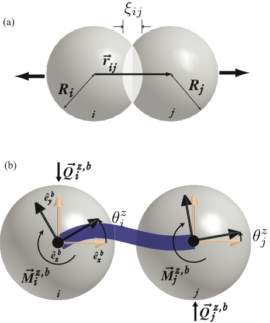
FIG. 1: (a) Representation of the overlap interaction between two elements. (b) Typical deformation of a beam in the x- y plane, showing the resulting bending and shear forces and torques. The z-axis is perpendicular to the image.
$$
The 3D representation of beams used in this work is an extension of the two-dimensional case of Euler-Bernoulli beams described in Ref. [41]. In 3D, however, the total deformation of a beam is calculated by the superposition of elongation, torsion, as well as bending and shearing in two different planes. The restoring force acting on element j connected by a beam to element i due to the elongation of the beam is given by
$$
$$
⃗F elo j = −EbAbεˆrij, (2)
$$
$$
Discrete Element Models (DEM) have been success- fully used since they were introduced by Cundall and Strack to study rock mechanics [32]. Applications range from static, to impact and explosive loading, using elementary particles of various shapes that are con- nected by different types of massless cohesive elements [14, 17, 18, 19, 20, 24, 33, 34, 35, 36, 37, 38]. In gen- eral, Newton’s equation governs the translational and rotational motion of the elements, that concentrate the whole mass. Forces and torques arise from element in- teractions, from the cohesive elements, volumetric forces, and of course from interaction with boundaries like walls. Throughout this work we use a three-dimensional (3D) implementation of DEM where the solid is represented by an assembly of spheres of two different sizes. They are connected via beam-truss elements that deform by elongation, shear, bending, and torsion. The total force and moment acting on each element consists of the contact forces resulting from sphere-sphere interactions, ⃗F c = ⃗F ov + ⃗F diss, the stretching and bending forces ⃗F b = ⃗F elo + ⃗Q and moments ⃗ M b transmitted by the beams attached. The contact force has a repulsive term due to elastic in- teraction between overlapping spherical elements, which is given by the Hertz theory [39] as a function of the ma- terial Young’s modulus Ep, the Poisson ratio νp, and the deformation ξ. The force on element j at a distance ⃗rij relative to element i (see Fig. 1(a) ) is given by
$$
$$
Reff
$$
$$
⃗F ov j = 4
$$
$$
3 Ep√
$$
$$
(1 −ν2) ξ3/2 ij ˆrij, (1)
$$
$$
where the overlapping distance ξij = Ri + Ri −|⃗rij| describes the deformation of the spheres, 1/Reff =
$$
$$
where Eb is the beam stiffness, ε = (|⃗rij| −l0) /l0, with the initial length of the beam l0 and its cross section Ab. The flexural forces and moments transmitted by a beam are calculated from the change in the orientations on each beam end, relative to the body-fixed coordinate system of the beam (ˆeb x, ˆeb y, ˆeb z). Figure 1(b) shows a ty- pical deformation due to rotation of both beam ends rel- ative to the ˆeb z axis, with ˆeb x oriented in the direction of ˆrij. Given the angular orientations θz i and θz j , the cor- responding bending force ⃗Qz,b j and moment ⃗M z,b j for the
$$

3
elastic deformation of the beam are given by \[41\]:
$$
⃗Qz,b j = 3EbI (θz i + θz j ) L2 ˆeb y, (3a)
$$
rotations of the elements is described using quaternions [41, 44]. The breaking rules are evaluated at each time step. The beam breaking is irreversible, which means that broken beams are excluded from the force calcula- tions for all consecutive time steps.
$$
⃗M z,b j = EbI (θz i −θz j ) L ˆeb z +  ⃗Qz,b i × |⃗rij| ˆeb x  , (3b)
$$
System formation and characterization
$$
where I is the beam moment of inertia. Corresponding equations are written for general rotations around ˆeb y, and the forces and moments are added up. Additional torsion moments are added to consider a relative rotation of the elements around ˆeb x:
$$
$$
⃗M x,b j = −GbItor (θx j −θx i ) L ˆeb x, (4)
$$
$$
with Gb and Itor representing the shear modulus and mo- ment of inertia of the beams along the beam axis, respec- tively. The bending forces and moments are transformed to the global coordinate system before they are added to the contact, volume and walls forces. Beams can break in order to explicitly model damage, fracture, and failure of the solid. The imposed breaking rule takes into account breaking due to stretching and bending of a beam [21, 23, 24, 40, 42], which breaks if
$$
$$
 ε
$$
$$
2 + max (|θi|, |θj|)
$$
$$
εth
$$
$$
θth ≥1, (5)
$$
$$
where ε = ∆l/l0 is the longitudinal strain, and θi and θj are the general rotation angles at the beam ends be- tween elements i and j, respectively. Here cos θi = ˆeib x ·ˆeb x, where (ˆeib x , ˆeib y , ˆeib z ) define the i−particle’s orientation in the beam body-fixed coordinate system, similar calcula- tion is performed to evaluate θj. Equation (5) has the form of the von Mises yield criterion for metal plasticity [40, 43]. The first part of Eq. (5) refers to the breaking of the beam through stretching and the second through bending, with εth and θth being the respective thresh- old values. The introduced threshold values are taken randomly for each beam, according to the Weibull distri- butions:
$$
$$
"
$$
$$
k#
$$
$$
εth
$$
$$
− εth
$$
$$
k−1 exp
$$
$$
, (6a)
$$
$$
P(εth) = k
$$
$$
εo
$$
$$
εo
$$
$$
εo
$$
$$
"
$$
$$
k#
$$
$$
θth
$$
$$
− θth
$$
$$
k−1 exp
$$
$$
. (6b)
$$
$$
P(θth) = k
$$
$$
θo
$$
$$
θo
$$
$$
θo
$$
$$
Special attention needs to be given to the discretiza- tion in order to prevent artifacts arising from the sys- tem topology, like anisotropic properties, leading to non uniform propagation of elastic waves or preferred crack paths. In our procedure we first start with 27000 spher- ical elements that we initially place on a cubic lattice with random velocities. The element diameters are of two different sizes, with D2 = 0.95D1, that are randomly assigned, leading to more or less equal fractions. Once the elements are placed, the system is left to evolve for 50000 time steps, using periodic boundary conditions, in a volume that is about 8 times larger then the total vol- ume of the elements. This way we obtain truly random and uniformly distributed positions. To compact the elements, a centripetal constant ac- celeration field, directed towards the center of the sim- ulation box, is imposed. Due to this field the elements form a nearly spherical agglomerate at the center of the box. The system is allowed to evolve until all particle velocities are reduced to nearly zero due to dissipative forces. With the elements compacted, the next stage is to con- nect them by beam-truss elements. This is achieved in our model through a Delaunay triangulation of their po- sitions. As a consequence, not only spherical elements that are initially in contact or nearly in contact with each other are connected, but the resulting beam lat- tice is equivalent to a discretization of the material us- ing a dual Voronoi tessellation of the material domain [43, 45, 46]. After the bonds have been positioned, their Young’s moduli are slowly increased while the centripetal field is reduced to zero. During this process the material expands to an equilibrium state, reducing the contact forces. The bond lengths and orientations are then reset so that no initial residual stresses are present in the beam lattice. The final solid fraction obtained is approximately 0.65. We have compared impact simulations of specimens compacted as described above with specimens using ran- dom packings of spheres as reported in Ref. [47], which have no preferential direction in the packing process such as the one that could be imposed by the centripetal field. No significant difference was found in the simulation re- sults, indicating that possible radially aligned locked-in force chains are not relevant. Once the system is formed, the specimen is shaped to the desired geometry by removing particles and beams that are situated outside the chosen volume. The mi- croscopic properties, namely the elastic properties of the elements and bonds, as well as the bond breaking
$$
$$
Here k , εo and θo are parameters of the model, control- ling the width of the distributions and the average values for εth and θth respectively. Low disorder is obtained by using large k values, large disorder by small k. Disor- der is also introduced in the model by the different beam lengths in the discretization as described below. The time evolution of the system is followed by nu- merically solving the equations of motion for the transla- tion and rotation of all elements using a 6th-order Gear predictor-corrector algorithm, and the dynamics of the
$$

4
$$
thresholds, are chosen to attain the desired macroscopic Young’s modulus, Poisson’s ratio, as well as the tensile and compressive strength. Table 1 summarizes the in- put values used in the simulations presented in this pa- per. These were chosen to obtain macroscopic proper- ties close to the mechanical properties of polymers like PMMA, PA, and nylon at low temperatures. Figure 2 displays the stress-strain curve measured by quasi-static, uni-axial tensile loading of a bar, as depicted in the inset. The microscopic and resulting macroscopic properties are resumed in Table 1, for a sample size (16 × 8 × 8 mm). The experiment is performed by measuring the force re- quired to slowly move the upper and lower surfaces (see inset of Fig. 2) at a constant strain rate of 0.004 s−1. The stress-strain curve is basically linear until the strength is reached where rapid brittle fracture of the material takes place. Oscillations in the broken specimen fractions can be seen after the system is completely unloaded due to elastic waves. The Young’s modulus measured from the slope of the curve is 7.4±0.5GPa, is presented along with other macroscopic properties of the material in Table 1.
$$
$$
in the negative z-direction, assigned to all its composing elements. The computation continues until no additional bonds are broken for at least 50µs. For comparative reasons we calculate the evolution of the stress field using an explicit Finite Element (FE) analysis. The FE model is composed of axisymmetric, linear 4-node elements with macroscopic properties taken from the results of the DEM simulations (see Table 1). Along the central axis through the sphere and ground plate, symmetry boundary conditions are imposed, the bottom of the target plate is encastred and contact sur- faces for the sphere and plate are defined. Figure 3(a) shows a comparison between the impact simulation using our DEM model and a Finite Element Model simulation. In Fig. 3(a), the DEM elements are colored according to the amplitude of their accelerations to show the propaga- tion of a longitudinal shock wave that was initiated at the contact point. The wave speed can be estimated to be ap- proximately 2200 ± 100m/s, which is consistent with the Young’s modulus of the material derived from Fig. 2 and its density. The time evolution of the potential energy stored in the system is compared in Fig. 3(b), showing excellent quantitative agreement between the two mod- els. After the characterization of the system properties we allow for the cohesive elements to fail in order to study the fragmentation properties.
$$
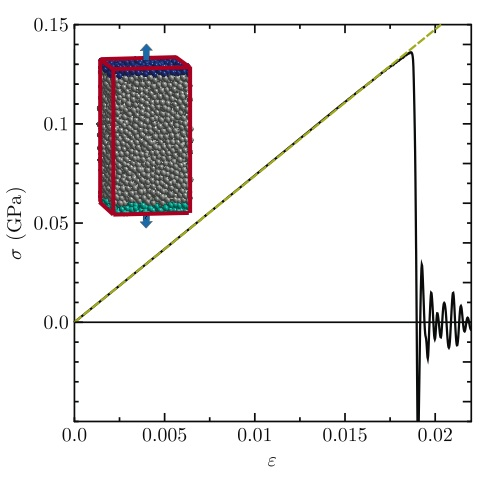
$$
FIG. 2: Stress-strain curve for specimen under quasi-static loading. The inset shows the load geometry. Abrupt brittle fracture behavior can be observed at about ε = 0.019.
$$
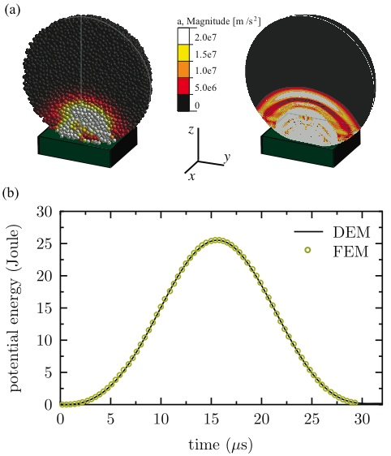
$$
FIG. 3: (a) Comparison of deformations and shock-wave propagation obtained between DEM and FEM simulations for vi = 117 m/s. (b) Time evolution of the elastic potential energy stored in the system for the same velocity obtained by DEM (solid line) and FEM (dashed line) simulations.
$$
$$
In order to simulate the impact of a sphere on a fric- tionless hard plate, a spherical specimen with diame- ter D = 16 mm is constructed, and a fixed plane with Young’s modulus 70 GPa is added to the simulation. The spherical specimen has a total of approximately 22000 el- ements, with around 32 across the sample diameter. The contact interaction between the elements and the plate is identical to the element-element contact interaction, only with ξ = Ri −rip , where rip is the distance be- tween the particle center and the plate. The specimen is placed close to the plate with an impact velocity vi,
$$

5
l
cover quite well the influence of complex stress states in the crack formation in a more precise way.
TABLE I: Micro- and macroscopic material model properties. Typical model properties (DEM):
$$
Beams: stiffness Eb/Gb 6 GPa average length L 0.5 mm diameter d 0.5 mm strain threshold ε0 0.02 - bending threshold θ0 3 ◦
$$
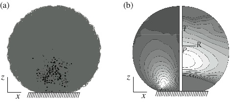
$$
shape parameter k 3/10 - Particles: stiffness Ep 3 GPa diameter D1 0.5 mm density ρ 3000 kg/m3
$$
$$
Hard plate: stiffness Ew 70 GPa Interaction: friction coefficient µ 1 - damping coefficient γn 0.25 s−1
$$
$$
friction coefficient γt 0.05 s−1
$$
FIG. 4: Initial damage due to bi-axial stress state. (a) Ver- tical cut through the center of the sphere from the DEM sim- ulation showing broken bonds represented by dark color. (b) Stress fields calculated with FEM model. Left side are shear stresses in global coordinates from 0 to -400MPa (black to white) while the right side shows circumferential stresses in local spherical coordinates with the center in the sphere center ranging from 0 to 130MPa (black to white).
$$
System: time increment ∆t 1e-8 s number of particles N p 22013 - number of beams N b 135948 - solid fraction 0.65 - sphere diameter D 16 mm
$$
Macroscopic properties (DEM):
$$
system stiffness E 7.4 ± 0.5 GPa Poisson’s ratio ν 0.2 - density ρ 1920 kg/m3
$$
$$
system strength σc 110 MPa
$$
Comparison:
$$
DEM FEM longitudinal 2210 ± 100 2270 ± 20 m/s wave speed contact time 31.4 31.4 µs
$$
III. FRAGMENTATION MECHANISMS
$$
In this section we explore the different fragmentation mechanisms in the order of occurrence and increasing energy input. The first yield that arises in the material is diffuse damage that occurs in the region above the contact disc. It can be seen from Fig. 4(a), that this damage region is centered in the load axis, at a distance approximately D/4 from the plane. We can see a strong correlation of the position of the diffuse cracking in the DEM results (Fig. 4(a)) with the location of a region with a bi-axial stress state in the x-y- plane and a superimposed compression in the z-direction, as calculated using FEM (Fig. 4(b)), also in agreement with experimental results reported in Ref. [6] . This re- sult, along with the one presented in Fig. 3, suggests that the use of three-dimensional beams, as compared with the use of simple springs, despite of the reduced number of degrees of freedom in the breaking criterion, could re-
$$
$$
As time evolves, meridional cracks start to appear. The origination of this type of cracks is explored in Fig. 5, where we plot in Fig. 5(a) the positions of the broken bonds in two different projections, showing well defined meridional crack planes that propagate towards the lat- eral and upper free surfaces of the specimen. In Fig. 5(b) we plot the angular distribution of the broken bonds for different times. Here g(θ) is the probability of finding two broken bonds with an angular separation θ. Note that their positions are projected into the plane perpen- dicular to the load axis. The evident peaks in g(θ) are a clear indication that the cracks are meridional planes that include the load axis. In this particular case, the cracks are separated by an average angle of about 60 de- grees, and they become evident 13 to 15 µs after impact (vi = 120 m/s). In order to understand what governs the orientation and angular separation of these meridional cracks we per- formed many different realizations with different seeds of the random number generator and impact points. For all cases the orientation of the cracks can change, but not their average angular separation. We observe that for strong disorder (Eq. (6)), a larger amount of uncorre- lated damage occurs, but the average angular separation of the primary cracks does not change. This suggests that the formation of these cracks arises due to a com- bination of the existence of local disorder and the stress field in the material, but does not depend on the degree of disorder. As we can see from the FE calculations and from the damage orientation correlation plot (Fig. 5) inside of the uniform biaxial tensile zone, no preferred crack orienta- tion is evidenced. Many microcracks weaken this ma- terial zone, decreasing the effective stiffness of the core. Around the weakened core the material is intact and un- der high circumferential stresses. It is in this ring shaped
$$

6
$$
between wedge shaped fragments with increasing impact velocity. If enough energy is still available, some of the merid- ional plane cracks grow outwards and upwards, breaking the sample into wedge shaped fragments that resemble orange slices. As the sphere continues moving towards the plate, a ring of broken bonds forms at the border of the con- tact disc due to shear failure (compare Fig. 6(a)). When the sphere begins to detach from the plate, the cone has been formed by high shear stresses in the contact zone (see Fig. 4(b) left) by a ring crack that was able to grow from the surface to the inside of the material under ap- proximately 45◦(Fig. 6(b)). It detaches, leaving a small number of cone shaped fragments that have a smaller rebound velocity than the rest of the fragments due to dissipated elastic energy (Fig. 6(c)).
$$
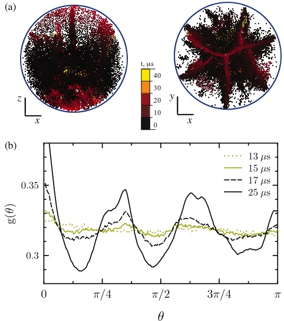
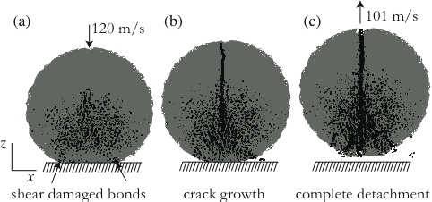
FIG. 5: (a) Colored dots display the positions of the broken bonds according to the time of breaking. (b) Angular distri- bution function of broken bonds as a function of the angular separation when their positions are projected into the plane perpendicular to the load axis.
FIG. 6: Vertical meridional cut of the sphere at different stages during impact, showing the separation of lower frag- ments. (a) Formation of a ring of broken bonds due to shear failure. (b) These broken bonds evolve into cracks that prop- agate inside the sample. (c) Finally these cracks lead to the detachment of the lower fragments.
Oblique plane cracks may still break the large frag- ments further, if the initial energy given to the system is high enough. Therefore they are called secondary cracks. Figure 7(a) shows a vertical meridional cut of a sample where these cracks can be seen. The intact bonds are colored according the final fragment they belong to.
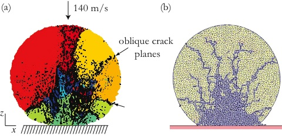
$$
FIG. 7: (a) DEM simulation at vi = 140 m/s exemplifying the secondary cracks. The bonds are colored according to the final fragment they belong to. (b) 2D simulations using polygons as elementary particles [21].
$$
zone, that we observe to be the onset of the meridional cracks when we trace them back. For increasing impact velocity we observe a decrease in the angular separation of crack planes and thus more wedge-shaped fragments. Therefore this fragment formation mechanism can not be explained by a quasi-static stress analysis. The observa- tion is in agreement with experimental findings and can be explained by the basic ideas of Mott’s fragmentation theory for expanding rings [48]. Due to the stress release front for circumferential stresses, once a meridional crack forms, stress is released in its neighborhood; the fractured regions spread with a constant velocity and the probabil- ity for fracture in neighboring regions decreases. On the other hand in the unstressed regions, the strain still in- creases, and so does the fracture probability along with it. The average size of the wedge shaped fragments therefore is determined by the relationship between the velocity of the stress release wave and the rate at which cracks nucle- ate. Thus the higher the strain rate, the higher the crack nucleation rate and the more fragments are formed. We measured the strain rate at different positions inside the bi-axially loaded zone, finding a clear correlation between impact velocity and strain rate. Even though we frag- ment a compact sphere and not a ring, when it comes to the formation of meridional cracks, we observe that they form in a ring shaped region and that Mott’s theory can qualitatively explain the decrease of angular separation

7
These secondary cracks are very similar to the oblique cracks observed in 2D simulations [14, 21]. For compari- son we show in Fig.7(b) the crack patterns obtained from a 2D DEM simulation that uses polygons as elementary particles. In the 2D case, we observe a cone of numerous single element fragments and meridional cracks cannot be observed.
IV. FRAGMENTATION REGIMES
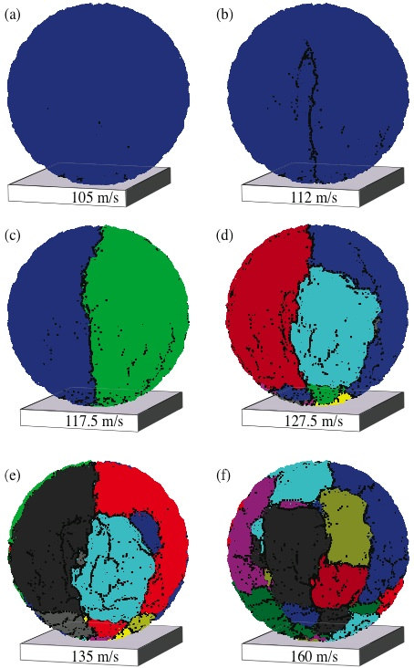
FIG. 8: Front view of the reconstructed spheres, showing the final crack patterns at the surfaces for different initial velocities. Gray dots are placed at the positions of broken beams while different colors are chosen for different fragments.
$$
below the threshold value vth = 115 m/s the largest frag- ment has almost the total mass of the system, while the second largest is orders of magnitude smaller. This be- haviour implies that for vi < vth the system does not fragment, it only gets damaged. For velocities larger then vth the mass of the largest fragment decreases rapidly. The second largest and average fragment masses increase, having their maximum at 117.5 m/s for this material strength.
$$
$$
The amount of energy necessary to fragment a material is a parameter that is very important for practical appli- cations in comminution. In fragmentation experiments two distinct regimes for damage and fragmentation can be identified depending on the impact energy: below a critical energy [4, 6, 19] damage takes place, while above fragments are formed. Figure 8 compares the final crack patterns after impact with different initial velocities. The intact bounds are colored according to the final fragment they belong to, and gray dots display the positions of bro- ken bonds. The fragments have been reassembled to their initial positions to provide a clearer picture of the result- ing crack patterns. For the smaller impact velocities it is possible to identify meridional cracks that reach the sam- ple surface above the contact point, but fragmentation is not complete and one large piece remains (Figs. 8(a) and 8(b)). We call these meridional cracks primary cracks, since as one increases the initial energy given to the sys- tem, some of them are the first to reach the top free surface of the sphere, fragmenting the material into a few large pieces, typically two or three fragments with wedge shapes (Fig. 8(c)). When we increase the initial energy secondary oblique plane cracks break the orange slice shaped fragments further (Fig. 8(d)). Additional increase in the impact velocity causes more secondary cracks and consequently the reduction of the fragment sizes (Figs. 8(e) and 8(f)). The shape and number of large fragments resulting from the numerical model for smaller impact energies, as well as the location and orientation of oblique secondary cracks for larger energies, are in agreement with experi- mental findings [11, 12, 20]. We can identify that for velocities smaller then a threshold value, the sample is damaged by the impact but not fragmented. This threshold velocity for frag- mentation has been found experimentally and numeri- cally [6, 18, 21]. In particular, it has been found from 2D simulations that a continuous phase transition from damaged to fragmented outcome of impact fragmenta- tion can be tuned by varying the initial energy imparted to the system [18, 21]. Following the analysis in references [18, 21] the final state of the system after impact is analyzed by observing the evolution of the mass of the two largest fragments, as well as the average fragment size (shown in Fig. 9). The average mass M2/M1, with Mk = PNf i M k i −M k max excludes the largest fragment. It can be observed that
$$
The results shown in Fig. 9 are in very good qualita- tive agreement with those obtained from simulations in different geometries and load conditions [18, 21, 49], in- dicating that our model shows a phase transition from a damaged to a fragmented state.

8
$$
that these fragments have their origin in mechanisms dis- tinct from the ones that form small fragments. Fig. 10(b) shows the cumulative size distribution of the fragments weighted by mass, Q3, for the same velocities. Q3 is cal- culated by summing the mass of all the fragments smaller then a given size s. The size of a fragment is estimated as the diameter of a sphere with identical mass, the values are normalized by the sample diameter. By this repre- sentation the large fragments are better resolved. We can see that the shape of the size distribution for large fragments can be described by a two-parameter Weibull distribution, Q3(s) = 1 −exp[−(s/sc)ks] (dashed line in Fig. 10(b), with sc = 0.75 and ks = 5.8). The Weibull distribution is used here since it has been empirically found to describe a large number of fracture experiments, specially for brittle materials [29]. With increasing initial velocity, the average fragment size shifts towards smaller values, also in agreement with experimental findings from Refs. [13, 30].
$$
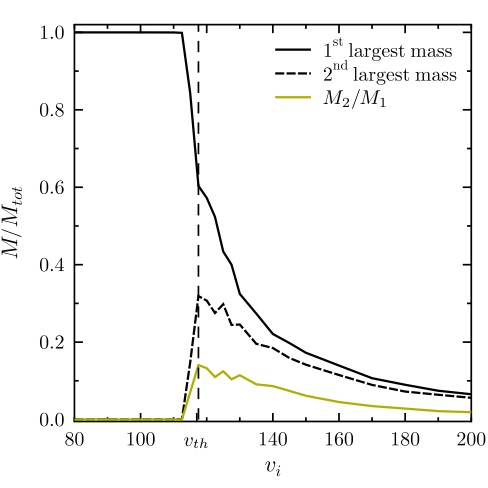
FIG. 9: The mass of first and second largest fragment and the average fragment mass as a function of the impact velocity.
V. RESULTING FRAGMENT MASS DISTRIBUTION
$$
The local maximum in the fragment mass distribution for large fragments represents those fragments, that are formed by the meridional cracks. As we can observe from Fig. 11, the fragment mass distribution is independent of the amount of disorder or material that the specimen is composed of (k is in the breaking thresholds distributions in Eq. (7)). Near the critical velocity vth we can iden- tify two main parts in the fragment mass distribution. For m up to around 1/40 (approximately 550 elements), the power law F(m) ∼m−τf(m/ ¯mo) with the cutoff function f(m/ ¯mo) containing an exponential component exp (−m/ ¯mo) can be used like in Ref. [49]. However, for larger m, F(m) can also be described by a two-parameter Weibull distribution
$$
$$
"
$$
$$
kl#
$$
$$
  m
$$
$$
−  m
$$
$$
F(m) ∼  kl
$$
$$
kl−1 exp
$$
$$
. (7)
$$
$$
¯ml
$$
$$
¯ml
$$
$$
¯ml
$$
$$
The dashed line in Fig. 11 corresponds to a fit to the data using ¯mo = 0.004 ± 0.001, ¯ml = 0.3 ± 0.02 and kl = 1.9 ± 0.1. The good quality of the fit allows for a better estimation of the exponent of the power-law distribution in the small fragment mass range τ = 2.2 ± 0.02.
$$
$$
One of the first and still most important character- izations for fragmentation processes are fragment mass distributions. Experimental and numerical studies on fragmentation show that the mass distribution follow a power law in the range of small fragments, whose expo- nent depends on the fragmentation mechanisms, while the mass distribution for large fragments is usually rep- resented by an exponential cut-offof the power law. The fragment mass distributions that are obtained from our three-dimensional simulations are given in Fig. 10(a) for different impact velocities vi. Here F(m) represents the probability density of finding a fragment with mass m between m and m + ∆m. Where m is the fragment mass normalized by the total mass of the sphere Mtot. The values are averaged over 36 simulations, changing the random breaking thresholds and randomly rotating the sample to obtain different impact points. For ve- locities below the critical velocity vth of our model, the fragment mass distribution shows a peak at low frag- ment masses, corresponding to some small fragments. The pronounced isolated peaks near the total mass of the system correspond to large damaged, but still unbro- ken system (see also Figs. 8(a) and (b)). Fragments at intermediate mass range are not found for small initial velocities. At and above vth, the fragment mass distri- bution exhibits a power law dependence for intermediate masses, F(m) ∼m−τ, (dashed line in Fig. 10(a)) with τ = 1.9 ± 0.2 [50, 51], and a broad maximum can be observed in the histogram for large fragments, indicating
$$
For the material parameters used in our calculations the primary cracks have an angular distribution with an average separation from 45 to 60 degrees. Therefore the mass of a fragment resulting from these plane meridional cracks is of the order of 10% of the sample mass, although typically only two to four cracks actually reach the sur- face breaking the material. This estimate corresponds to the range of masses that present the broad peak in the fragment mass distribution. This feature of the mass distribution function is not observed in the results of 2D simulations [18, 21] or 3D simulations of shell fragmenta- tion [49, 52], where obviously meridional cracks can not exist.

9
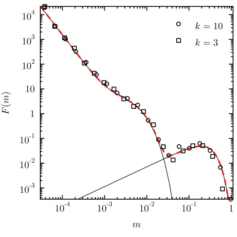
$$
FIG. 11: Fragment mass distribution at v = 122.5 m/s for different disorder in the bond breaking thresholds. The solid lines correspond to a power law with an exponential cuttoff for lower masses and the Weibull distribution for large masses (Eq. (7))
$$
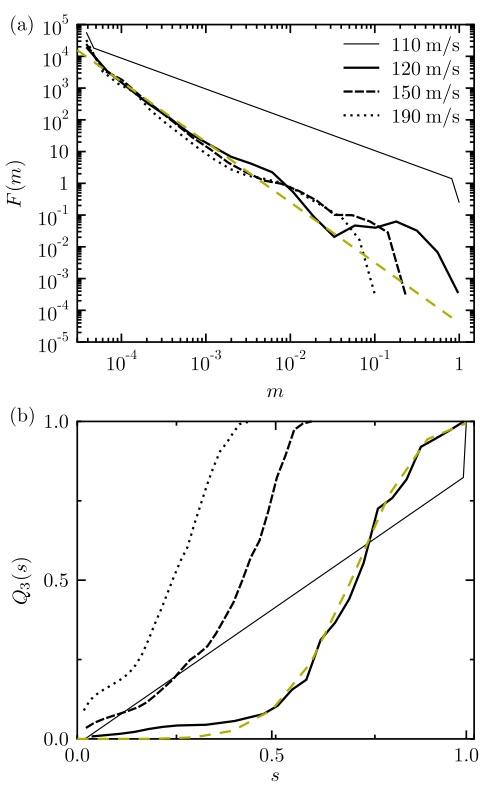
FIG. 10: (a) Fragment mass distribution for different initial velocities. The straight line corresponds to a power-law with exponent -1.9 (b) Fragment size distribution weighted by mass for initial velocities with identical legend as above.
VI. CONCLUSIONS
We studied a brittle, disordered fragmenting solid sphere. We performed 3D DEM simulations with 3D beam-truss elements for the particle cohesion. Due to this computationally more laborious approach as com- pared to previous works, we were able to obtain a clearer picture of the fragmentation process, the evolution of fragmentation mechanisms, and its consequences for the fragment mass distribution. To get a clearer insight into the fracture initiation, we used continuum solutions for the stress field, obtained by the Finite Element Method. We were able to show, that 2D simulations for frag- menting systems are not capable of capturing fragmenta- tion by meridional cracks, that are the primary cracking mechanism. We found that cracks form inside the sample in the region above a compressive cone long time before
they are experimentally observable from the outside, if at all. They grow to form meridional fracture planes that result in a small number of large wedge shaped fragments, typically two to four. The increasing tensile radial and circumferential stress in the ring-shaped region above the contact plane gives rise to meridional cracks. The de- crease in the angular separation between these cracks could be explained by the Mott fragmentation model. Some of these cracks grow to form the meridional frac- ture planes that break the material in a small number of large fragments, and it is only then, that they become visible in experiments. The resulting mass distribution of the fragments presents a power law regime for small fragments and a broad peak for large fragments that can be fitted with a two-parameter Weibull distribution, in agreement with experimental results [10, 13, 29, 30]. The fragment mass distribution is quite robust, independent on the macro- scopic material properties such as material strength and disorder distribution. Only the large fragment range of the mass distribution happens to be energy dependent, due to additional fragmentation processes that arise as one increases the impact energy. Even though our results are valid for various materi- als with disorder, they are limited to the class of brittle, heterogeneous media. Extensions to ductile materials are in progress. Another class of interesting questions deal with the problem of size effects, the influence of polydis- perse particles or the stiffness contrast of particles and

10
financial support, under grant 14516N from the German Federal Ministry of Economics and Technology (BMWI). H. J. Herrmann thanks the Max Planck Prize. F. Kun was supported by OTKA T049209. We thank Dr. Jan Bl¨omer and Prof. Jos´e Andrade Soares Jr. for helpfull discussions.
beam-elements. The ability of the model to reproduce well defined crack planes also opens up the possibility to study other crack propagation problems in 3D. For technological applications questions about the influence of target shapes and the optimization potential to obtain desired fragment size distributions or to reduce impact energies are of broad interest.
VII. ACKNOWLEDGMENTS
We thank the German Federation of Industrial Re- search Associations ”Otto von Guericke” e.V. (AiF) for
[1] H. J. Herrmann and S. Roux, eds., Statistical Models for the Fracture of Disordered Media (North-Holland, Ams- terdam, 1990). [2] J. A. ˚Astr¨om, Adv. Phys. 55, 247 (2006). [3] J. J. Gilvarry and B. H. Bergstrom, J. Appl. Phys. 32, 400 (1961). [4] J. J. Gilvarry and B. H. Bergstrom, J. Appl. Phys. 33, 3211 (1962). [5] N. Arbiter, C. C. Harris, and G. A. Stamboltzis, T. Soc. Min. Eng. 244, 118 (1969). [6] E. W. Andrews and K. S. Kim, Mech. Mater. 29, 161 (1998). [7] J. Tomas, M. Schreier, T. Groger, and S. Ehlers, Powder Technol. 105, 39 (1999). [8] R. Majzoub and M. M. Chaudhri, Philos. Mag. Lett. 80, 387 (2000). [9] K. T. Chau, X. X. Wei, R. H. C. Wong, and T. X. Yu, Mech. Mater. 32, 543 (2000). [10] A. D. Salman, C. A. Biggs, J. Fu, I. Angyal, M. Szabo, and M. J. Hounslow, Powder Technol. 128, 36 (2002). [11] S. Z. Wu, K. T. Chau, and T. X. Yu, Powder Technol. 143-4, 41 (2004). [12] W. Schubert, M. Khanal, and J. Tomas, Int. J. Miner. Process. 75, 41 (2005). [13] S. Antonyuk, M. Khanal, J. Tomas, S. Heinrich, and L. Morl, Chem. Eng. Process. 45, 838 (2006). [14] A. V. Potapov, M. A. Hopkins, and C. S. Campbell, Int. J. Mod. Phys. C. 6, 371 (1995). [15] A. V. Potapov and C. S. Campbell, Int. J. Mod. Phys. C. 7, 717 (1996). [16] A. V. Potapov and C. S. Campbell, Powder Technol. 93, 13 (1997). [17] C. Thornton, K. K. Yin, and M. J. Adams, J. Phys. D. Appl. Phys. 29, 424 (1996). [18] F. Kun and H. J. Herrmann, Phys. Rev. E. 59, 2623 (1999). [19] C. Thornton, M. T. Ciomocos, and M. J. Adams, Powder Technol. 105, 74 (1999). [20] M. Khanal, W. Schubert, and J. Tomas, Granul. Matter. 5, 177 (2004). [21] B. Behera, F. Kun, S. McNamara, and H. J. Herrmann, J. Phys-condens. Mat. 17, S2439 (2005). [22] H. J. Herrmann, F. K. Wittel, and F. Kun, Physica A 371, 59 (2006). [23] F. Kun and H. J. Herrmann, Int. J. Mod. Phys. C. 7, 837
(1996). [24] F. Kun and H. J. Herrmann, Comput. Method. Appl. M. 138, 3 (1996). [25] A. Diehl, H. A. Carmona, L. E. Araripe, J. S. Andrade, and G. A. Farias, Phys. Rev. E. 62, 4742 (2000). [26] J. A. ˚Astr¨om, B. L. Holian, and J. Timonen, Phys. Rev. Lett. 84, 3061 (2000). [27] L. Oddershede, P. Dimon, and J. Bohr, Phys. Rev. Lett. 71, 3107 (1993). [28] A. Meibom and I. Balslev, Phys. Rev. Lett. 76, 2492 (1996). [29] C. S. Lu, R. Danzer, and F. D. Fischer, Phys. Rev. E. 65, 067102 (2002). [30] Y. S. Cheong, G. K. Reynolds, A. D. Salman, and M. J. Hounslow, Int. J. Miner. Process. 74, S227 (2004). [31] E. W. Andrews and K. S. Kim, Mech. Mater. 31, 689 (1999). [32] P. A. Cundall and O. D. L. Strack, Geotechnique. 29, 47 (1979). [33] B. K. Mishra and C. Thornton, Int. J. Miner. Process. 61, 225 (2001). [34] C. Thornton and L. F. Liu, Powder Technol. 143-4, 110 (2004). [35] C. Thornton, M. T. Ciomocos, and M. J. Adams, Powder Technol. 140, 258 (2004). [36] D. O. Potyondy and P. A. Cundall, Int. J. Rock. Mech. Min. 41, 1329 (2004). [37] G. A. D’Addetta and E. Ramm, Granul. Matter. 8, 159 (2006). [38] H. A. Carmona, F. Kun, J. S. Andrade Jr, and H. J. Herrmann, Phys. Rev. E. 75, 046115 (2007). [39] L. D. Landau and E. M. Lifshitz, Theory of Elasticity, vol. 7 of Course of Theoretical Physics (Butterworth- Heinemann, London, 1986), 3rd ed. [40] H. J. Herrmann, A. Hansen, and S. Roux, Phys. Rev. B. 39, 637 (1989). [41] T. P¨oschel and T. Schwager, Computational Granu- lar Dynamics: Models and Algorithms (Springer-Verlag Berlin Heidelberg New York, 2005). [42] G. A. D’Addetta, F. Kun, E. Ramm, and H. J. Her- rmann, in Continuous and Discontinuous Modelling of Cohesive-Frictional Materials, edited by P. Vermeer (Springer-Verlag, Berlin, 2001), vol. 568 of Springer Lec- ture Notes in Physics, pp. 231–258. [43] G. Lilliu and J. G. M. Van Mier, Eng. Fract. Mech. 70,

11
[48] N. F. Mott, Proceedings of the Royal Society of London A 189, 300 (1946). [49] F. K. Wittel, F. Kun, H. J. Herrmann, and B. H. Kroplin, Phys. Rev. E. 71, 016108 (2005). [50] D. L. Turcotte, J. Geophys. Res-solid. 91, 1921 (1986). [51] R. P. Linna, J. A. ˚Astr¨om, and J. Timonen, Phys. Rev. E. 72, 015601 (2005). [52] F. Wittel, F. Kun, H. J. Herrmann, and B. H. Kr¨oplin, Phys. Rev. Lett. 93, 035504 (2004).
927 (2003). [44] D. C. Rapaport, The Art of Molecular Dynamics Simu- lation (Cambridge University Press, Cambridge, 2004), 2nd ed. [45] J. E. Bolander and N. Sukumar, Phys. Rev. B. 71, 094106 (2005). [46] M. Yip, Z. Li, B. S. Liao, and J. E. Bolander, Int. J. Fracture. 140, 113 (2006). [47] R. M. Baram and H. J. Herrmann, Phys. Rev. Lett. 95, 224303 (2005).
