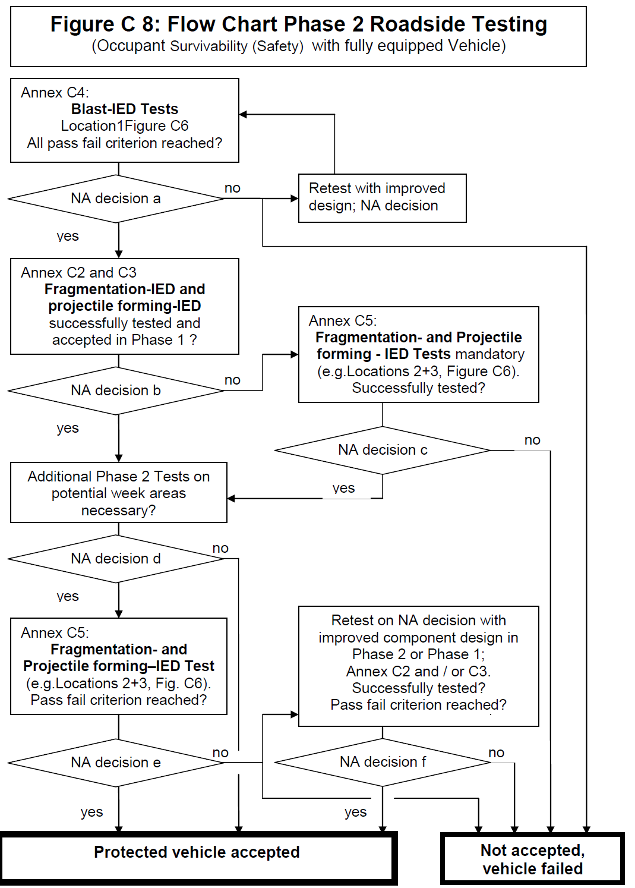

# NATO UNCLASSIFIED Releasable to PFP and Australia

### NATO STANDARD AEP-55 PROCEDURES FOR EVALUATING THE PROTECTION LEVEL OF ARMOURED VEHICLES - IED THREAT Edition C Volume 3 (PART I), Version 1 Ratification Draft 1

### NORTH ATLANTIC TREATY ORGANIZATION ALLIED ENGINEERING PUBLICATION Published by the NATO STANDARDIZATION AGENCY (NSA) © NATO/OTAN

# NATO UNCLASSIFIED Releasable to PFP and Australia

### NATO UNCLASSIFIED Releasable to PFP and Australia

INTENTIONALLY BLANK
NATO UNCLASSIFIED Releasable to PFP and Australia Ratification Draft 1

NATO UNCLASSIFIED Releasable to PFP and Australia
NORTH ATLANTIC TREATY ORGANIZATION (NATO) NATO STANDARDIZATION AGENCY (NSA) NATO LETTER OF PROMULGATION [Date] 1. The enclosed Allied Engineering Publication AEP-55 (C), Volume 3 on "PROCEDURES FOR EVALUATING THE PROTECTION LEVEL OF ARMOURED VEHICLES", has been approved by the nations in the NATO Army Armaments Group, is promulgated herewith. The agreement of nations to use this publication is recorded in STANAG 4569. 2. AEP-55 (C), Volume 3 is effective upon promulgation of STANAG 4569. 3. No part of this publication may be reproduced, stored in a retrieval system, used commercially, adapted, or transmitted in any form or by any means, electronic, mechani- cal, photo-copying, recording or otherwise, without the prior permission of the publisher. With the exception of commercial sales, this does not apply to member nations and Part- nership for Peace countries, or NATO commands and bodies. 4. This publication shall be handled in accordance with C-M(2002)60. Dr. Cihangir Aksit, TUR Civ Director NATO Standardization Agency
NATO UNCLASSIFIED Releasable to PFP and Australia Ratification Draft 1

NATO UNCLASSIFIED Releasable to PFP and Australia
INTENTIONALLY BLANK
NATO UNCLASSIFIED Releasable to PFP and Australia Ratification Draft 1

NATO UNCLASSIFIED Releasable to PFP and Australia AEP-55 (C), VOL 3 (PART I)
RESERVED FOR NATIONAL LETTER OF PROMULGATION
I Edition C, Vol 3 (Part I), Version 1 NATO UNCLASSIFIED Releasable to PFP and Australia Ratification Draft 1

NATO UNCLASSIFIED Releasable to PFP and Australia AEP-55 (C), VOL 3 (PART I)
INTENTIONALLY BLANK
II Edition C, Vol 3 (Part I), Version 1 NATO UNCLASSIFIED Releasable to PFP and Australia Ratification Draft 1

NATO UNCLASSIFIED Releasable to PFP and Australia AEP-55 (C), VOL 3 (PART I)

### RECORD OF RESERVATIONS CHAPTER RECORD OF RESERVATION BY NATIONS

### Note: The reservations listed on this page include only those that were recorded at time of promulgation and may not be complete. Refer to the NATO Standardization Database for the complete list of existing reservations.

III Edition C, Vol 3 (Part I), Version 1 NATO UNCLASSIFIED Releasable to PFP and Australia Ratification Draft 1

NATO UNCLASSIFIED Releasable to PFP and Australia AEP-55 (C), VOL 3 (PART I)
INTENTIONALLY BLANK
IV Edition C, Vol 3 (Part I), Version 1 NATO UNCLASSIFIED Releasable to PFP and Australia Ratification Draft 1

NATO UNCLASSIFIED Releasable to PFP and Australia AEP-55 (C), VOL 3 (PART I)
RECORD OF SPECIFIC RESERVATIONS
[nation] [detail of reservation]

### 

Note: The reservations listed on this page include only those that were recorded at time of promulgation and may not be complete. Refer to the NATO Standardization Database for the complete list of existing reservations.
V Edition C, Vol 3 (Part I), Version 1 NATO UNCLASSIFIED Releasable to PFP and Australia Ratification Draft 1

NATO UNCLASSIFIED Releasable to PFP and Australia AEP-55 (C), VOL 3 (PART I)
INTENTIONALLY BLANK
VI Edition C, Vol 3 (Part I), Version 1 NATO UNCLASSIFIED Releasable to PFP and Australia Ratification Draft 1

NATO UNCLASSIFIED Releasable to PFP and Australia AEP-55 (C), VOL 3 (PART I)

### TABLE OF CONTENTS

### TABLE OF CONTENTS ................................................................................................. VII

### LIST OF ABBREVIATIONS ............................................................................................ IX

### 1 SCOPE ...................................................................................................................... 1

### 2 SIGNIFICANCE OF USE .......................................................................................... 1

### 3 THREAT DEFINITION .............................................................................................. 3 3.1 Threat Direction ................................................................................................... 3 3.2 IED Classification ................................................................................................ 3

### 4 SYSTEM ACCEPTANCE PROCESS ....................................................................... 5

### 5 TEST REQUIREMENTS ........................................................................................... 7 5.1 Targets ................................................................................................................ 7 5.2 Measurements & Examination ............................................................................ 8

### 6 ASSESSMENT AND EVALUATION ........................................................................ 8 6.1 Occupant Survivability (Safety) Evaluation (Phase 2) ........................................ 8 6.2 Fragment Protection Assessment (Phase 2) ...................................................... 8 6.3 Vehicle Damage Assessment (Phase 2) ............................................................ 9 6.4 Vehicle Acceptance & Vulnerable Area Assessment ......................................... 9 6.5 Evaluation / Qualification .................................................................................... 9

### Annex A IED PROTECTION LEVELS FOR OCCUPANTS OF ARMOURED VEHICLES 1

### Annex B DEFINITION OF IED AND SURROGATES CHARGES ............................... 1

### Annex C DEFINITION OF TESTING CONDITIONS ROADSIDE IED ......................... 1 C1 Phase 1 Structural Integrity Blast Tests .............................................................. 1 C2 Phase 1 Structural Integrity Fragmentation Tests .............................................. 2 C3 Phase 1 Structural Integrity Projectile Forming (EFP) Tests .............................. 3 C4 Phase 2A Occupant Survivability (Safety) Blast Tests ....................................... 4 C5 Phase 2B Occupant Survivability (Safety) Fragmentation Tests ....................... 6 C6 Phase 2C Occupant Survivability (Safety) Projectile Forming Tests ................. 6 C7 Phase 3 Occupant Survivability (Safety) Overmatch Assessment .................... 6 C8 Summary of Testing and Acceptance Process ................................................... 8

### Annex D DEFINITION OF TESTING CONDITIONS UNDERBELLY IED .................... 1 D1 Phase 1 Structural Integrity Blast Tests .............................................................. 2 D2 Phase 1 Structural Integrity Fragmentation Tests .............................................. 4 D3 Phase 1 Structural Integrity Projectile Forming Tests ........................................ 6 D4 Phase 2A Occupant Survivability (Safety) Blast Tests ....................................... 8 D5 Phase 2B Occupant Survivability (Safety) Fragmentation Tests ...................... 10 D6 Phase 2C Occupant Survivability (Safety) Projectile Forming Tests ................ 12 D7 Phase 3 Occupant Survivability (Safety) Overmatch Assessment ................... 12 D8 Summary of Testing and Acceptance Process ................................................. 13

VII Edition C, Vol 3 (Part I), Version 1 NATO UNCLASSIFIED Releasable to PFP and Australia Ratification Draft 1

NATO UNCLASSIFIED Releasable to PFP and Australia AEP-55 (C), VOL 3 (PART I)

### Annex E SURVIVABILLITY (SAFETY) EVALUATION AND ASSESSMENT ........... 1 E1 PREFACE ........................................................................................................... 1 E2 ATD PREPARATION AND CERTIFICATION ..................................................... 1 E2.1 General ................................................................................................... 1 E2.2 ATD Certification .................................................................................... 2 E2.3 ATD Clothing, Footwear and PPE .......................................................... 2 E2.4 ATD Test Condition ................................................................................ 3 E3 INSTRUMENTATION .......................................................................................... 4 E3.1 General ................................................................................................... 4 E3.2 Instrumentation Calibration, Mounting And Sign Convention ................ 4 E3.3 ATD Instrumentation .............................................................................. 5 E3.4 Pressure Instrumentation ....................................................................... 6 E4 ATD Position ....................................................................................................... 7 E4.1 Basic Test Configuration ........................................................................ 7 E4.2 Selection of ATD .................................................................................... 8 E4.3 Position in the Vehicle ............................................................................ 9 E4.4 Seating Posture ...................................................................................... 9 E5 Description of Injury Assessment ...................................................................... 11 E5.1 Critical Body Parts ................................................................................ 11 E5.2 ATD Injury Assessment Reference Values .......................................... 11 E5.3 Injury Risk Assessment ........................................................................ 14 E6 Appendices ....................................................................................................... 15 E6.1 Instrumentation for Pressure Measurement ......................................... 15 E6.2 Data Acquisition and Processing ......................................................... 17 E6.3 Injury Criteria ........................................................................................ 19 E6.4 Recommendations ............................................................................... 25 Injury Risk Curves for Overmatch Assessment ....................................................... 27

### Annex F TEST REPORT GUIDELINES ....................................................................... 1 F1 Objective ............................................................................................................. 1 F2 Test Set-Up and Data Acquisition ....................................................................... 1 F3 Vehicle / Target Data .......................................................................................... 1 F4 Data Analysis ...................................................................................................... 2 F5 Test Results ........................................................................................................ 2

### Annex G REFERENCES & RELATED DOCUMENTS ................................................. 1

VIII Edition C, Vol 3 (Part I), Version 1 NATO UNCLASSIFIED Releasable to PFP and Australia Ratification Draft 1

NATO UNCLASSIFIED Releasable to PFP and Australia AEP-55 (C), VOL 3 (PART I)

### LIST OF ABBREVIATIONS

AEP Allied Engineering Publication AFIS Abbreviated Foot Injury Score AIS Abbreviated Injury Score AP Anti-Personnel AT Anti-Tank ATD Anthropomorphic Test Device BAE Behind Armour Effects BL Ballistic Limit CAC Channel Amplitude Class CBRN Chemical / Biological / Radiological / Nuclear CoG Center of Gravity CompB Composition B (60% RDX, 40% TNT) CE Chemical Energy CFC Channel Frequency Class CWV Chest Wall Velocity CWVP Chest Wall Velocity Predictor DFFC Directed Focussed Fragmentation Charge DRI Dynamic Response Index DoB Depth of Burial DoP Depth of Penetration EFP Explosively Formed Projectile ES-2re European Side Impact Dummy 2 with rib extension (ATD) EPC Expected Protection Capability FSP Fragment Simulating Projectile GRP Glass Reinforced Plastics HE High Explosive HFM Human Factors and Medicine Panel H III Hybrid III (ATD) HoB Height of Burst IARV Injury Assessment Reference Values IED Improvised Explosive Device KE Kinetic Energy MA Main Area MIL-DTL Military Specification (Detail) MIL-Lx Military Lower Extremity Moc Moment about the Occipital Condyle NA National Authority
IX Edition C, Vol 3 (Part I), Version 1 NATO UNCLASSIFIED Releasable to PFP and Australia Ratification Draft 1

NATO UNCLASSIFIED Releasable to PFP and Australia AEP-55 (C), VOL 3 (PART I)
OC Occipital Condyle PA Polyamide PBIED Person Borne Improvised Explosive Device PE Plastic Explosive PETN Pentaerythritol Tetranitrate PPE Personal Protective Equipment RS Roadside PVC Polyvinyl Chloride RTO Research and Technology Organization SAE Society of Automotive Engineers STANAG Standardization Agreement (NATO) SVBIED Suicide Victim Borne Improvised Explosive Device TG Task Group TNT Trinitrotoluene TNTeq. Trinitrotoluene equivalent UB Underbelly URT Upper Respiratory Tract VA Vulnerable Area VBIED Vehicle Borne Improvised Explosive Device VC Viscous Criterion
X Edition C, Vol 3 (Part I), Version 1 NATO UNCLASSIFIED Releasable to PFP and Australia Ratification Draft 1

NATO UNCLASSIFIED Releasable to PFP and Australia AEP-55 (C), VOL 3 (PART I)
INTENTIONALLY BLANK
XI Edition C, Vol 3, Version 1 NATO UNCLASSIFIED Releasable to PFP and Australia Ratification Draft 1

NATO UNCLASSIFIED Releasable to PFP and Australia AEP-55 (C), VOL 3 (PART I)

### ALLIED ENGINEERING PUBLICATION PROCEDURES FOR EVALUATING THE PROTECTION LEVEL OF ARMOURED VEHICLES IED THREAT

### 1 SCOPE

This document consist of two parts, the NATO UNCLASSIFIED AEP-55, Volume 3 and the NATO SECRET AEP-55, Volume 3-S.
This NATO UNCLASSIFIED AEP-55, Volume 3 document describes the threat defini- tions, test conditions and crew injury criteria of vehicle occupants to be used when de- termining the protection level of the occupants of armoured vehicles subject to IED threats.
The NATO SECRET AEP-55, Volume 3-S part describes all necessary details and data to define the threat levels and the details of the surrogates used for specific test condi- tions.

### 2 SIGNIFICANCE OF USE

The quantity of variables associated with the variety of threats, scenarios and the inte- ractions between the different physical mechanisms make assessment of IED threat complex. Similarly, the nature of IED threats and the wide spectrum of variables asso- ciated with these types of threats, make a precise methodology for testing procedures difficult. Nevertheless, it is possible to categorize a wide range of IED threats by using the most commonly encountered attack scenarios. AEP-55 Vol. 1 and 2 already present testing methodology for KE, artillery and mine threats. Some of the threats covered in those two AEPs are similar to IED threats. This Volume of the AEP covers specific IED threat test procedures that are beyond the scope of, but comparable with, AEP-55 Vols. 1 and 2. Where possible, this AEP Volume also specifies repeatable and standardized testing conditions and assessment methodology, in order to maximize the commonality between the different test procedures and ease the qualification of vehicles.
This Volume follows the same philosophy as AEP-55 Vols. 1 and 2, and is intended to provide testing standards that will promote increased levels of protection for NATO per-
1 Edition C, Vol 3 (Part I), Version 1 NATO UNCLASSIFIED Releasable to PFP and Australia Ratification Draft 1

NATO UNCLASSIFIED Releasable to PFP and Australia AEP-55 (C), VOL 3 (PART I)
sonnel. As in previous documents, test procedures are set up to provide a 90% proba- bility level of protection for the occupants of vehicles.
In general, the numbers of tests conducted are too low to gather fully reliable statistical results. For this reason, the test parameters and assessment criteria identified in this document are set to represent severe conditions (near worst-case). In addition, testing is to be conducted to specifically examine and quantify potential weaknesses in the pro- tection systems being assessed. It is the National Authority’s (NA) responsibility to en- sure the test parameters are in accordance with this intention.
NA may, at its discretion accept any deviation from the testing procedures outlined in this document, provided the procedures used are judged to be equivalent and are well documented.
In the event of a conflict between the text of this document and the references cited herein, the text of this document takes precedence. Nothing in this document, however, supersedes applicable national laws and regulations unless a specific exemption has been obtained.
The evaluation of a product using these test procedures may require the use of mate- rials and/or equipment and/or techniques that could be hazardous. This document does not attempt to address all the safety aspects associated with its use. It is the responsi- bility of the organization using this publication to establish appropriate health and safety etc. practices and to determine the applicability of any regulatory requirements prior to its use.
Unique national requirements for the IED testing of specific capabilities, platforms and equipment not covered in this document should be defined within the national procure- ment specification.
This AEP does not limit the threats that a NA may address when testing vehicles. Addi- tional types of IED deemed to be a potential or actual threat to a vehicle may be speci- fied, but such testing is outside the scope of this AEP and will be subject to national procedures.
This AEP may be updated by means of recorded changes as experience is gained and further data becomes available.
If specific tolerances are not addressed in this paper, use general tolerances for linear and angular dimensions according to DIN ISO 2768-1.
Where stated in this document, the NA is an appointed expert.
2 Edition C, Vol 3 (Part I), Version 1 NATO UNCLASSIFIED Releasable to PFP and Australia Ratification Draft 1

NATO UNCLASSIFIED Releasable to PFP and Australia AEP-55 (C), VOL 3 (PART I)

### 3 THREAT DEFINITION

### 3.1 Threat Direction

Two general directions of attack relative to the vehicle are defined:
$$
 Underbelly
$$
$$
 Roadside
$$
Underbelly threats are defined as IEDs underneath the vehicle (wheel, track or belly). They also include IEDs placed within 1m of the periphery (D1) of the vehicle, and which therefore are placed primarily to attack the underside of the vehicle.
All other IED threats not defined as underbelly attacks are defined as side attacks.
Throughout this Volume, a distinction is made between these two different definitions of threat location in relation to the vehicle and occupants.
It is acknowledged that specific top attack IEDs are not considered in this Volume, but may be addressed in the future.

### 3.2 IED Classification

Within this document the IED threats are divided into the following 3 basic categories (Annex A):
$$
 Blast Charges,
$$
$$
 Fragmentation Charges,
$$
$$
 Projectile Forming Charges.
$$
This classification is based upon the dominant physical effects resulting from using IEDs to attack armoured vehicles with the occupants inside.
The method of initiation (command wire, remote control, victim actuated, suicide, etc.) is of no relevance from a physical protection perspective. This AEP solely assesses the performance of occupant safety in armoured vehicles assuming the device was initiated successfully.
Chemical / Biological / Radioactive / Nuclear (CBRN) IEDs are not considered in this paper.
3 Edition C, Vol 3 (Part I), Version 1 NATO UNCLASSIFIED Releasable to PFP and Australia Ratification Draft 1

NATO UNCLASSIFIED Releasable to PFP and Australia AEP-55 (C), VOL 3 (PART I)
Other conceivable IED types are not specifically addressed in this paper. The thermo- baric threat is considered herein as blast threat.
For each of these three categories the IED threat is divided into 7 levels, with an ap- pended figure for the group; additionally, for each level roadside and underbelly attacks are treated separately (Annex A-S).

### Blast Charges The IED blast threat is defined as a bare High Explosive (HE) charge. The blast levels cover the range representative of the amount of explosive manageable for roadside or underbelly IED attack. The increments of the blast charges threat levels (Annex A-S) are chosen with respect to a well defined increase in structural and occupant loading. Details of blast charges are described in Annex B1.1-S and Annex B2.1-S.

### Fragmentation Charges IED fragmentation threats are defined as HE charges that generate high-speed frag- ments and close range blast effects.

A typical roadside attack with fragmentation charges generates cumulative loads of mul- tiple fragments and blast effects hitting the target. Therefore, the effects will be complex and cannot be simulated by a single fragment impact (single FSP) as described in AEP- 55 Volume 1.
The fragmentation charge levels (Annex A-S) vary from different types of fragmentation IED to single and multiple artillery rounds. The increase in fragmentation charge threat levels is chosen according to the penetration capability of the fragments and the amount of HE (or equivalent) employed.
Testing fragmentation charges representing these threats are described in Annex B1.2- S and Annex B2.2-S.

### Projectile Forming Charges Projectile forming threats are defined as HE charges, which generate Explosively Formed Projectiles (EFP\`s).

The increments in the Projectile Forming Charges threat levels (Annex A-S) are chosen according to the penetration capability of the projectiles.
The specification of Projectile Forming Charges representing these threats is described in Annex B1.3-S and Annex B2.3-S.
4 Edition C, Vol 3 (Part I), Version 1 NATO UNCLASSIFIED Releasable to PFP and Australia Ratification Draft 1

NATO UNCLASSIFIED Releasable to PFP and Australia AEP-55 (C), VOL 3 (PART I)

### 4 SYSTEM ACCEPTANCE PROCESS

The system qualification regime consists of the following phases (see Table 1):

### Phase 1: Structural Integrity Tests (On decision of NA)

### These are acceptance tests on plates, components or system parts (engi- neered targets) to determine the integrity of the vehicle structure against fragmentation-, projectile forming- and blast-charges (Note: blast close range tests are used for side attack threats only).

### Phase 2: Occupant Survivability (Safety) Tests

These are acceptance tests on a fully equipped vehicle to confirm that the occupant survivability (safety) is at the required Protection Level for the specific threat. These mandatory tests comprise at least one and up to three phases:

### Phase 2 A: Acceptance Blast IED test(s)

### Phase 2 B: Acceptance Fragmentation IED test(s)

### Phase 2 C: Acceptance Projectile Forming IED test(s)

### Phase 3: Occupant Survivability (Safety) Overmatch Assessment (Optional on decision of NA; not part of the acceptance process)

### This is an assessment with a fully equipped vehicle to determine the oc- cupant survivability (safety) in an overmatch event in order to assess the failure mechanism and allow mitigation strategies to be applied.

The threat level used for such overmatch assessment will normally be one level above that at which the vehicle is deemed to be protected (e.g. for a Level 3 qualified vehicle, the Overmatch Assessment is to be conducted at Level 4).
Prior to the tests, the scope of the mandatory testing phases and the test strategy (Ex- ample see Annex C8 and / or D8) is to be established and detailed in a test plan by the NA. This is achieved by:

1. Identification and confirmation of the desired Level of protection and (optional) the overmatch Level in accordance with Annex A-S. Testing at lower protection levels as
   5 Edition C, Vol 3 (Part I), Version 1 NATO UNCLASSIFIED Releasable to PFP and Australia Ratification Draft 1

NATO UNCLASSIFIED Releasable to PFP and Australia AEP-55 (C), VOL 3 (PART I)
desired will be necessary whenever there is any reason that the protection system may be vulnerable to such threats.
2\. Identification and confirmation of the mandatory Pass criteria (Para 6 and Annex E).
3\. Identification of the tests requirements to confirm the desired Level of protection for Phase 1 (Optional) and Phase 2 (Mandatory) tests, in accordance with Table 1.
4\. Optional: Identification of the tests requirements to establish the overmatch level of protection for Phase 3 assessments, in accordance with Table 1.
The exact number of qualification tests and the detonation locations are to be specified by the NA. The Anthropomorphic Test Device (ATD) occupied seat positions in the ve- hicle to be tested are to be selected by the NA. The detonation locations shall represent the assessed worst-case conditions for the occupants.
6 Edition C, Vol 3 (Part I), Version 1 NATO UNCLASSIFIED Releasable to PFP and Australia Ratification Draft 1

NATO UNCLASSIFIED Releasable to PFP and Australia AEP-55 (C), VOL 3 (PART I)
BLAST CHARGES FRAGMENTATION CHARGES
Roadside ANNEX C1 ANNEX C2 ANNEX C3
Underbelly ANNEX D1 ANNEX D2 ANNEX D3
PROJECTILE FORMING CHARGES PHASE 1 structural in- tegrity
Roadside ANNEX C4 ANNEX C5 ANNEX C6
Underbelly ANNEX D4 ANNEX D5 ANNEX D6
PHASE 2 occupant safety
Roadside ANNEX C7
Underbelly ANNEX D7
PHASE 3 Overmatch occupant safety
Annex C: Roadside Tests Annex D: Underbelly Tests Table 1: Test Phases and related Annexes
For brevity and accuracy, each test may be labeled with the Phase, Direction of Attack, Type of Charge and Protection Level. For example, a test coded 2-RB3 represents a Phase 2 Test, Roadside/Side-attack, Blast charge, Level 3.

### 5 TEST REQUIREMENTS

### 5.1 Targets

Phase 1 testing is to be conducted using engineered targets, vehicle parts, or plates, in order to determine the structural integrity and ballistic resistance of the main vehicle crew compartment surfaces (sides and bottom).
For the occupant survivability (safety) Phase 2 and Phase 3 tests, the target shall be representative of the vehicle being evaluated, including geometry, structure, material and mass. It is to be equipped with a representative wheel or track and suspension sys- tem and be loaded to the determined vehicle operational weight. The target is to be equipped with seating systems, test dummies and representative built-in and stowed items as specified by the NA, and is to be positioned so as to provide the same ground clearance as an operationally loaded vehicle. The NA must state for pass assessment, which of these items are to be included within the context of injurious secondary frag- ments (e.g. vehicle components, stowed equipment).
7 Edition C, Vol 3 (Part I), Version 1 NATO UNCLASSIFIED Releasable to PFP and Australia Ratification Draft 1

NATO UNCLASSIFIED Releasable to PFP and Australia AEP-55 (C), VOL 3 (PART I)

### 5.2 Measurements & Examination

Phase 2 measurements are to be conducted and recorded in order to assess injuries caused by dynamic loading of the vehicle structure. Assessment is to be conducted in accordance with Para. 6 and Annex E5.
It is mandatory to use the specific test dummies instrumented with the MIL – Lx lower legs (Annex E2), and the corresponding pass values as laid down in Table E.3 and E.4. On decision of the NA, alternatively the Denton leg with the corresponding pass values as described in AEP-55 Volume 2 can be used.
The following measurement tools shall be used in the qualification tests to get more in- formation on injury mechanism:
$$
 Sensors (acceleration, displacement, force) on vehicle structure, seats, foot rest systems etc.
$$
$$
 High speed video cameras inside the vehicle
$$
Post-detonation examination of the vehicle is to be conducted in order to identify struc- tural damages and fragment and/or Projectile Forming Penetration. Penetrations and characteristics of the structural damages are to be fully documented.

### 6 ASSESSMENT AND EVALUATION

### 6.1 Occupant Survivability (Safety) Evaluation (Phase 2)

Occupant measurement analysis is to be performed using the injury criteria and injury tolerance limits defined in Annex E5.2. To pass the test, the measurements must meet all the mandatory performance requirements.

### 6.2 Fragment Protection Assessment (Phase 2)

No penetration of the occupant / driver compartment is allowed through the Main Areas (MA). These are the relatively uniform vehicle armour panel areas that provide protec- tion coverage against the specified ballistic threat Levels. However, these vehicle MAs may not be fully homogeneous in their protection and could contain zones of ballistic weakness (Vehicle area descriptions see AEP 55 Vol. 1 Chap. 3.3.4).
The exact boundaries of the occupant / driver compartment including the main areas will be specified by the NA.
8 Edition C, Vol 3 (Part I), Version 1 NATO UNCLASSIFIED Releasable to PFP and Australia Ratification Draft 1

NATO UNCLASSIFIED Releasable to PFP and Australia AEP-55 (C), VOL 3 (PART I)

### 6.3 Vehicle Damage Assessment (Phase 2)

All damage to the vehicle as a result of the test is to be documented. Where possible, the direct and indirect mechanisms contributing to the crew injuries are to be identified and documented.
Also the functionality of the seat and restraint systems should be checked, this includes structural integrity, fixings, belt locks, belt retractor lock and belt release function.
Vehicle damage assessment is to be conducted using internal/external high-speed im- agery and post detonation inspection. This information must be available to the NA.

### 6.4 Vehicle Acceptance & Vulnerable Area Assessment

The Vehicle Acceptance Phase is based on a simplified vulnerability analysis called the Vulnerable Area (VA) assessment. This simplified assumption is that vehicle being as- sessed should provide a 90% probability of protection to the occupants. To achieve that, the following conditions are required to be met:

1. For Fragmentation and Projectile Forming IEDs the vehicle must ensure that 90% of impacts (attacks), no projectile could enter or be generated inside the occu- pant compartment of a vehicle, even if the projectile’s path would not intersect with the normal position of an occupant. For these types of threats, the calcula- tion of the VA and Expected Protection Capability (EPC) will be done using the procedures specified in AEP-55 Volume 1 Section 3.6.1. by analogy.
1. For blast IEDs this will be based upon:
   a. Occupant measurement analysis shall be performed using injury criteria and injury tolerance limits defined at Annex E. To pass the test, the measurements shall meet all the mandatory performance requirements. b. No fragment shall penetrate into the occupant compartment. The occupant compartment boundaries shall be defined by the NA. c. All damage to the vehicle as a result of the test shall be documented. The di- rect and indirect mechanisms contributing to the injuries shall, if possible, be as- sessed and documented. Vehicle damage assessment shall be done by the NA using post detonation inspection and internal high speed imagery.

### 6.5 Evaluation / Qualification

To achieve each Level / Threat Category defined in Annex A-S, each respective evalua- tion criteria must be met. Details are in Annexes C1 to.C6 and E5.2 for roadside threats and in Annexes D1 to D6 and E5.2 for underbelly threats.
Qualification of a vehicle to a given Protection Level will be endorsed if vehicle success- fully passes all performance criteria, as below:
9 Edition C, Vol 3 (Part I), Version 1 NATO UNCLASSIFIED Releasable to PFP and Australia Ratification Draft 1

NATO UNCLASSIFIED Releasable to PFP and Australia AEP-55 (C), VOL 3 (PART I)
Test Phase 1 pass criteria that must be met are:
The structural integrity and the absence of Behind Armour Effects (BAE)
Test Phase 2 pass criteria that must be met are:
(a) Occupant injury criteria as specified in Annex E5.2
(b) There shall be no indication of hull rupture, which allows penetration of inju- rious blast and/or ejecta inside the occupant compartment
(c) There shall be no indication of potentially injurious secondary fragments in- cluding those caused by loose equipment inside the occupant compartment.
(d) The seat and restraint systems shall meet the following criteria to reduce the risk of injury during subsequent related events (e.g. roll over):

- Ensure the occupant is securely restrained in the seat; - Ensure the seat remains adequately attached to the vehicle
  Test Phase 3 assessment criteria are:
  (a) Results must be documented and judged by NA with help of the injury risk curves for overmatch assessment in Annex E6.5
  (b) Occupant injury levels should be assessed in order to allow mitigation strat- egies to be applied
  (c) There should be no catastrophic hull rupture, which allows penetration of in- jurious blast and/or ejecta inside the vehicle compartment
  (d) There should be no indication of potentially injurious secondary fragments including those caused by loose equipment
  Overmatch tests and assessment are not part of the acceptance process.
  10 Edition C, Vol 3 (Part I), Version 1 NATO UNCLASSIFIED Releasable to PFP and Australia Ratification Draft 1

NATO UNCLASSIFIED Releasable to PFP and Australia ANNEX A TO AEP-55 (C), VOL 3 (PART I)

### Annex A IED PROTECTION LEVELS FOR OCCUPANTS OF ARMOURED VEHICLES

For full details see NATO SECRET AEP-55, Volume 3-S Annex A-S
3a Road side IED threat\* Level Blast Charges Fragmentation Charges Projectile Forming Charges a) far field b) near field a) coher- ent b) non-coherent
7 RB7a RB7b RF7 RP7a RP7b 6 RB6a RB6b RF6 RP6a RP6b 5 RB5a RB5b RF5 RP5a RP5b 4 RB4a RB4b RF4 RP4a RP4b 3 RB3a RB3b RF3 RP3a RP3b 2 RB2a RB2b RF2 RP2a RP2b 1 RB1a RB1b RF1 RP1a RP1b As notification of the protection level is advised to use the abbreviations mentioned above. * Specified in AEP-55 Volume 3-S (PART II) 3b Underbelly IED threat\* Level Blast Charges Fragmentation Charges Projectile Forming Charges a) shallow bur- ied b) deep buried
7 UB7a UB7b UF7 UP7 6 UB6a UB6b UF6 UP6 5 UB5a UB5b UF5 UP5 4 UB4a UB4b UF4 UP4 3 UB3a UB3b UF3 UP3 2 UB2a UB2b UF2 UP2 1 UB1a UB1b UF1 UP1 As notification of the protection level is advised to use the abbreviations mentioned above. * Specified in AEP-55 Volume 3-S (PART II)
A-1 Edition C, Vol 3 (Part I), Version 1 NATO UNCLASSIFIED Releasable to PFP and Australia Ratification Draft 1

NATO UNCLASSIFIED Releasable to PFP and Australia ANNEX A TO AEP-55 (C), VOL 3 (PART I)
INTENTIONALLY BLANK
A-2 Edition C, Vol 3 (Part I), Version 1 NATO UNCLASSIFIED Releasable to PFP and Australia Ratification Draft 1

NATO UNCLASSIFIED Releasable to PFP and Australia ANNEX B TO AEP-55 (C), VOL 3 (PART I)

### Annex B DEFINITION OF IED AND SURROGATES CHARGES

Specifications and full details see NATO SECRET AEP-55, Volume 3-S (PART II) An- nex B-S
B-1 Edition C, Vol 3 (Part I), Version 1 NATO UNCLASSIFIED Releasable to PFP and Australia Ratification Draft 1

NATO UNCLASSIFIED Releasable to PFP and Australia ANNEX B TO AEP-55 (C), VOL 3 (PART I)
INTENTIONALLY BLANK
B-2 Edition C, Vol 3 (Part I), Version 1 NATO UNCLASSIFIED Releasable to PFP and Australia Ratification Draft 1

NATO UNCLASSIFIED Releasable to PFP and Australia ANNEX C TO AEP-55 (C), VOL 3 (PART I)

### Annex C DEFINITION OF TESTING CONDITIONS ROADSIDE IED

C1 Phase 1 Structural Integrity Blast Tests
Phase 1 blast close range tests are discretionary on the decision of the NA and are typi- cally conducted in order to obtain detailed information on the performance and to deter- mine the safety of the vehicle structure in localised blast events. Phase 1 blast tests are to be performed on relevant structures of the vehicle (side) wall or its components fixed on a test rig. The total weight of the test set up should be similar to the total operational weight of the vehicle to be tested.
The charges will be bare HE charges normally of spherical shape. Other surrogates, or explosives and methods may be used, if they are reproducible and validated (Annex B 1.1-S).
Threats and threat distances for the blast protection levels are defined in Annex A1-S. The technical details of the test charges are provided in Annex B1.1-S.
The blast close range test position is to be determined by the NA and is to represent the worst-case test condition in relation to the crew positions. All blast charges are to be detonated at a distance (Value m) measured from the charge surface to the test vehicle (see Figure C1) as defined in Annex A1-S.
The charge is to be initiated in the center with the detonator introduced from the top, as described in Annex B1.1-S. Any heavy confinement (table, rack etc.) beneath the charge may influence the performance of the blast ‘downstream’ and is to be avoided.
The pass criterion for the Phase 1 blast close range tests is the maintenance of the structural integrity and the absence of BAE. This is to be defined and verified by the NA.

### 

### 

### 

### 

### 

### 

### 

### 

C-1 Edition C, Vol 3 (Part I), Version 1 NATO UNCLASSIFIED Releasable to PFP and Australia Ratification Draft 1

NATO UNCLASSIFIED Releasable to PFP and Australia ANNEX C TO AEP-55 (C), VOL 3 (PART I)

### 

### 

### Figure C1: Example set-up for close range Blast tests

### 

### C2 Phase 1 Structural Integrity Fragmentation Tests

Phase 1 fragmentation tests can be performed on decision of the NA\`s responsibility, in order to assess the integrity of the vehicle structure.
Fragmentation threats are HE charges generating multiple high-speed fragments.
Threats and threat distances for the Fragmentation Protection Levels are defined in An- nex A1-S.
The charges and surrogates used for qualification tests are defined in Annex B1.2-S. Single hit tests (e.g. using FSP) are not relevant due to the multi-hit behavior of frag- ments at the threat distances.
For Phase 1 testing the NA should select worst-case main areas and any potential weak areas related to the specific vehicle construction.
The targets (plates, components, engineered targets etc.) should be fully representative of the specific protection system configuration being assessed.
Engineered Targets are to be used for testing specific potential weak areas. Alternative- ly, the NA can decide to perform these tests wholly or partially within Phase 2B (Annex C5).
Plate and component targets for Main Area (MA) testing should be of a minimum size of 1000mm x 1000mm in order to ‘catch’ all the fragments generated. No specific mounting system is required for the target. The charge is to be oriented so that the center of the main fragmentation cone impacts the center of the target (see Figure C2) with an attack angle of 0 deg. (NATO).
The distance between the charge surface and target are to be as defined in Annex A1- S. A minimum of 3 shots is recommended.
C-2 Edition C, Vol 3 (Part I), Version 1 NATO UNCLASSIFIED Releasable to PFP and Australia Ratification Draft 1

NATO UNCLASSIFIED Releasable to PFP and Australia ANNEX C TO AEP-55 (C), VOL 3 (PART I)
Figure C2 Example set-up for Fragment Test Phase 1

### 

The pass criterion for the Phase 1 Fragment tests is the absence of Behind Armour Ef- fects. This is to be defined and verified using a Witness Plate in accordance with AEP- 55 Vol.1.

### C3 Phase 1 Structural Integrity Projectile Forming (EFP) Tests

Phase 1 projectile forming tests can be performed on decision of the NA’s responsibility, in order to determine the safety of the vehicle structure.
EFP are defined as HE charges, which generate penetrators at extremely high veloci- ties. This type of threat is typically detonated from the side of the road and directed to- wards the target vehicle.
The Type a and b, projectile forming charges used for qualification tests are surrogates, and are detailed in Annex B1.3 - S
For Phase 1 testing the NA is to select worst-case main areas and any potential weak areas related to the specific vehicle construction and the number of shots.
The targets (plates, components, engineered targets etc.) should be fully representative of the specific protection system configuration being assessed.
Engineered targets are to be used for testing specific potential weak areas. Alternative- ly, the NA can decide to perform these tests wholly or partially within Phase 2C (Annex C6).
Plate and component targets for Main Area testing should be of a minimum size of 600mm x 600mm in order to guarantee a hit at the point of aim. No specific mounting system is required for the target. The threat is to be oriented towards the center of the
C-3 Edition C, Vol 3 (Part I), Version 1 NATO UNCLASSIFIED Releasable to PFP and Australia Ratification Draft 1

NATO UNCLASSIFIED Releasable to PFP and Australia ANNEX C TO AEP-55 (C), VOL 3 (PART I)
target with an attack angle of 0 deg. (NATO) or with an angle θ representing worst-case attack conditions (Figure C3).
The orientation of the charge and the distance (Value m) between the charge surface and the target are to be as defined in Annex A1-S. A minimum of 3 shots is recom- mended.
Tests are to be conducted for each selected protection system configuration using the worst-case attack angle.
Figure C3: Example set-up for Projectile Forming test Phase 1
The pass criterion for the Phase 1 Projectile Forming (EFP) tests is the absence of BAEs. This is to be verified using a Witness Plate in accordance with AEP-55 Vol.1.

### C4 Phase 2A Occupant Survivability (Safety) Blast Tests

The Phase 2A blast tests are to be performed on a fully equipped vehicle (Chapter 5).
The charges will be bare HE charges normally of spherical shape. Other surrogates, explosives and methods may be used, if they are reproducible and validated (Annex B 1.1-S).
Threats and threat distances for the blast protection levels are defined in Annex A1-S. The technical details of the test charges are provided in Annex B1.1-S.
All blast charges are to be detonated at the defined Height of Burst (HoB), distance from the lower charge surface to soil and with a distance (Value m) from the charge surface to the test vehicle as defined in Annex A1-S and Figure C4.
C-4 Edition C, Vol 3 (Part I), Version 1 NATO UNCLASSIFIED Releasable to PFP and Australia Ratification Draft 1

NATO UNCLASSIFIED Releasable to PFP and Australia ANNEX C TO AEP-55 (C), VOL 3 (PART I)
The NA is to decide in accordance with the national requirements between long range (Annex A-S Level RB1-7a far field) and/or close range (Annex A-S Level RB1-7b near field) testing.
The charge is to be initiated from the center with the detonator introduced from the top, as detailed in Annex B1.1-S. Any heavy confinement (table, rack etc.) beneath the charge may influence the performance of the blast ‘downstream’ and is to be avoided.
The surface should be flat level, hard ground.

### Figure C4: Example set-up for Blast Charge test Phase 2.

### 

The exact detonation locations in relation to the fully equipped vehicle are to be decided by the NA and are to represent the expected worst-case conditions for the occupants. The positioning of the charge should be specified by the NA and is to be fully docu- mented in the test plan.
In Figure C6 an example is shown with one blast charge on each side of the vehicle; one on the crew compartment side and the other on the driver\`s compartment. Depend- ing on the construction of the vehicle, there may be more challenging detonation loca- tions, e.g. at an azimuth angle of 45° from forward. It must be noted, however, that in such a case a reduced area of the vehicle will be impacted by the full blast load, while other areas will receive only a reduced amount of blast, because the blast wave is quickly attenuated with distance.
To be qualified, all pass criteria described in Chapter 6.5 and Annex E5.2 must be met.
C-5 Edition C, Vol 3 (Part I), Version 1 NATO UNCLASSIFIED Releasable to PFP and Australia Ratification Draft 1

NATO UNCLASSIFIED Releasable to PFP and Australia ANNEX C TO AEP-55 (C), VOL 3 (PART I)

### C5 Phase 2B Occupant Survivability (Safety) Fragmentation Tests

Example charge locations are shown in Figures C5 and C6. The number of tests and the positions D, H = HoB and Θ (see figure C5) required for this evaluation will be speci- fied by the NA.
To be qualified, all pass criteria described in Annexes C2, C3 and E5.2 must be met. The NA is to decide in accordance with the national requirements.

### Figure C5: Example of IED locations for Fragmentation and Projectile Forming tests.

### C6 Phase 2C Occupant Survivability (Safety) Projectile Forming Tests

Example charge locations are shown in Figures C5 and C6. The number of tests and the positions D, H = HoB and Θ (see figure C5) required for this evaluation will be speci- fied by the NA in accordance with the national requirements.
To be qualified, all pass criteria described in Annexes C2, C3 and E5.2 must be met.
The NA is to decide in accordance with the national requirements between coherent (Annex A-S Level RP1-7a) and / or non-coherent (Annex A-S Level RP1-7b) testing.

### C7 Phase 3 Occupant Survivability (Safety) Overmatch Assessment

Phase 3 Overmatch tests and assessment are not part of the acceptance procedure.
C-6 Edition C, Vol 3 (Part I), Version 1 NATO UNCLASSIFIED Releasable to PFP and Australia Ratification Draft 1

NATO UNCLASSIFIED Releasable to PFP and Australia ANNEX C TO AEP-55 (C), VOL 3 (PART I)
The purpose of overmatch testing is to gain additional information beyond that collected during qualification testing. This will assist in confirming whether the failure mechanism is likely to be ‘graceful’ (gradual and predictable), or ‘catastrophic’ (sudden and/or un- predictable). Overmatch assessment normally place at one Level above that at which the vehicle is formally protected.
The Phase 3 Overmatch tests are to be performed on a fully equipped vehicle (Chapter 5 and Annex C4).
Threats and threat distances are defined in Annex A1-S. The technical details of the test charges are provided in Annex B1-S.
As an example, possible impact locations are shown in Figure C5 and C6. The number of test and impact locations required for this evaluation will be specified by the NA.
Phase 3 Overmatch tests with Fragmentation and / or Projectile Forming charges can be performed on the same target (if possible) or on plates, vehicle parts or engineered targets as with Phase 1 testing.
Results must be documented and judged by the NA with help of the injury risk curves for overmatch assessment in Annex E6.5
C-7 Edition C, Vol 3 (Part I), Version 1 NATO UNCLASSIFIED Releasable to PFP and Australia Ratification Draft 1

NATO UNCLASSIFIED Releasable to PFP and Australia ANNEX C TO AEP-55 (C), VOL 3 (PART I)

### C8 Summary of Testing and Acceptance Process

### Figure C6: Examples of charge locations for Phase 2 and Phase 3 testing

Note: Value m distances are as laid down in Annex A1-S.
1 Blast charge test locations (two locations shown: driver’s compartment and crew com- partment).
2 Fragmentation charge test locations (two locations shown: driver’s compartment and crew compartment).
3 Projectile Forming charges test locations (two locations shown: driver’s compartment and crew compartment).
C-8 Edition C, Vol 3 (Part I), Version 1 NATO UNCLASSIFIED Releasable to PFP and Australia Ratification Draft 1

NATO UNCLASSIFIED Releasable to PFP and Australia ANNEX C TO AEP-55 (C), VOL 3 (PART I)

### Phase 1 (Roadside IED Testing)

The sequence of the acceptance Phase 1 tests of plates, components, engineered tar- gets are illustrated in the flow chart presented in Figure C7, referring to the following note and decision points:
Decision a: General decisions by the NA are required:
A No: Phase 1 testing is not required as part of the acceptance process. All tests are to be done in Phase 2 with fully equipped vehicles B Yes: Phase 1 tests are part of the acceptance procedure for Blast IED, Fragmentation IED and Projectile Forming IED or D Yes: Phase 1 tests are partly part of the acceptance procedure. Then the tests for the remaining threat(s) are to be done in Phase 2 with a fully equipped vehicle Decision b: The NA may decide to:
A Yes: Structural Integrity (Blast IED testing) is accepted B No: Structural Integrity (Blast IED testing) is not accepted. On NA decision retest with improved design (Note that only one re- test of a given component design is normally permitted), or C No: Declare the component design as failed Decision c The NA may decide to:
A Yes: Structural Integrity (Fragmentation IED testing) is accepted No: Structural Integrity (Fragmentation IED testing) is not accepted. On NA decision retest with improved design (Note that only one re- test of a given component design is normally permitted), or B No: Declare the component design as failed Decision d The NA may decide to:
A Yes: Structural Integrity (Projectile Forming IED testing) is accepted B No: Structural Integrity (Projectile Forming IED testing) is not accepted. On NA decision retest with improved design (Note that only one retest of a given component design is normally permitted), or C No: Declare the component design as failed
C-9 Edition C, Vol 3 (Part I), Version 1 NATO UNCLASSIFIED Releasable to PFP and Australia Ratification Draft 1

NATO UNCLASSIFIED Releasable to PFP and Australia ANNEX C TO AEP-55 (C), VOL 3 (PART I)

## Figure C 7: Flow Chart Phase 1 Roadside Testing (Vehicle structure Integrity with Components / Relevant Structures)

Phase 1: Structural Integrity Tests shall be part of the qualification tests?
NA decision a
Go to Phase 2 Testing no
yes
Annex C1: Blast-IED on e.g. side wall engineered target or rele- vant vehicle parts Pass fail criterion reached?
no
NA decision b
Retest with improved design NA decision
yes
Annex C2: Fragmentation-IED Pass fail criterion reached?
no
NA decision c
Retest with improved design NA decision
yes
Annex C3: Projectile Forming-IED Pass fail criterion reached?
NA decision d
no Retest with improved design NA decision yes

### Structural Integrity accepted Go to Phase 2

### Not accepted, Structure Integrity failed

C-10 Edition C, Vol 3 (Part I), Version 1 NATO UNCLASSIFIED Releasable to PFP and Australia Ratification Draft 1

NATO UNCLASSIFIED Releasable to PFP and Australia ANNEX C TO AEP-55 (C), VOL 3 (PART I)

### Phase 2 (Roadside IED Testing) The sequence of the acceptance Phase 2 tests of with fully equipped vehicle(s) are illus- trated in the flow chart presented in Figure C8, referring to the following note and deci- sion points:

Decision a: General decisions by the National Authority are required:
A Yes: Occupant Safety Phase 2A (Blast IED) is accepted / not required. Go to next question. B No: Occupant Safety Phase 2A (Blast IED) is not accepted. On NA decision retest with improved design (Note that only one re- test of a given component design is normally permitted) or C No: Declare the vehicle design as failed Decision b: The National Authority may decide:
A Yes: Structural Integrity (Fragmentation and Projectile Forming IED threat) is successfully tested and accepted in Phase 1. Go to next question. B No: Structural Integrity (Fragmentation and Projectile Forming IED threat) is not tested in Phase 1. Go to Annex C5 and continue testing. Decision c The National Authority may decide:
A Yes: Go to next question or B No: Declare the vehicle design as failed Decision d The National Authority may decide:
A Yes: Additional Test on potential week areas necessary (NA decision). Go to Annex C5 and continue testing or B No: Protected vehicle is accepted. Decision e The National Authority may decide:
A Yes: Protected vehicle is accepted B No: On NA decision retest with improved design (Note that only one re- test of a given component design is normally permitted) or C No: Declare the component design as failed
C-11 Edition C, Vol 3 (Part I), Version 1 NATO UNCLASSIFIED Releasable to PFP and Australia Ratification Draft 1

NATO UNCLASSIFIED Releasable to PFP and Australia ANNEX C TO AEP-55 (C), VOL 3 (PART I)
Decision f The National Authority may decide:
A Yes: Protected vehicle is accepted or B No: Declare the component design as failed.
C-12 Edition C, Vol 3 (Part I), Version 1 NATO UNCLASSIFIED Releasable to PFP and Australia Ratification Draft 1

NATO UNCLASSIFIED
Releasable to PFP and Australia
ANNEX C TO
AEP-55 (C), VOL 3 (PART I)

### Figure C 8: Flow Chart Phase 2 Roadside Testing

(Occupant Survivability (Safety) with fully equipped Vehicle)

C-13 Edition C, Vol 3 (Part I), Version 1

NATO UNCLASSIFIED
Releasable to PFP and Australia
Ratification Draft 1

NATO UNCLASSIFIED Releasable to PFP and Australia ANNEX C TO AEP-55 (C), VOL 3 (PART I)
INTENTIONALLY BLANK
C-14 Edition C, Vol 3 (Part I), Version 1 NATO UNCLASSIFIED Releasable to PFP and Australia Ratification Draft 1

NATO UNCLASSIFIED Releasable to PFP and Australia ANNEX D TO AEP-55 (C), VOL 3 (PART I)

### Annex D DEFINITION OF TESTING CONDITIONS UNDERBELLY IED

All underbelly Blast IED threats (Annex D) shall be conducted in water-saturated sandy gravel with the following specifications:
Particle size analysis: 100% passing the 40 mm sieve, 60%-40% passing the 5 mm sieve and maximum 10% passing 80 µm, and a typical particle size curve for sandy gra- vel is provided at Figure D1.

### 

### Figure D1: Typical Sandy Gravel Soil Granulometry

Soil total (wet) density: 2200 +/- 100 kg/m³
Soil moisture content: The test area (min of 2m x 2m around the charge) shall be satu- rated with water prior to testing. The humidity level shall be a maximum of 1.5% below the optimum soil humidity. Typical optimum humidity for the sandy-gravel is between 5- 7%
The total soil density shall be calculated using dry density measurement and soil humidi- ty measurement. Standard methods for measuring dry density and humidity are pro- vided in ASTM D 6938-10 Ref [7]. Optimum soil humidity can be determined by compac- tion characteristic curve as specified in ASTM D1557-09 Ref [8]. Other recognized equivalent methods may be used.
D-1 Edition C, Vol 3 (Part I), Version 1 NATO UNCLASSIFIED Releasable to PFP and Australia Ratification Draft 1

NATO UNCLASSIFIED Releasable to PFP and Australia ANNEX D TO AEP-55 (C), VOL 3 (PART I)
On-site soil measurements, taken a maximum of 1.5 hrs before the detonation, as well soil characterization curves (particle size and compacting characteristics) shall be in- cluded in the test report.
The dimensions of the test bed shall be a minimum of 2x2 m² with a minimum depth of 1.5 m for charges up to 8 kg TNTeq. For charges larger than 8 kg TNTeq, the test bed dimensions shall be determined by the NA.
A constant soil quality over the entire test bed should be given. Testing in soil can be subjected to some level of loading variation. It is therefore recommended that test or- ganizations develop and validate their test procedures. At the discretion of the NA, de- viations in soil conditions can be accepted given sufficient experimental data demon- strate the test conditions used for the test generate a loading producing a local and a global target response that are equivalent or more severe than the loading generated with the conditions described above.

### D1 Phase 1 Structural Integrity Blast Tests

Phase 1 blast tests are discretionary on the decision of the NA and are typically con- ducted in order to obtain detailed information on the performance and to assess the in- tegrity of the vehicle structure. Threats for the Blast protection levels are defined in Annex A2-S The charges and surrogates used for qualification tests are defined in Annex B2.1-S, Type a) shallow buried
Blast Phase 1 tests with engineered targets (vehicle lower hull) can only be realistically conducted for Blast Type a) threats, using special test beds (Figure D2).
In case of an underbelly detonation, the positioning of the Blast IED is to be specified by the NA, and is to represent the assessed worst-case challenge to the structural integrity. In order to validate the criteria of “anywhere under the occupant compartment”, it may be necessary to conduct a number of tests.
The DoB (Figure D4) for the Blast IED is to be as defined in ANNEX A2-S ± 10mm. The DoB is measured from the top of the Blast IED surrogate main body to the surface of the soil.
The surface is to be flat and level.
D-2 Edition C, Vol 3 (Part I), Version 1 NATO UNCLASSIFIED Releasable to PFP and Australia Ratification Draft 1

NATO UNCLASSIFIED Releasable to PFP and Australia ANNEX D TO AEP-55 (C), VOL 3 (PART I)

### Figure D2: Example Test Rig for Acceptance Blast Test Phase 1 Structural Integ- rity

D-3 Edition C, Vol 3 (Part I), Version 1 NATO UNCLASSIFIED Releasable to PFP and Australia Ratification Draft 1

NATO UNCLASSIFIED Releasable to PFP and Australia ANNEX D TO AEP-55 (C), VOL 3 (PART I)
D2 Phase 1 Structural Integrity Fragmentation Tests
Fragmentation threats are HE charges generating multiple high-speed fragments com- bined with blast effects over short distances.
Threats for the Fragmentation protection levels are defined in Annex A2-S.
The charges (surrogates) used for qualification tests are defined in Annex B2.2-S.
Fragmentation Phase 1 tests with relevant bottom plates, vehicle lower hull, or engi- neered targets, will usually be conducted using special test rigs (Figure D2).
For Phase 1 testing the NA is to select worst-case Main areas and potential Weak Areas depending on the specific vehicle construction.
The targets (plate, component, or engineered target) are to be fully representative of the specific protection system configuration being assessed.
The orientation of the charge is to be specified in Annex A2-S. The exact distance be- tween the charge surface and the target will vary depending upon the vehicle ride- height.
Plate and component targets for Main Area testing are to be of a minimum size of 1000 mm x 1000 mm. A specific method of securing the target to the rig, and a simulated load to replicate the operational mass of the vehicle, will be required.
The pass criteria for the Phase 1 fragment tests is the structural integrity and the ab- sence of Behind Armour Effects. This is to be verified with a Witness Plate in accor- dance with AEP-55 Vol.1.
Specific requirements for each Level are as follows:

### Level UF1 The fragmentation charge is to be placed on a steel plate (minimum 25 mm thickness) or concrete (minimum 100 mm thickness) surface. The fragmentation charge is to be positioned under the area to be tested (with the horizontal axis directed towards the area being tested).

### Level UF2 and UF3 The fragmentation charge shall be placed in saturated sandy gravel. The fragmentation charge is to be positioned under the test specimen, component or vehicle, with its centre directly underneath the area to be tested (with the vertical axis directed towards the area being tested).

### Level UF4 to UF7

D-4 Edition C, Vol 3 (Part I), Version 1 NATO UNCLASSIFIED Releasable to PFP and Australia Ratification Draft 1

NATO UNCLASSIFIED Releasable to PFP and Australia ANNEX D TO AEP-55 (C), VOL 3 (PART I)
The fragmentation charges is to be placed as a bundle (see Annex B-S) in water satu- rated sandy gravel, and positioned under the test specimen, component or vehicle, with the centre directly underneath the area to be tested (with the horizontal axis directed towards the area being tested).
D-5 Edition C, Vol 3 (Part I), Version 1 NATO UNCLASSIFIED Releasable to PFP and Australia Ratification Draft 1

NATO UNCLASSIFIED Releasable to PFP and Australia ANNEX D TO AEP-55 (C), VOL 3 (PART I)

### D3 Phase 1 Structural Integrity Projectile Forming Tests

Projectile forming IED threats are defined as HE charges designed to generate penetra- tors at very high velocity. This threat is typically detonated under the belly of a vehicle.
Threats for the Projectile Forming (EFP) protection levels are defined in Annex A2-S
The charges (surrogates) used for qualification tests are defined in Annex B2.3-S.
For Phase 1 testing the NA is to select worst-case Main Areas and potential Weak Areas depending on the specific vehicle construction. The targets (plate, component, or engineered target) are to be fully representative of the specific protection system confi- guration being assessed.
Tests are to be conducted for each selected protection system configuration using the worst-case attack angle. The charge is to be oriented towards the center of the target. The exact distance x (Figure D3) between the charge surface and the target will vary depending upon the vehicle ride-height, etc.
Plate and component targets for Main Area testing are to be a minimum size of 600mm x 600mm. The target is to be oriented with an attack angle representing the worst-case conditions. The test setup is shown in Figure D3. To allow reproducible test conditions, the surrogate charge is to be positioned on a 50 mm thick plate of light wood or chip- board, laid on a 40 mm thick steel plate (for example Rolled Homogeneous Amour (RHA) or high-strength construction steel). The steel plate is to be in close contact with a bed of level compressed sand.
Figure D3: Projectile forming underbelly test setup
D-6 Edition C, Vol 3 (Part I), Version 1 NATO UNCLASSIFIED Releasable to PFP and Australia Ratification Draft 1

NATO UNCLASSIFIED Releasable to PFP and Australia ANNEX D TO AEP-55 (C), VOL 3 (PART I)
The pass criteria for the Phase 1 Projectile Forming tests are the structure integrity and the absence of Behind Armour Effects. This is to be verified using a Witness Plate in accordance with AEP-55 Vol.1.
D-7 Edition C, Vol 3 (Part I), Version 1 NATO UNCLASSIFIED Releasable to PFP and Australia Ratification Draft 1

NATO UNCLASSIFIED Releasable to PFP and Australia ANNEX D TO AEP-55 (C), VOL 3 (PART I)

### D4 Phase 2A Occupant Survivability (Safety) Blast Tests

Underbelly blast charges, type a) shallow buried and type b) deep buried IED threats, are defined as HE charges buried under a layer of soil.
Threats for the blast protection levels are defined in Annex A2-S. The technical details of the test charges are defined in Annex B2.1-S.
To determine occupant survivability (safety), acceptance blast IED tests must consider both the local deformation (loss of occupiable space) and the global motion of the com- plete vehicle. Tests with Blast charges Type a) and / or Type b) are to represent worst- case situation. This will depend upon specific vehicle construction parameters and is in the decision of the NA.
The exact detonation locations used in Phase 2A are to be specified by the NA and represent the assessed worst-case conditions for the occupants. Possible impact loca- tions are shown in Figure D6. In order to validate the criteria of “anywhere under the occupant compartment”, it may be necessary to conduct a number of tests.
The DoB for the Blast IED is defined in ANNEX A2-S ± 10 %. The DoB (Figure D4) is measured from the top of the surrogate main body to the level surface of the soil.
The testing procedure for assessing under-belly blast IED threats is as specified in AEP- 55 Volume 2 for Mine Threat. The Phase 2A blast tests are to be performed on fully equipped vehicles (Chapter 5).
To be qualified, all pass criteria described in Chapter 6.5 and Annex E5.2 must be met.
D-8 Edition C, Vol 3 (Part I), Version 1 NATO UNCLASSIFIED Releasable to PFP and Australia Ratification Draft 1

NATO UNCLASSIFIED Releasable to PFP and Australia ANNEX D TO AEP-55 (C), VOL 3 (PART I)

### Figure D4: Example test set-up for D4 testing

D-9 Edition C, Vol 3 (Part I), Version 1 NATO UNCLASSIFIED Releasable to PFP and Australia Ratification Draft 1

NATO UNCLASSIFIED Releasable to PFP and Australia ANNEX D TO AEP-55 (C), VOL 3 (PART I)
D5 Phase 2B Occupant Survivability (Safety) Fragmentation Tests
.
To determine occupant safety, acceptance fragmentation IED tests must consider both the local deformation (loss of occupiable space) and the global motion of the complete vehicle. Tests with fragmentation charges are to represent worst-case situation. This will depend upon specific vehicle construction parameters and is in the decision of the NA.
The number of test and impact locations required for this evaluation will be specified by the NA. Possible impact locations are shown in Figures D5 and D6
To be qualified, all pass criteria described in Chapter 6.5 and Annex E5.2 must be met.
D1 < 1m
Figure D5: Example test set-up for Underbelly Fragmentation and Projectile Form- ing tests
D-10 Edition C, Vol 3 (Part I), Version 1 NATO UNCLASSIFIED Releasable to PFP and Australia Ratification Draft 1

NATO UNCLASSIFIED Releasable to PFP and Australia ANNEX D TO AEP-55 (C), VOL 3 (PART I)
D-11 Edition C, Vol 3 (Part I), Version 1 NATO UNCLASSIFIED Releasable to PFP and Australia Ratification Draft 1

NATO UNCLASSIFIED Releasable to PFP and Australia ANNEX D TO AEP-55 (C), VOL 3 (PART I)
D6 Phase 2C Occupant Survivability (Safety) Projectile Forming Tests
To determine occupant safety, acceptance Projectile Forming IED tests must consider both the local deformation (loss of occupyable space) and the global motion of the com- plete vehicle. Tests with Projectile Forming Charges (EFP) are to represent worst-case situation. This will depend upon specific vehicle construction parameters and is in the decision of the NA.
The number of test and impact locations required for this evaluation will be specified by the NA. Possible impact locations are shown in Figures D5 and D6.
To be qualified, all pass criteria described in Chapter 6.5 and Annex E5.2 must be met.
D7 Phase 3 Occupant Survivability (Safety) Overmatch Assessment
Phase 3 Overmatch tests and assessment are not part of the acceptance procedure.
The purpose of overmatch testing is to gain additional information beyond that collected during qualification testing. This will assist in confirming whether the failure mechanism is likely to be ‘graceful’ (gradual and predictable), or ‘catastrophic’ (sudden and/or un- predictable). Overmatch assessment normally place at one Level above that at which the vehicle is formally protected.
The Phase 3 Overmatch tests are to be performed on a fully equipped vehicle (Chapter 5 and Annex C4).
Threats and threat distances are defined in Annex A2-S. The technical details of the test charges are provided in Annex B2-S.
As an example, possible impact locations are shown in Figure D5 and D6. The number of test and impact locations required for this evaluation will be specified by the NA.
Phase 3 Overmatch tests with Fragmentation and / or Projectile Forming charges can be performed on the same target (if possible) or on plates, vehicle parts or engineered targets as with Phase 1 testing.
Results must be documented and judged by the NA with help of the injury risk curves for overmatch assessment in Annex E6.5
D-12 Edition C, Vol 3 (Part I), Version 1 NATO UNCLASSIFIED Releasable to PFP and Australia Ratification Draft 1

NATO UNCLASSIFIED Releasable to PFP and Australia ANNEX D TO AEP-55 (C), VOL 3 (PART I)

### D8 Summary of Testing and Acceptance Process

Note: take care of the structural damage after each test!
1 Blast charge test locations – Underbelly shallow buried type a) (two locations shown: driver’s compartment and crew compartment).
2 Blast charge test locations – Underbelly deep buried type b) (Close to Centre of Grav- ity)
3 Fragmentation charge test locations (two locations shown: driver’s compartment and crew compartment).
4 Projectile Forming charges test locations (two locations shown: driver’s compartment and crew compartment).
Figure D6: Example of charge locations for Phase 2 and Phase 3 under belly testing

### 

D-13 Edition C, Vol 3 (Part I), Version 1 NATO UNCLASSIFIED Releasable to PFP and Australia Ratification Draft 1

NATO UNCLASSIFIED Releasable to PFP and Australia ANNEX D TO AEP-55 (C), VOL 3 (PART I)

### Phase 1 (Underbelly IED Testing) The sequence of the acceptance Phase 1 tests of plates, components, engineered tar- gets are illustrated in the flow chart presented in Figure D7, referring to the following note and decision points:

Decision a: General decisions by the National Authority are required:
A No: Phase 1 testing is not required as part of the acceptance process. All tests are to be done in Phase 2 with fully equipped vehicles B Yes: Phase 1 tests are part of the acceptance procedure: for Blast IED, Fragmentation-IED and Projectile Forming-IED or C Yes: Phase 1 tests are partly part of the acceptance procedure: Then the tests for the remaining threat(s) are to be done in Phase 2 with fully equipped vehicles Decision b: The National Authority may decide to:
A Yes: Structural Integrity (Blast IED type a) is accepted B No: Structural Integrity (Blast IED Type a) is not accepted. On NA decision retest with improved design (Note that only one re- test of a given component design is normally permitted) or C No: Declare the component design as failed Decision c The National Authority may decide to:
C Yes: Structural Integrity (Fragmentation IED testing) is accepted D No: Structural Integrity (Fragmentation IED testing) is not accepted. On NA decision retest with improved design (Note that only one re- test of a given component design is normally permitted) or E No: Declare the component design as failed Decision d The National Authority may decide to:
D Yes: Structural Integrity (Projectile Forming IED testing) is accepted No: Structural Integrity (Projectile Forming IED testing) is not accepted. On NA decision retest with improved design (Note that only one retest of a given component design is normally permitted) or Declare the component design as failed
D-14 Edition C, Vol 3 (Part I), Version 1 NATO UNCLASSIFIED Releasable to PFP and Australia Ratification Draft 1

NATO UNCLASSIFIED Releasable to PFP and Australia ANNEX D TO AEP-55 (C), VOL 3 (PART I)

## Figure D7: Flow Chart Phase 1 Underbelly Testing (Vehicle structure Integrity with Components / Relevant Structures)

Phase 1: Structural Integrity Tests shall be part of the qualification tests?
NA decision a
Go to Phase 2 Testing no
yes
Annex D1: Blast-IED on relevant vehicle-floor parts (engineered target) Pass fail criterion reached?
no
NA decision b
Retest with improved design NA decision
yes
Annex D2: Fragmentation-IED on relevant vehicle-floor parts (e.g. plates or engineered target) Pass fail criterion reached?
no
NA decision c
Retest with improved design NA decision
yes
Annex D3: Projectile Forming-IED on relevant vehicle-floor parts (e.g. plates or engineered target) Pass fail criterion reached?
NA decision d
no Retest with improved design NA decision yes

### Structural Integrity accepted Go to Phase 2

### Not accepted, Structure Integrity failed

D-15 Edition C, Vol 3 (Part I), Version 1 NATO UNCLASSIFIED Releasable to PFP and Australia Ratification Draft 1

NATO UNCLASSIFIED Releasable to PFP and Australia ANNEX D TO AEP-55 (C), VOL 3 (PART I)

### Phase 2 (Under belly IED Testing) The sequence of the acceptance Phase 2 tests of with fully equipped vehicle(s) are illus- trated in the flow chart presented in Figure D8, referring to the following note and deci- sion points:

Decision a: General decisions by the National Authority are required:
A Yes: Occupant Safety Phase 2A (Blast IED) is accepted / not required. Go to next question! B No: Occupant Safety Phase 2A (Blast IED) is not accepted On NA decision retest with improved design is possible (Note that only one retest of a given component design is normally permitted) or C No: Declare the vehicle design as failed Decision b: The National Authority may decide:
A Yes: Structural Integrity (Fragmentation and Projectile Forming IED threat) is successfully tested and accepted in Phase 1. Go to next question! B No: Structural Integrity (Fragmentation and Projectile Forming IED threat) is not tested in Phase 1. Go to Annex D5 and continue testing! Decision c The National Authority may decide:
A Yes: Go to next question or B No: Declare the vehicle design as failed Decision d The National Authority may decide:
A Yes: Additional Test on potential week areas necessary (NA decision). Go to Annex D5 and continue testing or B No: Protected vehicle is accepted. Decision e The National Authority may decide:
A Yes: Protected vehicle is accepted B No: On NA decision retest with improved design (Note that only one re- test of a given component design is normally permitted) or
D-16 Edition C, Vol 3 (Part I), Version 1 NATO UNCLASSIFIED Releasable to PFP and Australia Ratification Draft 1

NATO UNCLASSIFIED Releasable to PFP and Australia ANNEX D TO AEP-55 (C), VOL 3 (PART I)
C No: Declare the component design as failed Decision f The National Authority may decide:
A Yes: Protected vehicle is accepted or B No: Declare the component design as failed.
D-17 Edition C, Vol 3 (Part I), Version 1 NATO UNCLASSIFIED Releasable to PFP and Australia Ratification Draft 1

NATO UNCLASSIFIED - Releasable to PFP and Australia ANNEX D TO AEP-55 (C), VOL 3 (PART I)

## Figure D8: Flow Chart Phase 2 Under Belly Testing (Occupant Survivability (Safety) with fully equipped Vehicle)

Annex D4: Blast-IED Tests Phase 2A; e.g. Location 1 and 2, Figure D6 All pass fail criterion reached ?
no
NA decision a
Retest with improved design on NA decision
yes
Annexes D2 and D3 Fragmentation-IED and pro- jectile forming-IED successfully tested and accepted in Phase 1 ?
no
Annexes D5 and D6: Fragmentation- and Projectile forming - IED Tests Phase 2B+2C; e.g. Locations 3+4, Figure D6 Successfully tested ?
NA decision b
yes
no
NA decision c
yes
Additional Phase 2 Tests on potential week areas necessary ?
no
NA decision d
yes
Annexes D5and D6: Fragmentation- and Projec- tile forming–IED Test, e.g. Locations 3+4 Fig. D6. Pass fail criterion reached ?
Retest on NA decision with im- proved component design in Phase 2 or Phase 1; Annex D2 and / or D3. Successfully tested ? Pass fail criterion reached ?
no
NA decision e
no NA decision f
yes
yes

### Protected vehicle accepted Not accepted, vehicle failed

D-18 Edition C, Vol 3 (Part I), Version 1 NATO UNCLASSIFIED Releasable to PFP and Australia Ratification Draft 1

NATO UNCLASSIFIED Releasable to PFP and Australia ANNEX D TO AEP-55 (C), VOL 3 (PART I)
INTENTIONALLY BLANK
D-19 Edition C, Vol 3 (Part I), Version 1 NATO UNCLASSIFIED Releasable to PFP and Australia Ratification Draft 1

NATO UNCLASSIFIED Releasable to PFP and Australia ANNEX E TO AEP-55 (C), VOL 3 (PART I)

### Annex E SURVIVABILLITY (SAFETY) EVALUATION AND ASSESSMENT

### E1 PREFACE

Assessment of the occupant injury risk from Improvised Explosive Devices (IEDs) is based on an omni-directional threat. IEDs can be located at the front, side, rear and un- derneath (underbelly) of the vehicle. The occupant can be seated front facing, side fac- ing or rear facing (inwards or outwards) in the vehicle. The Anthropomorphic Test De- vice (ATD) better known as crash test dummy developed for assessment of automotive occupant safety is used as a surrogate for the occupant. These automotive ATDs are direction specific. Selection of the appropriate ATD is based on the location of the IED with respect to the vehicle occupant independent from the seating orientation in the ve- hicle. The Hybrid III is to be used for scenarios where the IED is located underneath, directly in front or directly behind the ATD. The EUROSID-2re (ES-2re) is to be used when the IED is located to the side of the ATD. ATD related Injury Assessment Refer- ence Values (IARVs) are used to assess the injury risk and pass/fail assessment under IED threat. E2 ATD PREPARATION AND CERTIFICATION

### E2.1 General

E2.1.1. The 50th percentile male Hybrid III ATD shall be used for seating positions with frontal or rear facing orientation towards the IED and for under belly IEDs. It shall con- form to U.S. Department of Transportation, Code of Federal Regulations Part 572 Sub- part E and ECE Regulation No. 94. E2.1.2.The 50th percentile male ES-2re ATD shall be used for seating positions with side facing orientation towards the IED location. It shall conform to U.S. Department of Transportation, Code of Federal Regulations Part 572, Docket No. NHTSA–2004– 25441, RIN 2127–AI89, Anthropomorphic Test Devices; ES–2re Side Impact Crash Test Dummy 50th Percentile Adult Male E2.1.3.The Military Lower Extremity (MIL-Lx) is a lower leg model developed and vali- dated for high loading rates in military vehicles due to explosive events. It is identified as Denton Model 585-0000. On decision of the NA, either the MIL-Lx or the original HIII lower leg with the corres- ponding pass values shall be used.
E-1 Edition C, Vol 3 (Part I), Version 1 NATO UNCLASSIFIED Releasable to PFP and Australia Ratification Draft 1

NATO UNCLASSIFIED Releasable to PFP and Australia ANNEX E TO AEP-55 (C), VOL 3 (PART I)
E2.1.4 For overmatch assessment only the MIL-Lx with the corresponding risk curve shall be used for proper assessment.

### E2.2 ATD Certification

Full details of the certification procedure for the Hybrid-III ATD are available in Part 572 Subpart E of US Department of Transportation Code of Federal Regulations) and Annex 10 of ECE Regulation No. 94). Full details of the ES-2re certification requirements are available in the document men- tioned in Section E2.1.2, Docket No. NHTSA–2004–25441, RIN 2127–AI89, and the procedures to be followed are set out in the ES-2re User Manual. Full details of the MIL-Lx certification requirements are available in the MIL-Lx certifica- tion procedure from December 23rd, 2009 (version 1.0) E2.2.1 If a sensor overload occurs, the sensor shall be re-calibrated prior to re-use. E2.2.2 If any part of the ATD is broken during a test, then the part shall be replaced with a fully certified component. E2.2.3 The ATD shall be certified and the sensors calibrated at least every two years. E2.2.4 The ATD shall be stored in a dark room in a seated position not compressing any skin-flesh part.

### E2.3 ATD Clothing, Footwear and PPE

E2.3.1 Hybrid III: The clothing of the ATD shall correspond to that of a typical crew member or passenger of the tested vehicle, including personal protective equipment (PPE) if relevant. Representative crew headgear shall be used when relevant. For film- ing purposes, the actual crew clothing may be replaced by an overall garment with a color contrasting to the background. E2.3.2 ES-2re: The original neoprene suit shall be used for the ATD. Additional overall garment in a color contrasting to the background may be used. Representative crew headgear shall be used when relevant. Torso protection (body armour) is not permitted to be used with the ES-2re, due to possible interaction between shoulder and protective system.
E-2 Edition C, Vol 3 (Part I), Version 1 NATO UNCLASSIFIED Releasable to PFP and Australia Ratification Draft 1

NATO UNCLASSIFIED Releasable to PFP and Australia ANNEX E TO AEP-55 (C), VOL 3 (PART I)
E2.3.3 Footwear The footwear (shoes or boots) shall be typical of those used by crew/ passengers for the specific type of vehicle. Footwear shall be in good condition, without any damage. For troop carriers, combat boots are recommended for crew in passenger seats. The foot- wear shall be placed on the ATD so that contact between the foot and the inner sole is maintained in a realistic manner.

### E2.4 ATD Test Condition

E2.4.1 ATD Temperature E2.4.1.1 ATD storage condition shall comply with the specifications in the manual. E2.4.1.2 The temperature inside the test vehicle shall be in the range of 10o C to 30o C. E2.4.1.3 The temperature of the ATD shall be measured inside the ATD flesh prior to the test. E2.4.1.4 The ATD temperature shall be maintained within the range of 10°C to 30°C from the time of setting the limbs up to the starting time of the test. E2.4.2 ATD Joints All constant friction joints shall have their ‘stiffness’ set by the following method while the ATD is equipped with the clothing, PPE and shoes required for testing: E2.4.2.1 The tensioning screw or bolt, which acts on the constant friction surfaces, shall be adjusted until the joint can just hold the adjoining limb in the horizontal. When a small downward force is applied and then removed, the limb should continue to fall. E2.4.2.2 The ATD joint stiffness should be set as close as possible to the time of the test and, in any case, not more than 24 hours before the test.
E-3 Edition C, Vol 3 (Part I), Version 1 NATO UNCLASSIFIED Releasable to PFP and Australia Ratification Draft 1

NATO UNCLASSIFIED Releasable to PFP and Australia ANNEX E TO AEP-55 (C), VOL 3 (PART I)
E3 INSTRUMENTATION

### E3.1 General

$$
The required instrumentation for the injury risk assessment:  Injury risks induced by forces, moments and inertial loads applied to the human body shall be monitored by accelerometers and force-moment transducers inte- grated in the ATD;  The injury risk due to the blast induced overpressure shall be monitored by the reflected pressure as input for the Chest Wall Velocity model. The recommended additional instrumentation:  Additional channels in the ATD (see Appendix E6.4);  Acceleration measurements of seat system and/or vehicle structure, which are relevant for the ATD loading conditions;  Force measurements in the restraint system;  Normal and/or high-speed video to record ATD body motion.
$$

### E3.2 Instrumentation Calibration, Mounting And Sign Convention

E3.2.1 All instrumentation used in a test program shall been calibrated. E3.2.2 A transducer shall be re-calibrated if it reaches its channel amplitude class (CAC) during any test. E3.2.3 All instrumentation shall be re-calibrated after two year, regardless of the num- ber of tests for which it has been used. E3.2.4 The ATD transducers shall be mounted according to procedures laid out in SAE J211 (2007). E3.2.5 The sign convention used for configuring the ATD transducers is stated in SAE J211.
E-4 Edition C, Vol 3 (Part I), Version 1 NATO UNCLASSIFIED Releasable to PFP and Australia Ratification Draft 1

NATO UNCLASSIFIED Releasable to PFP and Australia ANNEX E TO AEP-55 (C), VOL 3 (PART I)

### E3.3 ATD Instrumentation

The ATD to be used shall be instrumented to record the channels listed below.
Lower extremity measurement should use the specified test dummies instrumented with the MIL–Lx lower legs (Tables E.3 and E.4), and the corresponding pass criteria as laid down in Annex E2. Alternatively, the NA may accept the use of the Denton leg as de- scribed in AEP-55 Volume 2 with the corresponding pass criteria.
Table E1: Instrumentation for Hybrid III

### Location in ATD Parameter Symbol Associated injury crite- rion

Head Linear accelerations Ax, Ay, Az HIC
Fz Fx, Fy My
Fz Fx, Fy Mocy
Upper Neck Axial force (ten- sion/compression) Shear Forces Bending moment (flexion and extension)
Thorax Deflection Dx TCC (frontal)
VC (frontal)
Pelvis Linear acceleration (ver- tical) Az DRI
Femur left & right Axial force (compression) Fz Fz
Tibia left & right \*) Axial force (compression) Fz Fz
\*) Lower load cell for HIII leg Upper load cell for MIL-Lx leg
E-5 Edition C, Vol 3 (Part I), Version 1 NATO UNCLASSIFIED Releasable to PFP and Australia Ratification Draft 1

NATO UNCLASSIFIED Releasable to PFP and Australia ANNEX E TO AEP-55 (C), VOL 3 (PART I)

### Table E2: Instrumentation for ES-2re

### Location in ATD Parameter Symbol Associated injury crite- rion

Head Linear accelerations Ax, Ay, Az HIC
Upper Neck Axial force (tension) Fz
Fz
Shoulder (impact side) Axial force Fy Fy
Ribs (up- per/middle/lower)
Rib deflection Dyi (i= 1-3) RDC max (lat- eral)
(impact side)
VC max (later- al)
Abdomen (front/middle/rear) Forces Fi (i=1-3) Ftotal (peak sum of three forces)
Pelvis Linear acceleration (ver- tical) Az DRI
Pelvis (pubic sym- physis) Force Fy Fy
Tibia left & right \*) Axial force (compression) Fz Fz
\*) Lower load cell for HIII leg Upper load cell for MIL-Lx leg

### E3.4 Pressure Instrumentation

E3.4.1 Inside the vehicle, the pressure shall be measured in order to analyze the ef- fects on the non auditory internal organs within the torso. The Chest Wall Velocity (CWV) model is used to assess injury to these organs. As input for this model, the re- flected overpressure on the thorax shall be measured. E3.4.2 At least two positions for pressure measurements are mandated: 1. One on the chest of the ATD
E-6 Edition C, Vol 3 (Part I), Version 1 NATO UNCLASSIFIED Releasable to PFP and Australia Ratification Draft 1

NATO UNCLASSIFIED Releasable to PFP and Australia ANNEX E TO AEP-55 (C), VOL 3 (PART I)
2\. One on a second ATD (when available) or at the crew location where the highest overpressure loads are expected. E3.4.3 To measure the reflected pressure, it is important to correctly simulate the re- flected area of the human body, to which an appropriate transducer is attached. The chest of the ATD accurately represents the body dimensions, and shall be the mounting point for a pressure transducer. Alternatively, a “blast test device”, or an equivalent re- flecting surface may be used for pressure measurement. See Appendix E6.1 for more details. E3.4.4 With blast overpressure, the worst-case position may differ from the position of the primary ATD used. It is advised to have the second pressure sensor at a crew loca- tion where the highest overpressure loads are expected. E4 ATD Position

### E4.1 Basic Test Configuration

$$
The test configuration shall represent a realistic operational configuration of the vehicle using 50th percentile male ATDs to represent the vehicles occupant(s). The vehicle shall be prepared to prevent unwanted contamination of the vehicle or health risk for the personnel performing the test. Interior components and stowage, which induce potential risk, shall not be removed. For positioning the ATD inside the vehicle, the following aspects are important:  Location in the vehicle (see E4.3)  Seating posture (see E4.4) The precise location of the ATD(s), the setting of seating system and footrests, and the posture of the ATD shall be recorded and documented in the test report in order to allow reproduction of the test. Seating systems including restraint systems shall be set according to the manufacturer’s instructions and to reflect reality. The ATD shall wear clothing, shoes as specified in Section E2.3.
$$
E-7 Edition C, Vol 3 (Part I), Version 1 NATO UNCLASSIFIED Releasable to PFP and Australia Ratification Draft 1

NATO UNCLASSIFIED Releasable to PFP and Australia ANNEX E TO AEP-55 (C), VOL 3 (PART I)

### E4.2 Selection of ATD

• The exact type of ATD to be used for testing depends on the loading scenario identified by the location of the IED with respect to the ATD. Figure E.1 shows the possible scenarios (UB= Under Belly, RS = Road Side):
$$
 UB1: The location of the explosion underneath the ATD with the primary load direction in the vertical plane;
$$
$$
 UB2 and UB3: The location of the explosion under the vehicle with additional secondary loadings (blue arrows Fig. E1) horizontally for the ATD;
$$
$$
 RS1 and RS2: Roadside explosion with the location of the explosion respectively in front of or behind of the ATD. The primary load direction is horizontally with a secondary load direction in the vertical plane;
$$
$$
 RS3: Roadside explosion with the location of the explosion to the side of the ATD. The primary load direction is laterally with additional secondary loadings (blue arrows Fig. E1) vertically.
$$
Each loading direction could result in a vertical load to the occupant as the blast will en- ter open spaces under the vehicle. The Hybrid III 50th percentile male shall be used for the loading scenarios where the IED is located underneath, underbelly, in front or rear of the ATD: UB1,UB2, UB3, RS1, and RS2. The ES-2re 50th percentile male shall be used if the IED is located lateral of the ATD: RS3.
UB1 UB2 UB3
ATD Hybrid HIII ATD
E-8 Edition C, Vol 3 (Part I), Version 1 NATO UNCLASSIFIED Releasable to PFP and Australia Ratification Draft 1

NATO UNCLASSIFIED Releasable to PFP and Australia ANNEX E TO AEP-55 (C), VOL 3 (PART I)
RS1 RS2
Hybrid HIII ATD
RS3
EuroSid-2re ATD
Directions with respect to ATD:
Location of explosion
red arrow: primary load direc- tion
blue arrow: secondary load direc- tion

### Figure E1: Loading scenario’s and ATD selection

### E4.3 Position in the Vehicle

The ATD shall be placed in one of the original crew positions inside the tested vehicle. This shall be the ‘worst-case’ position: the position that is expected by the NA to give the highest loads inside the ATD for a particular detonation position.

### E4.4 Seating Posture

E.4.4.1 Seating general The seating posture of the ATD shall be representative for an operational realistic post- ure of a person with a comparable size as the 50th percentile ATD. The ATD shall be aligned laterally with the centerline of the seat. An upright seating posture shall be achieved by positioning the pelvis firmly into the seat and the torso in contact with the seat back resulting in a realistic upper torso orientation. The skull base of the ATD shall be aligned as close as possible to horizontal by adjustment of the neck angle (the neck centerline as close as possible to vertical). Note: the ES-2re has a non-adjustable neck.
E-9 Edition C, Vol 3 (Part I), Version 1 NATO UNCLASSIFIED Releasable to PFP and Australia Ratification Draft 1

NATO UNCLASSIFIED Releasable to PFP and Australia ANNEX E TO AEP-55 (C), VOL 3 (PART I)
It is recognized that for some seating systems an upright position is not possible for a human. For these cases, the most realistic position needs to be confirmed by a volun- teer (preferably of the same sizes as the 50th percentile ATD) and then mimicked with the ATD. The seat shall be adjusted according to the size and weight of a 50th percentile adult male. If different seat positions are possible for different functions and scenarios (e.g. combat vs. driving under homologation conditions in peace keeping operations), the worst-case position of the seat shall be tested. In case of the usage of periscopes or other vision tools, the seat shall be adjusted in such a way that the eye-level of the ATD corresponds to these vision systems. E4.4.2 Upper extremities The hands and arms of the Hybrid III shall be placed in a realistic position. In case of a steering wheel, control handle or joy sticks, the hands shall grip these devices; other- wise the hands shall be placed in a resting position on the upper leg. The hands shall not be fixed to the steering wheel or to the legs, but tape may be used to keep the hands in the correct position prior to the test. The ES-2re has only upper arms, which shall be inclined at 40 degrees upwards, opera- tional position related, like for the driver or gunner position. The upper arms shall be oriented directly downwards for all other occupant locations. E4.4.3 Lower extremities The feet shall be placed in a realistic position. Footrest shall be used unless they are not standard equipment or not obligatory for standard vehicle operation. In case of a driver, the right foot shall be on the accelerator pedal and the left one in a realistic rest position. For both legs, a realistic body posture shall be achieved. By considering this general requirement, the lower leg longitudinal axis is to be as close to perpendicular to the footplate as possible to provide a worst-case situation (see Figure E2).
Figure E2: Upright seating posture
E-10 Edition C, Vol 3 (Part I), Version 1 NATO UNCLASSIFIED Releasable to PFP and Australia Ratification Draft 1

NATO UNCLASSIFIED Releasable to PFP and Australia ANNEX E TO AEP-55 (C), VOL 3 (PART I)
E4.4.4 Restraint systems All available protective measures, like seat belts and head rests, shall be used and in- stalled correctly. When seat belts are available, they shall be used as defined in the manufacturer’s in- struction. Slack in the belts shall be removed and belts shall be tightened as realistic as possible. Where a belt retractor is fitted, it should be allowed to retract the belt to re- move slack. E4.4.5 Body posture The body posture shall be specified and documented to allow exact (reproducible) posi- tioning of the ATD. An example is presented in Appendix E6.4. E5 Description of Injury Assessment

### E5.1 Critical Body Parts

$$
With an IED detonation close to a vehicle, the occupants are loaded by the local struc- tural motions and deformations and by the global vehicle motion. For the purposes of injury assessment, the following body regions will be assessed:  Head (including skull and brain)  Neck (cervical spine )  Shoulder  Thorax  Abdomen  Spine (thoraxo-lumbar region)  Pelvis  Upper legs left and right (femur/hip/knee)  Lower legs left and right (including foot/ankle)  Non auditory internal organs/systems (vulnerable to overpressure) The qualification of a vehicle depends on whether the responses for these body parts are within the defined pass levels. The relevant criteria are linked to the type of ATD used for testing. As noted above, the ATD to be used shall be related to the orientation of the occupant towards the IED (see E4.2).
$$

### E5.2 ATD Injury Assessment Reference Values

E-11 Edition C, Vol 3 (Part I), Version 1 NATO UNCLASSIFIED Releasable to PFP and Australia Ratification Draft 1

NATO UNCLASSIFIED Releasable to PFP and Australia ANNEX E TO AEP-55 (C), VOL 3 (PART I)
$$
The mandatory IARVs are related to the type of ATD (section E5.2.1) and the pressure (section E5.2.2). The pass levels are based on 10% risk of AIS2+ (AIS2 or more severe) injuries. E5.2.1 ATD related IARV The following IARVs are mandatory and used as pass criteria for the tested vehicle:  Table E3 for the Hybrid III ATD Table E4 for the ES-2re
$$
E-12 Edition C, Vol 3 (Part I), Version 1 NATO UNCLASSIFIED Releasable to PFP and Australia Ratification Draft 1

NATO UNCLASSIFIED Releasable to PFP and Australia ANNEX E TO AEP-55 (C), VOL 3 (PART I)

### Table E3: Injury Assessment Reference Values for the Hybrid III ATD

### Body region Criterion IARV Pass Level

Head Head Injury Criterion HIC15 250
Fz-
Axial compression force
4.0 kN - 0 ms / 1.1 kN > 30 ms (Figures in appendix E.6.5)
Fz+
Axial tension force
3.3 kN @ 0 ms / 2.8 kN @ 35 ms / 1.1 kN > 60ms (Figures in appendix E.6.5)
Neck
Shear force
3.1 kN @ 0 ms / 1.5kN @ 25-35 ms / 1.1 kN > 45 ms (Figures in appendix E.6.5)
Fx+- / Fy+-
Mocy +
Bending moment (flexion)
190 Nm
Mocy -
96 Nm
Bending moment (exten- sion)
TCCfrontal
Thorax Thoracic Compression Criterion Viscous Criterion
30 mm 0.70 m/s
VCfrontal
Spine Dynamic Response Index DRIz 17.7
Femur Axial compression force Fz- 6.9 kN
Tibia \*) Axial compression force Fz- 2.6 kN (MIL-Lx, upper load cell)
5.4 kN (HIII, lower load cell)
\*) On decision of the NA the MIL-Lx leg or the HIII leg with the corresponding pass value can be used.
E-13 Edition C, Vol 3 (Part I), Version 1 NATO UNCLASSIFIED Releasable to PFP and Australia Ratification Draft 1

NATO UNCLASSIFIED Releasable to PFP and Australia ANNEX E TO AEP-55 (C), VOL 3 (PART I)

### Table E4: Injury Assessment Reference Values for the ES-2re ATD

### Body region Criterion IARV Pass Level

Head Head Injury Criterion HIC15 250
Neck Axial tension force Fz+ 1,8 kN
Shoulder Compression force Fy 1.4 kN
Ribs (upper /middle/lower) Rib Deflection Criterion RDClateral 28 mm
Thorax Viscous Criterion VClateral 0.58 m/s
Abdomen (front/middle/rear) Abdominal Peak Force Ftotal 1.8 kN
Spine Dynamic Response In- dex DRIz 17.7
Pelvis Maximum Pubic Force Fy 2.6 kN
Tibia\*) Axial compression force Fz- 2.6 kN (MIL-Lx, upper load cell) 5.4 kN (HIII, lower load cell)
\*) On decision of the NA the MIL-Lx leg or the HIII leg with the corresponding pass value can be used. E5.2.2 Pressure related IARV The Chest Wall Velocity Predictor shall be used as IARV for non auditory pressure in- duced injuries. Pass level = 3.6 m/s.

### E5.3 Injury Risk Assessment

The processed signals are input for the injury assessment using the mandatory injury assessment reference values. The outcome is compared to the defined pass levels, which results in an overall Pass or a Fail of the vehicle. The relevant IARVs and pass levels are listed in E5.2. E5.3.1 The vehicle passes the test if all measured IARVs are below the specified pass levels. E5.3.2 The vehicle fails a test if an IARV is equal or beyond the specified pass level
E-14 Edition C, Vol 3 (Part I), Version 1 NATO UNCLASSIFIED Releasable to PFP and Australia Ratification Draft 1

NATO UNCLASSIFIED Releasable to PFP and Australia ANNEX E TO AEP-55 (C), VOL 3 (PART I)
E5.3.3 It is strongly recommended to avoid contact by impact of the ATD and vehicle interior. This contact can be checked using paint or small molding clay or paper cones. These additional devices to check contact should not alter the ATD response. E5.3.4 The injury risk for the specific test (pass test or overmatch test) can be checked using the injury risk curves as presented in Appendix E6.5 E6 Appendices

### E6.1 Instrumentation for Pressure Measurement

### E6.1.1 Pressure Transducer on ATD Chest The pressure transducer shall be placed on the chest of the ATD. It is recommended to use a flat measurement device strapped on the chest of the ATD as shown in Figure E3. The ATD is dressed and the device must be fastened on the outside of all the clothes and PPE. The device should consist of a plate with a flat transducer fixed in or on this plate (see Figure E4). To avoid inertia problems with the ATD response; the device should be as light as possible. It is recommended to use hard plastic materials for the mount.

### Figure E3: Example of pressure transducer on the ATD chest

Figure E4: Example of a flat pressure measurement device
E-15 Edition C, Vol 3 (Part I), Version 1 NATO UNCLASSIFIED Releasable to PFP and Australia Ratification Draft 1

NATO UNCLASSIFIED Releasable to PFP and Australia ANNEX E TO AEP-55 (C), VOL 3 (PART I)
E6.1.2 Blast Test Device (BTD) The BTD may be used to measure the reflected pressure to calculate the Chest Wall Velocity Predictor. The dimensions of this cylinder are as follows: height of 762 mm, di- ameter of 305 mm. The pressure transducer(s) shall be fixed in or on the cylinder at the half height location. The material for the cylinder shall be hard enough to protect the transducer and the wires, and also to reflect sufficiently the incident pressure. When the crew member primary direction (chest direction) for the measurement location is known, at least one single transducer in the cylinder shall be oriented in this direction. For a standing position, and when the member at that position can face any direction, four sensors shall be used, see E5. For the injury assessment the sensor with the high- est Chest Wall Velocity value shall be used.
Figure E5: Example of the cylinder and pressure transducer location
E6.1.3 Pressure Transducer Specifications For fixing to a plate, a flat transducer (< 1 mm) should be used. It can be glued or screwed on that plate. For fixing in a plate or in the BTD cylinder, other transducers can be used as long as the opening of the sensor is flat with the outer surface. The following specifications are recommended for the pressure transducer:
E-16 Edition C, Vol 3 (Part I), Version 1 NATO UNCLASSIFIED Releasable to PFP and Australia Ratification Draft 1

NATO UNCLASSIFIED Releasable to PFP and Australia ANNEX E TO AEP-55 (C), VOL 3 (PART I)
$$
 Full scale range > 300 kPa  Resonance frequency at least 50 kHz  Time constant (transducer and amplifier) at least 200 ms. This should be at least 100 times the duration of the longest event to be recorded.
$$

### E6.2 Data Acquisition and Processing

$$
E6.2.1 Data Acquisition The following parameters are important for the acquisition of the data:  Sensor Range  Sample Rate  Trigger  Anti-aliasing Filtering  Resolution  Signal Duration
$$
E6.2.2 Sensor Range Sensors shall be selected such that the operational amplitude range is not exceeded during the test. Accelerometers in standard ATD testing have significantly lower ampli- tudes than the peak accelerations encountered in mine and IED testing. Non-damped sensors are particularly at risk as high frequent components of the acceleration can have high peak amplitudes. Monitoring or detecting these high peak amplitudes also requires higher sampling rates compared to automotive ATD application as specified in SAE J211. E6.2.3 Trigger It is recommended to use the explosive charge initiation or detonation as the trigger time (T0) for the data-acquisition systems. In the case of more than one data-acquisition sys- tem and/or video-system, it is recommended to use the same trigger pulse. E6.2.4 Sample Rate For ATD measurements only a minimum sampling rate of 10 kHz is specified in the do- cumentation (SAE J211/1, [SAE, 2007]). However, to increase the accuracy of the out- put for the IED loading situations, a sampling rate of 100 kHz or higher (at least 10 times the cut-off frequency of the anti-aliasing filter) is advised for ATD measurements. A sampling rate of 100 kHz to 1 MHz is advised for structural and pressure measure- ments.
E-17 Edition C, Vol 3 (Part I), Version 1 NATO UNCLASSIFIED Releasable to PFP and Australia Ratification Draft 1

NATO UNCLASSIFIED Releasable to PFP and Australia ANNEX E TO AEP-55 (C), VOL 3 (PART I)
$$
E6.2.5 Anti-Aliasing Filtering The ATD-signals shall be filtered by (analog) filters in the data-acquisition system to avoid aliasing. The definition of the best filtering method and parameters will be decided by the measurement team. It is recommended to use a cut-off frequency of at least 10 kHz. E6.2.6 Resolution Digital word lengths of at least 12 bits (including sign) shall be used according to the documentation (SAE J211/1, [SAE, 2007]) for the ATD measurements. However, based on experience in mine tests, higher digital word lengths are recommended for reasona- ble accuracy in case of low signal amplitude in relation to the maximum range of the sensors. Maximum sensor range is related to the peak amplitudes for high frequencies. E6.2.7 Signal Duration The duration of signal measuring depends on the process and shall include the initial loading phase and the global vehicle response including the drop-down phase. For lightweight vehicles (< 10 tons), this process can take 2 seconds as a maximum. A pre- signal (approximately 100 ms if the trigger origin is known) must be stored for signal ze- roing. E6.2.8 Data Processing After the tests, the measured data shall be pre-processed before being used for the in- jury assessment:  Signal Zeroing  Signal Filtering Both the measured signals (raw data) and the processed signals shall be stored. Alter- natively, the measured signals (raw data) and the analysis software shall be stored. The pressure data and structural acceleration is preferably not filtered, except for the required anti-aliasing hardware filter. Signal Zeroing The measured signals shall be corrected for zero offset errors before trigger time. For determining the offset, the average zero offset in a minimum of 100 ms pre-trigger data shall be taken.
$$
E-18 Edition C, Vol 3 (Part I), Version 1 NATO UNCLASSIFIED Releasable to PFP and Australia Ratification Draft 1

NATO UNCLASSIFIED Releasable to PFP and Australia ANNEX E TO AEP-55 (C), VOL 3 (PART I)
Signal Filtering The signals of the ATD measurements shall be filtered by a low-pass (digital) filter rou- tine according to the Channel Frequency Class (CFC) specifications as described in SAE J211/1 (revision July 2007) [SAE, 2007].

### E6.3 Injury Criteria

### E6.3.1 Head Injury Criterion (HIC) The HIC is an IARV for injury risk to the skull and brain. The HIC value is the standardized maximum integral value of the head acceleration. The length, ∆t max, of the corresponding time interval is maximum 15 ms (HIC15). The calculation of the HIC is based on the following equation:

5.2
t
2
$$

$$
$$

$$
$$
 
$$
2 1 t t adt t t HIC
$$
    ) ( 1 max 1 2
$$
1 2 , max \_
t t t t
1
$$
     
$$
$$
  
$$
$$

$$
$$

$$
t2 – t1 ≤ ∆t_max
$$
2 2 2 z y x a a a a   
$$
a is the resultant acceleration of the center of gravity of the head in g (= 9.81 m/s2). t1 and t2 are the moments in time during the event, where HIC is at a maximum. The time is specified in seconds [s]. Head accelerations shall be filtered in accordance with CFC1000, SAE J211. E6.3.2 Neck Criteria Neck forces and moments shall be both filtered in accordance with CFC1000 and CFC600 respectively, given in SAE J211. When the force is used for the moment calcu- lation, the raw data has to be filtered in accordance with CFC600. Upper neck axial and shear forces Hybrid III The peak values of the forces and the duration of the force levels have to be deter- mined. The method to determine the duration is given in the standard SAE J1727. The tolerance values for the different durations are presented in the figures in Appendix E6.5
E-19 Edition C, Vol 3 (Part I), Version 1 NATO UNCLASSIFIED Releasable to PFP and Australia Ratification Draft 1

NATO UNCLASSIFIED Releasable to PFP and Australia ANNEX E TO AEP-55 (C), VOL 3 (PART I)
$$
Upper bending moment Hybrid III Moc is the abbreviation for the moment about the Occipital Condyle. The moment is calculated in accordance with SAE J1727 and SAE J1733: ) ( x y OCy F d M M   
$$
With: MOCy Moment in y-direction [Nm] at head-neck joint Fx Upper neck force [N], shear force, anterior-posterior My Neck moment in y-direction [Nm] at the upper neck load cell d Distance between the origin of the load cell coordinate system and a point equivalent to the occipital condyles [m] Table E5: The distance D as specified in the formulas for calculating the total Moc
ATD Type Load cell type (Denton. FTSS, MSC) Number of channels D [m]
Hybrid III, 50th % male 1716; IF-2546, IF-205, IF- 207, IF-242, 55B/6UN 6 0.01778
2062 3 0.008763 Upper neck ES-2re The peak value of the tension force has to be determined for the pass/fail assessment. E6.3.3 DRIz Model Description The Dynamic Response Index (DRIz) is a criterion for axial compression injuries in the thoraco-lumbar spine. The DRIz is a dimensionless value related to the spine deflection (compression). This deflection is the output of a 2nd order mass-spring-damper system (see Figure E6) with the vertical pelvis acceleration as the input.
E-20 Edition C, Vol 3 (Part I), Version 1 NATO UNCLASSIFIED Releasable to PFP and Australia Ratification Draft 1

NATO UNCLASSIFIED Releasable to PFP and Australia ANNEX E TO AEP-55 (C), VOL 3 (PART I)

### m

$$
2
$$

### c k

$$
1
$$

## z

Figure E6: Mathematical spine model.
The equation of motion for this model is:
$$
             2 2 ) ( n n t z    Where:
$$
• ) (t z is the acceleration in the vertical direction [m/s2],
$$
• 2 1      (when delta > 0) is the deflection (compression) of the system,
$$
•
$$
n m c     2 is the damping coefficient (0.224) and
$$
$$
n   is the circular frequency (52.9 rad/s).
$$
• m k
$$
The DRIz is calculated with the maximum compression max  , n  and the gravity
$$
acceleration g (9.81 m/s2):
$$
g DRIz n max 2   
$$
Note: While the DRIz-model is developed for compression injuries to the spine, the input acceleration signal should be positive for the loading direction causing this compression. As this model does not follow the SAE convention concerning the standard coordinate system of the ATD, the measured pelvis acceleration needs to be multiplied by minus 1, before it can be used in the above described DRIz model. Pelvis accelerations shall be filtered in accordance with CFC1000, SAE J211
E-21 Edition C, Vol 3 (Part I), Version 1 NATO UNCLASSIFIED Releasable to PFP and Australia Ratification Draft 1

NATO UNCLASSIFIED Releasable to PFP and Australia ANNEX E TO AEP-55 (C), VOL 3 (PART I)

### E6.3.4 Viscous Criterion (VC) Frontal / Lateral VC is the abbreviation for Viscous Criterion (velocity of compression). VC is an injury criterion for the chest area. The VC value [m/s] is the maximum crush of the momentary product of the thorax deformation speed and the thorax deformation. Both quantities are determined by measuring the chest deflection (frontal impact) or the rib deflection (later- al impact). In accordance with ECE-R94, ECE-R95 and EuroNCAP (front and lateral impact)

$$
dt dD Defkonst D tor scalingfac VC CFC CFC 180 180   
$$
With: D thoracic deformation [m] dDCFC180/dt deformation velocity scaling factor see table Defkonst ATD constant, that is depth or width of half the rib cage [mm] (see table) The following table contains the scaling factor and the deformation constant (ATD con- stants) for each ATD, in accordance with SAE J1727, 8/96 Table E6: Scaling factor and deformation constant for VC calculation ATD Type Scaling factor Deformation constant [m] HIII: male 50% 1.3 0.229 ES-2\* 1,0 0.140 * Also to be used for ES-2re until more information is available. Calculate VC continuously with time and determine its largest value. E6.3.5 Thoracic Compression Criterion Frontal Thoracic Compression Criterion (TCCfrontal) is the criterion of the compression of the thorax between the sternum and the spine and is determined using the absolute value of the thorax compression, expressed in millimeters [mm]. The measurement values of the compression of the thorax shall be filtered in accor- dance with CFC600
E-22 Edition C, Vol 3 (Part I), Version 1 NATO UNCLASSIFIED Releasable to PFP and Australia Ratification Draft 1

NATO UNCLASSIFIED Releasable to PFP and Australia ANNEX E TO AEP-55 (C), VOL 3 (PART I)
E6.3.6 Rib Deflection Criterion Lateral Rib Deflection Criterion (RDClateral) is the criterion for the deflection of the ribs, ex- pressed in millimeters [mm], in a lateral impact. Determine the largest value of the rib deflection for all three ribs (upper/middle/lower). The measurement values of the compression of the ribs shall be filtered in accordance with CFC600 E6.3.7 Ftotal Abdomen Find the sum of the three abdomen force transducers (front/middle/rear) as a function of time after the individual components have been filtered. Determine the maximum value of the total abdominal force. Abdominal forces shall be filtered in accordance with CFC600, SAE J211. E6.3.8 Pelvis force Determine the peak value of the lateral force measured on the pubic symphysis (pelvis). Pelvis forces shall be filtered in accordance with CFC600, SAE J211. E6.3.9 Upper leg axial compression force For each of the upper legs (femurs), determine the peak value in compression (Fz neg- ative). Upper leg forces shall be filtered in accordance with CFC600, SAE J211. E6.3.10 Lower leg axial compression force For each of the lower legs determine the peak value in compression (Fz negative). Lower leg forces shall be filtered in accordance with CFC600, SAE J211. E6.3.11 CWV Model Description The measured reflected overpressure (p(t)) is used as the input for the Chest Wall Velocity model as described below (see Figure E7).
E-23 Edition C, Vol 3 (Part I), Version 1 NATO UNCLASSIFIED Releasable to PFP and Australia Ratification Draft 1

NATO UNCLASSIFIED Releasable to PFP and Australia ANNEX E TO AEP-55 (C), VOL 3 (PART I)
x
A: effective area
M: effective mass
A
K
V: initial gaseous volume of the lungs
p ( t ) M
X: displacement
C

# .

C: damping factor
K: elasticity constant
V , P P o
P0: ambient pressure
P(t): overpressure

# .

γ: polytrophic exponent for gas in lungs

### Figure E7: Thorax model.

### 

$$

$$
$$

$$
o o 2
2 P x A V V P )t( p A x K dt dx C dt x d M
$$
                
$$
$$
  
$$
$$
  
$$
The model is a second order (nonlinear) differential equation and the following values for the model constants have to be used (based on a 70 kg male):
• A = 0.082 m2
• M = 2.03 kg
• C = 696 Ns/m
• K = 989 N/m
• V =1.82 * 10-3 m3
• P0 = 1.0 * 105 Pa
• γ= 1.2
For the injury assessment, the velocity (dx/dt) profile has to be calculated. This velocity is called the Chest Wall Velocity Predictor (CWVP).
E-24 Edition C, Vol 3 (Part I), Version 1 NATO UNCLASSIFIED Releasable to PFP and Australia Ratification Draft 1

NATO UNCLASSIFIED Releasable to PFP and Australia ANNEX E TO AEP-55 (C), VOL 3 (PART I)

### E6.4 Recommendations

### E6.4.1 Instrumentation Additional instrumentation and channels are highly recommended to allow extended analysis of the ATD response and to support future development of new injury criteria (see table E.7). The technical report explains the importance of these measurements. Table E6: – Additional measurements recommended (for HIII and ES-2re) Body region Parameter Symbol Head Angular acceleration αx, αy, αz

Fz
Fx
Lumbar spine Axial compression Shear force Bending moment
Fx
My Upper legs Shear Force Bending moment
Mx, My Lower legs (upper tibia) Bending moment Mx, My

### E6.4.2 ATD Certification On request copies of the ATD certification certificates have to be provided as part of the full report for a test. E6.4.3 ATD Temperature Measurement The ATD temperature shall be recorded at intervals not exceeding 30 minutes prior to the test.

E-25 Edition C, Vol 3 (Part I), Version 1 NATO UNCLASSIFIED Releasable to PFP and Australia Ratification Draft 1

NATO UNCLASSIFIED Releasable to PFP and Australia ANNEX E TO AEP-55 (C), VOL 3 (PART I)
E6.4.4 Documentation of ATD Seating Posture An example of the measurements specifying the seating posture of a 50th percentile, Hybrid III seated in a vehicle is shown below. The seating posture can also be docu- mented using the joint angle recordings (when available from the ATD) together with a suitable (fixed) reference point.
Measure [mm]

## A B

A Head-roof 110
B Head-wall 430

## C

C Shoulder-wall 475
D Back-wall 400

## D

E Back panel height 625
Fa Seat panel-mid height 235
Fb Seat panel front height 285

## G H J

G Knee height 490

## I

## Fb Fa

H Calf – seat panel 200
I Heel-wall 620
J H-point height 410
Figure E8: Illustration of measurements to document the seating posture of an ATD inside a vehicle
E-26 Edition C, Vol 3 (Part I), Version 1 NATO UNCLASSIFIED Releasable to PFP and Australia Ratification Draft 1

NATO UNCLASSIFIED Releasable to PFP and Australia ANNEX E TO AEP-55 (C), VOL 3 (PART I)

### Injury Risk Curves for Overmatch Assessment

### 

### 

### Table E8: Injury assessment for Hybrid III 50%-tile male ATD with MIL-Lx lower leg

### Body re- gion Criterion IARV Injury Risk Curve

Head Head Injury Criterion HIC15 See Figure E.9
Fz–
Axial compression force
Fz+
Axial tension force
Shear force
Neck
No risk curves availa- ble. Current pass val- ues refer to 50% of serious neck injury
Fx+- and Fy +-
See Figure E.10-13
Bending moment (flexion)
Mocy +
Bending moment (exten- sion)
Mocy -
Thorax Thoracic Compression Criterion TCCfrontal See Figure E.15
Thorax Viscous Criterion VCfrontal See Figure E.17
Spine Dynamic Response Index DRIz See Figure E.20
Upper leg Axial compression force Fz - See Figure E.22
Lower Leg\*) Axial compression force Fz - See Figure E.23
\*) Only applicable for MIL-Lx leg
E-27 Edition C, Vol 3 (Part I), Version 1 NATO UNCLASSIFIED Releasable to PFP and Australia Ratification Draft 1

NATO UNCLASSIFIED Releasable to PFP and Australia ANNEX E TO AEP-55 (C), VOL 3 (PART I)
Table E9: Injury assessment for ES-2re 50%-tile male ATD with MIL-Lx lower leg

### Body re- gion Criterion IARV Pass evel

Head Head Injury Criterion HIC15 See Figure E.9
Neck Axial tension force Fz+ See Figure E13
Shoulder Compression force Fy See Figure E.14.
Thorax Rib Deflection Criterion RDClateral See Figure E.16
Thorax Viscous Criterion VClateral See Figure E.18
Abdomen Abdominal Peak Force Ftotal See Figure E.19
Spine Dynamic Response Index DRIz See Figure E.20
Pelvis Maximum Pubic Force Fy See Figure E.21
Lower Leg\*) Axial compression force Fz See Figure E.23
\*) Only applicable for MIL-Lx leg
AIS 2+ curve used for pass assessment
Figure E9: HIC injury risk curve (NHTSA, 1995)
E-28 Edition C, Vol 3 (Part I), Version 1 NATO UNCLASSIFIED Releasable to PFP and Australia Ratification Draft 1

NATO UNCLASSIFIED Releasable to PFP and Australia ANNEX E TO AEP-55 (C), VOL 3 (PART I)
The lower curve is used for pass assessment
8000
Lower Curve
7000
Upper Curve
6000
5000
Potential for serious neck injuries
4000
3000
2000
Compression force (N)
Risk for serious neck injuries is remote
1000
0
0 10 20 30 40 50 60
Duration (ms)
Figure E10: Injury tolerance curves for axial neck compression force when using a Hybrid III 50th percentile male ATD [Mertz, 1978, 2002].
3500
3000
2500
Potential for serious neck injuries
2000
1500
Shear force (N)
1000
Serious neck injuries are unlikely
500
0
0 10 20 30 40 50 60
Duration (ms)
Figure E11: Neck shear injury tolerance curve for the 50th percentile male Hybrid III (proposed by [Mertz, 2002]).
E-29 Edition C, Vol 3 (Part I), Version 1 NATO UNCLASSIFIED Releasable to PFP and Australia Ratification Draft 1

NATO UNCLASSIFIED Releasable to PFP and Australia ANNEX E TO AEP-55 (C), VOL 3 (PART I)

### Figure E12: Neck tension injury tolerance curve for the 50th percentile male Hybrid III (proposed by [Mertz, 2002]).

### Figure E13: Neck tension injury risk curve AIS3+ probability for ES-2re upper neck for lateral loading conditions, (Philippens, 2009)

E-30 Edition C, Vol 3 (Part I), Version 1 NATO UNCLASSIFIED Releasable to PFP and Australia Ratification Draft 1

NATO UNCLASSIFIED Releasable to PFP and Australia ANNEX E TO AEP-55 (C), VOL 3 (PART I)
1.0
0.8
0.6
0.4
AIS2+ Injury Probability
0.2
0.0
0 500 1000 1500 2000 2500 3000
Lateral Shoulder Force Fy (N)
Figure E14: Shoulder injury risk curve for lateral loading conditions, (HFM-148 technical report, 2011)
Figure E15: Injury risk curve for Hybrid III sternal deflection and associated 95% confidence bands for AIS 3+ thoracic injury frontal [Mertz et al, 1991].
E-31 Edition C, Vol 3 (Part I), Version 1 NATO UNCLASSIFIED Releasable to PFP and Australia Ratification Draft 1

NATO UNCLASSIFIED Releasable to PFP and Australia ANNEX E TO AEP-55 (C), VOL 3 (PART I)
Figure E16: Probability of AIS 3+ thoracic injury as a function of peak rib deflection [Lowne and Janssen, 1990]

### 

### Figure E17: Risk curve for AIS 4+ chest injury based on the Viscous Criterion for blunt frontal impact [Lau and Viano, 1986].

E-32 Edition C, Vol 3 (Part I), Version 1 NATO UNCLASSIFIED Releasable to PFP and Australia Ratification Draft 1

NATO UNCLASSIFIED Releasable to PFP and Australia ANNEX E TO AEP-55 (C), VOL 3 (PART I)
Figure E18: Probability of AIS 3+ thoracic injury as a function of VC lateral [Lowne and Janssen, 1990].

### 

AIS 3+ curve used for pass assessment
Figure E19: Probability of AIS3+ and AIS4+ Abdominal Injury in ES-2re [Kuppa, 2004].

### 

E-33 Edition C, Vol 3 (Part I), Version 1 NATO UNCLASSIFIED Releasable to PFP and Australia Ratification Draft 1

NATO UNCLASSIFIED Releasable to PFP and Australia ANNEX E TO AEP-55 (C), VOL 3 (PART I)
Laboratory data used for pass assessment

### Figure E20: Spinal injury risk calculated from laboratory and operational data supplemented with F-4 operational data [Brinkley, 1970] valid for AIS 2+ injuries.

E-34 Edition C, Vol 3 (Part I), Version 1 NATO UNCLASSIFIED Releasable to PFP and Australia Ratification Draft 1

NATO UNCLASSIFIED Releasable to PFP and Australia ANNEX E TO AEP-55 (C), VOL 3 (PART I)
AIS 2+ curve used for pass assessment

### 

### Figure E21: Injury risk curve for Pelvis (lateral impact)

AIS 2+ curve used for pass assessment

### Figure E22: Upper leg injury risk curve. AIS 2+, 3+ knee/femur/hip injury risk vs. femur axial force (Kuppa, 2001)

E-35 Edition C, Vol 3 (Part I), Version 1 NATO UNCLASSIFIED Releasable to PFP and Australia Ratification Draft 1

NATO UNCLASSIFIED Releasable to PFP and Australia ANNEX E TO AEP-55 (C), VOL 3 (PART I)

### Note: not to be used for standard instrumented Hybrid III lower leg. Only applicable to MIL-Lx leg up to 6 kN.

### Figure E23: Mil Lx risk curve. Tibia Axial Force Injury Risk Function for AFIS 4+ injuries by Logistic Regression [McKay, 2009].

### 

References and Related Documents for the injury risk curves in Figures E9 - E23 see ANNEX G No.18 to 30.
E-36 Edition C, Vol 3 (Part I), Version 1 NATO UNCLASSIFIED Releasable to PFP and Australia Ratification Draft 1

NATO UNCLASSIFIED Releasable to PFP and Australia ANNEX F TO AEP-55 (C), VOL 3 (PART I)

### Annex F TEST REPORT GUIDELINES

A test report must contain all the information needed to repeat the test under close to identical conditions. The report should be kept in a compact and readable format. It must, as a minimum, contain the following with respect to the necessary NATO Classi- fications:

### F1 Objective

Should include:
$$
 Date and Test Place, Name of the responsible organization
$$
$$
 Name and position of the test leader
$$
$$
 Test plan with mandatory testing phases
$$
$$
 Desired protection level and threat distance as laid down in Annex A-S
$$
$$
 Threat type as laid down in Annex B-S
$$
$$
 Other pertinent information on specific test requirements
$$
F2 Test Set-Up and Data Acquisition
Should include:
$$
 Schematic of the test set up
$$
$$
 Location of instrumentation, including the charge location with respect to the ve- hicle and ATDs
$$
$$
 List of instrumentation, including model, calibration data, acquisition system, de- tails on the acquisition process (sampling frequency, gain, anti-aliasing filtration)
$$
F3 Vehicle / Target Data
Should include:
$$
 Technical description of the target
$$
$$
 Vehicle type, model
$$
$$
 Vehicle mass
$$
$$
 List and documentation of stowed equipment (stowage plan)
$$
F-1 Edition C, Vol 3 (Part I), Version 1 NATO UNCLASSIFIED Releasable to PFP and Australia Ratification Draft 1

NATO UNCLASSIFIED Releasable to PFP and Australia ANNEX F TO AEP-55 (C), VOL 3 (PART I)
F4 Data Analysis
Should include:
$$
 General description of post-test vehicle damages and of occupant’s location and reaction
$$
$$
 Documentation and pictures of vehicle structural damages
$$
$$
 Documentation and pictures of indications of the projection of fragments or equipment inside the occupant’s compartment
$$
$$
 Measurement of occupants injury criteria
$$
$$
 Graph of all instrumentation signals (original and filtered)
$$
F5 Test Results
Should include:
$$
 A statement indicating that the vehicle either passed or failed to meet the manda- tory specified acceptance criteria
$$
$$
 Ownership and availability of the complete original trial data, including photos, videos and unfiltered instrumentation data
$$
F-2 Edition C, Vol 3 (Part I), Version 1 NATO UNCLASSIFIED Releasable to PFP and Australia Ratification Draft 1

NATO UNCLASSIFIED Releasable to PFP and Australia ANNEX G TO AEP-55 (C), VOL 3 (PART I)

### Annex G REFERENCES & RELATED DOCUMENTS

1. NATO STANAG 4569, “Protection Levels for Occupants of Armoured Vehicles”
1. AEP-55 Volume 1 KE and Artillery Threat
1. AEP-55 Volume 2 Mine Threat
1. MIL-DTL-12560J, “Armor, steel plate and sheet, wrought, homogeneous”; 24 July 2009 and MIL-DTL-46100E, “Detail specification: Armor Plate, Steel, Wrought, High-Hardness”; 08 July 2008.
1. TL2350-0000 “Technische Lieferbedingungen Panzerstahl II-Generation” July 2000 and EN 10163-2
1. ASTM D422-63 (2007), “Standard Test Method for Particle-Size Analysis of Soils”.
1. ASTM D6938-10, “Standard test methods for in-place density and water content of soil and soil-aggregate by nuclear methods (shallow depth)”.
1. ASTM D1557-09 “Standard Methods for Laboratory Compaction Characteristics of Soil Using Modified Effort (56,000 ft-lbf/ft3 (2,700 kN-m/m3))”
1. Criteria and Test Methodologies for Injury Assessment of Vehicle Occupants Threatened by Landmines and/or Improvised Explosive Devices (IED), HFM- 148/RTG, 2009 10) SAE J1727 (1996), Surface Vehicle Recommended Practice, Injury Calculations Guidelines, Issued August.
   $$
1. SAE J211/1 (1997) Surface Vehicle Recommended Practice, ® Instrumentation for Impact Test – Part 1 – Electronic Instrumentation, Rev. July. 12) SAE J1727 (1996), Surface Vehicle Recommended Practice, Injury Calculations Guidelines, Issued August. 13) 50th percentile male Hybrid III ATD  ECE Regulation No. 94.  US Department of transportation, Code of Federal Regulations Part 572 Sub- part E 14) 50th percentile male ES-2re ATD  U.S. Department of transportation, Code of Federal Regulations Part 572, Docket No. NHTSA–2004–25441, RIN 2127–AI89, Anthropomorphic Test De- vices; ES–2re Side Impact Crash Test Dummy 50th Percentile Adult Male.
   $$
   G-1 Edition C, Vol 3 (Part I), Version 1 NATO UNCLASSIFIED Releasable to PFP and Australia Ratification Draft 1

NATO UNCLASSIFIED Releasable to PFP and Australia ANNEX G TO AEP-55 (C), VOL 3 (PART I)
$$
15\) MIL-Lx  Product Specification Sheet, Denton Model 585-0000  MIL-Lx certification procedure from December 23rd, 2009 (version 1.0), Den- ton ATD. 16) Brinkley, J.W.; Shaffer, J.T. (1970), Dynamic Simulation Techniques for the De- sign of Escape Systems: Current Applications and Future Air Force Require- ments, Symposium on Biodynamic Models and their Applications, Report No. AMRL-TR-71-29, Aerospace Medical Research Laboratory, Wright-Patterson Air Force Base, Ohio, USA. 17) Kuppa, S., et al. (2001). Lower Extremity Injuries and Associated Injury Criteria. In: Proceedings of the 17th International Technical Conference on the Enhanced Safety of Vehicles, held in Amsterdam, The Netherlands, 2001. 18) Kuppa. S. 2004. Injury criteria for side impact dummies, National Transportation Biomechanics Research Center (NTBRC), NHTSA. 19) Lau, I.V. and Viano, D.C. 1986. The viscous criterion - Bases and applications of an injury severity index for soft tissues, 30th Stapp Car Crash Conference, SAE Paper No. 86182123. 20) Lowne R, and Janssen E. 1990. Thorax injury probability estimation using pro- duction prototype EUROSID, ISO/TC22/SC12/WG6 document N302. 21) Mertz, H.J.; Hodgson, V.R.; Murray Thomas, L., Nyquist, G.W. (1978), An as- sessment of Compressive Neck Loads Under Injury-Producing Conditions, The Physician and Sport Medicine, November 1978. 22) Mertz, H. J. (1984). Injury Assessment Values Used to Evaluate Hybrid III Re- sponse Measurements. NHTSA Docket 74-14, Notice 32, Enclosure 2 of Attach- ment I of Part III of General Motors Submission USG 2284, March 22, 1984. 23) Mertz, H.J., Horsch, J.D., Horn G. and Lowne, R. (1991) Hybrid III Sternal Defelc- tion Association with Thoracic Injury Severities of Occupants Restrainted with Force Limiting Belts. SAE PT-92 24) Mertz, H.J. (2002) Anthropomorphic Test Devices, in Accidental Injury, Biome- chanics and Prevention, edited by Nahum, A.M., Melvin, J.W., 2nd edition, ISBN 0-387-98820-3, Spinger Science + Business Media Inc.
$$
G-2 Edition C, Vol 3 (Part I), Version 1 NATO UNCLASSIFIED Releasable to PFP and Australia Ratification Draft 1

NATO UNCLASSIFIED Releasable to PFP and Australia ANNEX G TO AEP-55 (C), VOL 3 (PART I)
25\) Mertz, H.J., Irwin A.L., Prasad, P. (2003) Biomechanical and Scaling Bases for Frontal and Side Impact Injury Assessment reference Values. Stapp Car Crash Journal, Vol. 47 (October 2003), pp. 155-188, © 2003 The Stapp Association 26) McKay, B.J., Bir, C.A. Lower Extremity Injury Criteria for Evaluating Military Ve- hicle Occupant Injury in Underbelly Blast Events STAPP 2009 Stapp Car Crash Journal, Vol.53 (November 2009) Paper no 2009-22-0009. 27) NATO report (2010) Criteria and Test Methodologies for Injury Assessment of Vehicle Occupants Threatened by Landmines and/or Improvised Explosive De- vices (IED), HFM-148/RTG technical report, publication expected in 2011 28) NHTSA (1995), “Injury Risk Curves and Protection Reference Values”, www.nhtsa.dot.gov/cars/rules/rulings/80g/80gii.html 29) Philippens, M. Wismans, J., Forbes, P.A., Yoganandan, N., Pinter, F., Soltis, S.J. ES2 Neck Injury Assessment Reference values for Lateral Loading in Side Fac- ing Seats. Stapp Car Crash Journal, Vol.53 (November 2009) Paper no 2009-22- 0015. 30) ECE-R94, ECE-R95 and EuroNCAP0
G-3 Edition C, Vol 3 (Part I), Version 1 NATO UNCLASSIFIED Releasable to PFP and Australia Ratification Draft 1

NATO UNCLASSIFIED Releasable to PFP and Australia ANNEX G TO AEP-55 (C), VOL 3 (PART I)
INTENTIONALLY BLANK
G-4 Edition C, Vol 3 (Part I), Version 1 NATO UNCLASSIFIED Releasable to PFP and Australia

# NATO UNCLASSIFIED Releasable to PFP and Australia

### 

# NATO UNCLASSIFIED Releasable to PFP and Australia

# NATO UNCLASSIFIED Releasable to PFP and Australia

### AEP-55 (C), VOL3 (1) Ratification Draft 1

# NATO UNCLASSIFIED Releasable to PFP and Australia
