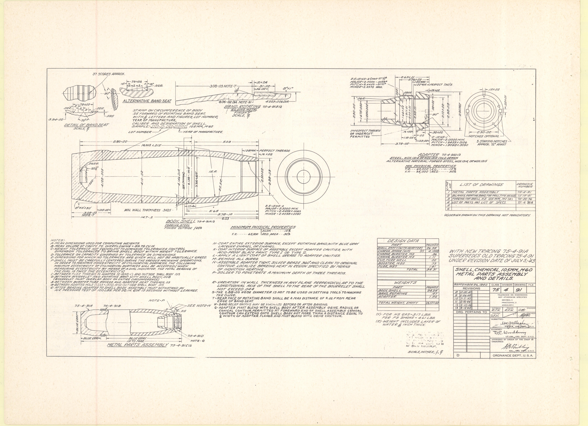
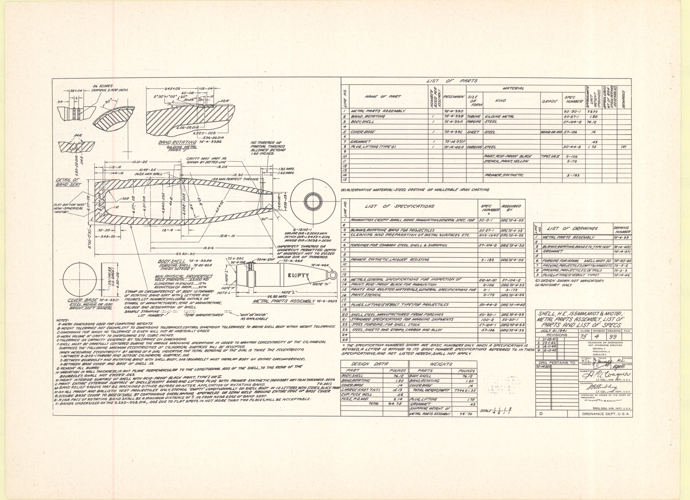
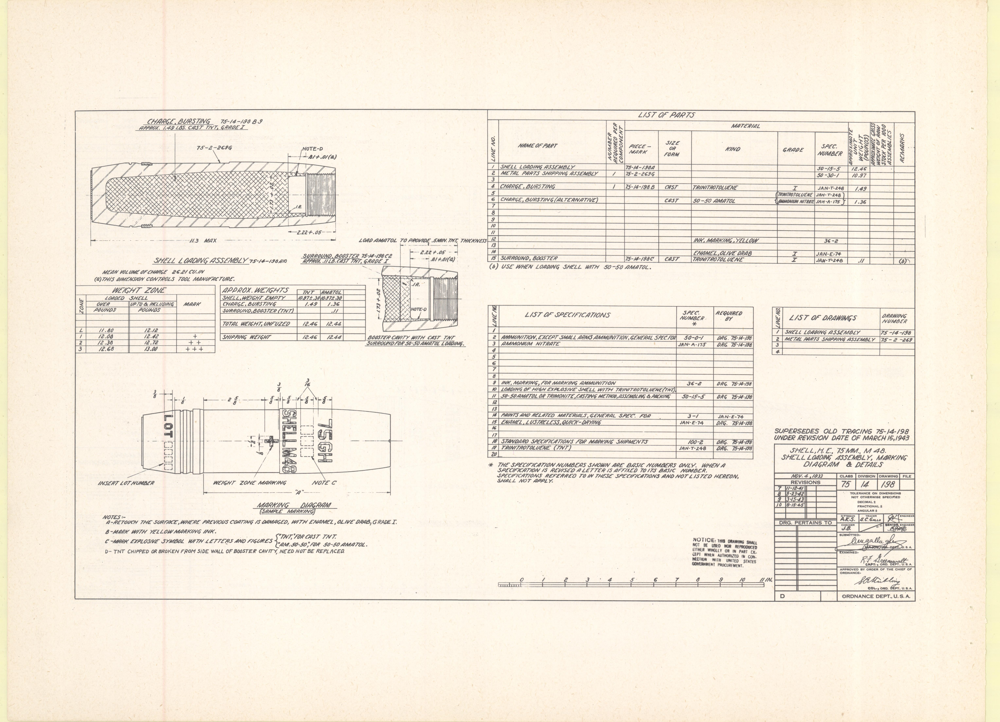
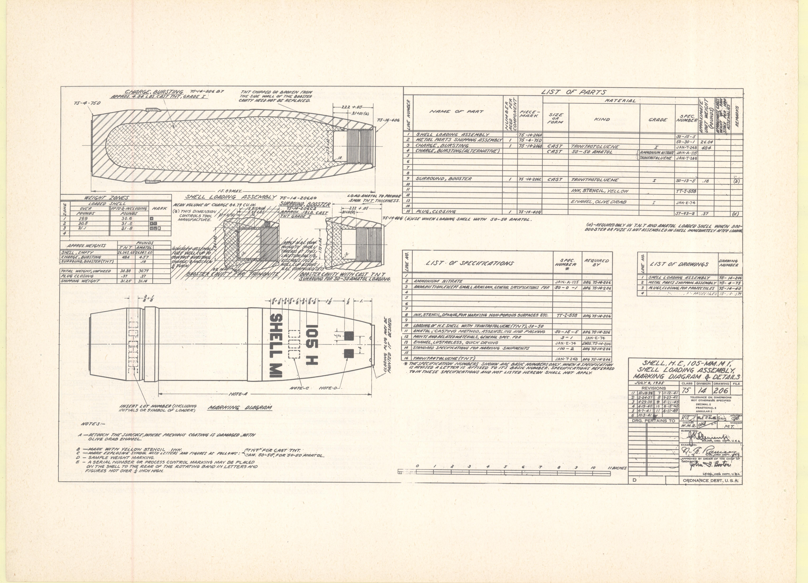
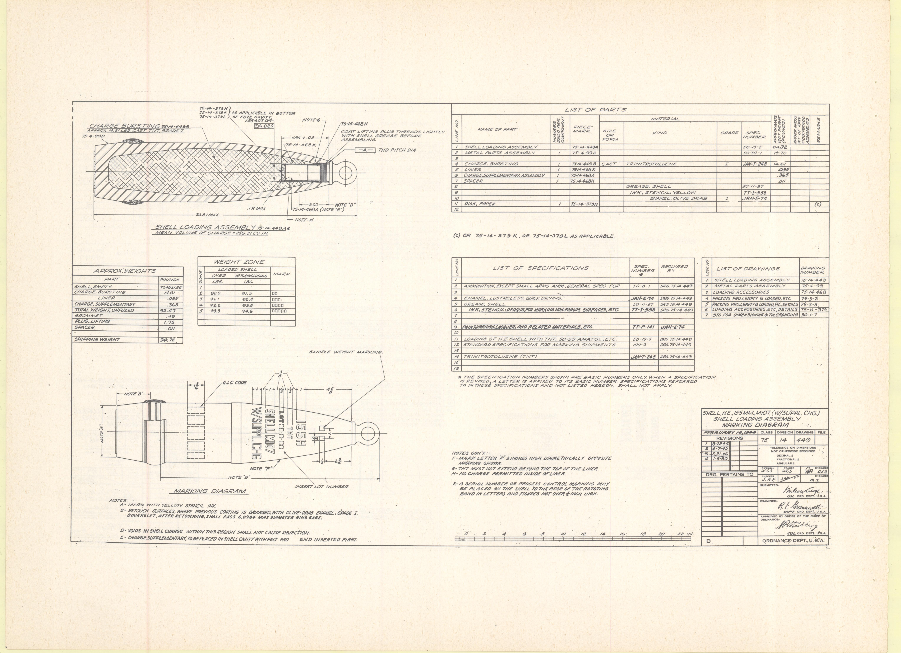

> **UNRELIABLE -- DO NOT CITE.** This is the raw output of the automated
> `--analyze-formulas` vision pass (Google Gemma free tier, this project's
> default `vision_provider`). Every numeric table in this file was checked
> against the primary source pages and found wrong -- wrong drawing numbers,
> swapped/mislabeled rows, wrong digits, and on page 53 an entirely
> fabricated table structure. Retained only as a record of the extraction
> failure mode. All correct data lives in `card.md` and `tables/*.csv`,
> independently re-transcribed from page rasters and verified by
> `checks/verify-weight-table-closures.py`.

DETAIL OF BAND SEAT
SCALE $\frac{1}{2}$

ALTERNATIVE BAND SEAT

STAMP ON CIRCUMFERENCE OF BODY 2.5" FORWARD OF ROTATING BAND SEAT WITH LETTERS AND FIGURES LOT NUMBER, YEAR OF MANUFACTURE
TOLERANCE ON CONCENTRATION OF SHELL
SAMPLE: $75\text{-}4\text{-}9$ / LOT NUMBER, $1943$ YEAR OF MANUFACTURE
LOT NUMBER: -

BAND, ROTATING $75\text{-}4\text{-}7$
SCALE $\frac{2}{1}$

BODY SHELL $75\text{-}4\text{-}8$
DRAWING OUTER DIAMETER $.4325$

ADAPTER $75\text{-}4\text{-}6$
STEEL HIGH ALLOY LOW CARBON FORGED STEEL HIGH ALLOY LOW CARBON
ALTERNATIVE MATERIAL FORGED STEEL HIGH ALLOY LOW CARBON

- PHYSICAL PROPERTIES
    L.S. $84,000$ PSI

| LIST OF DRAWINGS |                                |                        |
| :--------------- | :----------------------------- | :--------------------- |
| ITEM             | METAL PARTS ASSEMBLY           | DRAWING NUMBER         |
| 1                | METAL PARTS ASSEMBLY           | $75\text{-}4\text{-}9$ |
| 2                | BODY SHELL, M60 TYPE M60 STEEL | $75\text{-}4\text{-}8$ |
| 3                | BAND, ROTATING, M60 STEEL      | $75\text{-}4\text{-}7$ |
| 4                | ADAPTER, M60 STEEL             | $75\text{-}4\text{-}6$ |

NOTES:
A - MEAN DIMENSIONS USED FOR COMPUTING WEIGHTS.
B - USE ONE OF CRITERIA IN OVERLOADING - $8.78$ TO $9.1$ IN.
C - DIFFERENCE TO BE CHECKED AGAINST DIAMETER TOLERANCE CONTROL.
D - TOLERANCE TO BE DETERMINED BY SUM OF TOLERANCES TO EACH TOLERANCE.
E - TOLERANCE ON CAPACITY CONVEYED BY TOLERANCE ON DIMENSIONS.
F - SHELL MUST BE CAREFULLY CENTERED DURING THE MACHINE OPERATIONS IN ORDER TO MAINTAIN CONCENTRICITY OF CYLINDRICAL SURFACES. THE FOLLOWING CONCENTRICITY SHALL BE MAINTAINED:
1 - BETWEEN FUSE THREAD AND ADAPTER (DIE-ONE) AND OUTER SHELL BODY $\le \frac{1}{1000}$"
2 - BETWEEN OUTER SHELL BODY AND ROTATING BAND SEAT $\le \frac{1}{1000}$"
3 - BETWEEN ADAPTER HOLE AND BODY SHELL AND OUTER SHELL BODY $\le \frac{1}{1000}$"
4 - BETWEEN ADAPTER HOLE AND BODY SHELL AND OUTER SHELL BODY $\le \frac{1}{1000}$"

- MEASURING CONCENTRICITY BY MEANS OF A DIAL INDICATOR, THE TOTAL READING OF $\le \frac{1}{1000}$"
- ALL PRESSURE TEST OF INSIDE HER $50$ PSI IN $5$ SECONDS WITHOUT LEAKAGE.
    G - COAT ENTIRE EXTERIOR SURFACE, EXCEPT ROTATING BAND, WITH BLUE GRAY EPOXY PAINT, DRY.
    H - COAT INTERIOR SURFACE OF ASSEMBLY EXCEPT ADAPTER CAVITIES WITH LIGHT COAT OF SHELL WAX.
    I - APPLY A LIGHT COAT OF SHELL WAX TO ADAPTER CAVITIES.
    J - REMOVE ALL BURRS.
    K - SOLDER STEEL BEZEL TIGHT, SLIDE BEZEL BOTH AND CLEAR TO ORIGINAL CONTOUR LOCALIZE BEARING HEAT IN REGION SPECIFIED BY MARKS OF INDUCTION HEATING.
    L - SOLDER TO PENETRATE MINIMUM A DEPTH OF THREE THREADS.
    M - VARIATION IN WALL THICKNESS IN ANY PLANE PERPENDICULAR TO THE LONGITUDINAL AXIS OF THE SHELL TO THE REAR OF THE BOURRELET SHELL SHALL NOT EXCEED $\frac{1}{100}$"
    N - THE EFFECTIVE DIAMETER $13.15$ MAY BE USED IN SETTING TOOLS TOWARDS THE CURVE.
    O - THE WIDTH OF ROTATING BAND SHELL BE A MAX DISTANCE OF $0.01$ FROM REAR EDGE OF BAND SEAT.
    P - BAND SEAT GUIDE MAY BE SMOOTHED BEFORE OR AFTER BANDING.
    Q - CONICAL CONTOUR PERMITTED AT FORWARD END OF SHELL ASSEMBLY EQUAL TO $2$ WIDTH OF ADAPTER FLANGE AND MUST BLEND WITH DRIVE CONTOUR.
    R - WIDTH OF ADAPTER FLANGE AND MUST BLEND WITH DRIVE CONTOUR.

| DESIGN DATA          |                        |
| :------------------- | :--------------------- |
| PART                 | -                      |
| BODY SHELL           | $75\text{-}4\text{-}8$ |
| ROTATING BAND        | $75\text{-}4\text{-}7$ |
| ADAPTER              | $75\text{-}4\text{-}6$ |
| METAL PARTS ASSEMBLY | $75\text{-}4\text{-}9$ |
| **WEIGHTS**          |                        |
| -                    | -                      |
| BODY SHELL           | $34.24$                |
| ROTATING BAND        | $0.31$                 |
| ADAPTER              | $0.12$                 |
| TOTAL WEIGHT, SHIP   | $34.67$                |

(V) FOR HE CAS-317 LBD
(W) FOR 78 SHOCK - $441$ LBD
(X) WEIGHT INCLUDES LAYER OF WATER $1$ INCH THICK

WITH NEW TRACING $75\text{-}4\text{-}91\text{A}$
SUPERSEDES OLD TRACING $75\text{-}4\text{-}91$
UNDER REVISION DATE OF JULY $5\text{-}43$

SHELL, CHEMICAL, $105\text{MM}, M60$
METAL PARTS ASSEMBLY
AND DETAILS.

| REVISIONS |      |     |      |
| :-------- | :--- | :-- | :--- |
| -         | $75$ | $4$ | $91$ |
| -         | -    | -   | -    |
| -         | -    | -   | -    |
| -         | -    | -   | -    |
| -         | -    | -   | -    |
| -         | -    | -   | -    |
| -         | -    | -   | -    |
| -         | -    | -   | -    |
| -         | -    | -   | -    |
| -         | -    | -   | -    |

METAL PARTS ASSEMBLY $75\text{-}4\text{-}9$ M60

SCALE INCHES, $1:1$
ORDNANCE DEPT. U.S.A.

|     | NAME OF PART         | PIECE-MARK | MATERIAL (SIZE OR FORM) | MATERIAL (KIND)           | MATERIAL (GRADE) | SPEC NUMBER    | REQUIRED (QTY) |
| --- | -------------------- | ---------- | ----------------------- | ------------------------- | ---------------- | -------------- | -------------- |
| 1   | METAL PARTS ASSEMBLY | 75-4-BIC   | -                       | -                         | -                | 50-30-1        | 1              |
| 2   | -                    | -          | -                       | -                         | -                | -              | -              |
| 3   | ADAPTER              | 75-4-B10   | BAR                     | STEEL, COLD DRAWN         | -                | 27-107         | 100 (C)        |
| 4   | -                    | -          | -                       | -                         | -                | -              | -              |
| 5   | BAND, ROTATING       | 75-4-B12   | TURBINE WELDING METAL   | -                         | -                | 50-30-1        | 1              |
| 6   | BODY, SHELL          | 75-4-B18   | TURBINE STEEL           | -                         | -                | 57-104-2 24 50 | 1              |
| 7   | -                    | -          | -                       | -                         | -                | -              | -              |
| 8   | -                    | -          | -                       | -                         | -                | -              | -              |
| 9   | -                    | -          | -                       | -                         | -                | -              | -              |
| 10  | BORE, DIE            | -          | 75-4-B17 800            | STEEL                     | -                | COMMERCIAL     | 1              |
| 11  | -                    | -          | -                       | -                         | -                | -              | -              |
| 12  | -                    | -          | -                       | -                         | -                | -              | -              |
| 13  | -                    | -          | -                       | GREASE, SHELL             | -                | 50-11-37       | -              |
| 14  | -                    | -          | -                       | LACQUER ENAMEL, BLUE GREY | -                | 50-11-37       | -              |
| 15  | -                    | -          | -                       | PAINT, ACID-PROOF BLACK   | -                | TYPE I 3-106   | -              |
| 16  | -                    | -          | -                       | -                         | -                | -              | -              |
| 17  | -                    | -          | -                       | -                         | -                | -              | -              |
| 18  | -                    | -          | -                       | WIRE SOLDER, SILVER       | -                | -              | -              |
| 19  | -                    | -          | -                       | FLUX, BRAZING (SILVER)    | -                | -              | -              |
| 20  | -                    | -          | -                       | -                         | -                | 90-1-261       | 24             |

(A)-ALTERNATIVE MATERIAL: FORGED STEEL, W6104 OR NO SIZED SPEC 57-108
(B)-ALTERNATIVE MATERIAL: ENAMEL, BLUE-GREY GRADE 2, SPEC JAN-E74
(C)- WIRE SIZE: .051-.154 & .061 +/- .001 TOL

|     | LIST OF SPECIFICATIONS                                    | SPEC NUMBER | REQUIRED BY    |
| --- | --------------------------------------------------------- | ----------- | -------------- |
| 1   | AMMUNITION, EXCEPT SMALL ARMS AMMUNITION GENERAL SPEC FOR | 50-30-1     | 20, 21, 23, 40 |
| 2   | BLANK, ROTATING BAND, FOR PROJECTILES                     | 50-27-1     | 200 10-4-B1    |
| 3   | CLEANING AND PREPARATION OF METAL SURFACES, ETC           | 432 124 242 | 18, 24, 25, 41 |
| 4   | -                                                         | -           | -              |
| 5   | ENAMEL, LUSTRELESS QUICK-DRYING                           | 50-11-74    | -              |
| 6   | -                                                         | -           | -              |
| 7   | POWDERED, FOR COMMON STEEL SHELL AND SHRAPNEL             | 57-104-2    | 200 10-4-B1    |
| 8   | FORMER, LIGHT GUN AND MID, STEEL, CARBON AND ALLOY        | 57-103      | 200 10-4-B1    |
| 9   | FLUX, BRAZING (SILVER)                                    | 4-141       | 200 10-4-B1    |
| 10  | -                                                         | -           | -              |
| 11  | GREASE, SHELL                                             | 50-11-37    | 200 10-4-B1    |
| 12  | -                                                         | -           | -              |
| 13  | LACQUER ENAMEL, LUSTRELESS                                | JAN-L-115   | -              |
| 14  | METALS, GENERAL SPECIFICATION FOR INSPECTION OF           | 20-14-157   | 57-107         |
| 15  | AMINE ACID-PROOF BLACK                                    | 3-106       | 57-107         |
| 16  | SHAFTS AND RELATED MATERIALS, GENERAL SPEC FOR            | 3-3         | JAN-L-115      |
| 17  | -                                                         | -           | -              |
| 18  | -                                                         | -           | -              |
| 19  | STEEL, FORGING, FOR SHELL STOCK                           | 57-104-1    | 200 10-4-B1    |
| 20  | SHELL, STEEL MANUFACTURED FROM FORGINGS                   | 50-30-1     | 200 10-4-B1    |
| 21  | STEEL, CARBON AND ALLOY BARS                              | 57-107      | 200 10-4-B1    |
| 22  | -                                                         | -           | -              |
| 23  | SOLDER, SILVER                                            | 90-1-261    | 200 10-4-B1    |
| 24  | SHIPMENT, MARKING STORAGE SPECIFICATIONS PER              | 100-2       | 50-30-1        |

- THE SPECIFICATION NUMBERS SHOWN ARE BASIC NUMBERS ONLY.
    WHEN A SPECIFICATION IS REVISED A LETTER IS AFFIXED TO ITS BASIC NUMBER.
    SPECIFICATIONS REFERRED TO IN THESE SPECIFICATIONS AND NOT LISTED HEREON, SHALL NOT VARY.
    (D) COLOR CARD SUPPLEMENT ONLY MANDATORY.

WITH NEW TRACING 75-4-91
SUPERSEDES OLD TRACING 75-4-91
UNDER REVISION DATE OF JULY 5-43

SHELL, CHEMICAL, 105MM, M60
LIST OF PARTS AND
LIST OF SPECIFICATIONS

|                  |                      |
| ---------------- | -------------------- |
| FILE NO          | 75 4 91A             |
| REVISIONS        | -                    |
|                  | -                    |
|                  | -                    |
|                  | -                    |
|                  | -                    |
|                  | -                    |
|                  | -                    |
|                  | -                    |
|                  | -                    |
|                  | -                    |
|                  | -                    |
|                  | -                    |
| DRG PERTAINS TO: | ?                    |
|                  | ?                    |
|                  | ?                    |
|                  | ORDNANCE DEPT U.S.A. |

### LIST OF PARTS

| NO. | NAME OF PART           | MATERIAL: DRAWING NO. | MATERIAL: SIZE OR FORM | MATERIAL: KIND                | MATERIAL: GRADE | MATERIAL: SPEC NUMBER | MATERIAL: SIZE OR WEIGHT | QTY PER ASSY |
| :-- | :--------------------- | :-------------------- | :--------------------- | :---------------------------- | :-------------- | :-------------------- | :----------------------- | :----------- |
| 1   | METAL PARTS ASSEMBLY   | -                     | -                      | -                             | -               | -                     | -                        | 1            |
| 2   | BAND, ROTATING         | 10-4-330              | TORUS                  | CHROME STEEL                  | -               | 50-30-1               | 1.85                     | 1            |
| 3   | BODY SHELL             | -                     | -                      | -                             | -               | 50-27-1               | 1.80                     | 1            |
| 4   | -                      | -                     | -                      | -                             | -               | 27-104-B              | 74.12                    | -            |
| 5   | COVER BASE             | 10-4-832              | CONE                   | STEEL STEEL                   | -               | -                     | -                        | 1            |
| 6   | -                      | -                     | -                      | -                             | -               | MIL-B-4520            | -                        | -            |
| 7   | CONNECTOR              | 10-4-339              | -                      | -                             | -               | -                     | .49                      | 1            |
| 8   | POLE, LIFTING (TYPE G) | 10-4-143-C            | FORGING STEEL          | -                             | 50-44-B         | 1.38                  | 1                        |              |
| 9   | -                      | -                     | -                      | -                             | -               | -                     | -                        | -            |
| 10  | -                      | -                     | -                      | PAINT, ACID-PROOF BLACK BLACK | -               | 3-126                 | -                        | -            |
| 11  | -                      | -                     | -                      | STENCIL PAINT, YELLOW         | -               | 3-179                 | -                        | -            |
| 12  | -                      | -                     | -                      | -                             | -               | -                     | -                        | -            |
| 13  | -                      | -                     | -                      | PRIMER, SYNTHETIC             | -               | 3-183                 | -                        | -            |

### LIST OF SPECIFICATIONS

| No. | LIST OF SPECIFICATIONS                                         | SPEC NUMBER | REQUIRED / DRAWING NO. |
| :-- | :------------------------------------------------------------- | :---------- | :--------------------- |
| 1   | MANUFACTURE EXCEPT SMALL ARMS AMMUNITION GENERAL SPEC SPEC FOR | 30-1-0-1    | 10-4-330               |
| 2   | BAND ROTATING BAND FOR PROJECTILES                             | 50-27-1     | 10-4-330               |
| 3   | CLEANING AND PREPARATION OF METAL SURFACES ETC                 | MIL-S-1643  | 10-4-330               |
| 4   | FORGINGS FOR CHEMICAL STEEL SHELL & ASSEMBLY                   | 27-104-B    | 10-4-330               |
| 5   | -                                                              | -           | -                      |
| 6   | PRIMER, SYNTHETIC LACQUER REGISTER                             | 3-183       | 10-4-330               |
| 7   | -                                                              | -           | -                      |
| 8   | -                                                              | -           | -                      |
| 9   | METALS GENERAL SPECIFICATIONS FOR INSPECTION OF                | 00-14-10    | 27-104-B               |
| 10  | STENCIL PAINT, YELLOW                                          | 3-179       | 10-4-330               |
| 11  | PAINTS AND RELATED MATERIALS GENERAL SPECIFICATION FOR         | 00-17-3     | 10-4-330               |
| 12  | PAINT, ACID-PROOF BLACK                                        | 3-126       | 10-4-330               |
| 13  | -                                                              | -           | -                      |
| 14  | SHELL LIFTING (ROTATING TYPE) FOR PROJECTILES                  | -           | 10-4-143-C             |
| 15  | -                                                              | -           | -                      |
| 16  | SHELL STEEL SPECIFICATIONS FOR FORMING PROJECTILES             | 50-30-1     | 10-4-330               |
| 17  | STEEL STEEL SPECIFICATIONS FOR FORMING SEGMENTS                | 50-20-1     | 10-4-330               |
| 18  | STEEL POWDER, FOR SHELL STOCK                                  | 27-104-A    | 10-4-330               |
| 19  | STEEL SHEETS AND STRIPS, CARBON AND ALLOY                      | 47-130      | 10-4-330               |

### LIST OF DRAWINGS

| No. | LIST OF DRAWINGS                      | DRAWING NO. |
| :-- | :------------------------------------ | :---------- |
| 1   | METAL PARTS ASSEMBLY                  | 10-4-330    |
| 2   | BLANK ROTATING BAND, SIZE TO TYPE G   | 10-4-330    |
| 3   | -                                     | -           |
| 4   | FORGING FOR BODY SHELL, SHELL BODY    | 50-30-1     |
| 5   | ROTATING BAND, FOR PROJECTILES (M107) | 50-27-1     |
| 6   | ANCHORING PROJECTILES OF TYPE G       | 10-4-143-C  |
| 7   | POLE, LIFTING (ROTATING TYPE)         | 10-4-143-C  |
| 8   | COVER, BASE (SHOWN NOT MANUFACTORY)   | 10-4-832    |
| 9   | SECONDARY ONLY                        | -           |

### DESIGN DATA / WEIGHTS

| DESIGN DATA           | Value | WEIGHTS              | Value            |
| :-------------------- | :---- | :------------------- | :--------------- |
| METAL PARTS ASSEMBLY  | 76.12 | METAL PARTS ASSEMBLY | 76.12            |
| BODY SHELL            | 76.12 | BODY SHELL           | 76.12            |
| BAND ROTATING         | 1.85  | BAND ROTATING        | 1.85             |
| COVER BASE            | 1.80  | COVER BASE           | 1.80             |
| CONNECTOR             | .49   | CONNECTOR            | .49              |
| SAMPLE (CASET TINT T) | .173  | TOTAL WEIGHT EMPTY   | $77.46 \pm 1.23$ |
| CUP PLUG WELL         | .143  | METAL PARTS ASSEMBLY | 76.12            |
| POLE, RIGID           | .138  | TOTAL WEIGHT METAL   | 76.12            |
| POLE, PMA             | .114  | METAL PARTS ASSEMBLY | 76.12            |
| TOTAL                 | 80.12 | -                    | -                |

NOTES:
a. METER DIMENSIONS USED FOR COMPOSITE WEIGHTS
b. WEIGHT TOLERANCES ARE EQUAL TO CUMULATIVE TOLERANCES. CONTROL DIMENSION TOLERANCES TO BODY SHELL BODY WITHIN WEIGHT TOLERANCE
c. CONCENTRICITY THAT MUST BE MAINTAINED IS TO BE MEASURED BY ?
d. TOLERANCES ON CAPACITY GOVERNED BY TOLERANCES ON DIMENSIONS ?
e. SHELL BODY MUST BE MACHINED ?
f. RUNOUT OF BODY SHELL ?
g. VARIATION IN WALL THICKNESS ?
h. PAINT ?
i. PAINT ?
j. BAND RELIEF ?
k. FILL PLUG ?
l. SECURE BASE COVER ?
m. FOUR LINE PIECE ?
n. BANDS UNCONSCRIBED ON THE ?

| SHELL, H.E. 155MM, M107 & M107M1, METAL PARTS ASSEMBLY, LIST OF PARTS AND LIST OF SPECS | REVISIONS: 25, 4, 99 |
| :-------------------------------------------------------------------------------------- | :------------------- |
| -                                                                                       | -                    |
| ORDNANCE DEPT. U.S.A.                                                                   | -                    |

## LIST OF PARTS

| LINE NUMBER | NAME OF PART             | NUMBER PER COMPONENT | PIECE MARK | MATERIAL: SIZE DS FOAM     | MATERIAL: KIND                               | MATERIAL: GRADE  | MATERIAL: SPEC NUMBER | APPROX WEIGHT | STOCK NUMBER | REMARKS                                                                       |
| :---------- | :----------------------- | :------------------- | :--------- | :------------------------- | :------------------------------------------- | :--------------- | :-------------------- | :------------ | :----------- | :---------------------------------------------------------------------------- |
| 1           | METAL PARTS ASSEMBLY     | -                    | 75-4-1067  | -                          | -                                            | -                | -                     | -             | -            | (a) ALTERNATIVE MATERIAL- STEEL FORGING, WD 10118 15 WEBSTE SPEC. 27-104      |
| 2           | DRIVE AND UNION ASSEMBLY | -                    | 75-4-1074  | -                          | -                                            | -                | -                     | -             | -            | -                                                                             |
| 3           | -                        | -                    | -          | -                          | -                                            | -                | -                     | -             | -            | -                                                                             |
| 4           | -                        | -                    | -          | -                          | -                                            | -                | -                     | -             | -            | -                                                                             |
| 5           | -                        | -                    | -          | -                          | -                                            | -                | -                     | -             | -            | -                                                                             |
| 6           | BAND, ROTATING           | 1                    | 75-4-1083  | TUBING                     | GILDING METAL                                | ANNEALED WD 55-3 | 30-21-1               | 4Y            | -            | (b) SPECIFICATION 27-84-14 IS ALLOWABLE FOR MATERIAL FOR FORGING              |
| 7           | BODY, SHELL              | 1                    | 75-4-1084  | -                          | STEEL                                        | -                | 27-104-1              | -             | -            | -                                                                             |
| 8           | -                        | -                    | -          | -                          | -                                            | -                | -                     | -             | -            | -                                                                             |
| 9           | -                        | -                    | -          | -                          | -                                            | -                | -                     | -             | -            | -                                                                             |
| 10          | -                        | -                    | -          | -                          | -                                            | -                | -                     | -             | -            | -                                                                             |
| 11          | -                        | -                    | -          | -                          | -                                            | -                | -                     | -             | -            | -                                                                             |
| 12          | ZONE                     | 1                    | 75-6-617L  | SHEET                      | COPPER                                       | SOFT             | G-0-C-8 MTRANE        | -             | -            | (c) ALTERNATIVE MATERIAL- SHEET STEEL, HOT ROLLED, COLD DRAWN, WD SPEC RT-116 |
| 13          | -                        | -                    | -          | -                          | -                                            | -                | -                     | -             | -            | -                                                                             |
| 14          | DRIVE                    | 1                    | 75-4-617C  | SHEET                      | STEEL, COLD ROLLED, ANNEALED, WD 100 68 1018 | -                | 27-158                | -             | -            | (d) ALTERNATIVE MATERIAL- ENAMEL OLIVE DRAB, GRADE I, SPEC JAN-1-14.          |
| 15          | -                        | -                    | -          | -                          | -                                            | -                | -                     | -             | -            | -                                                                             |
| 16          | -                        | -                    | -          | -                          | -                                            | -                | -                     | -             | -            | -                                                                             |
| 17          | -                        | -                    | -          | -                          | -                                            | -                | -                     | -             | -            | -                                                                             |
| 18          | -                        | -                    | -          | -                          | -                                            | -                | -                     | -             | -            | -                                                                             |
| 19          | -                        | -                    | -          | -                          | -                                            | -                | -                     | -             | -            | -                                                                             |
| 20          | -                        | -                    | -          | -                          | -                                            | -                | -                     | -             | -            | -                                                                             |
| 21          | -                        | -                    | -          | -                          | -                                            | -                | -                     | -             | -            | -                                                                             |
| 22          | -                        | -                    | -          | -                          | -                                            | -                | -                     | -             | -            | -                                                                             |
| 23          | SCREWS, SET              | 3                    | 75-4-1065  | BAR                        | STEEL, INDIA (SEM-C + Mn)                    | COMMERCIAL       | -                     | -             | -            | (e) ALTERNATIVE MATERIAL- COPPER BRAZE (COMMERCIAL)                           |
| 24          | -                        | -                    | -          | -                          | -                                            | -                | -                     | -             | -            | -                                                                             |
| 25          | UNION, DRIVE             | 1                    | 75-4-107F  | TUBING                     | STEEL                                        | WD 1018          | 27-180                | -             | -            | (f) PROTECTIVE FINISH, SPEC 27-8-1 (R) TYPE I CLASS A OR TS                   |
| 26          | -                        | -                    | -          | -                          | -                                            | -                | -                     | -             | -            | -                                                                             |
| 27          | -                        | -                    | -          | -                          | -                                            | -                | -                     | -             | -            | -                                                                             |
| 28          | -                        | -                    | -          | -                          | -                                            | -                | -                     | -             | -            | -                                                                             |
| 29          | -                        | -                    | -          | -                          | -                                            | -                | -                     | -             | -            | -                                                                             |
| 30          | -                        | -                    | -          | -                          | -                                            | -                | -                     | -             | -            | -                                                                             |
| 31          | -                        | -                    | -          | -                          | -                                            | -                | -                     | -             | -            | -                                                                             |
| 32          | -                        | -                    | -          | -                          | -                                            | -                | -                     | -             | -            | -                                                                             |
| 33          | -                        | -                    | -          | -                          | -                                            | -                | -                     | -             | -            | -                                                                             |
| 34          | -                        | -                    | -          | LACQUER ENAMEL, OLIVE DRAB | -                                            | -                | JAN-1-12              | -             | -            | (g)                                                                           |
| 35          | -                        | -                    | -          | -                          | -                                            | -                | -                     | -             | -            | -                                                                             |
| 36          | -                        | -                    | -          | PAINT, ACID-PROOF BLACK    | TYPE I & II                                  | -                | JAN-1-400             | -             | -            | -                                                                             |
| 37          | -                        | -                    | -          | BINDING, SYNTHETIC RUBBER  | TYPE II                                      | -                | 41-4                  | -             | -            | -                                                                             |
| 38          | -                        | -                    | -          | SYNTHETIC POWDER           | -                                            | -                | WD 34                 | -             | -            | -                                                                             |
| 39          | -                        | -                    | -          | -                          | -                                            | -                | -                     | -             | -            | -                                                                             |
| 40          | -                        | -                    | -          | SOLDER, SILVER WIRE        | CL-054                                       | -                | 80-5-C                | -             | -            | -                                                                             |
| 41          | -                        | -                    | -          | -                          | -                                            | -                | -                     | -             | -            | -                                                                             |
| 42          | -                        | -                    | -          | PLUG, BRAZING (SILVER)     | -                                            | -                | 4-1-10                | -             | -            | -                                                                             |
| 43          | -                        | -                    | -          | CEMENT, FETTMAN            | -                                            | -                | JAN-1-C               | -             | -            | -                                                                             |
| 44          | -                        | -                    | -          | -                          | -                                            | -                | -                     | -             | -            | -                                                                             |
| 45          | -                        | -                    | -          | -                          | -                                            | -                | -                     | -             | -            | -                                                                             |
| 46          | -                        | -                    | -          | -                          | -                                            | -                | -                     | -             | -            | -                                                                             |
| 47          | -                        | -                    | -          | -                          | -                                            | -                | -                     | -             | -            | -                                                                             |
| 48          | -                        | -                    | -          | -                          | -                                            | -                | -                     | -             | -            | -                                                                             |
| 49          | -                        | -                    | -          | -                          | -                                            | -                | -                     | -             | -            | -                                                                             |
| 50          | -                        | -                    | -          | -                          | -                                            | -                | -                     | -             | -            | -                                                                             |
| 51          | -                        | -                    | -          | -                          | -                                            | -                | -                     | -             | -            | -                                                                             |
| 52          | -                        | -                    | -          | -                          | -                                            | -                | -                     | -             | -            | -                                                                             |
| 53          | -                        | -                    | -          | -                          | -                                            | -                | -                     | -             | -            | -                                                                             |
| 54          | -                        | -                    | -          | -                          | -                                            | -                | -                     | -             | -            | -                                                                             |
| 55          | -                        | -                    | -          | -                          | -                                            | -                | -                     | -             | -            | -                                                                             |
| 56          | -                        | -                    | -          | -                          | -                                            | -                | -                     | -             | -            | -                                                                             |
| 57          | -                        | -                    | -          | -                          | -                                            | -                | -                     | -             | -            | -                                                                             |
| 58          | -                        | -                    | -          | -                          | -                                            | -                | -                     | -             | -            | -                                                                             |
| 59          | -                        | -                    | -          | -                          | -                                            | -                | -                     | -             | -            | -                                                                             |
| 60          | -                        | -                    | -          | -                          | -                                            | -                | -                     | -             | -            | -                                                                             |
| 61          | -                        | -                    | -          | -                          | -                                            | -                | -                     | -             | -            | -                                                                             |
| 62          | -                        | -                    | -          | -                          | -                                            | -                | -                     | -             | -            | -                                                                             |
| 63          | -                        | -                    | -          | -                          | -                                            | -                | -                     | -             | -            | -                                                                             |
| 64          | -                        | -                    | -          | -                          | -                                            | -                | -                     | -             | -            | -                                                                             |
| 65          | -                        | -                    | -          | -                          | -                                            | -                | -                     | -             | -            | -                                                                             |
| 66          | -                        | -                    | -          | -                          | -                                            | -                | -                     | -             | -            | -                                                                             |
| 67          | -                        | -                    | -          | -                          | -                                            | -                | -                     | -             | -            | -                                                                             |

## LIST OF SPECIFICATIONS

| LINE NUMBER | DESCRIPTION                                                                | SPECIFICATION NUMBER | REQUIRED BY  |
| :---------- | :------------------------------------------------------------------------- | :------------------- | :----------- |
| 1           | ADHESIVE, SYNTHETIC RUBBER (HOT OR COLD BONDING)                           | 41-4                 | DRG 50-4-108 |
| 2           | AMMUNITION, EXCEPT SMALL ARMS AMMUNITION, GENERAL SPECIFICATIONS FOR       | 27-10-4-A-109        | DRG 70-4-109 |
| 3           | -                                                                          | -                    | -            |
| 4           | COPPER, BARE, PLATED, COLD DRAWN, SHEETS, STRIPS AND STRUTS                | WD-C-201             | DRG 70-4-107 |
| 5           | BLANKS, ROTATING BAND, FOR PROJECTILES                                     | WD 55-3              | DRG 70-4-108 |
| 6           | BRASS, SEMI-FINISHED, FOR MUNITIONS AND RELATED SERVICES, FOR PROJECTILES  | JAN-1-450            | DRG 70-4-108 |
| 7           | CEMENT, FETTMAN                                                            | JAN-1-C              | DRG 70-4-107 |
| 8           | ENAMEL, LUSTRELESS, QUICK-DRYING                                           | 57-134-2             | DRG 70-4-107 |
| 9           | FORGINGS, FOR COMMON STEEL SHELL AND SUB-SHELL                             | 27-104-1             | DRG 70-4-108 |
| 10          | FORGINGS, LIGHT, DROP AND HAMMER, ANNEALED STEEL, CARBON AND ALLOY         | 27-180               | DRG 70-4-107 |
| 11          | -                                                                          | -                    | -            |
| 12          | -                                                                          | -                    | -            |
| 13          | FORGINGS, PROTECTIVE, FOR IRON AND STEEL PARTS                             | 27-0-2               | DRG 70-4-108 |
| 14          | -                                                                          | -                    | -            |
| 15          | -                                                                          | -                    | -            |
| 16          | -                                                                          | -                    | -            |
| 17          | -                                                                          | -                    | -            |
| 18          | -                                                                          | -                    | -            |
| 19          | LACQUER, ENAMEL, LUSTRELESS                                                | 27-158               | DRG 70-4-108 |
| 20          | -                                                                          | -                    | -            |
| 21          | -                                                                          | -                    | -            |
| 22          | -                                                                          | -                    | -            |
| 23          | METALS, GENERAL SPECIFICATIONS FOR INSPECTION OF                           | 50-4-110             | 57-158       |
| 24          | -                                                                          | -                    | -            |
| 25          | PAINT, ACID-PROOF BLACK, FOR AMMUNITION                                    | JAN-1-400            | DRG 70-4-108 |
| 26          | PRIMER, SYNTHETIC, LACQUER, RESISTIVE                                      | JAN-P-12             | DRG 70-4-107 |
| 27          | PAINTS AND RELATED MATERIALS, GENERAL SPECIFICATIONS FOR                   | 3-1                  | JAN-1-15     |
| 28          | -                                                                          | -                    | -            |
| 29          | -                                                                          | -                    | -            |
| 30          | SHELL, HE, AT, 105MM, MET, METAL PARTS FOR                                 | 75-4-1067            | DRG 70-4-108 |
| 31          | SHELL, STEEL, MANUFACTURED FROM FORGINGS                                   | 27-104-1             | DRG 70-4-108 |
| 32          | -                                                                          | -                    | -            |
| 33          | STEEL, FORGINGS FOR SHELL STOCK                                            | 27-104-1             | DRG 70-4-108 |
| 34          | STEELS, CARBON AND ALLOY, SHEETS AND STRIPS                                | 27-104-1             | DRG 70-4-107 |
| 35          | SHIPMENTS, MIXING, STANDARD SPECIFICATIONS FOR                             | 100-2                | FED-948      |
| 36          | -                                                                          | -                    | -            |
| 37          | TUBING, SEAMLESS OR STRAIGHT STEEL, CARBON & ALLOY, SEAMLESS, MIDDLE-DRAWN | 27-180               | DRG 70-4-107 |
| 38          | SOLDER, SILVER                                                             | 80-5-C               | DRG 70-4-107 |
| 39          | PLUG, BRAZING (SILVER)                                                     | 4-1-10               | DRG 70-4-107 |
| 40          | -                                                                          | -                    | -            |
| 41          | -                                                                          | -                    | -            |
| 42          | -                                                                          | -                    | -            |
| 43          | -                                                                          | -                    | -            |
| 44          | -                                                                          | -                    | -            |
| 45          | -                                                                          | -                    | -            |

- THE SPECIFICATION NUMBERS SHOWN ARE BASIC NUMBERS ONLY. WHEN A SPECIFICATION IS REVISED A LETTER IS AFFIXED TO ITS BASIC NUMBER. SPECIFICATIONS REFERRED TO IN THESE SPECIFICATIONS AND NOT LISTED HEREIN, SHALL NOT APPLY.

______________________________________________________________________

SHELL, HE, AT, 105MM, M67
LIST OF PARTS AND
LIST OF SPECIFICATIONS
REV. ? - ? - ? - ?
TOLERANCES UNLESS OTHERWISE SPECIFIED: ?
FILE NO. 75 4 106A
?
?
?
S-?
?
?
?
?
?
?
S-?
DRG PERTAINS TO:
?
?
S-?
ORDNANCE OFFICE, WAR DEPT

`CHARGE, BURSTING 75-14-198 B-9`
`S-148 (A3 CAST OUT, GRADE I)`

`75-2-2686`
`NOTE-D`
`1.13 MAX`
$-2.22+0.00$

`SHELL LOADING ASSEMBLY 75-14-198`
`MEAN VOLUME OF CHARGE: 111.2 CM3`
`OTHERS BY DESIGN CONTROLS THRU MANUFACTURER`

| WEIGHT ZONE  |        |      |
| :----------- | :----- | :--- |
| LOADED SHELL | B-9    | MARK |
| POUNDS       | POUNDS | -    |
| 11.80        | 12.10  | -    |
| 12.00        | 12.40  | ++   |
| 12.20        | 12.70  | +++  |
| 12.40        | 13.00  | ++++ |

| APPROX WEIGHTS         | TNT (MATERIAL) | AMATOL |
| :--------------------- | :------------- | :----- |
| SHELL, EMPTY SHELL     | 1.49           | 1.49   |
| CHARGING BOOSTER (TNT) | 1.36           | 1.36   |
| TOTAL WEIGHT, UNFIZED  | 12.46          | 12.44  |
| SHIPPING WEIGHT        | 12.46          | 12.44  |

`LOAD AMATOL TO PROVIDE 2MM TNT THICKNESS`
$-2.22+0.00$
`NOTE-G`
`BOOSTER CAVITY WITH CAST TNT`
`SURROUNDING BOOSTER 75-14-198 B-1`
`S-148 (A3 CAST OUT, GRADE I)`
`SURROUNDING FOR 50-50 AMATOL LOADING`

`LOT`
`SHELL MARK`
`75SH`
`INSERT LOT NUMBER`
`WEIGHT ZONE MARKING`
`NOTE C`

### MARKING DIAGRAM

(SAMPLE MARKING)

`NOTES -`
`A- RETOUCH THE SURFACE, WHERE PREVIOUS COATING IS DAMAGED, WITH ENAMEL, OLIVE DRAB, GRADE I`
`B- MARK WITH YELLOW MARKING INK.`
`C- MARK EXPLOSIVE SYMBOL WITH LETTERS AND FIGURES`
`D- TNT CHIPPED OR BROKEN FROM SIDE WALL OF BOOSTER CAVITY NEED NOT BE REPLACED`

`TINT FOR CAST TNT`
`CAM 80-20, 50-50, OR 50-50 AMATOL`

### LIST OF PARTS

| LINE NO. | NAME OF PART                   | DRAWING NUMBER | PIECE-PER-PART | SIZE OR FORM | MATERIAL KIND        | MATERIAL GRADE | SPEC NUMBER | SPEC NUMBER | WEIGHT (LBS) |
| :------- | :----------------------------- | :------------- | :------------- | :----------- | :------------------- | :------------- | :---------- | :---------- | :----------- |
| 1        | SHELL LOADING ASSEMBLY         | 75-14-198      | -              | -            | -                    | -              | -           | -           | 12.45        |
| 2        | METAL PARTS SHIPPING ASSEMBLY  | 75-2-2686      | -              | -            | -                    | -              | -           | -           | 1.48         |
| 3        | CHARGE, BURSTING               | 75-14-198 B-9  | 1              | CAST         | TRINITROTOLUENE      | I              | JAN-T-148   | -           | 1.43         |
| 4        | CHARGE, BURSTING (ALTERNATIVE) | -              | 1              | CAST         | 50-50 AMATOL         | -              | JAN-T-149   | -           | 1.36         |
| -        | -                              | -              | -              | -            | -                    | -              | -           | -           | -            |
| -        | -                              | -              | -              | -            | INK, MARKING, YELLOW | -              | S-A-2       | -           | -            |
| -        | -                              | -              | -              | -            | CHANNEL, OLIVE DRAB  | I              | JAN-E-74    | -           | -            |
| 5        | SURROUND, BOOSTER              | 75-14-198 B-1  | 1              | CAST         | TRINITROTOLUENE      | I              | JAN-T-148   | -           | -            |

`(*) USE WHEN LOADING SHELL WITH 50-50 AMATOL.`

### LIST OF SPECIFICATIONS

| ITEM | SPECIFICATION                                                     | SPEC NUMBER | REQUIRED BY    |
| :--- | :---------------------------------------------------------------- | :---------- | :------------- |
| 1    | AMMUNITION, EXCEPT SMALL ARMS AMMUNITION, GENERAL SPEC FOR        | 50-0-1      | ORD 75-14-198  |
| 2    | AMMUNITION HIT-SITES                                              | -           | ORD DRC 14-198 |
| 3    | -                                                                 | -           | -              |
| 4    | COLOR, FOR MARKING AMMUNITION                                     | 36-8        | -              |
| 5    | LOADING OF HIGH EXPLOSIVE SHELL WITH TRINITROTOLUENE              | -           | ORD 75-14-198  |
| 6    | 50-50 AMATOL TRINITROTOLUENE CASTING METHOD, ASSEMBLING & MARKING | 50-11-2     | ORD 75-14-198  |
| 7    | AMATOL AND RELATED MATERIALS, GENERAL SPEC FOR                    | S-1         | ORD 50-11-2    |
| 8    | CHANNEL, LUSTRELESS, QUICK-DRYING                                 | JAN-E-74    | ORD 75-14-198  |
| 9    | -                                                                 | -           | -              |
| 10   | STANDARD SPECIFICATIONS FOR MARKING SHIPMENTS                     | -           | -              |

`* THE SPECIFICATION NUMBERS SHOWN ARE BASIC NUMBERS ONLY. WHEN A SPECIFICATION IS REVISED A LETTER IS AFFIXED TO ITS BASIC NUMBER. SPECIFICATIONS REFERRED TO IN THESE SPECIFICATIONS AND NOT LISTED HEREON SHALL NOT APPLY`

### LIST OF DRAWINGS

| ITEM | DRAWING NAME                  | DRAWING NUMBER |
| :--- | :---------------------------- | :------------- |
| 1    | SHELL LOADING ASSEMBLY        | 75-14-198      |
| 2    | METAL PARTS SHIPPING ASSEMBLY | 75-0-460       |
| 3    | -                             | -              |
| 4    | -                             | -              |

`SUPERSEDES OLD TRACING 75-14-198`
`UNDER REVISION DATE OF MARCH 16, 1943`

`SHELL, HE, 25 MM, M48`
`SHELL LOADING ASSEMBLY, MARKING DIAGRAM & DETAILS`

| REVISIONS             | 75 14 198 |
| :-------------------- | :-------- |
| DATE                  | -         |
| BY                    | -         |
| DESC                  | -         |
| ORG PORTIONS TO       | JS        |
| DRAWN BY              | -         |
| CHECKED BY            | -         |
| APPROVED BY           | -         |
| ORDNANCE DEPT, U.S.A. | -         |

CHARGE, BURSTING 75-14-200
TINT CHARGE OR BURSTING FROM THE SIDE WALL OF THE BOOSTER CAVITY NEED NOT BE REPLACED.

$.522 \pm .007$
$.314 \pm .005$
$75-14-406$

| WEIGHT ZONES |        |          |
| :----------- | :----- | :------- |
| ZONE         | WEIGHT | PRESSURE |
| PRIMER       | -      | -        |
| BOOSTER      | -      | -        |
| CHARGE       | -      | -        |
| SURROUND     | -      | -        |
| TOTAL        | -      | -        |

| APPROX WEIGHTS         | PRIMER | CHARGE |
| :--------------------- | :----- | :----- |
| SHELL, EMPTY           | -      | 46.1   |
| CHARGE, BURSTING       | -      | 4.27   |
| SURROUND, BURSTING     | -      | 1.46   |
| TOTAL WEIGHT, UNPRIMED | -      | 51.83  |
| PLUG, CLOSURE          | -      | 0.37   |
| OVERALL WEIGHT         | -      | 52.2   |

SHELL LOADING ASSEMBLY 75-14-20649

| LIST OF PARTS                    |          |                |               |              |                      |              |             |                      |
| :------------------------------- | :------- | :------------- | :------------ | :----------- | :------------------- | :----------- | :---------- | :------------------- |
| NAME OF PART                     | QUANTITY | DRAWING NUMBER | PIECE- ARRANG | SIZE OR FORM | MATERIAL KIND        | GRADE        | SPEC NUMBER | UNIT WEIGHT (POUNDS) |
| 1 SHELL LOADING ASSEMBLY         | 1        | 75-14-20649    | -             | -            | -                    | -            | -           | -                    |
| 2 METAL PARTS SHIPPING ASSEMBLY  | 1        | 75-14-310      | -             | -            | -                    | -            | -           | -                    |
| 3 CHARGE, BURSTING               | 1        | 75-14-200      | -             | CAST         | TNT/TNT-TOLUENE      | -            | -           | -                    |
| 4 CHARGE, BURSTING (ALTERNATIVE) | -        | 75-14-200      | -             | CAST         | AMATOL               | 52-30 AMATOL | -           | -                    |
| 5 -                              | -        | -              | -             | -            | -                    | -            | -           | -                    |
| 6 SURROUND, BOOSTER              | 1        | 75-14-500      | -             | CAST         | TNT/TNT-TOLUENE      | -            | -           | -                    |
| 7 -                              | -        | -              | -             | -            | -                    | -            | -           | -                    |
| 8 -                              | -        | -              | -             | -            | INK, STENCIL, YELLOW | -            | PT-I-3-308  | -                    |
| 9 -                              | -        | -              | -             | -            | ENAMEL, OLIVE DRAB   | -            | MIL-P-?     | -                    |
| 10 PLUG, CLOSURE                 | 1        | 75-14-400      | -             | -            | -                    | -            | 57-P-8-9    | -                    |

(a) REQUIRED ONLY IN TNT AND AMATOL LOADED SHELL WITH 24-SH-AMATOL BOOSTER OR FUSE IS NOT ASSEMBLED IN SHELL IMMEDIATELY AFTER LOADING.

| LIST OF SPECIFICATIONS                                          |             |             |
| :-------------------------------------------------------------- | :---------- | :---------- |
|                                                                 | SPEC NUMBER | REQUIRED BY |
| 1                                                               | -           | -           |
| 2                                                               | -           | -           |
| 3                                                               | -           | -           |
| 4 AMMUNITION ATTRIBUTE                                          | JAN-D-111-S | -           |
| 5 AMMUNITION, EXCEPT SHELL, LOADING, GENERAL SPECIFICATIONS FOR | MIL-S-8-C   | -           |
| 6                                                               | -           | -           |
| 7 INK, STENCIL, OPHTHALIC, FOR MARKING NONPOROUS SURFACES       | MIL-P-5-G   | 75-14-206   |
| 8 LOADING OF M1 SHELL WITH TNT/TOLUENE (T), 52-30               | 75-14-206   | -           |
| 9 AMATOL, CASTING METHODS, HANDLING AND PACKING                 | JAN-S-120   | -           |
| 10 CHARGE, BURSTING, OPHTHALIC, FOR M1 SHELL                    | JAN-S-114   | 75-14-200   |
| 11 CHARGE, BOOSTER, LESS, QUICK DRAWING                         | JAN-S-113   | 75-14-500   |
| 12 SPECIFICATION, OPHTHALIC (TNT)                               | JAN-S-112   | 75-14-200   |
| 13 SPECIFICATION, OPHTHALIC (AMATOL)                            | JAN-S-111   | 75-14-200   |

THE SPECIFICATION NUMBERS SHOWN ARE BASIC NUMBER ONLY. WHEN A SPECIFICATION IS MODIFIED A LETTER IS AFFIXED TO ITS BASIC NUMBER. SPECIFIC ITEMS REFERENCED FROM THESE SPECIFICATIONS AND NOT LISTED HEREBY SHALL NOT APPLY.

| LIST OF DRAWINGS                |                |
| :------------------------------ | :------------- |
|                                 | DRAWING NUMBER |
| 1 SHELL LOADING ASSEMBLY        | 75-14-20649    |
| 2 METAL PARTS SHIPPING ASSEMBLY | 75-14-310      |
| 3 CHARGE, BURSTING              | 75-14-200      |
| 4 SURROUND, BOOSTER             | 75-14-500      |
| 5 PLUG, CLOSURE                 | 75-14-400      |

MARKING DIAGRAM

NOTES:
A - RETOUCH THE JUNCTURE WHERE PREVIOUS COATING IS DAMAGED WITH OLIVE DRAB ENAMEL.
B - MARK WITH YELLOW STENCIL INK.
C - MARK EXPLAINING SYMBOL WITH LETTERS AND FIGURES AS FOLLOWS: "TYPE FOR CAST TNT" OR "52-30 AMATOL FOR 52-30 AMATOL.
D - ERASE ALL PREVIOUS MARKINGS.
E - A SERIAL NUMBER OR PROCESS CONTROL MARKING MAY BE PLACED ON THE SHELL TO THE REAR OF THE ROTATING BAND IN LETTERS AND FIGURES NOT OVER 1/8 INCH HIGH.

| SHELL, H.E., 105-MM, M1, SHELL LOADING ASSEMBLY, MARKING DIAGRAM & DETAILS |              |
| :------------------------------------------------------------------------- | :----------- |
| DRAWING NO                                                                 | 75 14 206    |
| REVISIONS                                                                  |              |
| DATE                                                                       | DESCRIPTION  |
| -                                                                          | -            |
| -                                                                          | -            |
| -                                                                          | -            |
| -                                                                          | -            |
| -                                                                          | -            |
| APPROVED BY                                                                | [Signatures] |
| ORDNANCE DEPT, USA                                                         |              |

### LIST OF PARTS

| ITEM | NAME OF PART                  | PIECE MARK | SIZE OR FORM | MATERIAL        | GRADE               | SPEC NUMBER | DWG NO     |
| ---- | ----------------------------- | ---------- | ------------ | --------------- | ------------------- | ----------- | ---------- |
| 1    | SHELL LOADING ASSEMBLY        | -          | -            | -               | -                   | 60-11-4     | 448-448    |
| 2    | METAL PARTS ASSEMBLY          | -          | -            | -               | -                   | 60-11-1     | 15-4-482   |
| 3    | CHARGE, BURSTING              | -          | CAST         | TRINITROTOLUENE | -                   | -           | 448-445    |
| 4    | LINER                         | -          | -            | -               | -                   | -           | 15-4-462   |
| 5    | CHARGE SUPPLEMENTARY ASSEMBLY | -          | -            | -               | -                   | 75-14-482-4 | -          |
| 6    | SHELL                         | -          | -            | BRASS, SHELL    | -                   | 60-11-67    | -          |
| 7    | FUSE                          | -          | -            | -               | ZINC, STEEL, YELLOW | -           | 75-1-2-558 |
| 8    | SPACER                        | -          | -            | -               | STEEL, DRIVE GRAD   | -           | JAN-2-74   |
| 9    | DIFF, PAPER                   | -          | -            | -               | -                   | -           | -          |

(D) OR 75-14-373 K, OR 75-14-378 L AS APPLICABLE

### LIST OF SPECIFICATIONS

| ITEM | LIST OF SPECIFICATIONS                                    | SPEC NUMBER | REQUIRED BY   |
| ---- | --------------------------------------------------------- | ----------- | ------------- |
| 1    | AMMUNITION EXCEPT SMALL ARMS AMM, GENERAL SPEC FOR        | 60-1-1      | 75-14-448-448 |
| 2    | ENAMEL, LUSTRELESS QUICK DRYING                           | 60-11-1     | 75-14-448-448 |
| 3    | ENAMEL, GREEN, SHELL                                      | -           | 75-14-448-448 |
| 4    | INK, STENCILING, YELLOW MARKING NON-PURPOSE, SURFACE, ETC | 77-1-2-558  | 75-14-448-448 |
| 5    | MAIN CHARGING (LIQUOR, AND RELATED MATERIALS, ETC)        | 75-1-1-1    | JAN-2-74      |
| 6    | LOADING OF HE SHELL WITH TNT, 60-30 AMNATOL, ETC          | 60-11-5     | 75-14-448-448 |
| 7    | STANDARD SPECIFICATIONS FOR MARKING SHIPMENTS             | 60-1-1      | 75-14-448-448 |
| 8    | TRINITROTOLUENE (TNT)                                     | JAN-2-748   | 75-14-448-448 |

- THE SPECIFICATION NUMBERS SHOWN ARE BASIC NUMBERS ONLY WHEN A SPECIFICATION IS REVISED, A LETTER IS AFFIXED TO ITS BASIC NUMBER. SPECIFICATIONS REFERED TO IN THESE SPECIFICATIONS AND NOT LISTED HEREIN, SHALL NOT APPLY.

### LIST OF DRAWINGS

| ITEM | LIST OF DRAWINGS                           | DRAWING NUMBER |
| ---- | ------------------------------------------ | -------------- |
| 1    | SHELL LOADING ASSEMBLY                     | 448-448        |
| 2    | METAL PARTS ASSEMBLY                       | 15-4-482       |
| 3    | BURSTING CHARGE                            | 448-445        |
| 4    | LINER POLYETHYLENE & COMPOSITE             | 75-3-2         |
| 5    | PACKING ROLL POLYETHYLENE (MANUAL DETAILS) | 75-3-2         |
| 6    | SECOND LOADING PROCESSES ETC DETAILS       | 75-14-448-578  |
| 7    | FUSE FOR AMMUNITION IN TOLERANCES          | AD-1-7         |

### APPROX WEIGHTS

| PART                   | POUNDS |
| ---------------------- | ------ |
| SHELL EMPTY            | 134.33 |
| CHARGE BURSTING        | 21.59  |
| LINER                  | 0.38   |
| CHARGE SUPPLEMENTARY   | 2.23   |
| MEAN WEIGHT UNPREPARED | 158.53 |
| FUSE                   | 1.12   |
| PLUG, LIFTING          | 1.72   |
| SPACER                 | 0.35   |
| SHIPPING WEIGHT        | 164.76 |

### WEIGHT ZONE

| LOADED SHELL | MARK |
| ------------ | ---- |
| 155          | -    |
| 156          | A    |
| 157          | B    |
| 158          | C    |
| 159          | D    |
| 160          | E    |
| 161          | F    |
| 162          | G    |
| 163          | H    |

NOTES:
a- MARK WITH YELLOW STENCIL INK.
b- RETOUCH STENCIL MARKED WHERE PROCESS CONTINUES IS DIAMETERED WITH SILVER GREY ENAMEL, GRADE 2 BOURRELET, AFTER RETURNING, SHALL PASS 0.6884 MAX DIAMETER RING GAGE.
c- EDGES OF SHELL CHARGE WITHIN AND BRUSH SHALL NOT CAUSE REJECTION.
d- CHARGE SUPPLEMENTARY, TO BE PLACED IN SHELL CAVITY WITH FELT PAD AND INSERTED FIRST.

NOTES CONT'D:
e- MARK LETTER 'F' PUNCHES HIGH DIRECTLY OPPOSITE
f- MARKING SHALL -
g- TNT MUST NOT EXTEND BEYOND THE TOP OF THE LINER
h- NO CHARGE PERMITTED INSIDE OF LINER
i- A SERIAL NUMBER OR PROCESS CONTROL MARKING MAY BE PLACED ON THE SHELL TO THE REAR OF THE RETAINING BAND IN LETTERS AND FIGURES NOT OVER 1/8 INCH HIGH.

| SHELL HE 155MM M107 (VISUAL CHG) |
| -------------------------------- |
| SHELL LOADING ASSEMBLY           |
| MARKING DIAGRAM                  |
| DRAWING NO: 75 14 448            |

| REVISIONS       | -   | -   | -   | -   | -   |
| --------------- | --- | --- | --- | --- | --- |
| -               | -   | -   | -   | -   | -   |
| -               | -   | -   | -   | -   | -   |
| -               | -   | -   | -   | -   | -   |
| -               | -   | -   | -   | -   | -   |
| ORG PERTAINS TO | -   | -   | -   | -   | -   |
| -               | -   | -   | -   | -   | -   |

ORDNANCE DEPT. U.S.A.
