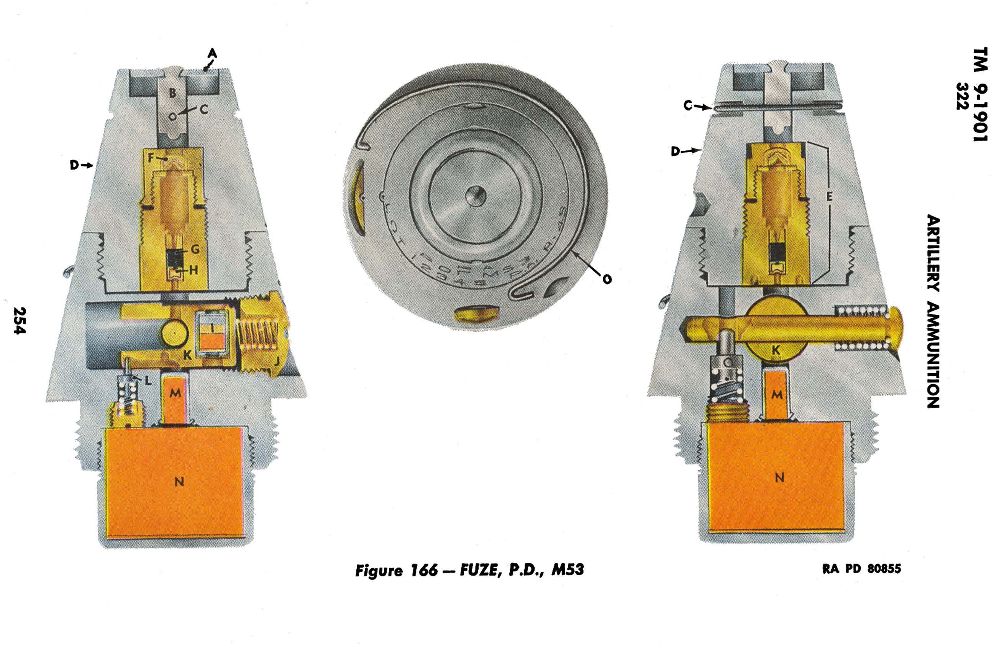
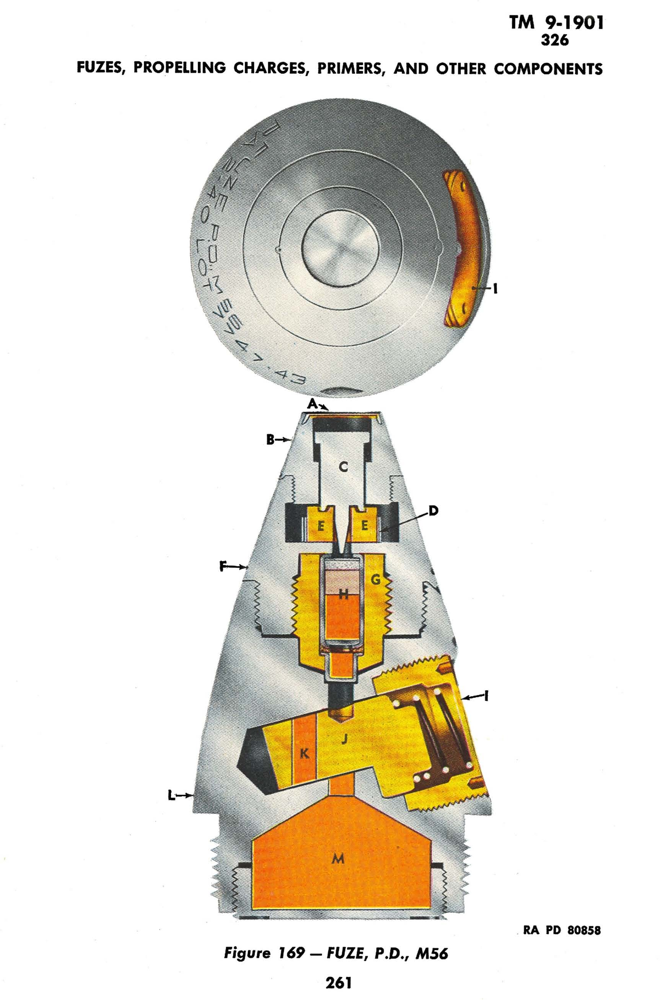

TM 9-1901
318

# ARTILLERY AMMUNITION

RA PD 80852

Figure 163 — FUZE, P.D., M48A2
246

TM 9-1901
319

# FUZES, PROPELLING CHARGES, PRIMERS, AND OTHER COMPONENTS

## 319. FUZE, P.D., M48A2, M48A1, AND M48.

a. General. The M48A2 (fig. 163) is a selective superquick or delay fuze. Either action can be obtained, prior to firing, by turning a setting screw in the side of the fuze. The M48A2 Fuze has two models, one having a delay of 0.05 second, the other a delay of 0.15 second; the time of delay is stamped on the fuze body. The M48A1 Fuze was originally fitted with the 0.15-second delay, whereas the M48 Fuze has the 0.05-second delay. The M48A1 Fuze differs from the M48A2 in that the firing pin in the delay-action assembly is not secured against movement to the rear. This is also true of the M48 Fuze, which differs, in addition, in not having a centrifugal lock (P) to hold the centrifugal delay plungers (Q) apart at low velocities. The fuzes are adapted for use in conjunction with the M20 Booster (or modification) which is made a manufacturing component of the shell. Some M48A1 Fuzes modified to have 0.05-second delay elements are in existence.

b. Data. Length, visible, 3.74 inches, over-all, 4.55 inches; weight, 1.41 pounds; thread size, 1.7-14NS-1.

c. Description. The fuze consists of a head (A) which holds a superquick action (B), and a body (H) which houses a delay assembly (L) and a selective setting device. These main assemblies are connected by a tube (G) which holds the parts firmly in position, and are further supported by a thin-walled ogive (F) shaped to continue the sweep of the ogive of the shell. The superquick action comprises a firing pin (D) supported by a gilding metal cup (C), and a detonator (E). The firing pin support is strong enough to withstand ordinary blows on the firing pin as well as set-back forces upon firing, but collapses under the force of impact at the target. The delay assembly is an inertia plunger type and includes a firing pin (M), primer (N), black powder delay pellet (O), and a detonating relay charge (R).

d. Setting. The setting device is an eccentrically positioned plunger (J) and plunger spring (K), the functioning of which is regulated by a setting sleeve (I). The head of the sleeve is slotted to facilitate turning when adjusting the setting. To enable exact alinement, two register lines and the marking “S.Q.” and “DELAY” are stamped on the ogive of the fuze. When the slot in the sleeve head is alined with the “S.Q.” line (parallel to the fuze axis), or within 15 degrees either side, the sleeve, which is thicker on one side than on the other, is turned so that it does not interfere with movement of the plunger. The plunger is free, therefore, to move outward under centrifugal force, and thereby open the passage for superquick action. When the slot is alined with the “DELAY” line (at right angles to

247

TM 9-1901
319—320

# ARTILLERY AMMUNITION

the fuze axis) or within 15 degrees either side, a section on the setting sleeve rests against the plunger, securing it in the lower extremity of the recess, across the superquick passage.

e. Safety Devices. Boresafe superquick action is provided by the plunger (J). Boresafe delay action is provided by the M20 type booster.

f. Functioning. No action takes place upon firing until sufficient rotational speed has been established to overcome the resistance of springs and set-back force on the several safety devices. When set for superquick action, after projectile leaves the muzzle of the weapon, centrifugal force causes the plunger (J) to move outward opening the passage. At the same time, the plunger pins (Q) locking the delay assembly in unarmed position also move outward, releasing that assembly in preparation for impact. In the M48A1 and M48A2 Fuzes, the plunger-pin lock (P) then swings on its pivot under centrifugal force, placing an arm against the inner end of each plunger pin and thereby preventing the return of the pins to the unarmed position. In the M48, rotational force is relied on to hold the pins in the armed position. Upon impact, the firing pin of the superquick action is driven against the detonator, initiating the superquick action. Inertia causes the delay action plunger to move forward, driving the primer against the delay action firing pin and initiating the delay action. In normal functioning with superquick action, the delay action has no effect since the superquick train will have caused the shell to explode before the delay train can burn for its prescribed time. However, should the superquick action fail, the shell will function with delay action rather than become a dud. When set for delay action, the plunger which interrupts the superquick passage is restrained from moving. Upon impact, the superquick firing pin and detonator function but the effect is prevented from being transmitted to the shell.

g. Preparation for Firing. The fuze need only be adjusted for the desired action, as described above. The setting can be adjusted at will, prior to firing, with a screwdriver or similar instrument. The adjustment can be made in the dark by noting the position of the slot, parallel to the fuze axis (or within 15 deg either side) for superquick ("S.Q.") action, and at right angles thereto (or within 15 deg either side) for delay ("DELAY") action.

## 320. FUZE, P.D., M51A3, W/BOOSTER, M21A2.

a. Description. The M51A3 Fuze (fig. 164) is essentially the M48A2 (par. 318) with the M21A2 Booster (ch. 3, sec. IV) attached. FUZE, P.D., M51A3, w/BOOSTER, M21A2, replaces FUZE, P.D., M51, w/BOOSTER, M21, and FUZE, P.D., M51A1, w/BOOSTER, M21A1, which must be drop-tested prior to use. The M51A3 Fuze

248

TM 9-1901
324—326

# FUZES, PROPELLING CHARGES, PRIMERS, AND OTHER COMPONENTS

mitted directly to the shell booster through the uninterrupted flash hole. The fuze will function on impact, therefore, with superquick action, when the time setting is set for a time greater than the time of flight or otherwise fails to complete its functioning. The gases formed by the burning of the powder train escape through the closing disk (M).

f. Preparation for Firing. Prior to firing, with either superquick or time setting, the safety pull wire must be removed from the fuze (pull free end of wire off fuze and out of hole). If superquick action is required, the graduated time ring can be left as shipped set at safe ("S") or be set for a time greater than the time of flight. If time action is required, the graduated time ring is set for the required time of burning by means of a fuze setter.

## 325. FUZE, TSQ, M55A2, W/BOOSTER, M21A2.

a. Description. The M55A2, M55A1, and M55 Fuzes (fig. 168) are identical in every respect with M54 Fuze (par. 324) except that BOOSTER M21A2, M21A1, M21, respectively, is a manufacturing component of the fuze. The only difference between the M55A2, M55A1, and M55 Fuzes is in the booster with which each is assembled. See chapter 3, section IV for a description of the boosters.

b. Data. Length, visible, 3.76 inches, over-all, 5.95 inches (including booster); weight 2.16 pounds (including booster); thread size, of fuze, 1.7-14NS-1, of booster, 2-12NS-1.

c. Preparation for Firing. The fuzes are shipped separately from the shell with which they are used, for assembling to the projectile in the field. This is done by:

(1) Removing the shipping plug from the projectile.
(2) Examining all threads to insure that no foreign matter is present which may interfere with proper assembly.
(3) Screwing the fuze with booster into the fuze hole by hand, then tightening with a fuze wrench.
(4) Removing safety pin (C) from the booster.
(5) When thus assembled to the projectile, the fuze is set for the required action as described in paragraph 324 for the M54 Fuze.

## 326. FUZE, P.D., M56.

a. General. The M56 Fuze (fig. 169) is known as a supersensitive type because its mechanism is arranged to function on light impact. It is used with 37-mm high-explosive shell in both antiaircraft and aircraft guns.

259

TM 9-1901
326

# ARTILLERY AMMUNITION

RA PD 80857
**Figure 168 — FUZE, TSQ, M55A2, w/BOOSTER, M21A2**
260

TM 9-1901
326

# FUZES, PROPELLING CHARGES, PRIMERS, AND OTHER COMPONENTS

RA PD 80858
**Figure 169 — FUZE, P.D., M56**
261
