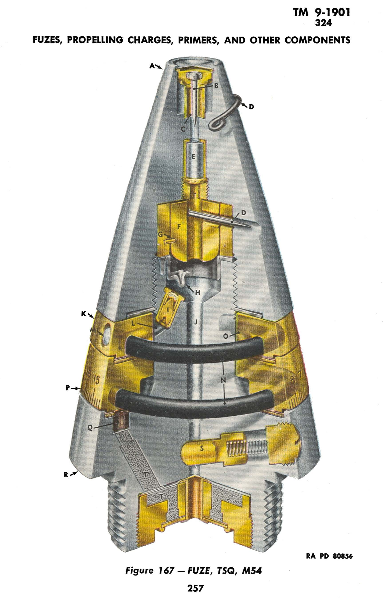

TM 9-1901
322

ARTILLERY AMMUNITION

254

Figure 166 — FUZE, P.D., M53
RA PD 80855

TM 9-1901
322-323

## FUZES, PROPELLING CHARGES, PRIMERS, AND OTHER COMPONENTS

the safety pin in turn is held in locking position by a set-back pin (N). Positive safety during shipment and handling is provided by a safety wire (M) which prevents the set-back pin from moving. This safety wire must be removed before firing.

d. Functioning. Upon firing, after removing the safety wire, set-back causes the set-back pin to move backward against the resistance of the spring. This releases the safety pin which, after the shell has emerged from the mortar tube, is ejected from the fuze by its spring, bringing the detonator into the aligned (armed) position. While the shell is in the mortar, the safety pin is kept in the fuze by the inner wall of the mortar tube. The slider is locked in the armed position by the spring-activated locking pin (H). Upon impact, the striker is driven inward, compressing its spring and carrying the firing pin against the detonator. Action of the detonator is transmitted through the booster lead-in to the tetryl booster pellet and, thereby, to the bursting charge of the shell.

e. Preparation for Firing. The fuze requires no preparation for firing other than removing the safety wire. This should be done just before firing, and at no other time.

### 323. FUZE, P.D., M53.

a. General. The M53 Fuze (fig. 166) is standard for use with 81-mm high-explosive ammunition when delayed functioning is desired. It replaces the M45 Selective-action Fuze for such purposes.

b. Data. Length, visible, 3.36 inches, over-all, 3.47 inches; weight, 0.54 pound; thread size, 1.5-12NF-1.

c. Description. The fuze is a single-action type with a direct-action firing device. The body and mechanism therein are identical with that of the M52 Mortar Fuze (fig. 170). However, the head (D) is fitted with a delay assembly (E), and a short plug-type firing pin (B) with a nipple at one end and riveted at the other end to a thin aluminum-alloy disk (A) which forms the striker. Normally, the firing pin is held at rest by a shear wire (C). This wire is sufficiently strong to withstand ordinary blows and the set-back created upon firing, but is sheared or bent upon impact at the target, allowing the nipple of the firing pin to come into contact with a primer (F) in the delay assembly. The delay assembly consists of the primer, a black powder delay pellet (G) which is loaded to cause the fuze to function with 0.1-second delay, and a relay charge (H) of lead azide.

d. Functioning. Upon impact the firing pin is driven against the primer. Action of the latter ignites the black powder. After burning for the prescribed time, action of the lead azide is initiated. The detonator (I) in the slider (K) of the interrupter having been

255

# TM 9-1901

# 323-324

## ARTILLERY AMMUNITION

brought into alinement in the same manner as in the M52 Fuze (par. 356) and locked in the armed position by the lock pin (L), action of the relay charge is transmitted to the detonator and, thereby, to the booster lead (M) and booster charge (N). The booster charge in turn causes the shell to explode.

e. **Preparation for Firing.** There is no preparation other than removing the safety wire (O). This should be done just before firing, and at no other time.

### 324. FUZE, TSQ, M54.

a. **General.** The M54 (fig. 167) is a selective superquick or time-action (to 25 sec) type. The fuze is usually used in conjunction with the M20 type booster, which is made a manufacturing component of the shell when the fuze is to be assembled thereto. The M54 is of the same size, shape, and weight as the M48, which is used with shell in the same calibers for impact functioning, and has the same ballistic values.

b. **Data.** Length, visible, 3.76 inches, over-all, 4.57 inches; weight, 1.42 pounds; thread size, 1.7-14NS-1.

c. **Description.** The fuze consists of three major parts: a closing cap or head (A) containing the superquick impact elements (B, C, E) and the time-action plunger (F); two time-train rings, one fixed (K) to the body and the other movable (P); and a body (R) containing a time-action striker (H) and primer (I), a magazine charge (T), and an interrupter (S). The superquick action is identical in construction and functioning with that in the M48 Fuze except that the interrupter incorporated in the body of the fuze has no setting sleeve, being automatic and always operative regardless of fuze setting. Hence, the fuze will function on impact unless prior functioning has been caused by the time action. The time action is typical of powder-train types and is initiated upon firing by the time-action plunger under set-back. The fixed upper and moveable lower time rings have a tunnel-shaped slot or groove in their lower surfaces which is filled with compressed black powder (N). One end of the lower-ring powder train is connected by a pellet (O) to the upper-ring train; one end of the upper train is connected by a pellet (L) to the time-action primer. Movement of the lower ring in relation to the fixed upper ring and a pellet (Q) in the body determines the time of functioning. Counterclockwise turning of the lower ring (viewed from the point of the fuze) lengthens the time by increasing the amount of powder which must burn in the upper and lower rings before the flame reaches the pellet in the body and is transmitted

256

# TM 9-1901

# 324

## FUZES, PROPELLING CHARGES, PRIMERS, AND OTHER COMPONENTS

RA PD 80856

**Figure 167 — FUZE, TSQ, M54**

257

TM 9-1901
324

### ARTILLERY AMMUNITION

thereby to the body and magazine charges. For setting purposes, the lower ring is graduated to 25 seconds, with 0.2-second graduations, and a register line is engraved on the body.

d. Safety Devices. When used with the M20 type booster, bore-safety is provided by the arrangement of the booster mechanism. Provision is also made for boresafe superquick action by the interrupter, which shuts off the superquick flash hole (J) until sufficient rotational speed has been established. A metal cup-shaped support (C) which is sufficiently strong to withstand initial set-back holds the superquick firing pin (B) away from the detonator (E) until impact at the target. When the fuze is set safe ("S"), the time-train rings are so positioned that either or both may burn without causing functioning of the succeeding elements in the time train. To prevent functioning within dangerously short time limits, a safety disk incorporated in the lower time ring covers the body pellet and prevents its ignition when the fuze is set at less than 0.4 second. A pull (safety) wire (D) and a shear pin (G) are fitted in the time-action plunger to prevent accidental functioning of the plunger prior to firing. The safety pull wire must be removed before firing.

e. Functioning. Upon firing, with the safety wire removed, set-back causes the time-action plunger to shear the shear wire and force the striker against the primer. The primer flash ignites the black powder train in the upper time ring, which then burns at a relatively uniform rate. The burning progresses until the flame contacts and ignites the pellet of the graduated (lower) time ring, unless the fuze is set at safe ("S"). In this event, flame of the upper train cannot contact the graduated time-ring pellet since the lower-ring pellet is covered by the solid part of the upper ring, and time action stops at this point. Upon ignition, the pellet transmits the flame to the graduated time-ring powder train, which burns in manner similar to that of the upper ring. After burning for a time determined by the fuze setting, the flame contacts and ignites the black powder pellet in the fuze body unless the setting is less than 0.4 second. In this event, the flame is interrupted before making contact with the body pellet, and time action is stopped at this point. When ignited, the body pellet transmits the flame to the body charge and, thereby, to the magazine charge. This charge initiates action of the booster unless prior functioning has been caused by the superquick action on impact. This superquick action becomes armed when sufficient rotational speed has been established to force the slider of the interrupter outward against the resistance of its spring, and thereafter remains operative until impact unless the time action has completed its functioning during flight. Upon impact, the firing pin support collapses and the firing pin strikes the superquick detonator. Action of the detonator is trans-

258
